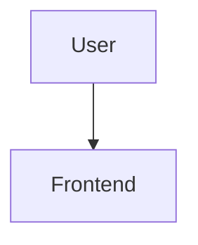

# Markdown Pages Viewer

一个简单、完整、无需后端的 Markdown 在线阅读器。项目使用原生 HTML、CSS 和 JavaScript，可直接部署到 GitHub Pages，并正确处理仓库子路径与 Markdown 文件的相对图片路径。

## 主要功能

- 多层文件树与当前文档高亮
- 文件名搜索和 Markdown 正文搜索
- GitHub 风格排版、响应式布局、深色/浅色主题
- H1～H6、列表、任务列表、表格、引用、链接、图片、GIF、HTML 等 Markdown 内容
- highlight.js 代码语法高亮与代码复制
- Mermaid 流程图、时序图、类图、状态图、甘特图和思维导图
- KaTeX 行内与块级数学公式
- 自动 TOC 与标题锚点
- `?file=docs/example.md` 文档直链
- Markdown 相对链接自动转换为阅读器直链
- GitHub Actions 部署时自动生成文档索引

## 项目结构

```text
.
├─ index.html
├─ css/style.css
├─ js/
│  ├─ app.js
│  ├─ markdown.js
│  └─ file-tree.js
├─ docs/
│  ├─ index.json
│  ├─ README.md
│  ├─ demo.md
│  ├─ mermaid-demo.md
│  ├─ code-demo.md
│  ├─ images/
│  └─ guides/
├─ scripts/generate-doc-index.mjs
└─ .github/workflows/deploy-pages.yml
```

## 本地运行

浏览器的安全规则通常不允许网页通过 `file://` 读取本地 Markdown，所以请从项目根目录启动一个静态服务器。

使用 Python：

```bash
python -m http.server 8000
```

然后打开 <http://localhost:8000/>。

也可以使用 Node.js：

```bash
npx serve .
```

> 页面通过 CDN 加载 markdown-it、Mermaid、KaTeX、highlight.js 和 DOMPurify；首次打开时需要能访问 `cdn.jsdelivr.net`。

## 增加 Markdown 文档

1. 把 `.md` 文件放入 `docs/` 或它的任意子目录。
2. 推荐在文件第一行使用一级标题，例如 `# 我的文章`；该标题会用于文件树显示。
3. 本地执行以下命令更新目录：

```bash
npm run build:index
```

该命令只使用 Node.js 内置模块，不需要执行 `npm install`。推送到 GitHub 后，项目内置的 Actions 工作流也会自动执行它，所以无需手工维护 `docs/index.json`。

纯静态网站无法在浏览器中枚举服务器文件夹，因此 `docs/index.json` 是文件树的数据源。不要把它删除。

## 增加图片和 GIF

图片路径应相对于当前 Markdown 文件书写。例如：

```text
docs/
└─ ai/
   ├─ agent.md
   └─ images/
      └─ agent.png
```

在 `docs/ai/agent.md` 中使用：

```md

```

也可以省略开头的 `./`：

```md

```

PNG、JPG、SVG、WebP 与 GIF 均由浏览器原生显示。不要为仓库内资源写以域名根目录为起点的绝对 URL；相对路径最适合 GitHub Pages 的仓库子路径。

## Mermaid 与数学公式

Mermaid 使用带 `mermaid` 语言名的围栏代码块：

````md

````

KaTeX 行内公式使用单个美元符号，块级公式使用两个美元符号：

```md
质能方程 $E = mc^2$。

$$
E = mc^2
$$
```

没有 `$...$` 或 `$$...$$` 标记的 `E = mc^2` 会按普通文本显示，这是标准 Markdown/LaTeX 的预期行为。

## 文档直链

页面在选择文档时会生成如下 URL：

```text
https://USERNAME.github.io/REPOSITORY/?file=docs/ai/agent.md
```

标题锚点也可以一起分享：

```text
https://USERNAME.github.io/REPOSITORY/?file=docs/ai/agent.md#architecture
```

## 部署到 GitHub Pages

### 推荐：使用内置 GitHub Actions

1. 创建 GitHub 仓库并把本项目全部文件推送到 `main` 或 `master` 分支。
2. 打开仓库的 **Settings → Pages**。
3. 在 **Build and deployment → Source** 中选择 **GitHub Actions**。
4. 完成上述设置后，再推送一次提交或在 Actions 页面手动重新运行 **Deploy Markdown Viewer to GitHub Pages**。
5. Pages 页面会显示最终访问地址。

工作流会先扫描 `docs/` 并生成最新索引，再发布整个静态站点。项目全部使用相对路径，因此部署在 `https://USERNAME.github.io/REPOSITORY/` 时无需修改配置。

如果 `Configure Pages` 报错 `Get Pages site failed` 或 `HttpError: Not Found`，说明仓库尚未启用 Pages，或 Source 尚未选择 **GitHub Actions**。先完成第 2～3 步，再重新运行失败的工作流；无需添加 PAT，也不要把访问令牌写进工作流。

### 不使用 Actions

先在本地运行 `npm run build:index` 并提交生成的 `docs/index.json`，然后在 Pages 设置中选择 **Deploy from a branch**，发布仓库根目录即可。

## 自定义项目名称

编辑 `scripts/generate-doc-index.mjs` 末尾的 `projectName`，运行 `npm run build:index` 后提交。也可以直接修改 `docs/index.json`，但下次自动生成时会被覆盖。

## 安全说明

阅读器支持常用 HTML，但会使用 DOMPurify 清理脚本、事件处理器等危险内容。仍建议只展示你信任的 Markdown 文件。第三方 `iframe` 可能加载外部内容，添加前请确认来源可信。

## 技术栈

- [markdown-it](https://github.com/markdown-it/markdown-it)
- [Mermaid](https://mermaid.js.org/)
- [KaTeX](https://katex.org/)
- [highlight.js](https://highlightjs.org/)
- [DOMPurify](https://github.com/cure53/DOMPurify)
