# The Sandwich Everyone Had Already Eaten

## 《大家其实早就吃掉的三明治》

> 一篇使用全部 1463 个目标词汇的简单英语幽默故事。每个英文段落后面都有逐句、完整、不省略的中文翻译，并附带本段词汇的中文释义与用法说明。

## 阅读方法

- 先读英文剧情，尽量直接理解。
- 再看“中文完整翻译（逐句，不省略）”。
- 最后看“本段词汇讲解”，复习粗体目标词。
- 故事故意使用非常简单、重复度较高的句型，以降低阅读难度；重点是把 1463 个词全部放进同一个有剧情、有反转的故事框架里。


## 故事导航增强版

> 下面新增了一组 **Mermaid 流程图 / 关系图 / 时间线图**，帮助你在正式阅读 1463 个词汇故事段落之前，先快速看懂整条剧情线。

### 1）全篇总流程图

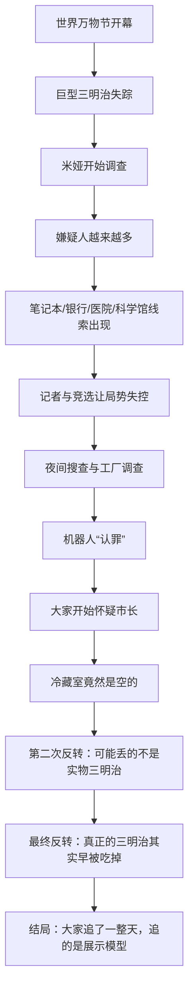

### 2）人物关系图

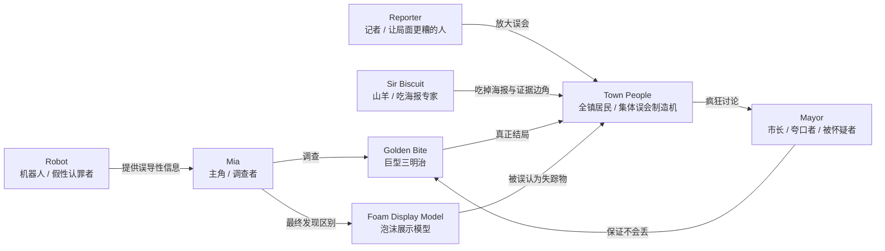

### 3）时间线图


### 4）悬疑推进图：线索是怎样一步步跑偏的

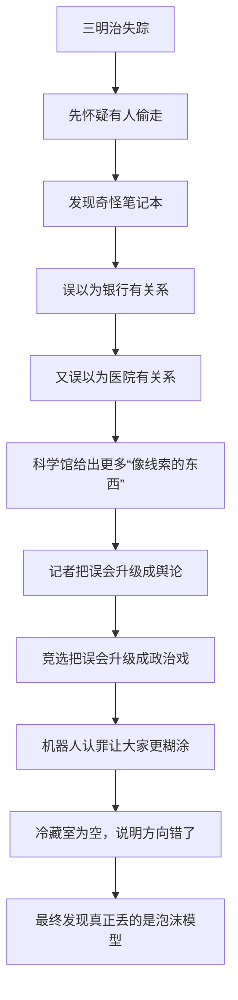

### 5）反转结构图

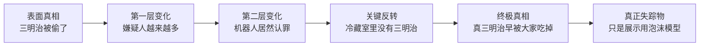

### 6）章节地图

| 章节 | 中文概括 |
|---|---|
| Chapter 1 | 节日开场，巨型三明治失踪 |
| Chapter 2 | 第一名嫌疑人出现，调查开始跑偏 |
| Chapter 3 | 神秘笔记本带来更多古怪线索 |
| Chapter 4 | 银行线索出现，但真相反而更远 |
| Chapter 5 | 调查意外拐到医院方向 |
| Chapter 6 | 科学馆中的证据让局面更混乱 |
| Chapter 7 | 记者把事件越报道越离谱 |
| Chapter 8 | 不必要的竞选把案件政治化 |
| Chapter 9 | 夜间搜查展开，气氛升级 |
| Chapter 10 | 工厂大门后的线索似乎指向真相 |
| Chapter 11 | 机器人“认罪”，但明显不太对劲 |
| Chapter 12 | 全镇开始集体怀疑市长 |
| Chapter 13 | 冷藏室是空的，真相再次反转 |
| Chapter 14 | 第二次重大反转：丢失物可能根本不是实物 |
| Chapter 15 | 最终反转：真正吃掉的和真正丢的并不是同一样东西 |
| Ending | 结局揭晓：大家早就把真三明治吃掉了 |

---

---

## Chapter 1 — The Festival Begins


### 本章剧情导图

> 节日开场，巨型三明治神秘失踪


### 本章在线索链中的位置

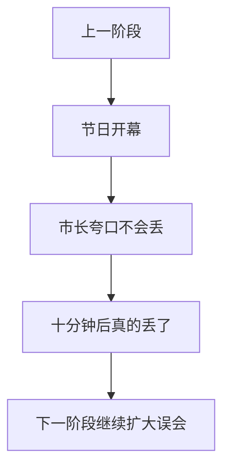

### 第一章——奇怪的节日开始

### Story

Mia arrived in the tiny town of Smilebridge for the World Everything Festival. The star attraction was a giant sandwich called the Golden Bite. The mayor promised that it was safe, delicious, and absolutely impossible to lose. Ten minutes later, it was gone.

### 中文完整翻译

米娅来到小镇 Smilebridge，参加“世界万物节”。节日的明星展品是一份叫作“Golden Bite（金色一口）”的巨型三明治。市长保证它安全、美味，而且“绝对不可能丢”。十分钟之后，它就不见了。

#### Vocabulary Story Paragraph 1

Someone tried to **abandon** before Mia could ask why. The mayor said they might **abduct** if the search became harder. Mia watched someone **absorb** and wrote the action in her notebook. The strange instructions told the team to **abuse**, which sounded suspicious. Someone tried to **accelerate** before Mia could ask why. The old plan looked **accessible**, even before the goat stepped on it. The mayor suddenly asked about **accomplice**, which made everyone look at him. The strange instructions told the team to **account**, which sounded suspicious.

#### 第 1 段：中文完整翻译（逐句，不省略）

1. 还没等米娅问“为什么”，就有人试图去做 **abandon**（v. 抛弃，放弃） 这件事。

2. 市长说，如果搜寻变得更困难，他们可能会采取 **abduct**（v. 诱拐；绑架，劫持） 这样的做法。

3. 米娅看到有人做了 **absorb**（v. 吸收；使全神贯注，吸引（注意等）） 这个动作，于是把这件事记进了她的笔记本。

4. 那份奇怪的指示要求团队去做 **abuse**（v. 滥用；辱骂；虐待），这听起来很可疑。

5. 还没等米娅问“为什么”，就有人试图去做 **accelerate**（v. 增加，增长；使加速；促进） 这件事。

6. 那份旧计划看上去很 **accessible**（a. 可接近的；可进入的）；甚至在那只山羊踩到它之前，就已经给人这种感觉了。

7. 市长突然问起了 **accomplice**（n. 从犯，帮凶，同谋），这让所有人一下子都转头看着他。

8. 那份奇怪的指示要求团队去做 **account**（v. 把…视为；解释，说明；占（多少）），这听起来很可疑。

#### 本段词汇讲解

| 词汇 | 原书词义 | 本段中的理解方式 |
|---|---|---|
| **abandon** | v. 抛弃，放弃 | 作为动作/行为来理解 |
| **abduct** | v. 诱拐；绑架，劫持 | 作为动作/行为来理解 |
| **absorb** | v. 吸收；使全神贯注，吸引（注意等） | 作为动作/行为来理解 |
| **abuse** | v. 滥用；辱骂；虐待 | 作为动作/行为来理解 |
| **accelerate** | v. 增加，增长；使加速；促进 | 作为动作/行为来理解 |
| **accessible** | a. 可接近的；可进入的 | 作为性质、状态或评价来理解 |
| **accomplice** | n. 从犯，帮凶，同谋 | 作为人物、事物、概念或线索名词来理解 |
| **account** | v. 把…视为；解释，说明；占（多少） | 作为动作/行为来理解 |

#### Vocabulary Story Paragraph 2

The town report mentioned **accountant**, and Mia underlined it twice. The mayor said they might **accumulate** if the search became harder. Mia said the idea sounded **accurate**, but the mayor still liked it. A museum poster explained **activism**, but Sir Biscuit tried to eat the poster. Someone tried to **addict** before Mia could ask why. The old plan looked **adjacent**, even before the goat stepped on it. The mayor suddenly asked about **administration**, which made everyone look at him. The strange instructions told the team to **admit**, which sounded suspicious.

#### 第 2 段：中文完整翻译（逐句，不省略）

1. 镇上的报告提到了 **accountant**（n. 会计），米娅把这个词划了两遍下划线。

2. 市长说，如果搜寻变得更困难，他们可能会采取 **accumulate**（v. 累积，积聚） 这样的做法。

3. 米娅说，这个想法听起来很 **accurate**（a. 准确的，精确的），但市长还是很喜欢它。

4. 博物馆的一张海报正在解释 **activism**（n. 激进主义，行动主义），可是 Sir Biscuit 那只山羊却试图把海报吃掉。

5. 还没等米娅问“为什么”，就有人试图去做 **addict**（v. 使…沉溺，使…上瘾） 这件事。

6. 那份旧计划看上去很 **adjacent**（a. 毗连的，邻近的，接近的）；甚至在那只山羊踩到它之前，就已经给人这种感觉了。

7. 市长突然问起了 **administration**（n. 经营，管理；行政，行政机关），这让所有人一下子都转头看着他。

8. 那份奇怪的指示要求团队去做 **admit**（v. 承认；允许入内；容许有），这听起来很可疑。

#### 本段词汇讲解

| 词汇 | 原书词义 | 本段中的理解方式 |
|---|---|---|
| **accountant** | n. 会计 | 作为人物、事物、概念或线索名词来理解 |
| **accumulate** | v. 累积，积聚 | 作为动作/行为来理解 |
| **accurate** | a. 准确的，精确的 | 作为性质、状态或评价来理解 |
| **activism** | n. 激进主义，行动主义 | 作为人物、事物、概念或线索名词来理解 |
| **addict** | v. 使…沉溺，使…上瘾 | 作为动作/行为来理解 |
| **adjacent** | a. 毗连的，邻近的，接近的 | 作为性质、状态或评价来理解 |
| **administration** | n. 经营，管理；行政，行政机关 | 作为人物、事物、概念或线索名词来理解 |
| **admit** | v. 承认；允许入内；容许有 | 作为动作/行为来理解 |

#### Vocabulary Story Paragraph 3

Someone tried to **advance** before Mia could ask why. Mia found a note about **adversity** beside the next blue arrow. The mayor suddenly asked about **advertisement**, which made everyone look at him. A museum poster explained **aerospace**, but Sir Biscuit tried to eat the poster. The town report mentioned **affidavit**, and Mia underlined it twice. The old plan looked **affluent**, even before the goat stepped on it. Mia said the idea sounded **affordable**, but the mayor still liked it. A museum poster explained **aftershock**, but Sir Biscuit tried to eat the poster.

#### 第 3 段：中文完整翻译（逐句，不省略）

1. 还没等米娅问“为什么”，就有人试图去做 **advance**（v. 促进，提高；提出；前进） 这件事。

2. 米娅在下一个蓝色箭头旁边发现了一张关于 **adversity**（n. 不幸，灾祸；逆境） 的纸条。

3. 市长突然问起了 **advertisement**（n. 广告；做广告，登广告），这让所有人一下子都转头看着他。

4. 博物馆的一张海报正在解释 **aerospace**（n. 航空航天技术），可是 Sir Biscuit 那只山羊却试图把海报吃掉。

5. 镇上的报告提到了 **affidavit**（n. 【律】宣誓书，口供书），米娅把这个词划了两遍下划线。

6. 那份旧计划看上去很 **affluent**（a. 富裕的，丰富的，富饶的）；甚至在那只山羊踩到它之前，就已经给人这种感觉了。

7. 米娅说，这个想法听起来很 **affordable**（a. 负担得起的），但市长还是很喜欢它。

8. 博物馆的一张海报正在解释 **aftershock**（n. 余震，余悸），可是 Sir Biscuit 那只山羊却试图把海报吃掉。

#### 本段词汇讲解

| 词汇 | 原书词义 | 本段中的理解方式 |
|---|---|---|
| **advance** | v. 促进，提高；提出；前进 | 作为动作/行为来理解 |
| **adversity** | n. 不幸，灾祸；逆境 | 作为人物、事物、概念或线索名词来理解 |
| **advertisement** | n. 广告；做广告，登广告 | 作为人物、事物、概念或线索名词来理解 |
| **aerospace** | n. 航空航天技术 | 作为人物、事物、概念或线索名词来理解 |
| **affidavit** | n. 【律】宣誓书，口供书 | 作为人物、事物、概念或线索名词来理解 |
| **affluent** | a. 富裕的，丰富的，富饶的 | 作为性质、状态或评价来理解 |
| **affordable** | a. 负担得起的 | 作为性质、状态或评价来理解 |
| **aftershock** | n. 余震，余悸 | 作为人物、事物、概念或线索名词来理解 |

#### Vocabulary Story Paragraph 4

The town report mentioned **agent**, and Mia underlined it twice. The old plan looked **aggressive**, even before the goat stepped on it. At the next booth, Mia saw a poster about **agony column** and followed another arrow. The strange instructions told the team to **aid**, which sounded suspicious. Someone tried to **allege** before Mia could ask why. Mia found a note about **allergy** beside the next blue arrow. The mayor suddenly asked about **alliance**, which made everyone look at him. A museum poster explained **allocation**, but Sir Biscuit tried to eat the poster.

#### 第 4 段：中文完整翻译（逐句，不省略）

1. 镇上的报告提到了 **agent**（n. 代理人，代理商；起因），米娅把这个词划了两遍下划线。

2. 那份旧计划看上去很 **aggressive**（a. 侵略的，好斗的；有进取精神的）；甚至在那只山羊踩到它之前，就已经给人这种感觉了。

3. 到了下一个摊位，米娅看到了一张关于 **agony column**（（报刊）人事广告栏） 的海报，然后继续沿着另一个箭头走。

4. 那份奇怪的指示要求团队去做 **aid**（v. 说明；救助；有助于），这听起来很可疑。

5. 还没等米娅问“为什么”，就有人试图去做 **allege**（v. （无充分证据而）断言，宣称；提出） 这件事。

6. 米娅在下一个蓝色箭头旁边发现了一张关于 **allergy**（n. 过敏症；厌恶，反感） 的纸条。

7. 市长突然问起了 **alliance**（n. 结盟，同盟；联姻；类同，相似），这让所有人一下子都转头看着他。

8. 博物馆的一张海报正在解释 **allocation**（n. 分派，分配；分配额），可是 Sir Biscuit 那只山羊却试图把海报吃掉。

#### 本段词汇讲解

| 词汇 | 原书词义 | 本段中的理解方式 |
|---|---|---|
| **agent** | n. 代理人，代理商；起因 | 作为人物、事物、概念或线索名词来理解 |
| **aggressive** | a. 侵略的，好斗的；有进取精神的 | 作为性质、状态或评价来理解 |
| **agony column** | （报刊）人事广告栏 | 作为固定短语或概念整体记忆 |
| **aid** | v. 说明；救助；有助于 | 作为动作/行为来理解 |
| **allege** | v. （无充分证据而）断言，宣称；提出 | 作为动作/行为来理解 |
| **allergy** | n. 过敏症；厌恶，反感 | 作为人物、事物、概念或线索名词来理解 |
| **alliance** | n. 结盟，同盟；联姻；类同，相似 | 作为人物、事物、概念或线索名词来理解 |
| **allocation** | n. 分派，分配；分配额 | 作为人物、事物、概念或线索名词来理解 |

#### Vocabulary Story Paragraph 5

Someone tried to **alter** before Mia could ask why. The old plan looked **amateur**, even before the goat stepped on it. The mayor suddenly asked about **ambulance**, which made everyone look at him. The strange instructions told the team to **amount**, which sounded suspicious. Someone tried to **anchor** before Mia could ask why. The old plan looked **animated**, even before the goat stepped on it. Mia watched someone **annoy** and wrote the action in her notebook. A museum poster explained **antibiotic**, but Sir Biscuit tried to eat the poster.

#### 第 5 段：中文完整翻译（逐句，不省略）

1. 还没等米娅问“为什么”，就有人试图去做 **alter**（v. 改变，修改） 这件事。

2. 那份旧计划看上去很 **amateur**（a. 业余的，外行的；不熟练的）；甚至在那只山羊踩到它之前，就已经给人这种感觉了。

3. 市长突然问起了 **ambulance**（n. 救护车），这让所有人一下子都转头看着他。

4. 那份奇怪的指示要求团队去做 **amount**（v. 合计，共计，相当于），这听起来很可疑。

5. 还没等米娅问“为什么”，就有人试图去做 **anchor**（v. 抛锚泊船；（使）固定） 这件事。

6. 那份旧计划看上去很 **animated**（a. 栩栩如生的；活跃的，热烈的）；甚至在那只山羊踩到它之前，就已经给人这种感觉了。

7. 米娅看到有人做了 **annoy**（v. 使（某人）烦恼；打搅，骚扰（某人）） 这个动作，于是把这件事记进了她的笔记本。

8. 博物馆的一张海报正在解释 **antibiotic**（n. 抗生素），可是 Sir Biscuit 那只山羊却试图把海报吃掉。

#### 本段词汇讲解

| 词汇 | 原书词义 | 本段中的理解方式 |
|---|---|---|
| **alter** | v. 改变，修改 | 作为动作/行为来理解 |
| **amateur** | a. 业余的，外行的；不熟练的 | 作为性质、状态或评价来理解 |
| **ambulance** | n. 救护车 | 作为人物、事物、概念或线索名词来理解 |
| **amount** | v. 合计，共计，相当于 | 作为动作/行为来理解 |
| **anchor** | v. 抛锚泊船；（使）固定 | 作为动作/行为来理解 |
| **animated** | a. 栩栩如生的；活跃的，热烈的 | 作为性质、状态或评价来理解 |
| **annoy** | v. 使（某人）烦恼；打搅，骚扰（某人） | 作为动作/行为来理解 |
| **antibiotic** | n. 抗生素 | 作为人物、事物、概念或线索名词来理解 |

#### Vocabulary Story Paragraph 6

The guide called the situation **antitrust**, and Mia wrote the word down. The old plan looked **apologetic**, even before the goat stepped on it. The mayor suddenly asked about **apology**, which made everyone look at him. The strange instructions told the team to **apparel**, which sounded suspicious. The town report mentioned **application**, and Mia underlined it twice. The mayor said they might **appraise** if the search became harder. Mia watched someone **apprehend** and wrote the action in her notebook. A museum poster explained **arraignment**, but Sir Biscuit tried to eat the poster.

#### 第 6 段：中文完整翻译（逐句，不省略）

1. 向导把当前的情况称作 **antitrust**（a. 反垄断的，反托拉斯的），米娅把这个词记了下来。

2. 那份旧计划看上去很 **apologetic**（a. 道歉的，认错的，愧悔的；辩解的，辩）；甚至在那只山羊踩到它之前，就已经给人这种感觉了。

3. 市长突然问起了 **apology**（n. 道歉，赔罪；辩解，辩护），这让所有人一下子都转头看着他。

4. 那份奇怪的指示要求团队去做 **apparel**（v. 给…穿衣服（尤指华丽或特殊的服装）），这听起来很可疑。

5. 镇上的报告提到了 **application**（n. 运用；申请，申请表），米娅把这个词划了两遍下划线。

6. 市长说，如果搜寻变得更困难，他们可能会采取 **appraise**（v. 估计，估价，评价） 这样的做法。

7. 米娅看到有人做了 **apprehend**（v. 逮捕；担忧；理解，了解） 这个动作，于是把这件事记进了她的笔记本。

8. 博物馆的一张海报正在解释 **arraignment**（n. 传讯，传问；责难），可是 Sir Biscuit 那只山羊却试图把海报吃掉。

#### 本段词汇讲解

| 词汇 | 原书词义 | 本段中的理解方式 |
|---|---|---|
| **antitrust** | a. 反垄断的，反托拉斯的 | 作为性质、状态或评价来理解 |
| **apologetic** | a. 道歉的，认错的，愧悔的；辩解的，辩 | 作为性质、状态或评价来理解 |
| **apology** | n. 道歉，赔罪；辩解，辩护 | 作为人物、事物、概念或线索名词来理解 |
| **apparel** | v. 给…穿衣服（尤指华丽或特殊的服装） | 作为动作/行为来理解 |
| **application** | n. 运用；申请，申请表 | 作为人物、事物、概念或线索名词来理解 |
| **appraise** | v. 估计，估价，评价 | 作为动作/行为来理解 |
| **apprehend** | v. 逮捕；担忧；理解，了解 | 作为动作/行为来理解 |
| **arraignment** | n. 传讯，传问；责难 | 作为人物、事物、概念或线索名词来理解 |

#### Vocabulary Story Paragraph 7

The town report mentioned **arson**, and Mia underlined it twice. The old plan looked **artificial**, even before the goat stepped on it. The mayor suddenly asked about **assailant**, which made everyone look at him. The strange instructions told the team to **assassinate**, which sounded suspicious. Someone tried to **assemble** before Mia could ask why. The mayor said they might **assert** if the search became harder. The mayor suddenly asked about **asset**, which made everyone look at him. The strange instructions told the team to **assimilate**, which sounded suspicious.

#### 第 7 段：中文完整翻译（逐句，不省略）

1. 镇上的报告提到了 **arson**（n. 纵火，放火），米娅把这个词划了两遍下划线。

2. 那份旧计划看上去很 **artificial**（a. 人工的，人造的；假的；矫揉造作的，不自然）；甚至在那只山羊踩到它之前，就已经给人这种感觉了。

3. 市长突然问起了 **assailant**（n. 攻击者，袭击者），这让所有人一下子都转头看着他。

4. 那份奇怪的指示要求团队去做 **assassinate**（v. 暗杀；诋毁；破坏），这听起来很可疑。

5. 还没等米娅问“为什么”，就有人试图去做 **assemble**（v. 集合，召集，聚集；配装） 这件事。

6. 市长说，如果搜寻变得更困难，他们可能会采取 **assert**（v. 断言，声称；维护；坚持） 这样的做法。

7. 市长突然问起了 **asset**（n. 财产，资产；才能；有利条件），这让所有人一下子都转头看着他。

8. 那份奇怪的指示要求团队去做 **assimilate**（v. 同化；吸收），这听起来很可疑。

#### 本段词汇讲解

| 词汇 | 原书词义 | 本段中的理解方式 |
|---|---|---|
| **arson** | n. 纵火，放火 | 作为人物、事物、概念或线索名词来理解 |
| **artificial** | a. 人工的，人造的；假的；矫揉造作的，不自然 | 作为性质、状态或评价来理解 |
| **assailant** | n. 攻击者，袭击者 | 作为人物、事物、概念或线索名词来理解 |
| **assassinate** | v. 暗杀；诋毁；破坏 | 作为动作/行为来理解 |
| **assemble** | v. 集合，召集，聚集；配装 | 作为动作/行为来理解 |
| **assert** | v. 断言，声称；维护；坚持 | 作为动作/行为来理解 |
| **asset** | n. 财产，资产；才能；有利条件 | 作为人物、事物、概念或线索名词来理解 |
| **assimilate** | v. 同化；吸收 | 作为动作/行为来理解 |

#### Vocabulary Story Paragraph 8

The town report mentioned **asthma**, and Mia underlined it twice. Mia found a note about **astronomer** beside the next blue arrow. Mia said the idea sounded **atomic**, but the mayor still liked it. The strange instructions told the team to **attain**, which sounded suspicious. The guide called the situation **attentive**, and Mia wrote the word down. The mayor said they might **attribute** if the search became harder. Mia watched someone **audit** and wrote the action in her notebook. The mayor insisted that the plan was **authentic**, which did not calm anyone.

#### 第 8 段：中文完整翻译（逐句，不省略）

1. 镇上的报告提到了 **asthma**（n. 哮喘症，气喘），米娅把这个词划了两遍下划线。

2. 米娅在下一个蓝色箭头旁边发现了一张关于 **astronomer**（n. 天文学家） 的纸条。

3. 米娅说，这个想法听起来很 **atomic**（a. 原子的，核能的；核武器的），但市长还是很喜欢它。

4. 那份奇怪的指示要求团队去做 **attain**（v. 达到，获得），这听起来很可疑。

5. 向导把当前的情况称作 **attentive**（a. 注意的，关心的；有礼貌的），米娅把这个词记了下来。

6. 市长说，如果搜寻变得更困难，他们可能会采取 **attribute**（v. 归因于，归属于） 这样的做法。

7. 米娅看到有人做了 **audit**（v. 审核；查账；旁听） 这个动作，于是把这件事记进了她的笔记本。

8. 市长坚持认为这项计划是 **authentic**（a. 可信的，可靠的；真的） 的，但这并没有让任何人安心下来。

#### 本段词汇讲解

| 词汇 | 原书词义 | 本段中的理解方式 |
|---|---|---|
| **asthma** | n. 哮喘症，气喘 | 作为人物、事物、概念或线索名词来理解 |
| **astronomer** | n. 天文学家 | 作为人物、事物、概念或线索名词来理解 |
| **atomic** | a. 原子的，核能的；核武器的 | 作为性质、状态或评价来理解 |
| **attain** | v. 达到，获得 | 作为动作/行为来理解 |
| **attentive** | a. 注意的，关心的；有礼貌的 | 作为性质、状态或评价来理解 |
| **attribute** | v. 归因于，归属于 | 作为动作/行为来理解 |
| **audit** | v. 审核；查账；旁听 | 作为动作/行为来理解 |
| **authentic** | a. 可信的，可靠的；真的 | 作为性质、状态或评价来理解 |

#### Vocabulary Story Paragraph 9

The guide called the situation **authoritative**, and Mia wrote the word down. The old plan looked **available**, even before the goat stepped on it. Mia watched someone **avert** and wrote the action in her notebook. The mayor insisted that the plan was **backward**, which did not calm anyone. Someone tried to **balance** before Mia could ask why. The mayor said they might **ban** if the search became harder. The mayor suddenly asked about **bandwagon**, which made everyone look at him. A museum poster explained **banker**, but Sir Biscuit tried to eat the poster.

#### 第 9 段：中文完整翻译（逐句，不省略）

1. 向导把当前的情况称作 **authoritative**（a. 权威性的，可信赖的；官方的，当局的；专断的，命令式的），米娅把这个词记了下来。

2. 那份旧计划看上去很 **available**（a. 可利用的，可得到的；有空的）；甚至在那只山羊踩到它之前，就已经给人这种感觉了。

3. 米娅看到有人做了 **avert**（v. 避免，防止，避开） 这个动作，于是把这件事记进了她的笔记本。

4. 市长坚持认为这项计划是 **backward**（a. 向后的，落后的；畏缩的） 的，但这并没有让任何人安心下来。

5. 还没等米娅问“为什么”，就有人试图去做 **balance**（v. 使平衡，均衡，相等；权衡） 这件事。

6. 市长说，如果搜寻变得更困难，他们可能会采取 **ban**（v. 禁止；取缔） 这样的做法。

7. 市长突然问起了 **bandwagon**（n. 乐队彩车；浪潮，时尚），这让所有人一下子都转头看着他。

8. 博物馆的一张海报正在解释 **banker**（n. 银行家，银行业者；（赌博的）庄家），可是 Sir Biscuit 那只山羊却试图把海报吃掉。

#### 本段词汇讲解

| 词汇 | 原书词义 | 本段中的理解方式 |
|---|---|---|
| **authoritative** | a. 权威性的，可信赖的；官方的，当局的；专断的，命令式的 | 作为性质、状态或评价来理解 |
| **available** | a. 可利用的，可得到的；有空的 | 作为性质、状态或评价来理解 |
| **avert** | v. 避免，防止，避开 | 作为动作/行为来理解 |
| **backward** | a. 向后的，落后的；畏缩的 | 作为性质、状态或评价来理解 |
| **balance** | v. 使平衡，均衡，相等；权衡 | 作为动作/行为来理解 |
| **ban** | v. 禁止；取缔 | 作为动作/行为来理解 |
| **bandwagon** | n. 乐队彩车；浪潮，时尚 | 作为人物、事物、概念或线索名词来理解 |
| **banker** | n. 银行家，银行业者；（赌博的）庄家 | 作为人物、事物、概念或线索名词来理解 |

#### Vocabulary Story Paragraph 10

The town report mentioned **bankruptcy**, and Mia underlined it twice. The mayor said they might **bargain** if the search became harder. Mia watched someone **base** and wrote the action in her notebook. The mayor answered **beforehand**, while Mia kept taking notes. Someone tried to **beguile** before Mia could ask why. The mayor said they might **belittle** if the search became harder. Mia said the idea sounded **beneficial**, but the mayor still liked it. The strange instructions told the team to **beset**, which sounded suspicious.

#### 第 10 段：中文完整翻译（逐句，不省略）

1. 镇上的报告提到了 **bankruptcy**（n. 破产，倒闭；彻底失败），米娅把这个词划了两遍下划线。

2. 市长说，如果搜寻变得更困难，他们可能会采取 **bargain**（v. 讨价还价；达成协议） 这样的做法。

3. 米娅看到有人做了 **base**（v. 把…建立在某种基础上，以…为起点） 这个动作，于是把这件事记进了她的笔记本。

4. 市长以 **beforehand**（ad. 预先，事先，提前） 的方式作了回答，而米娅继续不停地做笔记。

5. 还没等米娅问“为什么”，就有人试图去做 **beguile**（v. 欺骗；使陶醉，使着迷） 这件事。

6. 市长说，如果搜寻变得更困难，他们可能会采取 **belittle**（v. 轻视，贬低） 这样的做法。

7. 米娅说，这个想法听起来很 **beneficial**（a. 有益的，有利的；有说明的），但市长还是很喜欢它。

8. 那份奇怪的指示要求团队去做 **beset**（v. 困扰，使苦恼；围攻，包围住），这听起来很可疑。

#### 本段词汇讲解

| 词汇 | 原书词义 | 本段中的理解方式 |
|---|---|---|
| **bankruptcy** | n. 破产，倒闭；彻底失败 | 作为人物、事物、概念或线索名词来理解 |
| **bargain** | v. 讨价还价；达成协议 | 作为动作/行为来理解 |
| **base** | v. 把…建立在某种基础上，以…为起点 | 作为动作/行为来理解 |
| **beforehand** | ad. 预先，事先，提前 | 作为动作方式来理解 |
| **beguile** | v. 欺骗；使陶醉，使着迷 | 作为动作/行为来理解 |
| **belittle** | v. 轻视，贬低 | 作为动作/行为来理解 |
| **beneficial** | a. 有益的，有利的；有说明的 | 作为性质、状态或评价来理解 |
| **beset** | v. 困扰，使苦恼；围攻，包围住 | 作为动作/行为来理解 |

#### Vocabulary Story Paragraph 11

The guide called the situation **bilateral**, and Mia wrote the word down. The old plan looked **binocular**, even before the goat stepped on it. The mayor suddenly asked about **biohazard**, which made everyone look at him. A museum poster explained **biosphere**, but Sir Biscuit tried to eat the poster. The town report mentioned **birthrate**, and Mia underlined it twice. The mayor said they might **blackmail** if the search became harder. Mia watched someone **blast** and wrote the action in her notebook. The strange instructions told the team to **blood**, which sounded suspicious.

#### 第 11 段：中文完整翻译（逐句，不省略）

1. 向导把当前的情况称作 **bilateral**（a. 有两面的，双边的），米娅把这个词记了下来。

2. 那份旧计划看上去很 **binocular**（a. 双目的）；甚至在那只山羊踩到它之前，就已经给人这种感觉了。

3. 市长突然问起了 **biohazard**（n. 生物危害），这让所有人一下子都转头看着他。

4. 博物馆的一张海报正在解释 **biosphere**（n. 生物圈），可是 Sir Biscuit 那只山羊却试图把海报吃掉。

5. 镇上的报告提到了 **birthrate**（n. 出生率），米娅把这个词划了两遍下划线。

6. 市长说，如果搜寻变得更困难，他们可能会采取 **blackmail**（v. 敲诈，勒索，胁迫） 这样的做法。

7. 米娅看到有人做了 **blast**（v. 爆炸；吹奏；使枯萎；损坏） 这个动作，于是把这件事记进了她的笔记本。

8. 那份奇怪的指示要求团队去做 **blood**（v. 从…抽血；使初尝经验），这听起来很可疑。

#### 本段词汇讲解

| 词汇 | 原书词义 | 本段中的理解方式 |
|---|---|---|
| **bilateral** | a. 有两面的，双边的 | 作为性质、状态或评价来理解 |
| **binocular** | a. 双目的 | 作为性质、状态或评价来理解 |
| **biohazard** | n. 生物危害 | 作为人物、事物、概念或线索名词来理解 |
| **biosphere** | n. 生物圈 | 作为人物、事物、概念或线索名词来理解 |
| **birthrate** | n. 出生率 | 作为人物、事物、概念或线索名词来理解 |
| **blackmail** | v. 敲诈，勒索，胁迫 | 作为动作/行为来理解 |
| **blast** | v. 爆炸；吹奏；使枯萎；损坏 | 作为动作/行为来理解 |
| **blood** | v. 从…抽血；使初尝经验 | 作为动作/行为来理解 |

#### Vocabulary Story Paragraph 12

The guide called the situation **bogus**, and Mia wrote the word down. Mia found a note about **bond** beside the next blue arrow. Mia watched someone **boom** and wrote the action in her notebook. The strange instructions told the team to **bootleg**, which sounded suspicious. The town report mentioned **borrowing**, and Mia underlined it twice. The mayor said they might **bounce** if the search became harder. The mayor suddenly asked about **boundary**, which made everyone look at him. The strange instructions told the team to **boycott**, which sounded suspicious.

#### 第 12 段：中文完整翻译（逐句，不省略）

1. 向导把当前的情况称作 **bogus**（a. 伪造的，假货的），米娅把这个词记了下来。

2. 米娅在下一个蓝色箭头旁边发现了一张关于 **bond**（n. 结合；债券；束缚） 的纸条。

3. 米娅看到有人做了 **boom**（v. （发出）隆隆声；繁荣） 这个动作，于是把这件事记进了她的笔记本。

4. 那份奇怪的指示要求团队去做 **bootleg**（v. 非法携带（或制造、贩卖）），这听起来很可疑。

5. 镇上的报告提到了 **borrowing**（n. 借，借用；借用的言语（或思想等）），米娅把这个词划了两遍下划线。

6. 市长说，如果搜寻变得更困难，他们可能会采取 **bounce**（v. 反跳，弹起，（使）跳起） 这样的做法。

7. 市长突然问起了 **boundary**（n. 边界，分界线；界限，范围），这让所有人一下子都转头看着他。

8. 那份奇怪的指示要求团队去做 **boycott**（v. 联合抵制，拒绝参加（或购买等）），这听起来很可疑。

#### 本段词汇讲解

| 词汇 | 原书词义 | 本段中的理解方式 |
|---|---|---|
| **bogus** | a. 伪造的，假货的 | 作为性质、状态或评价来理解 |
| **bond** | n. 结合；债券；束缚 | 作为人物、事物、概念或线索名词来理解 |
| **boom** | v. （发出）隆隆声；繁荣 | 作为动作/行为来理解 |
| **bootleg** | v. 非法携带（或制造、贩卖） | 作为动作/行为来理解 |
| **borrowing** | n. 借，借用；借用的言语（或思想等） | 作为人物、事物、概念或线索名词来理解 |
| **bounce** | v. 反跳，弹起，（使）跳起 | 作为动作/行为来理解 |
| **boundary** | n. 边界，分界线；界限，范围 | 作为人物、事物、概念或线索名词来理解 |
| **boycott** | v. 联合抵制，拒绝参加（或购买等） | 作为动作/行为来理解 |

#### Vocabulary Story Paragraph 13

Someone tried to **brand** before Mia could ask why. Mia found a note about **breakup** beside the next blue arrow.

#### 第 13 段：中文完整翻译（逐句，不省略）

1. 还没等米娅问“为什么”，就有人试图去做 **brand**（v. 在…上打烙印（或标记）；铭记，铭刻） 这件事。

2. 米娅在下一个蓝色箭头旁边发现了一张关于 **breakup**（n. 中断，分离，分裂；崩溃，解体） 的纸条。

#### 本段词汇讲解

| 词汇 | 原书词义 | 本段中的理解方式 |
|---|---|---|
| **brand** | v. 在…上打烙印（或标记）；铭记，铭刻 | 作为动作/行为来理解 |
| **breakup** | n. 中断，分离，分裂；崩溃，解体 | 作为人物、事物、概念或线索名词来理解 |

---

## Chapter 2 — The First Suspect


### 本章剧情导图

> 第一名嫌疑人出现，调查开始跑偏


### 本章在线索链中的位置

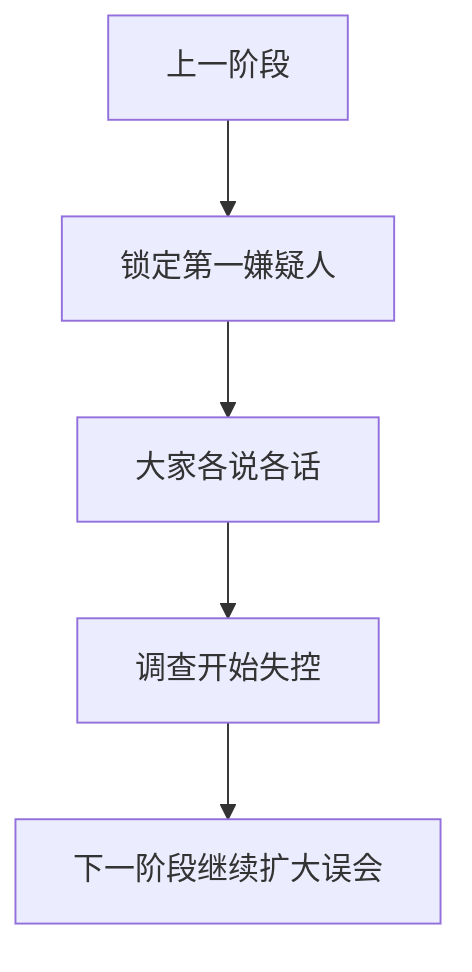

### 第二章——第一位嫌疑人

### Story

The police blamed Sir Biscuit, a goat wearing a red bow tie. Sir Biscuit looked guilty because he was chewing a paper map, but Mia noticed that goats do not usually steal sandwiches with forklifts.

### 中文完整翻译

警方首先怀疑一只戴红色领结的山羊 Sir Biscuit。它看上去确实很可疑，因为嘴里正嚼着一张地图。不过米娅想到一个简单的问题：山羊通常不会开叉车去偷巨型三明治。

#### Vocabulary Story Paragraph 14

Someone tried to **bribe** before Mia could ask why. The mayor said they might **broadcast** if the search became harder. Mia watched someone **bruise** and wrote the action in her notebook. A museum poster explained **budget**, but Sir Biscuit tried to eat the poster. Someone tried to **bully** before Mia could ask why. Mia found a note about **bystander** beside the next blue arrow. Mia watched someone **calculate** and wrote the action in her notebook. The mayor insisted that the plan was **candid**, which did not calm anyone.

#### 第 14 段：中文完整翻译（逐句，不省略）

1. 还没等米娅问“为什么”，就有人试图去做 **bribe**（v. 向…行贿，行贿，收买） 这件事。

2. 市长说，如果搜寻变得更困难，他们可能会采取 **broadcast**（v. 广播，播送；广为散播，传布） 这样的做法。

3. 米娅看到有人做了 **bruise**（v. 碰伤，使青肿） 这个动作，于是把这件事记进了她的笔记本。

4. 博物馆的一张海报正在解释 **budget**（n. 预算；预算费；生活费；专款），可是 Sir Biscuit 那只山羊却试图把海报吃掉。

5. 还没等米娅问“为什么”，就有人试图去做 **bully**（v. 威吓，胁迫，欺侮） 这件事。

6. 米娅在下一个蓝色箭头旁边发现了一张关于 **bystander**（n. 旁观者） 的纸条。

7. 米娅看到有人做了 **calculate**（v. 计算；推测；打算，计划） 这个动作，于是把这件事记进了她的笔记本。

8. 市长坚持认为这项计划是 **candid**（a. 公正的；直言的，坦率的） 的，但这并没有让任何人安心下来。

#### 本段词汇讲解

| 词汇 | 原书词义 | 本段中的理解方式 |
|---|---|---|
| **bribe** | v. 向…行贿，行贿，收买 | 作为动作/行为来理解 |
| **broadcast** | v. 广播，播送；广为散播，传布 | 作为动作/行为来理解 |
| **bruise** | v. 碰伤，使青肿 | 作为动作/行为来理解 |
| **budget** | n. 预算；预算费；生活费；专款 | 作为人物、事物、概念或线索名词来理解 |
| **bully** | v. 威吓，胁迫，欺侮 | 作为动作/行为来理解 |
| **bystander** | n. 旁观者 | 作为人物、事物、概念或线索名词来理解 |
| **calculate** | v. 计算；推测；打算，计划 | 作为动作/行为来理解 |
| **candid** | a. 公正的；直言的，坦率的 | 作为性质、状态或评价来理解 |

#### Vocabulary Story Paragraph 15

The guide called the situation **canny**, and Mia wrote the word down. A sign near the next clue mentioned **capital gain**, which seemed oddly specific. Mia watched someone **capitalize** and wrote the action in her notebook. The strange instructions told the team to **capitulate**, which sounded suspicious. Someone tried to **care** before Mia could ask why. The old plan looked **careless**, even before the goat stepped on it. At the next booth, Mia saw a poster about **cash flow** and followed another arrow. A museum poster explained **catalyst**, but Sir Biscuit tried to eat the poster.

#### 第 15 段：中文完整翻译（逐句，不省略）

1. 向导把当前的情况称作 **canny**（a. 精明的；谨慎的），米娅把这个词记了下来。

2. 下一条线索旁边的一块牌子提到了 **capital gain**（资本盈利（出售资本、资产所得的利润））；这个细节具体得有些奇怪。

3. 米娅看到有人做了 **capitalize**（v. 用大写字母书写；使资本化；计算…的现价） 这个动作，于是把这件事记进了她的笔记本。

4. 那份奇怪的指示要求团队去做 **capitulate**（v. （有条件地）投降，屈从），这听起来很可疑。

5. 还没等米娅问“为什么”，就有人试图去做 **care**（v. 关心；介意；愿意；喜欢） 这件事。

6. 那份旧计划看上去很 **careless**（a. 粗心的，疏忽的；自然的，无忧无虑的）；甚至在那只山羊踩到它之前，就已经给人这种感觉了。

7. 到了下一个摊位，米娅看到了一张关于 **cash flow**（现金流） 的海报，然后继续沿着另一个箭头走。

8. 博物馆的一张海报正在解释 **catalyst**（n. 催化剂，刺激因素），可是 Sir Biscuit 那只山羊却试图把海报吃掉。

#### 本段词汇讲解

| 词汇 | 原书词义 | 本段中的理解方式 |
|---|---|---|
| **canny** | a. 精明的；谨慎的 | 作为性质、状态或评价来理解 |
| **capital gain** | 资本盈利（出售资本、资产所得的利润） | 作为固定短语或概念整体记忆 |
| **capitalize** | v. 用大写字母书写；使资本化；计算…的现价 | 作为动作/行为来理解 |
| **capitulate** | v. （有条件地）投降，屈从 | 作为动作/行为来理解 |
| **care** | v. 关心；介意；愿意；喜欢 | 作为动作/行为来理解 |
| **careless** | a. 粗心的，疏忽的；自然的，无忧无虑的 | 作为性质、状态或评价来理解 |
| **cash flow** | 现金流 | 作为固定短语或概念整体记忆 |
| **catalyst** | n. 催化剂，刺激因素 | 作为人物、事物、概念或线索名词来理解 |

#### Vocabulary Story Paragraph 16

The guide called the situation **catching**, and Mia wrote the word down. The old plan looked **causal**, even before the goat stepped on it. Mia watched someone **celebrate** and wrote the action in her notebook. The mayor insisted that the plan was **cellular**, which did not calm anyone. Someone tried to **censure** before Mia could ask why. Mia found a note about **chaos** beside the next blue arrow. Mia said the idea sounded **characteristic**, but the mayor still liked it. A museum poster explained **charisma**, but Sir Biscuit tried to eat the poster.

#### 第 16 段：中文完整翻译（逐句，不省略）

1. 向导把当前的情况称作 **catching**（a. 传染性的；迷人的），米娅把这个词记了下来。

2. 那份旧计划看上去很 **causal**（a. 原因的，因果关系的）；甚至在那只山羊踩到它之前，就已经给人这种感觉了。

3. 米娅看到有人做了 **celebrate**（v. 庆祝，庆贺；赞美） 这个动作，于是把这件事记进了她的笔记本。

4. 市长坚持认为这项计划是 **cellular**（a. 细胞组成的；划分的；多孔的） 的，但这并没有让任何人安心下来。

5. 还没等米娅问“为什么”，就有人试图去做 **censure**（v. 责备，谴责） 这件事。

6. 米娅在下一个蓝色箭头旁边发现了一张关于 **chaos**（n. 混乱，杂乱的一团） 的纸条。

7. 米娅说，这个想法听起来很 **characteristic**（a. 特有的，独特的，典型的），但市长还是很喜欢它。

8. 博物馆的一张海报正在解释 **charisma**（n. 非凡的领导力，魅力），可是 Sir Biscuit 那只山羊却试图把海报吃掉。

#### 本段词汇讲解

| 词汇 | 原书词义 | 本段中的理解方式 |
|---|---|---|
| **catching** | a. 传染性的；迷人的 | 作为性质、状态或评价来理解 |
| **causal** | a. 原因的，因果关系的 | 作为性质、状态或评价来理解 |
| **celebrate** | v. 庆祝，庆贺；赞美 | 作为动作/行为来理解 |
| **cellular** | a. 细胞组成的；划分的；多孔的 | 作为性质、状态或评价来理解 |
| **censure** | v. 责备，谴责 | 作为动作/行为来理解 |
| **chaos** | n. 混乱，杂乱的一团 | 作为人物、事物、概念或线索名词来理解 |
| **characteristic** | a. 特有的，独特的，典型的 | 作为性质、状态或评价来理解 |
| **charisma** | n. 非凡的领导力，魅力 | 作为人物、事物、概念或线索名词来理解 |

#### Vocabulary Story Paragraph 17

Someone tried to **chase** before Mia could ask why. Mia found a note about **chemotherapy** beside the next blue arrow. Mia said the idea sounded **chronic**, but the mayor still liked it. The mayor insisted that the plan was **civic**, which did not calm anyone. The guide called the situation **civilian**, and Mia wrote the word down. The mayor said they might **clamp** if the search became harder. Mia watched someone **clash** and wrote the action in her notebook. A museum poster explained **clearance**, but Sir Biscuit tried to eat the poster.

#### 第 17 段：中文完整翻译（逐句，不省略）

1. 还没等米娅问“为什么”，就有人试图去做 **chase**（v. 追逐；追赶；驱逐） 这件事。

2. 米娅在下一个蓝色箭头旁边发现了一张关于 **chemotherapy**（n. 化学疗法） 的纸条。

3. 米娅说，这个想法听起来很 **chronic**（a. 长期的；慢性的），但市长还是很喜欢它。

4. 市长坚持认为这项计划是 **civic**（a. 市民的；公民的；城市的） 的，但这并没有让任何人安心下来。

5. 向导把当前的情况称作 **civilian**（a. 平民的，百姓的；民用的），米娅把这个词记了下来。

6. 市长说，如果搜寻变得更困难，他们可能会采取 **clamp**（v. 钳紧，夹住；强行实施） 这样的做法。

7. 米娅看到有人做了 **clash**（v. 冲突，抵触） 这个动作，于是把这件事记进了她的笔记本。

8. 博物馆的一张海报正在解释 **clearance**（n. 清除，清理；（人、交通工具等）通关；空），可是 Sir Biscuit 那只山羊却试图把海报吃掉。

#### 本段词汇讲解

| 词汇 | 原书词义 | 本段中的理解方式 |
|---|---|---|
| **chase** | v. 追逐；追赶；驱逐 | 作为动作/行为来理解 |
| **chemotherapy** | n. 化学疗法 | 作为人物、事物、概念或线索名词来理解 |
| **chronic** | a. 长期的；慢性的 | 作为性质、状态或评价来理解 |
| **civic** | a. 市民的；公民的；城市的 | 作为性质、状态或评价来理解 |
| **civilian** | a. 平民的，百姓的；民用的 | 作为性质、状态或评价来理解 |
| **clamp** | v. 钳紧，夹住；强行实施 | 作为动作/行为来理解 |
| **clash** | v. 冲突，抵触 | 作为动作/行为来理解 |
| **clearance** | n. 清除，清理；（人、交通工具等）通关；空 | 作为人物、事物、概念或线索名词来理解 |

#### Vocabulary Story Paragraph 18

The town report mentioned **climate**, and Mia underlined it twice. Mia found a note about **clone** beside the next blue arrow. Mia said the idea sounded **coarse**, but the mayor still liked it. The strange instructions told the team to **coddle**, which sounded suspicious. The guide called the situation **coherent**, and Mia wrote the word down. The old plan looked **collateral**, even before the goat stepped on it. Mia said the idea sounded **colloquial**, but the mayor still liked it. The mayor insisted that the plan was **colonial**, which did not calm anyone.

#### 第 18 段：中文完整翻译（逐句，不省略）

1. 镇上的报告提到了 **climate**（n. 气候；风气，趋势；气氛），米娅把这个词划了两遍下划线。

2. 米娅在下一个蓝色箭头旁边发现了一张关于 **clone**（n. 无性繁殖系；翻版，复制品） 的纸条。

3. 米娅说，这个想法听起来很 **coarse**（a. 粗的，粗糙的；粗俗的），但市长还是很喜欢它。

4. 那份奇怪的指示要求团队去做 **coddle**（v. 溺爱；娇养；用文火煮（蛋等）），这听起来很可疑。

5. 向导把当前的情况称作 **coherent**（a. 一致的，协调的，连贯的），米娅把这个词记了下来。

6. 那份旧计划看上去很 **collateral**（a. 并行的，附属的；旁系的）；甚至在那只山羊踩到它之前，就已经给人这种感觉了。

7. 米娅说，这个想法听起来很 **colloquial**（a. 白话的，口语的），但市长还是很喜欢它。

8. 市长坚持认为这项计划是 **colonial**（a. 殖民地的，殖民的） 的，但这并没有让任何人安心下来。

#### 本段词汇讲解

| 词汇 | 原书词义 | 本段中的理解方式 |
|---|---|---|
| **climate** | n. 气候；风气，趋势；气氛 | 作为人物、事物、概念或线索名词来理解 |
| **clone** | n. 无性繁殖系；翻版，复制品 | 作为人物、事物、概念或线索名词来理解 |
| **coarse** | a. 粗的，粗糙的；粗俗的 | 作为性质、状态或评价来理解 |
| **coddle** | v. 溺爱；娇养；用文火煮（蛋等） | 作为动作/行为来理解 |
| **coherent** | a. 一致的，协调的，连贯的 | 作为性质、状态或评价来理解 |
| **collateral** | a. 并行的，附属的；旁系的 | 作为性质、状态或评价来理解 |
| **colloquial** | a. 白话的，口语的 | 作为性质、状态或评价来理解 |
| **colonial** | a. 殖民地的，殖民的 | 作为性质、状态或评价来理解 |

#### Vocabulary Story Paragraph 19

The town report mentioned **commerce**, and Mia underlined it twice. Mia found a note about **commercialism** beside the next blue arrow. Mia watched someone **commit** and wrote the action in her notebook. A museum poster explained **commodity**, but Sir Biscuit tried to eat the poster. Someone tried to **communicate** before Mia could ask why. The old plan looked **comparable**, even before the goat stepped on it. The mayor suddenly asked about **compensation**, which made everyone look at him. The mayor insisted that the plan was **competent**, which did not calm anyone.

#### 第 19 段：中文完整翻译（逐句，不省略）

1. 镇上的报告提到了 **commerce**（n. 商业，贸易；交流，社交），米娅把这个词划了两遍下划线。

2. 米娅在下一个蓝色箭头旁边发现了一张关于 **commercialism**（n. 商业精神；营利主义） 的纸条。

3. 米娅看到有人做了 **commit**（v. 犯（罪），做（错事等）；把…托付给；提交） 这个动作，于是把这件事记进了她的笔记本。

4. 博物馆的一张海报正在解释 **commodity**（n. 商品；日用品；有用的东西），可是 Sir Biscuit 那只山羊却试图把海报吃掉。

5. 还没等米娅问“为什么”，就有人试图去做 **communicate**（v. 交际，交流；传送；通讯） 这件事。

6. 那份旧计划看上去很 **comparable**（a. 可比较的，比得上的）；甚至在那只山羊踩到它之前，就已经给人这种感觉了。

7. 市长突然问起了 **compensation**（n. 补偿，赔偿；赔偿金），这让所有人一下子都转头看着他。

8. 市长坚持认为这项计划是 **competent**（a. 有能力的，能胜任的） 的，但这并没有让任何人安心下来。

#### 本段词汇讲解

| 词汇 | 原书词义 | 本段中的理解方式 |
|---|---|---|
| **commerce** | n. 商业，贸易；交流，社交 | 作为人物、事物、概念或线索名词来理解 |
| **commercialism** | n. 商业精神；营利主义 | 作为人物、事物、概念或线索名词来理解 |
| **commit** | v. 犯（罪），做（错事等）；把…托付给；提交 | 作为动作/行为来理解 |
| **commodity** | n. 商品；日用品；有用的东西 | 作为人物、事物、概念或线索名词来理解 |
| **communicate** | v. 交际，交流；传送；通讯 | 作为动作/行为来理解 |
| **comparable** | a. 可比较的，比得上的 | 作为性质、状态或评价来理解 |
| **compensation** | n. 补偿，赔偿；赔偿金 | 作为人物、事物、概念或线索名词来理解 |
| **competent** | a. 有能力的，能胜任的 | 作为性质、状态或评价来理解 |

#### Vocabulary Story Paragraph 20

The town report mentioned **competitor**, and Mia underlined it twice. The old plan looked **complicated**, even before the goat stepped on it. Mia watched someone **compound** and wrote the action in her notebook. The mayor insisted that the plan was **computer-literate**, which did not calm anyone. Someone tried to **conceal** before Mia could ask why. Mia found a note about **concession** beside the next blue arrow. Mia watched someone **concoct** and wrote the action in her notebook. The strange instructions told the team to **concur**, which sounded suspicious.

#### 第 20 段：中文完整翻译（逐句，不省略）

1. 镇上的报告提到了 **competitor**（n. 竞争者，对手，敌手），米娅把这个词划了两遍下划线。

2. 那份旧计划看上去很 **complicated**（a. 复杂的，难懂的）；甚至在那只山羊踩到它之前，就已经给人这种感觉了。

3. 米娅看到有人做了 **compound**（v. 增重；使混合，使化合） 这个动作，于是把这件事记进了她的笔记本。

4. 市长坚持认为这项计划是 **computer-literate**（a. 精通计算机的，懂计算机操作的） 的，但这并没有让任何人安心下来。

5. 还没等米娅问“为什么”，就有人试图去做 **conceal**（v. 隐蔽，隐瞒） 这件事。

6. 米娅在下一个蓝色箭头旁边发现了一张关于 **concession**（n. 让步，妥协；特许权） 的纸条。

7. 米娅看到有人做了 **concoct**（v. 调制，调和；捏造；图谋） 这个动作，于是把这件事记进了她的笔记本。

8. 那份奇怪的指示要求团队去做 **concur**（v. 同意，赞成；同时发生），这听起来很可疑。

#### 本段词汇讲解

| 词汇 | 原书词义 | 本段中的理解方式 |
|---|---|---|
| **competitor** | n. 竞争者，对手，敌手 | 作为人物、事物、概念或线索名词来理解 |
| **complicated** | a. 复杂的，难懂的 | 作为性质、状态或评价来理解 |
| **compound** | v. 增重；使混合，使化合 | 作为动作/行为来理解 |
| **computer-literate** | a. 精通计算机的，懂计算机操作的 | 作为性质、状态或评价来理解 |
| **conceal** | v. 隐蔽，隐瞒 | 作为动作/行为来理解 |
| **concession** | n. 让步，妥协；特许权 | 作为人物、事物、概念或线索名词来理解 |
| **concoct** | v. 调制，调和；捏造；图谋 | 作为动作/行为来理解 |
| **concur** | v. 同意，赞成；同时发生 | 作为动作/行为来理解 |

#### Vocabulary Story Paragraph 21

Someone tried to **condone** before Mia could ask why. The mayor said they might **confederate** if the search became harder. The mayor suddenly asked about **conference**, which made everyone look at him. The mayor insisted that the plan was **confident**, which did not calm anyone. Someone tried to **confirm** before Mia could ask why. The old plan looked **congenital**, even before the goat stepped on it. Mia watched someone **conjecture** and wrote the action in her notebook. A museum poster explained **conscience**, but Sir Biscuit tried to eat the poster.

#### 第 21 段：中文完整翻译（逐句，不省略）

1. 还没等米娅问“为什么”，就有人试图去做 **condone**（v. 宽恕，赦免） 这件事。

2. 市长说，如果搜寻变得更困难，他们可能会采取 **confederate**（v. （使）结盟，（使）联合） 这样的做法。

3. 市长突然问起了 **conference**（n. 会议，讨论会，协商会），这让所有人一下子都转头看着他。

4. 市长坚持认为这项计划是 **confident**（a. 自信的，有信心的） 的，但这并没有让任何人安心下来。

5. 还没等米娅问“为什么”，就有人试图去做 **confirm**（v. 证实，确认；加强；批准） 这件事。

6. 那份旧计划看上去很 **congenital**（a. 先天的，天生的）；甚至在那只山羊踩到它之前，就已经给人这种感觉了。

7. 米娅看到有人做了 **conjecture**（v. 推测，猜想，揣摩） 这个动作，于是把这件事记进了她的笔记本。

8. 博物馆的一张海报正在解释 **conscience**（n. 良心），可是 Sir Biscuit 那只山羊却试图把海报吃掉。

#### 本段词汇讲解

| 词汇 | 原书词义 | 本段中的理解方式 |
|---|---|---|
| **condone** | v. 宽恕，赦免 | 作为动作/行为来理解 |
| **confederate** | v. （使）结盟，（使）联合 | 作为动作/行为来理解 |
| **conference** | n. 会议，讨论会，协商会 | 作为人物、事物、概念或线索名词来理解 |
| **confident** | a. 自信的，有信心的 | 作为性质、状态或评价来理解 |
| **confirm** | v. 证实，确认；加强；批准 | 作为动作/行为来理解 |
| **congenital** | a. 先天的，天生的 | 作为性质、状态或评价来理解 |
| **conjecture** | v. 推测，猜想，揣摩 | 作为动作/行为来理解 |
| **conscience** | n. 良心 | 作为人物、事物、概念或线索名词来理解 |

#### Vocabulary Story Paragraph 22

The guide called the situation **consecutive**, and Mia wrote the word down. Mia found a note about **consequence** beside the next blue arrow. The mayor suddenly asked about **conservationist**, which made everyone look at him. The mayor insisted that the plan was **conspicuous**, which did not calm anyone. The guide called the situation **constituent**, and Mia wrote the word down. Mia found a note about **constitution** beside the next blue arrow. Mia watched someone **consume** and wrote the action in her notebook. At the next booth, Mia saw a poster about **consumer price index** and followed another arrow.

#### 第 22 段：中文完整翻译（逐句，不省略）

1. 向导把当前的情况称作 **consecutive**（a. 连续不断的，连贯的），米娅把这个词记了下来。

2. 米娅在下一个蓝色箭头旁边发现了一张关于 **consequence**（n. 结果，后果；重要性） 的纸条。

3. 市长突然问起了 **conservationist**（n. 自然环境保护主义者），这让所有人一下子都转头看着他。

4. 市长坚持认为这项计划是 **conspicuous**（a. 显著的，显而易见的） 的，但这并没有让任何人安心下来。

5. 向导把当前的情况称作 **constituent**（a. 组成的，构成的；有宪法制定（或修改）），米娅把这个词记了下来。

6. 米娅在下一个蓝色箭头旁边发现了一张关于 **constitution**（n. 宪法；构造，构成；组成，形成） 的纸条。

7. 米娅看到有人做了 **consume**（v. 消耗，花费；吃完） 这个动作，于是把这件事记进了她的笔记本。

8. 到了下一个摊位，米娅看到了一张关于 **consumer price index**（消费者价格指数） 的海报，然后继续沿着另一个箭头走。

#### 本段词汇讲解

| 词汇 | 原书词义 | 本段中的理解方式 |
|---|---|---|
| **consecutive** | a. 连续不断的，连贯的 | 作为性质、状态或评价来理解 |
| **consequence** | n. 结果，后果；重要性 | 作为人物、事物、概念或线索名词来理解 |
| **conservationist** | n. 自然环境保护主义者 | 作为人物、事物、概念或线索名词来理解 |
| **conspicuous** | a. 显著的，显而易见的 | 作为性质、状态或评价来理解 |
| **constituent** | a. 组成的，构成的；有宪法制定（或修改） | 作为性质、状态或评价来理解 |
| **constitution** | n. 宪法；构造，构成；组成，形成 | 作为人物、事物、概念或线索名词来理解 |
| **consume** | v. 消耗，花费；吃完 | 作为动作/行为来理解 |
| **consumer price index** | 消费者价格指数 | 作为固定短语或概念整体记忆 |

#### Vocabulary Story Paragraph 23

Someone tried to **contemplate** before Mia could ask why. Mia found a note about **contempt** beside the next blue arrow. Mia watched someone **contort** and wrote the action in her notebook. The mayor insisted that the plan was **contrary**, which did not calm anyone. Someone tried to **contribute** before Mia could ask why. The mayor said they might **control** if the search became harder. Mia watched someone **convene** and wrote the action in her notebook. The strange instructions told the team to **convey**, which sounded suspicious.

#### 第 23 段：中文完整翻译（逐句，不省略）

1. 还没等米娅问“为什么”，就有人试图去做 **contemplate**（v. 深思，考虑；注视；预期） 这件事。

2. 米娅在下一个蓝色箭头旁边发现了一张关于 **contempt**（n. 轻视，蔑视；丢脸，受辱） 的纸条。

3. 米娅看到有人做了 **contort**（v. 扭曲，曲解） 这个动作，于是把这件事记进了她的笔记本。

4. 市长坚持认为这项计划是 **contrary**（a. 相反的，矛盾的，对抗的） 的，但这并没有让任何人安心下来。

5. 还没等米娅问“为什么”，就有人试图去做 **contribute**（v. 捐赠，贡献；投稿） 这件事。

6. 市长说，如果搜寻变得更困难，他们可能会采取 **control**（v. 控制，管理；克制，抑制） 这样的做法。

7. 米娅看到有人做了 **convene**（v. 召集，召开；聚集，集合） 这个动作，于是把这件事记进了她的笔记本。

8. 那份奇怪的指示要求团队去做 **convey**（v. 传达；转移；运输，输送），这听起来很可疑。

#### 本段词汇讲解

| 词汇 | 原书词义 | 本段中的理解方式 |
|---|---|---|
| **contemplate** | v. 深思，考虑；注视；预期 | 作为动作/行为来理解 |
| **contempt** | n. 轻视，蔑视；丢脸，受辱 | 作为人物、事物、概念或线索名词来理解 |
| **contort** | v. 扭曲，曲解 | 作为动作/行为来理解 |
| **contrary** | a. 相反的，矛盾的，对抗的 | 作为性质、状态或评价来理解 |
| **contribute** | v. 捐赠，贡献；投稿 | 作为动作/行为来理解 |
| **control** | v. 控制，管理；克制，抑制 | 作为动作/行为来理解 |
| **convene** | v. 召集，召开；聚集，集合 | 作为动作/行为来理解 |
| **convey** | v. 传达；转移；运输，输送 | 作为动作/行为来理解 |

#### Vocabulary Story Paragraph 24

The town report mentioned **conviction**, and Mia underlined it twice. The mayor said they might **cooperate** if the search became harder. Mia said the idea sounded **cordial**, but the mayor still liked it. The mayor insisted that the plan was **corporate**, which did not calm anyone. The town report mentioned **corporation**, and Mia underlined it twice. The old plan looked **correspondent**, even before the goat stepped on it. Mia watched someone **corrupt** and wrote the action in her notebook. A museum poster explained **cost-conscious**, but Sir Biscuit tried to eat the poster.

#### 第 24 段：中文完整翻译（逐句，不省略）

1. 镇上的报告提到了 **conviction**（n. 定罪，证明有罪；信念），米娅把这个词划了两遍下划线。

2. 市长说，如果搜寻变得更困难，他们可能会采取 **cooperate**（v. 合作，协作，配合） 这样的做法。

3. 米娅说，这个想法听起来很 **cordial**（a. 热忱的，友好的，真挚的），但市长还是很喜欢它。

4. 市长坚持认为这项计划是 **corporate**（a. 法人的，团体的；公司的；共同的） 的，但这并没有让任何人安心下来。

5. 镇上的报告提到了 **corporation**（n. 法人，社团法人；公司），米娅把这个词划了两遍下划线。

6. 那份旧计划看上去很 **correspondent**（a. 符合的，一致的）；甚至在那只山羊踩到它之前，就已经给人这种感觉了。

7. 米娅看到有人做了 **corrupt**（v. （使）腐败，（使）堕落） 这个动作，于是把这件事记进了她的笔记本。

8. 博物馆的一张海报正在解释 **cost-conscious**（n. 成本意识），可是 Sir Biscuit 那只山羊却试图把海报吃掉。

#### 本段词汇讲解

| 词汇 | 原书词义 | 本段中的理解方式 |
|---|---|---|
| **conviction** | n. 定罪，证明有罪；信念 | 作为人物、事物、概念或线索名词来理解 |
| **cooperate** | v. 合作，协作，配合 | 作为动作/行为来理解 |
| **cordial** | a. 热忱的，友好的，真挚的 | 作为性质、状态或评价来理解 |
| **corporate** | a. 法人的，团体的；公司的；共同的 | 作为性质、状态或评价来理解 |
| **corporation** | n. 法人，社团法人；公司 | 作为人物、事物、概念或线索名词来理解 |
| **correspondent** | a. 符合的，一致的 | 作为性质、状态或评价来理解 |
| **corrupt** | v. （使）腐败，（使）堕落 | 作为动作/行为来理解 |
| **cost-conscious** | n. 成本意识 | 作为人物、事物、概念或线索名词来理解 |

#### Vocabulary Story Paragraph 25

Someone tried to **count** before Mia could ask why. The mayor said they might **counterfeit** if the search became harder. Mia said the idea sounded **cozy**, but the mayor still liked it. A museum poster explained **craft**, but Sir Biscuit tried to eat the poster. The guide called the situation **crass**, and Mia wrote the word down. The old plan looked **credible**, even before the goat stepped on it. The mayor suddenly asked about **creditor**, which made everyone look at him. A museum poster explained **criminology**, but Sir Biscuit tried to eat the poster.

#### 第 25 段：中文完整翻译（逐句，不省略）

1. 还没等米娅问“为什么”，就有人试图去做 **count**（v. 计算；认为；考虑） 这件事。

2. 市长说，如果搜寻变得更困难，他们可能会采取 **counterfeit**（v. 伪造，仿造；假装） 这样的做法。

3. 米娅说，这个想法听起来很 **cozy**（a. 舒适的，惬意的），但市长还是很喜欢它。

4. 博物馆的一张海报正在解释 **craft**（n. 工艺；行业；手腕，诡计；狡猾），可是 Sir Biscuit 那只山羊却试图把海报吃掉。

5. 向导把当前的情况称作 **crass**（a. 粗鲁的，愚钝的；粗糙的），米娅把这个词记了下来。

6. 那份旧计划看上去很 **credible**（a. 可信的，可靠的）；甚至在那只山羊踩到它之前，就已经给人这种感觉了。

7. 市长突然问起了 **creditor**（n. 债权人），这让所有人一下子都转头看着他。

8. 博物馆的一张海报正在解释 **criminology**（n. 犯罪学），可是 Sir Biscuit 那只山羊却试图把海报吃掉。

#### 本段词汇讲解

| 词汇 | 原书词义 | 本段中的理解方式 |
|---|---|---|
| **count** | v. 计算；认为；考虑 | 作为动作/行为来理解 |
| **counterfeit** | v. 伪造，仿造；假装 | 作为动作/行为来理解 |
| **cozy** | a. 舒适的，惬意的 | 作为性质、状态或评价来理解 |
| **craft** | n. 工艺；行业；手腕，诡计；狡猾 | 作为人物、事物、概念或线索名词来理解 |
| **crass** | a. 粗鲁的，愚钝的；粗糙的 | 作为性质、状态或评价来理解 |
| **credible** | a. 可信的，可靠的 | 作为性质、状态或评价来理解 |
| **creditor** | n. 债权人 | 作为人物、事物、概念或线索名词来理解 |
| **criminology** | n. 犯罪学 | 作为人物、事物、概念或线索名词来理解 |

#### Vocabulary Story Paragraph 26

Someone tried to **cripple** before Mia could ask why. Mia found a note about **criticality** beside the next blue arrow.

#### 第 26 段：中文完整翻译（逐句，不省略）

1. 还没等米娅问“为什么”，就有人试图去做 **cripple**（v. 使残废；严重削弱；使陷入瘫痪） 这件事。

2. 米娅在下一个蓝色箭头旁边发现了一张关于 **criticality**（n. 临界状态，临界点） 的纸条。

#### 本段词汇讲解

| 词汇 | 原书词义 | 本段中的理解方式 |
|---|---|---|
| **cripple** | v. 使残废；严重削弱；使陷入瘫痪 | 作为动作/行为来理解 |
| **criticality** | n. 临界状态，临界点 | 作为人物、事物、概念或线索名词来理解 |

---

## Chapter 3 — The Strange Notebook


### 本章剧情导图

> 神秘笔记本带来更多古怪线索


### 本章在线索链中的位置

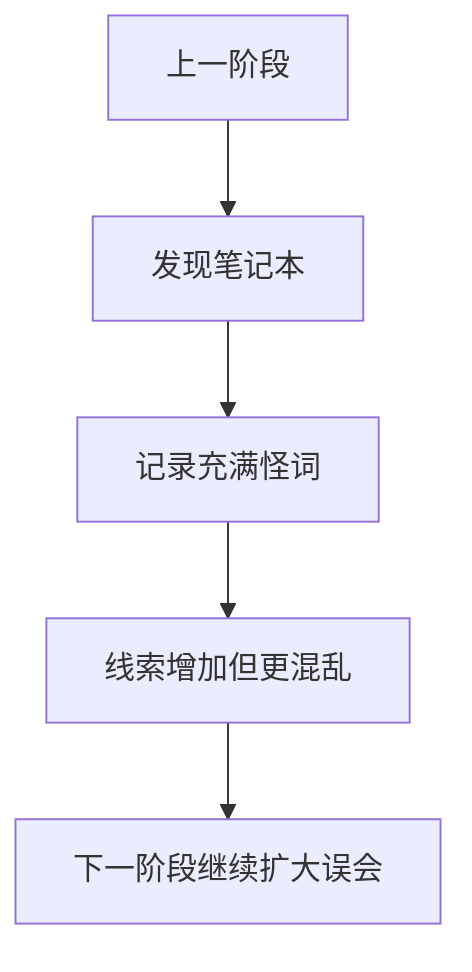

### 第三章——奇怪的笔记本

### Story

Near the empty display table, Mia found a thick notebook full of strange words. Every page seemed unrelated to the sandwich, but each page had one tiny blue arrow pointing toward another part of town.

### 中文完整翻译

在空空的展示台旁边，米娅发现了一本很厚的笔记本，里面写满了奇怪的单词。每一页看起来都和三明治毫无关系，但每页角落都有一个很小的蓝色箭头，指向镇上的另一个地方。

#### Vocabulary Story Paragraph 27

The town report mentioned **critique**, and Mia underlined it twice. The old plan looked **crucial**, even before the goat stepped on it. Mia watched someone **culminate** and wrote the action in her notebook. The strange instructions told the team to **cure**, which sounded suspicious. The town report mentioned **custody**, and Mia underlined it twice. The mayor said they might **cut** if the search became harder. The mayor suddenly asked about **cyberspace**, which made everyone look at him. The strange instructions told the team to **dangle**, which sounded suspicious.

#### 第 27 段：中文完整翻译（逐句，不省略）

1. 镇上的报告提到了 **critique**（n. 批评；评论，评论文章），米娅把这个词划了两遍下划线。

2. 那份旧计划看上去很 **crucial**（a. 关键的，决定性的）；甚至在那只山羊踩到它之前，就已经给人这种感觉了。

3. 米娅看到有人做了 **culminate**（v. 达到最高点；告终，使结束） 这个动作，于是把这件事记进了她的笔记本。

4. 那份奇怪的指示要求团队去做 **cure**（v. 治好，治愈；矫正；改正），这听起来很可疑。

5. 镇上的报告提到了 **custody**（n. 保管，照管；监护；拘留，监禁），米娅把这个词划了两遍下划线。

6. 市长说，如果搜寻变得更困难，他们可能会采取 **cut**（v. 切，割，砍，削；伤害） 这样的做法。

7. 市长突然问起了 **cyberspace**（n. 计算机空间），这让所有人一下子都转头看着他。

8. 那份奇怪的指示要求团队去做 **dangle**（v. （使）悬荡，（使）吊着；追随），这听起来很可疑。

#### 本段词汇讲解

| 词汇 | 原书词义 | 本段中的理解方式 |
|---|---|---|
| **critique** | n. 批评；评论，评论文章 | 作为人物、事物、概念或线索名词来理解 |
| **crucial** | a. 关键的，决定性的 | 作为性质、状态或评价来理解 |
| **culminate** | v. 达到最高点；告终，使结束 | 作为动作/行为来理解 |
| **cure** | v. 治好，治愈；矫正；改正 | 作为动作/行为来理解 |
| **custody** | n. 保管，照管；监护；拘留，监禁 | 作为人物、事物、概念或线索名词来理解 |
| **cut** | v. 切，割，砍，削；伤害 | 作为动作/行为来理解 |
| **cyberspace** | n. 计算机空间 | 作为人物、事物、概念或线索名词来理解 |
| **dangle** | v. （使）悬荡，（使）吊着；追随 | 作为动作/行为来理解 |

#### Vocabulary Story Paragraph 28

Someone tried to **daunt** before Mia could ask why. The mayor said they might **deal** if the search became harder. Mia watched someone **debate** and wrote the action in her notebook. A museum poster explained **debtor**, but Sir Biscuit tried to eat the poster. Someone tried to **declare** before Mia could ask why. The mayor said they might **deduce** if the search became harder. The mayor suddenly asked about **deduction**, which made everyone look at him. The strange instructions told the team to **default**, which sounded suspicious.

#### 第 28 段：中文完整翻译（逐句，不省略）

1. 还没等米娅问“为什么”，就有人试图去做 **daunt**（v. 使胆怯；使气馁；使失去信心） 这件事。

2. 市长说，如果搜寻变得更困难，他们可能会采取 **deal**（v. 处理，应付；分配；发牌） 这样的做法。

3. 米娅看到有人做了 **debate**（v. 辩论，讨论，争论；思考） 这个动作，于是把这件事记进了她的笔记本。

4. 博物馆的一张海报正在解释 **debtor**（n. 借方，债务人），可是 Sir Biscuit 那只山羊却试图把海报吃掉。

5. 还没等米娅问“为什么”，就有人试图去做 **declare**（v. 宣告，声明；申报） 这件事。

6. 市长说，如果搜寻变得更困难，他们可能会采取 **deduce**（v. 演绎，推断；追溯） 这样的做法。

7. 市长突然问起了 **deduction**（n. 扣除，扣除额；推论，演绎），这让所有人一下子都转头看着他。

8. 那份奇怪的指示要求团队去做 **default**（v. 不履行；缺席；拖欠 n. 违约；拖欠；缺席），这听起来很可疑。

#### 本段词汇讲解

| 词汇 | 原书词义 | 本段中的理解方式 |
|---|---|---|
| **daunt** | v. 使胆怯；使气馁；使失去信心 | 作为动作/行为来理解 |
| **deal** | v. 处理，应付；分配；发牌 | 作为动作/行为来理解 |
| **debate** | v. 辩论，讨论，争论；思考 | 作为动作/行为来理解 |
| **debtor** | n. 借方，债务人 | 作为人物、事物、概念或线索名词来理解 |
| **declare** | v. 宣告，声明；申报 | 作为动作/行为来理解 |
| **deduce** | v. 演绎，推断；追溯 | 作为动作/行为来理解 |
| **deduction** | n. 扣除，扣除额；推论，演绎 | 作为人物、事物、概念或线索名词来理解 |
| **default** | v. 不履行；缺席；拖欠 n. 违约；拖欠；缺席 | 作为动作/行为来理解 |

#### Vocabulary Story Paragraph 29

Someone tried to **defend** before Mia could ask why. Mia found a note about **deficit** beside the next blue arrow. The mayor suddenly asked about **deflation**, which made everyone look at him. The strange instructions told the team to **defuse**, which sounded suspicious. Someone tried to **delete** before Mia could ask why. The mayor said they might **deliver** if the search became harder. Mia watched someone **demand** and wrote the action in her notebook. The strange instructions told the team to **demean**, which sounded suspicious.

#### 第 29 段：中文完整翻译（逐句，不省略）

1. 还没等米娅问“为什么”，就有人试图去做 **defend**（v. 防御，保卫，保护；为…辩护） 这件事。

2. 米娅在下一个蓝色箭头旁边发现了一张关于 **deficit**（n. 不足额，赤字，亏空） 的纸条。

3. 市长突然问起了 **deflation**（n. 放气，缩小；通货紧缩；泄气），这让所有人一下子都转头看着他。

4. 那份奇怪的指示要求团队去做 **defuse**（v. 拆去…的雷管；除去危险性；缓和，平息），这听起来很可疑。

5. 还没等米娅问“为什么”，就有人试图去做 **delete**（v. 删除，划掉） 这件事。

6. 市长说，如果搜寻变得更困难，他们可能会采取 **deliver**（v. 投递，送交；发表；接生） 这样的做法。

7. 米娅看到有人做了 **demand**（v. 要求，请求；查询） 这个动作，于是把这件事记进了她的笔记本。

8. 那份奇怪的指示要求团队去做 **demean**（v. 贬低…的身份），这听起来很可疑。

#### 本段词汇讲解

| 词汇 | 原书词义 | 本段中的理解方式 |
|---|---|---|
| **defend** | v. 防御，保卫，保护；为…辩护 | 作为动作/行为来理解 |
| **deficit** | n. 不足额，赤字，亏空 | 作为人物、事物、概念或线索名词来理解 |
| **deflation** | n. 放气，缩小；通货紧缩；泄气 | 作为人物、事物、概念或线索名词来理解 |
| **defuse** | v. 拆去…的雷管；除去危险性；缓和，平息 | 作为动作/行为来理解 |
| **delete** | v. 删除，划掉 | 作为动作/行为来理解 |
| **deliver** | v. 投递，送交；发表；接生 | 作为动作/行为来理解 |
| **demand** | v. 要求，请求；查询 | 作为动作/行为来理解 |
| **demean** | v. 贬低…的身份 | 作为动作/行为来理解 |

#### Vocabulary Story Paragraph 30

Someone tried to **denounce** before Mia could ask why. The old plan looked **dental**, even before the goat stepped on it. Mia watched someone **depart** and wrote the action in her notebook. The strange instructions told the team to **depict**, which sounded suspicious. Someone tried to **deposit** before Mia could ask why. Mia found a note about **depression** beside the next blue arrow. Mia said the idea sounded **derelict**, but the mayor still liked it. A museum poster explained **dermatologist**, but Sir Biscuit tried to eat the poster.

#### 第 30 段：中文完整翻译（逐句，不省略）

1. 还没等米娅问“为什么”，就有人试图去做 **denounce**（v. 指责，谴责；告发；指控） 这件事。

2. 那份旧计划看上去很 **dental**（a. 牙齿的；牙科的）；甚至在那只山羊踩到它之前，就已经给人这种感觉了。

3. 米娅看到有人做了 **depart**（v. 起程，出发，离开；背离） 这个动作，于是把这件事记进了她的笔记本。

4. 那份奇怪的指示要求团队去做 **depict**（v. 描绘，描述，描画），这听起来很可疑。

5. 还没等米娅问“为什么”，就有人试图去做 **deposit**（v. 储存，放置；（使）沉淀） 这件事。

6. 米娅在下一个蓝色箭头旁边发现了一张关于 **depression**（n. 沮丧，意志消沉；不景气，萧条） 的纸条。

7. 米娅说，这个想法听起来很 **derelict**（a. 荒废的，被弃置的；玩忽职守的），但市长还是很喜欢它。

8. 博物馆的一张海报正在解释 **dermatologist**（n. 皮肤学专家，皮肤科医生），可是 Sir Biscuit 那只山羊却试图把海报吃掉。

#### 本段词汇讲解

| 词汇 | 原书词义 | 本段中的理解方式 |
|---|---|---|
| **denounce** | v. 指责，谴责；告发；指控 | 作为动作/行为来理解 |
| **dental** | a. 牙齿的；牙科的 | 作为性质、状态或评价来理解 |
| **depart** | v. 起程，出发，离开；背离 | 作为动作/行为来理解 |
| **depict** | v. 描绘，描述，描画 | 作为动作/行为来理解 |
| **deposit** | v. 储存，放置；（使）沉淀 | 作为动作/行为来理解 |
| **depression** | n. 沮丧，意志消沉；不景气，萧条 | 作为人物、事物、概念或线索名词来理解 |
| **derelict** | a. 荒废的，被弃置的；玩忽职守的 | 作为性质、状态或评价来理解 |
| **dermatologist** | n. 皮肤学专家，皮肤科医生 | 作为人物、事物、概念或线索名词来理解 |

#### Vocabulary Story Paragraph 31

Someone tried to **desert** before Mia could ask why. Mia found a note about **desktop** beside the next blue arrow. The mayor suddenly asked about **detection**, which made everyone look at him. A museum poster explained **detention**, but Sir Biscuit tried to eat the poster. Someone tried to **deteriorate** before Mia could ask why. Mia found a note about **device** beside the next blue arrow. Mia watched someone **diagnose** and wrote the action in her notebook. A museum poster explained **dictator**, but Sir Biscuit tried to eat the poster.

#### 第 31 段：中文完整翻译（逐句，不省略）

1. 还没等米娅问“为什么”，就有人试图去做 **desert**（v. 遗弃，抛弃） 这件事。

2. 米娅在下一个蓝色箭头旁边发现了一张关于 **desktop**（n. 台式计算机；（电脑）桌面） 的纸条。

3. 市长突然问起了 **detection**（n. 发现，发觉；侦查，探知），这让所有人一下子都转头看着他。

4. 博物馆的一张海报正在解释 **detention**（n. 滞留，延迟；拘留），可是 Sir Biscuit 那只山羊却试图把海报吃掉。

5. 还没等米娅问“为什么”，就有人试图去做 **deteriorate**（v. （使）恶化；（使）下降；（使）退化；） 这件事。

6. 米娅在下一个蓝色箭头旁边发现了一张关于 **device**（n. 装置，设备；手段，谋略） 的纸条。

7. 米娅看到有人做了 **diagnose**（v. 诊断） 这个动作，于是把这件事记进了她的笔记本。

8. 博物馆的一张海报正在解释 **dictator**（n. 独裁者），可是 Sir Biscuit 那只山羊却试图把海报吃掉。

#### 本段词汇讲解

| 词汇 | 原书词义 | 本段中的理解方式 |
|---|---|---|
| **desert** | v. 遗弃，抛弃 | 作为动作/行为来理解 |
| **desktop** | n. 台式计算机；（电脑）桌面 | 作为人物、事物、概念或线索名词来理解 |
| **detection** | n. 发现，发觉；侦查，探知 | 作为人物、事物、概念或线索名词来理解 |
| **detention** | n. 滞留，延迟；拘留 | 作为人物、事物、概念或线索名词来理解 |
| **deteriorate** | v. （使）恶化；（使）下降；（使）退化； | 作为动作/行为来理解 |
| **device** | n. 装置，设备；手段，谋略 | 作为人物、事物、概念或线索名词来理解 |
| **diagnose** | v. 诊断 | 作为动作/行为来理解 |
| **dictator** | n. 独裁者 | 作为人物、事物、概念或线索名词来理解 |

#### Vocabulary Story Paragraph 32

Someone tried to **diffuse** before Mia could ask why. The old plan looked **digital**, even before the goat stepped on it. Mia watched someone **diminish** and wrote the action in her notebook. The mayor insisted that the plan was **dire**, which did not calm anyone. The guide called the situation **disabled**, and Mia wrote the word down. The old plan looked **disastrous**, even before the goat stepped on it. Mia watched someone **discern** and wrote the action in her notebook. The strange instructions told the team to **disclaim**, which sounded suspicious.

#### 第 32 段：中文完整翻译（逐句，不省略）

1. 还没等米娅问“为什么”，就有人试图去做 **diffuse**（v. （使）扩散，传播，散布） 这件事。

2. 那份旧计划看上去很 **digital**（a. 数字的，数码的）；甚至在那只山羊踩到它之前，就已经给人这种感觉了。

3. 米娅看到有人做了 **diminish**（v. 缩小，减少，递减；削弱…的权势） 这个动作，于是把这件事记进了她的笔记本。

4. 市长坚持认为这项计划是 **dire**（a. 可怕的；悲惨的；极度的；紧迫的） 的，但这并没有让任何人安心下来。

5. 向导把当前的情况称作 **disabled**（a. 残废的；有缺陷的），米娅把这个词记了下来。

6. 那份旧计划看上去很 **disastrous**（a. 灾害的，灾难性的；悲惨的）；甚至在那只山羊踩到它之前，就已经给人这种感觉了。

7. 米娅看到有人做了 **discern**（v. 认出，发现；辨别，识别） 这个动作，于是把这件事记进了她的笔记本。

8. 那份奇怪的指示要求团队去做 **disclaim**（v. 放弃，否认，拒绝承认），这听起来很可疑。

#### 本段词汇讲解

| 词汇 | 原书词义 | 本段中的理解方式 |
|---|---|---|
| **diffuse** | v. （使）扩散，传播，散布 | 作为动作/行为来理解 |
| **digital** | a. 数字的，数码的 | 作为性质、状态或评价来理解 |
| **diminish** | v. 缩小，减少，递减；削弱…的权势 | 作为动作/行为来理解 |
| **dire** | a. 可怕的；悲惨的；极度的；紧迫的 | 作为性质、状态或评价来理解 |
| **disabled** | a. 残废的；有缺陷的 | 作为性质、状态或评价来理解 |
| **disastrous** | a. 灾害的，灾难性的；悲惨的 | 作为性质、状态或评价来理解 |
| **discern** | v. 认出，发现；辨别，识别 | 作为动作/行为来理解 |
| **disclaim** | v. 放弃，否认，拒绝承认 | 作为动作/行为来理解 |

#### Vocabulary Story Paragraph 33

The town report mentioned **disclosure**, and Mia underlined it twice. The mayor said they might **discredit** if the search became harder. Mia watched someone **disinfect** and wrote the action in her notebook. The strange instructions told the team to **dismiss**, which sounded suspicious. The town report mentioned **disruption**, and Mia underlined it twice. The mayor said they might **dissipate** if the search became harder. Mia watched someone **distribute** and wrote the action in her notebook. The strange instructions told the team to **dive**, which sounded suspicious.

#### 第 33 段：中文完整翻译（逐句，不省略）

1. 镇上的报告提到了 **disclosure**（n. 揭发，透露，公开），米娅把这个词划了两遍下划线。

2. 市长说，如果搜寻变得更困难，他们可能会采取 **discredit**（v. 使丢脸，败坏…的名声；使不足信） 这样的做法。

3. 米娅看到有人做了 **disinfect**（v. 给…消毒（或杀菌）） 这个动作，于是把这件事记进了她的笔记本。

4. 那份奇怪的指示要求团队去做 **dismiss**（v. 解散；开除），这听起来很可疑。

5. 镇上的报告提到了 **disruption**（n. 分裂，崩溃，瓦解；混乱），米娅把这个词划了两遍下划线。

6. 市长说，如果搜寻变得更困难，他们可能会采取 **dissipate**（v. 驱散，使消散；浪费，挥霍） 这样的做法。

7. 米娅看到有人做了 **distribute**（v. 分发；分配；散布） 这个动作，于是把这件事记进了她的笔记本。

8. 那份奇怪的指示要求团队去做 **dive**（v. 跳水，潜水；潜心钻研，探究），这听起来很可疑。

#### 本段词汇讲解

| 词汇 | 原书词义 | 本段中的理解方式 |
|---|---|---|
| **disclosure** | n. 揭发，透露，公开 | 作为人物、事物、概念或线索名词来理解 |
| **discredit** | v. 使丢脸，败坏…的名声；使不足信 | 作为动作/行为来理解 |
| **disinfect** | v. 给…消毒（或杀菌） | 作为动作/行为来理解 |
| **dismiss** | v. 解散；开除 | 作为动作/行为来理解 |
| **disruption** | n. 分裂，崩溃，瓦解；混乱 | 作为人物、事物、概念或线索名词来理解 |
| **dissipate** | v. 驱散，使消散；浪费，挥霍 | 作为动作/行为来理解 |
| **distribute** | v. 分发；分配；散布 | 作为动作/行为来理解 |
| **dive** | v. 跳水，潜水；潜心钻研，探究 | 作为动作/行为来理解 |

#### Vocabulary Story Paragraph 34

Someone tried to **diversify** before Mia could ask why. Mia found a note about **dividend** beside the next blue arrow. The mayor suddenly asked about **dizziness**, which made everyone look at him. A museum poster explained **donor**, but Sir Biscuit tried to eat the poster. The guide called the situation **dormant**, and Mia wrote the word down. The old plan looked **dour**, even before the goat stepped on it. Mia watched someone **downsize** and wrote the action in her notebook. The strange instructions told the team to **draft**, which sounded suspicious.

#### 第 34 段：中文完整翻译（逐句，不省略）

1. 还没等米娅问“为什么”，就有人试图去做 **diversify**（v. 使多样化） 这件事。

2. 米娅在下一个蓝色箭头旁边发现了一张关于 **dividend**（n. 红利，股息；被除数） 的纸条。

3. 市长突然问起了 **dizziness**（n. 头昏眼花，眩晕），这让所有人一下子都转头看着他。

4. 博物馆的一张海报正在解释 **donor**（n. 赠送人，捐赠者），可是 Sir Biscuit 那只山羊却试图把海报吃掉。

5. 向导把当前的情况称作 **dormant**（a. 睡着的；冬眠的，休眠的），米娅把这个词记了下来。

6. 那份旧计划看上去很 **dour**（a. 阴郁的；严厉的；倔强的）；甚至在那只山羊踩到它之前，就已经给人这种感觉了。

7. 米娅看到有人做了 **downsize**（v. 以较小尺寸设计或制造；裁减（员工）人数） 这个动作，于是把这件事记进了她的笔记本。

8. 那份奇怪的指示要求团队去做 **draft**（v. 起草；设计；选派；征兵），这听起来很可疑。

#### 本段词汇讲解

| 词汇 | 原书词义 | 本段中的理解方式 |
|---|---|---|
| **diversify** | v. 使多样化 | 作为动作/行为来理解 |
| **dividend** | n. 红利，股息；被除数 | 作为人物、事物、概念或线索名词来理解 |
| **dizziness** | n. 头昏眼花，眩晕 | 作为人物、事物、概念或线索名词来理解 |
| **donor** | n. 赠送人，捐赠者 | 作为人物、事物、概念或线索名词来理解 |
| **dormant** | a. 睡着的；冬眠的，休眠的 | 作为性质、状态或评价来理解 |
| **dour** | a. 阴郁的；严厉的；倔强的 | 作为性质、状态或评价来理解 |
| **downsize** | v. 以较小尺寸设计或制造；裁减（员工）人数 | 作为动作/行为来理解 |
| **draft** | v. 起草；设计；选派；征兵 | 作为动作/行为来理解 |

#### Vocabulary Story Paragraph 35

Someone tried to **drift** before Mia could ask why. The old plan looked **dubious**, even before the goat stepped on it. Mia said the idea sounded **dumb**, but the mayor still liked it. A museum poster explained **duty**, but Sir Biscuit tried to eat the poster. The town report mentioned **earnings**, and Mia underlined it twice. The old plan looked **eco-conscious**, even before the goat stepped on it. The mayor suddenly asked about **economics**, which made everyone look at him. A museum poster explained **economy**, but Sir Biscuit tried to eat the poster.

#### 第 35 段：中文完整翻译（逐句，不省略）

1. 还没等米娅问“为什么”，就有人试图去做 **drift**（v. 漂流；漂泊，游荡；渐渐趋向） 这件事。

2. 那份旧计划看上去很 **dubious**（a. 半信半疑的，怀疑的；犹豫不决的）；甚至在那只山羊踩到它之前，就已经给人这种感觉了。

3. 米娅说，这个想法听起来很 **dumb**（a. 哑的，无言的；迟钝的，笨的），但市长还是很喜欢它。

4. 博物馆的一张海报正在解释 **duty**（n. 职责，本分，责任；税），可是 Sir Biscuit 那只山羊却试图把海报吃掉。

5. 镇上的报告提到了 **earnings**（n. 收入，工资；利润，收益），米娅把这个词划了两遍下划线。

6. 那份旧计划看上去很 **eco-conscious**（a. 有环保意识的）；甚至在那只山羊踩到它之前，就已经给人这种感觉了。

7. 市长突然问起了 **economics**（n. 经济学；经济情况，经济），这让所有人一下子都转头看着他。

8. 博物馆的一张海报正在解释 **economy**（n. 节约，节省；经济），可是 Sir Biscuit 那只山羊却试图把海报吃掉。

#### 本段词汇讲解

| 词汇 | 原书词义 | 本段中的理解方式 |
|---|---|---|
| **drift** | v. 漂流；漂泊，游荡；渐渐趋向 | 作为动作/行为来理解 |
| **dubious** | a. 半信半疑的，怀疑的；犹豫不决的 | 作为性质、状态或评价来理解 |
| **dumb** | a. 哑的，无言的；迟钝的，笨的 | 作为性质、状态或评价来理解 |
| **duty** | n. 职责，本分，责任；税 | 作为人物、事物、概念或线索名词来理解 |
| **earnings** | n. 收入，工资；利润，收益 | 作为人物、事物、概念或线索名词来理解 |
| **eco-conscious** | a. 有环保意识的 | 作为性质、状态或评价来理解 |
| **economics** | n. 经济学；经济情况，经济 | 作为人物、事物、概念或线索名词来理解 |
| **economy** | n. 节约，节省；经济 | 作为人物、事物、概念或线索名词来理解 |

#### Vocabulary Story Paragraph 36

The town report mentioned **editor**, and Mia underlined it twice. The notebook had a whole line about **educational toys**, although nobody knew why. Mia watched someone **effect** and wrote the action in her notebook. The strange instructions told the team to **elicit**, which sounded suspicious. Someone tried to **emancipate** before Mia could ask why. The mayor said they might **embed** if the search became harder. Mia watched someone **embrace** and wrote the action in her notebook. The strange instructions told the team to **empathize**, which sounded suspicious.

#### 第 36 段：中文完整翻译（逐句，不省略）

1. 镇上的报告提到了 **editor**（n. 编辑），米娅把这个词划了两遍下划线。

2. 笔记本里居然整整写了一行关于 **educational toys**（教学玩具） 的内容，尽管谁也不知道为什么。

3. 米娅看到有人做了 **effect**（v. 造成，招致；产生，实现） 这个动作，于是把这件事记进了她的笔记本。

4. 那份奇怪的指示要求团队去做 **elicit**（v. 引出，诱出，引起），这听起来很可疑。

5. 还没等米娅问“为什么”，就有人试图去做 **emancipate**（v. 释放，解放） 这件事。

6. 市长说，如果搜寻变得更困难，他们可能会采取 **embed**（v. 使插入，使嵌入；使深留脑中（或记忆中）） 这样的做法。

7. 米娅看到有人做了 **embrace**（v. 拥抱；包括；欣然接受） 这个动作，于是把这件事记进了她的笔记本。

8. 那份奇怪的指示要求团队去做 **empathize**（v. （使）同情，有同感，产生共鸣），这听起来很可疑。

#### 本段词汇讲解

| 词汇 | 原书词义 | 本段中的理解方式 |
|---|---|---|
| **editor** | n. 编辑 | 作为人物、事物、概念或线索名词来理解 |
| **educational toys** | 教学玩具 | 作为固定短语或概念整体记忆 |
| **effect** | v. 造成，招致；产生，实现 | 作为动作/行为来理解 |
| **elicit** | v. 引出，诱出，引起 | 作为动作/行为来理解 |
| **emancipate** | v. 释放，解放 | 作为动作/行为来理解 |
| **embed** | v. 使插入，使嵌入；使深留脑中（或记忆中） | 作为动作/行为来理解 |
| **embrace** | v. 拥抱；包括；欣然接受 | 作为动作/行为来理解 |
| **empathize** | v. （使）同情，有同感，产生共鸣 | 作为动作/行为来理解 |

#### Vocabulary Story Paragraph 37

The town report mentioned **employee**, and Mia underlined it twice. Mia found a note about **encryption** beside the next blue arrow. Mia watched someone **endeavor** and wrote the action in her notebook. The strange instructions told the team to **endorse**, which sounded suspicious. The town report mentioned **energy**, and Mia underlined it twice. The mayor said they might **engineer** if the search became harder. Mia watched someone **ensure** and wrote the action in her notebook. The strange instructions told the team to **entertain**, which sounded suspicious.

#### 第 37 段：中文完整翻译（逐句，不省略）

1. 镇上的报告提到了 **employee**（n. 受雇者，雇工，雇员），米娅把这个词划了两遍下划线。

2. 米娅在下一个蓝色箭头旁边发现了一张关于 **encryption**（n. 加密） 的纸条。

3. 米娅看到有人做了 **endeavor**（v. 努力，尽力；力图） 这个动作，于是把这件事记进了她的笔记本。

4. 那份奇怪的指示要求团队去做 **endorse**（v. 背书，签署；赞同，批准），这听起来很可疑。

5. 镇上的报告提到了 **energy**（n. 能量，精力，活力），米娅把这个词划了两遍下划线。

6. 市长说，如果搜寻变得更困难，他们可能会采取 **engineer**（v. 设计，建造；操纵，策划） 这样的做法。

7. 米娅看到有人做了 **ensure**（v. 保证，担保；使安全，保护） 这个动作，于是把这件事记进了她的笔记本。

8. 那份奇怪的指示要求团队去做 **entertain**（v. 使欢乐，使娱乐；招待；持有），这听起来很可疑。

#### 本段词汇讲解

| 词汇 | 原书词义 | 本段中的理解方式 |
|---|---|---|
| **employee** | n. 受雇者，雇工，雇员 | 作为人物、事物、概念或线索名词来理解 |
| **encryption** | n. 加密 | 作为人物、事物、概念或线索名词来理解 |
| **endeavor** | v. 努力，尽力；力图 | 作为动作/行为来理解 |
| **endorse** | v. 背书，签署；赞同，批准 | 作为动作/行为来理解 |
| **energy** | n. 能量，精力，活力 | 作为人物、事物、概念或线索名词来理解 |
| **engineer** | v. 设计，建造；操纵，策划 | 作为动作/行为来理解 |
| **ensure** | v. 保证，担保；使安全，保护 | 作为动作/行为来理解 |
| **entertain** | v. 使欢乐，使娱乐；招待；持有 | 作为动作/行为来理解 |

#### Vocabulary Story Paragraph 38

The town report mentioned **entrepreneur**, and Mia underlined it twice. At the next booth, Mia saw a poster about **environmental assessment** and followed another arrow. The mayor suddenly asked about **envy**, which made everyone look at him. The mayor insisted that the plan was **equal**, which did not calm anyone. The town report mentioned **equipment**, and Mia underlined it twice. Mia found a note about **eradication** beside the next blue arrow. Mia said the idea sounded **essential**, but the mayor still liked it. A museum poster explained **estate**, but Sir Biscuit tried to eat the poster.

#### 第 38 段：中文完整翻译（逐句，不省略）

1. 镇上的报告提到了 **entrepreneur**（n. 企业家），米娅把这个词划了两遍下划线。

2. 到了下一个摊位，米娅看到了一张关于 **environmental assessment**（环境评估） 的海报，然后继续沿着另一个箭头走。

3. 市长突然问起了 **envy**（n. 妒忌，羡慕），这让所有人一下子都转头看着他。

4. 市长坚持认为这项计划是 **equal**（a. 相等的，平等的；能胜任的） 的，但这并没有让任何人安心下来。

5. 镇上的报告提到了 **equipment**（n. 装备，设备），米娅把这个词划了两遍下划线。

6. 米娅在下一个蓝色箭头旁边发现了一张关于 **eradication**（n. 根除；消灭） 的纸条。

7. 米娅说，这个想法听起来很 **essential**（a. 本质的，实质的；基本的），但市长还是很喜欢它。

8. 博物馆的一张海报正在解释 **estate**（n. 房地产，不动产；社会等级），可是 Sir Biscuit 那只山羊却试图把海报吃掉。

#### 本段词汇讲解

| 词汇 | 原书词义 | 本段中的理解方式 |
|---|---|---|
| **entrepreneur** | n. 企业家 | 作为人物、事物、概念或线索名词来理解 |
| **environmental assessment** | 环境评估 | 作为固定短语或概念整体记忆 |
| **envy** | n. 妒忌，羡慕 | 作为人物、事物、概念或线索名词来理解 |
| **equal** | a. 相等的，平等的；能胜任的 | 作为性质、状态或评价来理解 |
| **equipment** | n. 装备，设备 | 作为人物、事物、概念或线索名词来理解 |
| **eradication** | n. 根除；消灭 | 作为人物、事物、概念或线索名词来理解 |
| **essential** | a. 本质的，实质的；基本的 | 作为性质、状态或评价来理解 |
| **estate** | n. 房地产，不动产；社会等级 | 作为人物、事物、概念或线索名词来理解 |

#### Vocabulary Story Paragraph 39

A sign near the next clue mentioned **ethnic minority**, which seemed oddly specific. The mayor said they might **evaluate** if the search became harder.

#### 第 39 段：中文完整翻译（逐句，不省略）

1. 下一条线索旁边的一块牌子提到了 **ethnic minority**（少数民族）；这个细节具体得有些奇怪。

2. 市长说，如果搜寻变得更困难，他们可能会采取 **evaluate**（v. 估价，评价） 这样的做法。

#### 本段词汇讲解

| 词汇 | 原书词义 | 本段中的理解方式 |
|---|---|---|
| **ethnic minority** | 少数民族 | 作为固定短语或概念整体记忆 |
| **evaluate** | v. 估价，评价 | 作为动作/行为来理解 |

---

## Chapter 4 — The Bank Clue


### 本章剧情导图

> 银行线索出现，但真相反而更远


### 本章在线索链中的位置

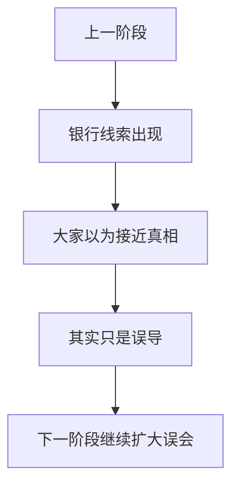

### 第四章——银行里的线索

### Story

The arrows led Mia to the town bank. The banker denied stealing food, but he did admit that someone had paid for a refrigerated truck at 6 a.m. The receipt was signed only with a smiley face.

### 中文完整翻译

箭头把米娅带到了镇上的银行。银行家否认偷过食物，但承认清晨六点有人付钱租过一辆冷藏卡车。收据上的签名只有一个笑脸。

#### Vocabulary Story Paragraph 40

The town report mentioned **evolution**, and Mia underlined it twice. Mia found a note about **excess** beside the next blue arrow. Mia watched someone **exclude** and wrote the action in her notebook. The mayor insisted that the plan was **executive**, which did not calm anyone. Someone tried to **exhibit** before Mia could ask why. The mayor said they might **expedite** if the search became harder. The mayor suddenly asked about **expense**, which made everyone look at him. The strange instructions told the team to **expire**, which sounded suspicious.

#### 第 40 段：中文完整翻译（逐句，不省略）

1. 镇上的报告提到了 **evolution**（n. 发展；渐进；进化），米娅把这个词划了两遍下划线。

2. 米娅在下一个蓝色箭头旁边发现了一张关于 **excess**（n. 超越；过量；（饮食等的）过度，无节制） 的纸条。

3. 米娅看到有人做了 **exclude**（v. 排除；拒绝） 这个动作，于是把这件事记进了她的笔记本。

4. 市长坚持认为这项计划是 **executive**（a. 执行的；行政的，管理的） 的，但这并没有让任何人安心下来。

5. 还没等米娅问“为什么”，就有人试图去做 **exhibit**（v. 显示，陈列，展览，展出） 这件事。

6. 市长说，如果搜寻变得更困难，他们可能会采取 **expedite**（v. 使加速，促进） 这样的做法。

7. 市长突然问起了 **expense**（n. 价钱；费用；花费），这让所有人一下子都转头看着他。

8. 那份奇怪的指示要求团队去做 **expire**（v. 断气；终止，期满），这听起来很可疑。

#### 本段词汇讲解

| 词汇 | 原书词义 | 本段中的理解方式 |
|---|---|---|
| **evolution** | n. 发展；渐进；进化 | 作为人物、事物、概念或线索名词来理解 |
| **excess** | n. 超越；过量；（饮食等的）过度，无节制 | 作为人物、事物、概念或线索名词来理解 |
| **exclude** | v. 排除；拒绝 | 作为动作/行为来理解 |
| **executive** | a. 执行的；行政的，管理的 | 作为性质、状态或评价来理解 |
| **exhibit** | v. 显示，陈列，展览，展出 | 作为动作/行为来理解 |
| **expedite** | v. 使加速，促进 | 作为动作/行为来理解 |
| **expense** | n. 价钱；费用；花费 | 作为人物、事物、概念或线索名词来理解 |
| **expire** | v. 断气；终止，期满 | 作为动作/行为来理解 |

#### Vocabulary Story Paragraph 41

Someone tried to **explode** before Mia could ask why. Mia found a note about **explosive** beside the next blue arrow. The mayor suddenly asked about **exposure**, which made everyone look at him. A museum poster explained **extinction**, but Sir Biscuit tried to eat the poster. The guide called the situation **extraordinary**, and Mia wrote the word down. Mia found a note about **eyewitness** beside the next blue arrow. Mia watched someone **facilitate** and wrote the action in her notebook. A museum poster explained **farce**, but Sir Biscuit tried to eat the poster.

#### 第 41 段：中文完整翻译（逐句，不省略）

1. 还没等米娅问“为什么”，就有人试图去做 **explode**（v. （使）爆炸；勃然（大怒）;大发（雷霆）） 这件事。

2. 米娅在下一个蓝色箭头旁边发现了一张关于 **explosive**（n. 炸药，爆炸物） 的纸条。

3. 市长突然问起了 **exposure**（n. 暴露；揭露；曝光），这让所有人一下子都转头看着他。

4. 博物馆的一张海报正在解释 **extinction**（n. 消灭，灭绝；熄灭，灭火），可是 Sir Biscuit 那只山羊却试图把海报吃掉。

5. 向导把当前的情况称作 **extraordinary**（a. 非同寻常的，特别的），米娅把这个词记了下来。

6. 米娅在下一个蓝色箭头旁边发现了一张关于 **eyewitness**（n. 目击者，见证人） 的纸条。

7. 米娅看到有人做了 **facilitate**（v. 使容易，促进，帮助） 这个动作，于是把这件事记进了她的笔记本。

8. 博物馆的一张海报正在解释 **farce**（n. 笑剧，闹剧，滑稽戏），可是 Sir Biscuit 那只山羊却试图把海报吃掉。

#### 本段词汇讲解

| 词汇 | 原书词义 | 本段中的理解方式 |
|---|---|---|
| **explode** | v. （使）爆炸；勃然（大怒）;大发（雷霆） | 作为动作/行为来理解 |
| **explosive** | n. 炸药，爆炸物 | 作为人物、事物、概念或线索名词来理解 |
| **exposure** | n. 暴露；揭露；曝光 | 作为人物、事物、概念或线索名词来理解 |
| **extinction** | n. 消灭，灭绝；熄灭，灭火 | 作为人物、事物、概念或线索名词来理解 |
| **extraordinary** | a. 非同寻常的，特别的 | 作为性质、状态或评价来理解 |
| **eyewitness** | n. 目击者，见证人 | 作为人物、事物、概念或线索名词来理解 |
| **facilitate** | v. 使容易，促进，帮助 | 作为动作/行为来理解 |
| **farce** | n. 笑剧，闹剧，滑稽戏 | 作为人物、事物、概念或线索名词来理解 |

#### Vocabulary Story Paragraph 42

Someone tried to **fascinate** before Mia could ask why. The old plan looked **fastidious**, even before the goat stepped on it. The mayor suddenly asked about **feature**, which made everyone look at him. The strange instructions told the team to **ferment**, which sounded suspicious. The guide called the situation **festive**, and Mia wrote the word down. Mia found a note about **fever** beside the next blue arrow. Mia watched someone **file** and wrote the action in her notebook. The mayor insisted that the plan was **financial**, which did not calm anyone.

#### 第 42 段：中文完整翻译（逐句，不省略）

1. 还没等米娅问“为什么”，就有人试图去做 **fascinate**（v. 迷住；深深吸引） 这件事。

2. 那份旧计划看上去很 **fastidious**（a. 难取悦的，挑剔的）；甚至在那只山羊踩到它之前，就已经给人这种感觉了。

3. 市长突然问起了 **feature**（n. 特征，特色；面貌，相貌；脸的一部分），这让所有人一下子都转头看着他。

4. 那份奇怪的指示要求团队去做 **ferment**（v. （使）发酵；骚动），这听起来很可疑。

5. 向导把当前的情况称作 **festive**（a. 节日的，喜庆的，欢乐的），米娅把这个词记了下来。

6. 米娅在下一个蓝色箭头旁边发现了一张关于 **fever**（n. 发热，发烧；狂热，高度兴奋） 的纸条。

7. 米娅看到有人做了 **file**（n. 档案，文件，活页夹 v. 把…归档；排成纵队前进） 这个动作，于是把这件事记进了她的笔记本。

8. 市长坚持认为这项计划是 **financial**（a. 财政的，金融的） 的，但这并没有让任何人安心下来。

#### 本段词汇讲解

| 词汇 | 原书词义 | 本段中的理解方式 |
|---|---|---|
| **fascinate** | v. 迷住；深深吸引 | 作为动作/行为来理解 |
| **fastidious** | a. 难取悦的，挑剔的 | 作为性质、状态或评价来理解 |
| **feature** | n. 特征，特色；面貌，相貌；脸的一部分 | 作为人物、事物、概念或线索名词来理解 |
| **ferment** | v. （使）发酵；骚动 | 作为动作/行为来理解 |
| **festive** | a. 节日的，喜庆的，欢乐的 | 作为性质、状态或评价来理解 |
| **fever** | n. 发热，发烧；狂热，高度兴奋 | 作为人物、事物、概念或线索名词来理解 |
| **file** | n. 档案，文件，活页夹 v. 把…归档；排成纵队前进 | 作为动作/行为来理解 |
| **financial** | a. 财政的，金融的 | 作为性质、状态或评价来理解 |

#### Vocabulary Story Paragraph 43

The guide called the situation **fiscal**, and Mia wrote the word down. The mayor said they might **flee** if the search became harder. Mia watched someone **flock** and wrote the action in her notebook. A museum poster explained **flora**, but Sir Biscuit tried to eat the poster. Someone tried to **flourish** before Mia could ask why. The mayor said they might **focus** if the search became harder. A sign near the next clue mentioned **food poisoning**, which seemed oddly specific. The notebook had a whole line about **foreign exchange**, although nobody knew why.

#### 第 43 段：中文完整翻译（逐句，不省略）

1. 向导把当前的情况称作 **fiscal**（a. 财政的），米娅把这个词记了下来。

2. 市长说，如果搜寻变得更困难，他们可能会采取 **flee**（v. 逃避，逃跑，逃走） 这样的做法。

3. 米娅看到有人做了 **flock**（v. 群集，聚集 n. 群；大量，众多） 这个动作，于是把这件事记进了她的笔记本。

4. 博物馆的一张海报正在解释 **flora**（n. 植物群），可是 Sir Biscuit 那只山羊却试图把海报吃掉。

5. 还没等米娅问“为什么”，就有人试图去做 **flourish**（v. 繁荣，兴旺） 这件事。

6. 市长说，如果搜寻变得更困难，他们可能会采取 **focus**（v. 聚焦，集中） 这样的做法。

7. 下一条线索旁边的一块牌子提到了 **food poisoning**（食物中毒）；这个细节具体得有些奇怪。

8. 笔记本里居然整整写了一行关于 **foreign exchange**（外汇） 的内容，尽管谁也不知道为什么。

#### 本段词汇讲解

| 词汇 | 原书词义 | 本段中的理解方式 |
|---|---|---|
| **fiscal** | a. 财政的 | 作为性质、状态或评价来理解 |
| **flee** | v. 逃避，逃跑，逃走 | 作为动作/行为来理解 |
| **flock** | v. 群集，聚集 n. 群；大量，众多 | 作为动作/行为来理解 |
| **flora** | n. 植物群 | 作为人物、事物、概念或线索名词来理解 |
| **flourish** | v. 繁荣，兴旺 | 作为动作/行为来理解 |
| **focus** | v. 聚焦，集中 | 作为动作/行为来理解 |
| **food poisoning** | 食物中毒 | 作为固定短语或概念整体记忆 |
| **foreign exchange** | 外汇 | 作为固定短语或概念整体记忆 |

#### Vocabulary Story Paragraph 44

The town report mentioned **forgery**, and Mia underlined it twice. Mia found a note about **formula** beside the next blue arrow. The mayor suddenly asked about **fortune**, which made everyone look at him. The strange instructions told the team to **found**, which sounded suspicious. The guide called the situation **frail**, and Mia wrote the word down. Mia found a note about **fraud** beside the next blue arrow. Mia watched someone **freeze** and wrote the action in her notebook. The strange instructions told the team to **frustrate**, which sounded suspicious.

#### 第 44 段：中文完整翻译（逐句，不省略）

1. 镇上的报告提到了 **forgery**（n. 伪造；赝品），米娅把这个词划了两遍下划线。

2. 米娅在下一个蓝色箭头旁边发现了一张关于 **formula**（n. 公式；规则；客套语） 的纸条。

3. 市长突然问起了 **fortune**（n. 运气；命运；财产，大笔的钱），这让所有人一下子都转头看着他。

4. 那份奇怪的指示要求团队去做 **found**（v. 打基础；建立），这听起来很可疑。

5. 向导把当前的情况称作 **frail**（a. 虚弱的；脆弱的；薄弱的），米娅把这个词记了下来。

6. 米娅在下一个蓝色箭头旁边发现了一张关于 **fraud**（n. 欺骗罪，欺诈罪；骗子） 的纸条。

7. 米娅看到有人做了 **freeze**（v. 冻结；不许动） 这个动作，于是把这件事记进了她的笔记本。

8. 那份奇怪的指示要求团队去做 **frustrate**（v. 使懊恼，使沮丧；阻止，挫败），这听起来很可疑。

#### 本段词汇讲解

| 词汇 | 原书词义 | 本段中的理解方式 |
|---|---|---|
| **forgery** | n. 伪造；赝品 | 作为人物、事物、概念或线索名词来理解 |
| **formula** | n. 公式；规则；客套语 | 作为人物、事物、概念或线索名词来理解 |
| **fortune** | n. 运气；命运；财产，大笔的钱 | 作为人物、事物、概念或线索名词来理解 |
| **found** | v. 打基础；建立 | 作为动作/行为来理解 |
| **frail** | a. 虚弱的；脆弱的；薄弱的 | 作为性质、状态或评价来理解 |
| **fraud** | n. 欺骗罪，欺诈罪；骗子 | 作为人物、事物、概念或线索名词来理解 |
| **freeze** | v. 冻结；不许动 | 作为动作/行为来理解 |
| **frustrate** | v. 使懊恼，使沮丧；阻止，挫败 | 作为动作/行为来理解 |

#### Vocabulary Story Paragraph 45

The town report mentioned **fund**, and Mia underlined it twice. Mia found a note about **future** beside the next blue arrow. The mayor suddenly asked about **galaxy**, which made everyone look at him. A museum poster explained **garbage**, but Sir Biscuit tried to eat the poster. Someone tried to **gather** before Mia could ask why. A sign near the next clue mentioned **general strike**, which seemed oddly specific. The notebook had a whole line about **genetic engineering**, although nobody knew why. The mayor insisted that the plan was **genial**, which did not calm anyone.

#### 第 45 段：中文完整翻译（逐句，不省略）

1. 镇上的报告提到了 **fund**（n. 资金，基金；存款），米娅把这个词划了两遍下划线。

2. 米娅在下一个蓝色箭头旁边发现了一张关于 **future**（n. 将来；前途，前景） 的纸条。

3. 市长突然问起了 **galaxy**（n. 星系，银河；群英，人才荟萃），这让所有人一下子都转头看着他。

4. 博物馆的一张海报正在解释 **garbage**（n. 垃圾，废物；废话），可是 Sir Biscuit 那只山羊却试图把海报吃掉。

5. 还没等米娅问“为什么”，就有人试图去做 **gather**（v. 聚集，集合） 这件事。

6. 下一条线索旁边的一块牌子提到了 **general strike**（总罢工）；这个细节具体得有些奇怪。

7. 笔记本里居然整整写了一行关于 **genetic engineering**（基因工程，遗传工程） 的内容，尽管谁也不知道为什么。

8. 市长坚持认为这项计划是 **genial**（a. 友好的；亲切的；欢快的） 的，但这并没有让任何人安心下来。

#### 本段词汇讲解

| 词汇 | 原书词义 | 本段中的理解方式 |
|---|---|---|
| **fund** | n. 资金，基金；存款 | 作为人物、事物、概念或线索名词来理解 |
| **future** | n. 将来；前途，前景 | 作为人物、事物、概念或线索名词来理解 |
| **galaxy** | n. 星系，银河；群英，人才荟萃 | 作为人物、事物、概念或线索名词来理解 |
| **garbage** | n. 垃圾，废物；废话 | 作为人物、事物、概念或线索名词来理解 |
| **gather** | v. 聚集，集合 | 作为动作/行为来理解 |
| **general strike** | 总罢工 | 作为固定短语或概念整体记忆 |
| **genetic engineering** | 基因工程，遗传工程 | 作为固定短语或概念整体记忆 |
| **genial** | a. 友好的；亲切的；欢快的 | 作为性质、状态或评价来理解 |

#### Vocabulary Story Paragraph 46

Someone tried to **gloat** before Mia could ask why. The notebook had a whole line about **global warming**, although nobody knew why. Mia watched someone **gnaw** and wrote the action in her notebook. The strange instructions told the team to **goad**, which sounded suspicious. Someone tried to **gossip** before Mia could ask why. Mia found a note about **gravity** beside the next blue arrow. A sign near the next clue mentioned **greenhouse effect**, which seemed oddly specific. The strange instructions told the team to **groom**, which sounded suspicious.

#### 第 46 段：中文完整翻译（逐句，不省略）

1. 还没等米娅问“为什么”，就有人试图去做 **gloat**（v. 幸灾乐祸地看（或想）；贪婪地盯视） 这件事。

2. 笔记本里居然整整写了一行关于 **global warming**（全球变暖） 的内容，尽管谁也不知道为什么。

3. 米娅看到有人做了 **gnaw**（v. 使烦恼，折磨） 这个动作，于是把这件事记进了她的笔记本。

4. 那份奇怪的指示要求团队去做 **goad**（v. 刺激；驱使；唆使），这听起来很可疑。

5. 还没等米娅问“为什么”，就有人试图去做 **gossip**（v. 闲聊；传播流言蜚语） 这件事。

6. 米娅在下一个蓝色箭头旁边发现了一张关于 **gravity**（n. 地心引力；重力） 的纸条。

7. 下一条线索旁边的一块牌子提到了 **greenhouse effect**（温室效应）；这个细节具体得有些奇怪。

8. 那份奇怪的指示要求团队去做 **groom**（v. 使整洁；打扮），这听起来很可疑。

#### 本段词汇讲解

| 词汇 | 原书词义 | 本段中的理解方式 |
|---|---|---|
| **gloat** | v. 幸灾乐祸地看（或想）；贪婪地盯视 | 作为动作/行为来理解 |
| **global warming** | 全球变暖 | 作为固定短语或概念整体记忆 |
| **gnaw** | v. 使烦恼，折磨 | 作为动作/行为来理解 |
| **goad** | v. 刺激；驱使；唆使 | 作为动作/行为来理解 |
| **gossip** | v. 闲聊；传播流言蜚语 | 作为动作/行为来理解 |
| **gravity** | n. 地心引力；重力 | 作为人物、事物、概念或线索名词来理解 |
| **greenhouse effect** | 温室效应 | 作为固定短语或概念整体记忆 |
| **groom** | v. 使整洁；打扮 | 作为动作/行为来理解 |

#### Vocabulary Story Paragraph 47

At the next booth, Mia saw a poster about **gross domestic product** and followed another arrow. The mayor said they might **guarantee** if the search became harder. Mia watched someone **gush** and wrote the action in her notebook. The strange instructions told the team to **head**, which sounded suspicious. A sign near the next clue mentioned **health insurance**, which seemed oddly specific. Mia found a note about **hearsay** beside the next blue arrow. Mia said the idea sounded **herbivorous**, but the mayor still liked it. A sign near the next clue mentioned **high-definition television**, which seemed oddly specific.

#### 第 47 段：中文完整翻译（逐句，不省略）

1. 到了下一个摊位，米娅看到了一张关于 **gross domestic product**（国内生产总值） 的海报，然后继续沿着另一个箭头走。

2. 市长说，如果搜寻变得更困难，他们可能会采取 **guarantee**（n. 保证，担保；保证书；抵押品 v. 保证，担） 这样的做法。

3. 米娅看到有人做了 **gush**（v. 涌出；滔滔不绝地说） 这个动作，于是把这件事记进了她的笔记本。

4. 那份奇怪的指示要求团队去做 **head**（v. 为首；朝（某方向）前进），这听起来很可疑。

5. 下一条线索旁边的一块牌子提到了 **health insurance**（健康保险）；这个细节具体得有些奇怪。

6. 米娅在下一个蓝色箭头旁边发现了一张关于 **hearsay**（n. 谣传，道听途说） 的纸条。

7. 米娅说，这个想法听起来很 **herbivorous**（a. 草食性的），但市长还是很喜欢它。

8. 下一条线索旁边的一块牌子提到了 **high-definition television**（高清晰度电视）；这个细节具体得有些奇怪。

#### 本段词汇讲解

| 词汇 | 原书词义 | 本段中的理解方式 |
|---|---|---|
| **gross domestic product** | 国内生产总值 | 作为固定短语或概念整体记忆 |
| **guarantee** | n. 保证，担保；保证书；抵押品 v. 保证，担 | 作为动作/行为来理解 |
| **gush** | v. 涌出；滔滔不绝地说 | 作为动作/行为来理解 |
| **head** | v. 为首；朝（某方向）前进 | 作为动作/行为来理解 |
| **health insurance** | 健康保险 | 作为固定短语或概念整体记忆 |
| **hearsay** | n. 谣传，道听途说 | 作为人物、事物、概念或线索名词来理解 |
| **herbivorous** | a. 草食性的 | 作为性质、状态或评价来理解 |
| **high-definition television** | 高清晰度电视 | 作为固定短语或概念整体记忆 |

#### Vocabulary Story Paragraph 48

Someone tried to **hijack** before Mia could ask why. Mia found a note about **holding** beside the next blue arrow. The mayor suddenly asked about **homicide**, which made everyone look at him. A museum poster explained **hook**, but Sir Biscuit tried to eat the poster. The town report mentioned **horizon**, and Mia underlined it twice. The mayor said they might **hospitalize** if the search became harder. The mayor suddenly asked about **house**, which made everyone look at him. A museum poster explained **humanism**, but Sir Biscuit tried to eat the poster.

#### 第 48 段：中文完整翻译（逐句，不省略）

1. 还没等米娅问“为什么”，就有人试图去做 **hijack**（v. 抢劫，劫持） 这件事。

2. 米娅在下一个蓝色箭头旁边发现了一张关于 **holding**（n. 持有；支持；所有物，财产） 的纸条。

3. 市长突然问起了 **homicide**（n. 杀人；杀人者），这让所有人一下子都转头看着他。

4. 博物馆的一张海报正在解释 **hook**（n. 挂钩，钩），可是 Sir Biscuit 那只山羊却试图把海报吃掉。

5. 镇上的报告提到了 **horizon**（n. 地平线；眼界，见识），米娅把这个词划了两遍下划线。

6. 市长说，如果搜寻变得更困难，他们可能会采取 **hospitalize**（v. 使住院治疗） 这样的做法。

7. 市长突然问起了 **house**（n. 房子，住宅），这让所有人一下子都转头看着他。

8. 博物馆的一张海报正在解释 **humanism**（n. 人文主义，人道主义），可是 Sir Biscuit 那只山羊却试图把海报吃掉。

#### 本段词汇讲解

| 词汇 | 原书词义 | 本段中的理解方式 |
|---|---|---|
| **hijack** | v. 抢劫，劫持 | 作为动作/行为来理解 |
| **holding** | n. 持有；支持；所有物，财产 | 作为人物、事物、概念或线索名词来理解 |
| **homicide** | n. 杀人；杀人者 | 作为人物、事物、概念或线索名词来理解 |
| **hook** | n. 挂钩，钩 | 作为人物、事物、概念或线索名词来理解 |
| **horizon** | n. 地平线；眼界，见识 | 作为人物、事物、概念或线索名词来理解 |
| **hospitalize** | v. 使住院治疗 | 作为动作/行为来理解 |
| **house** | n. 房子，住宅 | 作为人物、事物、概念或线索名词来理解 |
| **humanism** | n. 人文主义，人道主义 | 作为人物、事物、概念或线索名词来理解 |

#### Vocabulary Story Paragraph 49

Someone tried to **humiliate** before Mia could ask why. Mia found a note about **hydrocarbon** beside the next blue arrow. The mayor suddenly asked about **hypothesis**, which made everyone look at him. The strange instructions told the team to **identify**, which sounded suspicious. The town report mentioned **immigrant**, and Mia underlined it twice. The old plan looked **immune**, even before the goat stepped on it. Mia watched someone **imperil** and wrote the action in her notebook. The strange instructions told the team to **impose**, which sounded suspicious.

#### 第 49 段：中文完整翻译（逐句，不省略）

1. 还没等米娅问“为什么”，就有人试图去做 **humiliate**（v. 羞辱，使丧失尊严，使丢脸） 这件事。

2. 米娅在下一个蓝色箭头旁边发现了一张关于 **hydrocarbon**（n. 【化】 碳氢化合物） 的纸条。

3. 市长突然问起了 **hypothesis**（n. 假设，假说），这让所有人一下子都转头看着他。

4. 那份奇怪的指示要求团队去做 **identify**（v. 识别，鉴定；使等同于），这听起来很可疑。

5. 镇上的报告提到了 **immigrant**（n. 移民，侨民），米娅把这个词划了两遍下划线。

6. 那份旧计划看上去很 **immune**（a. 免疫的；免除的；不受影响的）；甚至在那只山羊踩到它之前，就已经给人这种感觉了。

7. 米娅看到有人做了 **imperil**（v. 使陷于危险中，危及） 这个动作，于是把这件事记进了她的笔记本。

8. 那份奇怪的指示要求团队去做 **impose**（v. 强加于，强迫；课征，征收（税款）），这听起来很可疑。

#### 本段词汇讲解

| 词汇 | 原书词义 | 本段中的理解方式 |
|---|---|---|
| **humiliate** | v. 羞辱，使丧失尊严，使丢脸 | 作为动作/行为来理解 |
| **hydrocarbon** | n. 【化】 碳氢化合物 | 作为人物、事物、概念或线索名词来理解 |
| **hypothesis** | n. 假设，假说 | 作为人物、事物、概念或线索名词来理解 |
| **identify** | v. 识别，鉴定；使等同于 | 作为动作/行为来理解 |
| **immigrant** | n. 移民，侨民 | 作为人物、事物、概念或线索名词来理解 |
| **immune** | a. 免疫的；免除的；不受影响的 | 作为性质、状态或评价来理解 |
| **imperil** | v. 使陷于危险中，危及 | 作为动作/行为来理解 |
| **impose** | v. 强加于，强迫；课征，征收（税款） | 作为动作/行为来理解 |

#### Vocabulary Story Paragraph 50

The town report mentioned **impunity**, and Mia underlined it twice. Mia found a note about **income** beside the next blue arrow. Mia watched someone **increase** and wrote the action in her notebook. The strange instructions told the team to **indicate**, which sounded suspicious. The guide called the situation **indifferent**, and Mia wrote the word down. Mia found a note about **industry** beside the next blue arrow. Mia said the idea sounded **infatuated**, but the mayor still liked it. A museum poster explained **inflation**, but Sir Biscuit tried to eat the poster.

#### 第 50 段：中文完整翻译（逐句，不省略）

1. 镇上的报告提到了 **impunity**（n. （惩罚、损失等的）免除），米娅把这个词划了两遍下划线。

2. 米娅在下一个蓝色箭头旁边发现了一张关于 **income**（n. 收入；收益；所得） 的纸条。

3. 米娅看到有人做了 **increase**（v. 增加，增大，增强；繁殖） 这个动作，于是把这件事记进了她的笔记本。

4. 那份奇怪的指示要求团队去做 **indicate**（v. 指示，指出；象征；表示），这听起来很可疑。

5. 向导把当前的情况称作 **indifferent**（a. 不感兴趣的，冷淡的），米娅把这个词记了下来。

6. 米娅在下一个蓝色箭头旁边发现了一张关于 **industry**（n. 工业；勤勉，孜孜不倦） 的纸条。

7. 米娅说，这个想法听起来很 **infatuated**（a. 入迷的），但市长还是很喜欢它。

8. 博物馆的一张海报正在解释 **inflation**（n. 通货膨胀；充气），可是 Sir Biscuit 那只山羊却试图把海报吃掉。

#### 本段词汇讲解

| 词汇 | 原书词义 | 本段中的理解方式 |
|---|---|---|
| **impunity** | n. （惩罚、损失等的）免除 | 作为人物、事物、概念或线索名词来理解 |
| **income** | n. 收入；收益；所得 | 作为人物、事物、概念或线索名词来理解 |
| **increase** | v. 增加，增大，增强；繁殖 | 作为动作/行为来理解 |
| **indicate** | v. 指示，指出；象征；表示 | 作为动作/行为来理解 |
| **indifferent** | a. 不感兴趣的，冷淡的 | 作为性质、状态或评价来理解 |
| **industry** | n. 工业；勤勉，孜孜不倦 | 作为人物、事物、概念或线索名词来理解 |
| **infatuated** | a. 入迷的 | 作为性质、状态或评价来理解 |
| **inflation** | n. 通货膨胀；充气 | 作为人物、事物、概念或线索名词来理解 |

#### Vocabulary Story Paragraph 51

The notebook had a whole line about **informed source**, although nobody knew why. The mayor said they might **infuse** if the search became harder. Mia watched someone **inherit** and wrote the action in her notebook. The mayor insisted that the plan was **initial**, which did not calm anyone. Someone tried to **inject** before Mia could ask why. Mia found a note about **insider** beside the next blue arrow. Mia watched someone **insist** and wrote the action in her notebook. The strange instructions told the team to **inspect**, which sounded suspicious.

#### 第 51 段：中文完整翻译（逐句，不省略）

1. 笔记本里居然整整写了一行关于 **informed source**（消息来源） 的内容，尽管谁也不知道为什么。

2. 市长说，如果搜寻变得更困难，他们可能会采取 **infuse**（v. 将…注入；灌输） 这样的做法。

3. 米娅看到有人做了 **inherit**（v. 继承，从前任接过（某事物）） 这个动作，于是把这件事记进了她的笔记本。

4. 市长坚持认为这项计划是 **initial**（a. 开始的，最初的） 的，但这并没有让任何人安心下来。

5. 还没等米娅问“为什么”，就有人试图去做 **inject**（v. 投入；注射） 这件事。

6. 米娅在下一个蓝色箭头旁边发现了一张关于 **insider**（n. 局内人，圈内人，内部人士） 的纸条。

7. 米娅看到有人做了 **insist**（v. 坚持；强调） 这个动作，于是把这件事记进了她的笔记本。

8. 那份奇怪的指示要求团队去做 **inspect**（v. 检查，审查），这听起来很可疑。

#### 本段词汇讲解

| 词汇 | 原书词义 | 本段中的理解方式 |
|---|---|---|
| **informed source** | 消息来源 | 作为固定短语或概念整体记忆 |
| **infuse** | v. 将…注入；灌输 | 作为动作/行为来理解 |
| **inherit** | v. 继承，从前任接过（某事物） | 作为动作/行为来理解 |
| **initial** | a. 开始的，最初的 | 作为性质、状态或评价来理解 |
| **inject** | v. 投入；注射 | 作为动作/行为来理解 |
| **insider** | n. 局内人，圈内人，内部人士 | 作为人物、事物、概念或线索名词来理解 |
| **insist** | v. 坚持；强调 | 作为动作/行为来理解 |
| **inspect** | v. 检查，审查 | 作为动作/行为来理解 |

#### Vocabulary Story Paragraph 52

The town report mentioned **institution**, and Mia underlined it twice. Mia found a note about **insurance** beside the next blue arrow.

#### 第 52 段：中文完整翻译（逐句，不省略）

1. 镇上的报告提到了 **institution**（n. 公共团体，机构；建立，设立），米娅把这个词划了两遍下划线。

2. 米娅在下一个蓝色箭头旁边发现了一张关于 **insurance**（n. 保险；保险业） 的纸条。

#### 本段词汇讲解

| 词汇 | 原书词义 | 本段中的理解方式 |
|---|---|---|
| **institution** | n. 公共团体，机构；建立，设立 | 作为人物、事物、概念或线索名词来理解 |
| **insurance** | n. 保险；保险业 | 作为人物、事物、概念或线索名词来理解 |

---

## Chapter 5 — The Hospital Detour


### 本章剧情导图

> 调查意外拐到医院方向


### 本章在线索链中的位置

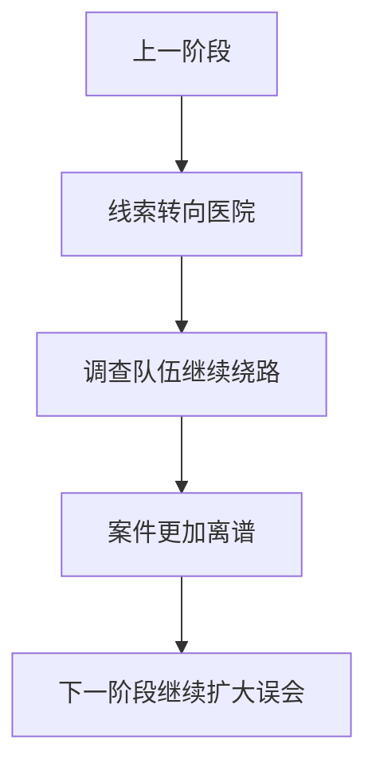

### 第五章——医院里的岔路

### Story

The next clue led to the hospital. Dr. Chen said nobody there had seen the sandwich. Then a nurse whispered that the mayor had asked many questions about food safety, allergies, and refrigeration the day before.

### 中文完整翻译

下一条线索把米娅带到了医院。陈医生说没有人见过那份三明治。不过一位护士小声告诉她：市长前一天问了很多关于食品安全、过敏和冷藏的问题。

#### Vocabulary Story Paragraph 53

The town report mentioned **intake**, and Mia underlined it twice. The old plan looked **interactive**, even before the goat stepped on it. The mayor suddenly asked about **interest**, which made everyone look at him. The mayor insisted that the plan was **intergovernmental**, which did not calm anyone. The town report mentioned **intervention**, and Mia underlined it twice. The mayor said they might **interweave** if the search became harder. Mia watched someone **invalidate** and wrote the action in her notebook. A museum poster explained **inventory**, but Sir Biscuit tried to eat the poster.

#### 第 53 段：中文完整翻译（逐句，不省略）

1. 镇上的报告提到了 **intake**（n. 吸入；通风口；吸收；纳入人员），米娅把这个词划了两遍下划线。

2. 那份旧计划看上去很 **interactive**（a. 相互作用的）；甚至在那只山羊踩到它之前，就已经给人这种感觉了。

3. 市长突然问起了 **interest**（n. 兴趣；关注；利息；利益），这让所有人一下子都转头看着他。

4. 市长坚持认为这项计划是 **intergovernmental**（a. 政府间的） 的，但这并没有让任何人安心下来。

5. 镇上的报告提到了 **intervention**（n. 插入，介入；调停，斡旋），米娅把这个词划了两遍下划线。

6. 市长说，如果搜寻变得更困难，他们可能会采取 **interweave**（v. 使交织，使混杂） 这样的做法。

7. 米娅看到有人做了 **invalidate**（v. 使无效，证明无效） 这个动作，于是把这件事记进了她的笔记本。

8. 博物馆的一张海报正在解释 **inventory**（n. 财产目录；存货清单；存货；盘存），可是 Sir Biscuit 那只山羊却试图把海报吃掉。

#### 本段词汇讲解

| 词汇 | 原书词义 | 本段中的理解方式 |
|---|---|---|
| **intake** | n. 吸入；通风口；吸收；纳入人员 | 作为人物、事物、概念或线索名词来理解 |
| **interactive** | a. 相互作用的 | 作为性质、状态或评价来理解 |
| **interest** | n. 兴趣；关注；利息；利益 | 作为人物、事物、概念或线索名词来理解 |
| **intergovernmental** | a. 政府间的 | 作为性质、状态或评价来理解 |
| **intervention** | n. 插入，介入；调停，斡旋 | 作为人物、事物、概念或线索名词来理解 |
| **interweave** | v. 使交织，使混杂 | 作为动作/行为来理解 |
| **invalidate** | v. 使无效，证明无效 | 作为动作/行为来理解 |
| **inventory** | n. 财产目录；存货清单；存货；盘存 | 作为人物、事物、概念或线索名词来理解 |

#### Vocabulary Story Paragraph 54

The town report mentioned **investigation**, and Mia underlined it twice. The old plan looked **invincible**, even before the goat stepped on it. The mayor suddenly asked about **irrigation**, which made everyone look at him. A museum poster explained **issue**, but Sir Biscuit tried to eat the poster. Someone tried to **jail** before Mia could ask why. The old plan looked **judicial**, even before the goat stepped on it. The mayor suddenly asked about **jury**, which made everyone look at him. The mayor insisted that the plan was **kinetic**, which did not calm anyone.

#### 第 54 段：中文完整翻译（逐句，不省略）

1. 镇上的报告提到了 **investigation**（n. 研究；调查），米娅把这个词划了两遍下划线。

2. 那份旧计划看上去很 **invincible**（a. 无敌的，无法征服的，不屈不挠的）；甚至在那只山羊踩到它之前，就已经给人这种感觉了。

3. 市长突然问起了 **irrigation**（n. 灌溉），这让所有人一下子都转头看着他。

4. 博物馆的一张海报正在解释 **issue**（n. 问题，议题），可是 Sir Biscuit 那只山羊却试图把海报吃掉。

5. 还没等米娅问“为什么”，就有人试图去做 **jail**（n. 监狱，拘留所；监禁 v. 监禁，拘留） 这件事。

6. 那份旧计划看上去很 **judicial**（a. 司法的；公正的；审判上的）；甚至在那只山羊踩到它之前，就已经给人这种感觉了。

7. 市长突然问起了 **jury**（n. 陪审团），这让所有人一下子都转头看着他。

8. 市长坚持认为这项计划是 **kinetic**（a. 运动的） 的，但这并没有让任何人安心下来。

#### 本段词汇讲解

| 词汇 | 原书词义 | 本段中的理解方式 |
|---|---|---|
| **investigation** | n. 研究；调查 | 作为人物、事物、概念或线索名词来理解 |
| **invincible** | a. 无敌的，无法征服的，不屈不挠的 | 作为性质、状态或评价来理解 |
| **irrigation** | n. 灌溉 | 作为人物、事物、概念或线索名词来理解 |
| **issue** | n. 问题，议题 | 作为人物、事物、概念或线索名词来理解 |
| **jail** | n. 监狱，拘留所；监禁 v. 监禁，拘留 | 作为动作/行为来理解 |
| **judicial** | a. 司法的；公正的；审判上的 | 作为性质、状态或评价来理解 |
| **jury** | n. 陪审团 | 作为人物、事物、概念或线索名词来理解 |
| **kinetic** | a. 运动的 | 作为性质、状态或评价来理解 |

#### Vocabulary Story Paragraph 55

The notebook had a whole line about **labor law**, although nobody knew why. The mayor said they might **lament** if the search became harder. The mayor suddenly asked about **landscape**, which made everyone look at him. A museum poster explained **larceny**, but Sir Biscuit tried to eat the poster. The town report mentioned **layoff**, and Mia underlined it twice. The mayor said they might **leak** if the search became harder. Mia watched someone **lease** and wrote the action in her notebook. The mayor insisted that the plan was **legal**, which did not calm anyone.

#### 第 55 段：中文完整翻译（逐句，不省略）

1. 笔记本里居然整整写了一行关于 **labor law**（劳动法） 的内容，尽管谁也不知道为什么。

2. 市长说，如果搜寻变得更困难，他们可能会采取 **lament**（v. 哀悼，悲痛；痛哭） 这样的做法。

3. 市长突然问起了 **landscape**（n. 风景，景色，景致；风景画），这让所有人一下子都转头看着他。

4. 博物馆的一张海报正在解释 **larceny**（n. 盗窃（罪）），可是 Sir Biscuit 那只山羊却试图把海报吃掉。

5. 镇上的报告提到了 **layoff**（n. 临时解雇；停止活动，停工），米娅把这个词划了两遍下划线。

6. 市长说，如果搜寻变得更困难，他们可能会采取 **leak**（v. 漏；泄漏） 这样的做法。

7. 米娅看到有人做了 **lease**（v. 出租；租用） 这个动作，于是把这件事记进了她的笔记本。

8. 市长坚持认为这项计划是 **legal**（a. 合法的；法律的） 的，但这并没有让任何人安心下来。

#### 本段词汇讲解

| 词汇 | 原书词义 | 本段中的理解方式 |
|---|---|---|
| **labor law** | 劳动法 | 作为固定短语或概念整体记忆 |
| **lament** | v. 哀悼，悲痛；痛哭 | 作为动作/行为来理解 |
| **landscape** | n. 风景，景色，景致；风景画 | 作为人物、事物、概念或线索名词来理解 |
| **larceny** | n. 盗窃（罪） | 作为人物、事物、概念或线索名词来理解 |
| **layoff** | n. 临时解雇；停止活动，停工 | 作为人物、事物、概念或线索名词来理解 |
| **leak** | v. 漏；泄漏 | 作为动作/行为来理解 |
| **lease** | v. 出租；租用 | 作为动作/行为来理解 |
| **legal** | a. 合法的；法律的 | 作为性质、状态或评价来理解 |

#### Vocabulary Story Paragraph 56

Someone tried to **legislate** before Mia could ask why. The mayor said they might **levy** if the search became harder. The mayor suddenly asked about **liberalization**, which made everyone look at him. The strange instructions told the team to **liberalize**, which sounded suspicious. The notebook had a whole line about **life cycle**, although nobody knew why. The old plan looked **lightweight**, even before the goat stepped on it. Mia said the idea sounded **listless**, but the mayor still liked it. The strange instructions told the team to **litigate**, which sounded suspicious.

#### 第 56 段：中文完整翻译（逐句，不省略）

1. 还没等米娅问“为什么”，就有人试图去做 **legislate**（v. 立法，制定（或通过）法律） 这件事。

2. 市长说，如果搜寻变得更困难，他们可能会采取 **levy**（v. 征收，征集；强加某事物） 这样的做法。

3. 市长突然问起了 **liberalization**（n. 自由化，自由主义化），这让所有人一下子都转头看着他。

4. 那份奇怪的指示要求团队去做 **liberalize**（v. 使自由化），这听起来很可疑。

5. 笔记本里居然整整写了一行关于 **life cycle**（生命周期，盛衰周期） 的内容，尽管谁也不知道为什么。

6. 那份旧计划看上去很 **lightweight**（a. 无足轻重的，没有影响力的）；甚至在那只山羊踩到它之前，就已经给人这种感觉了。

7. 米娅说，这个想法听起来很 **listless**（a. 无精打采的，无聊的），但市长还是很喜欢它。

8. 那份奇怪的指示要求团队去做 **litigate**（v. 诉讼，提起诉讼），这听起来很可疑。

#### 本段词汇讲解

| 词汇 | 原书词义 | 本段中的理解方式 |
|---|---|---|
| **legislate** | v. 立法，制定（或通过）法律 | 作为动作/行为来理解 |
| **levy** | v. 征收，征集；强加某事物 | 作为动作/行为来理解 |
| **liberalization** | n. 自由化，自由主义化 | 作为人物、事物、概念或线索名词来理解 |
| **liberalize** | v. 使自由化 | 作为动作/行为来理解 |
| **life cycle** | 生命周期，盛衰周期 | 作为固定短语或概念整体记忆 |
| **lightweight** | a. 无足轻重的，没有影响力的 | 作为性质、状态或评价来理解 |
| **listless** | a. 无精打采的，无聊的 | 作为性质、状态或评价来理解 |
| **litigate** | v. 诉讼，提起诉讼 | 作为动作/行为来理解 |

#### Vocabulary Story Paragraph 57

The town report mentioned **loan**, and Mia underlined it twice. A sign near the next clue mentioned **long-term strategy**, which seemed oddly specific. Mia said the idea sounded **lucrative**, but the mayor still liked it. The strange instructions told the team to **maim**, which sounded suspicious. The town report mentioned **majority**, and Mia underlined it twice. The mayor said they might **malign** if the search became harder. The mayor suddenly asked about **malpractice**, which made everyone look at him. A museum poster explained **management**, but Sir Biscuit tried to eat the poster.

#### 第 57 段：中文完整翻译（逐句，不省略）

1. 镇上的报告提到了 **loan**（n. 贷款；暂借，借出），米娅把这个词划了两遍下划线。

2. 下一条线索旁边的一块牌子提到了 **long-term strategy**（长期的策略）；这个细节具体得有些奇怪。

3. 米娅说，这个想法听起来很 **lucrative**（a. 赚钱的，有利可图的），但市长还是很喜欢它。

4. 那份奇怪的指示要求团队去做 **maim**（v. 使残废；使受重伤），这听起来很可疑。

5. 镇上的报告提到了 **majority**（n. 多数，大多数），米娅把这个词划了两遍下划线。

6. 市长说，如果搜寻变得更困难，他们可能会采取 **malign**（v. 诽谤，中伤） 这样的做法。

7. 市长突然问起了 **malpractice**（n. 不法行为，营私舞弊；误诊），这让所有人一下子都转头看着他。

8. 博物馆的一张海报正在解释 **management**（n. 管理，经营；管理部门），可是 Sir Biscuit 那只山羊却试图把海报吃掉。

#### 本段词汇讲解

| 词汇 | 原书词义 | 本段中的理解方式 |
|---|---|---|
| **loan** | n. 贷款；暂借，借出 | 作为人物、事物、概念或线索名词来理解 |
| **long-term strategy** | 长期的策略 | 作为固定短语或概念整体记忆 |
| **lucrative** | a. 赚钱的，有利可图的 | 作为性质、状态或评价来理解 |
| **maim** | v. 使残废；使受重伤 | 作为动作/行为来理解 |
| **majority** | n. 多数，大多数 | 作为人物、事物、概念或线索名词来理解 |
| **malign** | v. 诽谤，中伤 | 作为动作/行为来理解 |
| **malpractice** | n. 不法行为，营私舞弊；误诊 | 作为人物、事物、概念或线索名词来理解 |
| **management** | n. 管理，经营；管理部门 | 作为人物、事物、概念或线索名词来理解 |

#### Vocabulary Story Paragraph 58

The town report mentioned **manhunt**, and Mia underlined it twice. The mayor said they might **mar** if the search became harder. The mayor suddenly asked about **market**, which made everyone look at him. The notebook had a whole line about **market share**, although nobody knew why. At the next booth, Mia saw a poster about **mass production** and followed another arrow. Mia found a note about **measles** beside the next blue arrow. The mayor suddenly asked about **Medicaid**, which made everyone look at him. A museum poster explained **Medicare**, but Sir Biscuit tried to eat the poster.

#### 第 58 段：中文完整翻译（逐句，不省略）

1. 镇上的报告提到了 **manhunt**（n. 搜索；追捕），米娅把这个词划了两遍下划线。

2. 市长说，如果搜寻变得更困难，他们可能会采取 **mar**（v. 毁损；损伤；玷污） 这样的做法。

3. 市长突然问起了 **market**（n. 市场；交易；行销地区），这让所有人一下子都转头看着他。

4. 笔记本里居然整整写了一行关于 **market share**（市场占有率，市场份额） 的内容，尽管谁也不知道为什么。

5. 到了下一个摊位，米娅看到了一张关于 **mass production**（大量生产，批量生产） 的海报，然后继续沿着另一个箭头走。

6. 米娅在下一个蓝色箭头旁边发现了一张关于 **measles**（n. 麻疹） 的纸条。

7. 市长突然问起了 **Medicaid**（n. 医疗补助制度），这让所有人一下子都转头看着他。

8. 博物馆的一张海报正在解释 **Medicare**（n. 医疗保险制度），可是 Sir Biscuit 那只山羊却试图把海报吃掉。

#### 本段词汇讲解

| 词汇 | 原书词义 | 本段中的理解方式 |
|---|---|---|
| **manhunt** | n. 搜索；追捕 | 作为人物、事物、概念或线索名词来理解 |
| **mar** | v. 毁损；损伤；玷污 | 作为动作/行为来理解 |
| **market** | n. 市场；交易；行销地区 | 作为人物、事物、概念或线索名词来理解 |
| **market share** | 市场占有率，市场份额 | 作为固定短语或概念整体记忆 |
| **mass production** | 大量生产，批量生产 | 作为固定短语或概念整体记忆 |
| **measles** | n. 麻疹 | 作为人物、事物、概念或线索名词来理解 |
| **Medicaid** | n. 医疗补助制度 | 作为人物、事物、概念或线索名词来理解 |
| **Medicare** | n. 医疗保险制度 | 作为人物、事物、概念或线索名词来理解 |

#### Vocabulary Story Paragraph 59

The guide called the situation **mellow**, and Mia wrote the word down. Mia found a note about **merchant** beside the next blue arrow. The mayor suddenly asked about **merger**, which made everyone look at him. A museum poster explained **message**, but Sir Biscuit tried to eat the poster. The town report mentioned **microscope**, and Mia underlined it twice. At the next booth, Mia saw a poster about **minimum wage** and followed another arrow. The mayor suddenly asked about **mishap**, which made everyone look at him. The mayor insisted that the plan was **missing**, which did not calm anyone.

#### 第 59 段：中文完整翻译（逐句，不省略）

1. 向导把当前的情况称作 **mellow**（a. 醇香的；柔美的；老练的），米娅把这个词记了下来。

2. 米娅在下一个蓝色箭头旁边发现了一张关于 **merchant**（n. 商人） 的纸条。

3. 市长突然问起了 **merger**（n. 合并，联合），这让所有人一下子都转头看着他。

4. 博物馆的一张海报正在解释 **message**（n. 消息，信息），可是 Sir Biscuit 那只山羊却试图把海报吃掉。

5. 镇上的报告提到了 **microscope**（n. 显微镜），米娅把这个词划了两遍下划线。

6. 到了下一个摊位，米娅看到了一张关于 **minimum wage**（最低工资） 的海报，然后继续沿着另一个箭头走。

7. 市长突然问起了 **mishap**（n. 灾祸，不幸），这让所有人一下子都转头看着他。

8. 市长坚持认为这项计划是 **missing**（a. 漏掉的；失去的；失踪的） 的，但这并没有让任何人安心下来。

#### 本段词汇讲解

| 词汇 | 原书词义 | 本段中的理解方式 |
|---|---|---|
| **mellow** | a. 醇香的；柔美的；老练的 | 作为性质、状态或评价来理解 |
| **merchant** | n. 商人 | 作为人物、事物、概念或线索名词来理解 |
| **merger** | n. 合并，联合 | 作为人物、事物、概念或线索名词来理解 |
| **message** | n. 消息，信息 | 作为人物、事物、概念或线索名词来理解 |
| **microscope** | n. 显微镜 | 作为人物、事物、概念或线索名词来理解 |
| **minimum wage** | 最低工资 | 作为固定短语或概念整体记忆 |
| **mishap** | n. 灾祸，不幸 | 作为人物、事物、概念或线索名词来理解 |
| **missing** | a. 漏掉的；失去的；失踪的 | 作为性质、状态或评价来理解 |

#### Vocabulary Story Paragraph 60

Someone tried to **mock** before Mia could ask why. Mia found a note about **molecule** beside the next blue arrow. The mayor suddenly asked about **monarchy**, which made everyone look at him. The mayor insisted that the plan was **monolithic**, which did not calm anyone. The guide called the situation **morbid**, and Mia wrote the word down. The mayor said they might **mortgage** if the search became harder. Mia watched someone **mourn** and wrote the action in her notebook. The strange instructions told the team to **multiply**, which sounded suspicious.

#### 第 60 段：中文完整翻译（逐句，不省略）

1. 还没等米娅问“为什么”，就有人试图去做 **mock**（v. 嘲弄，轻视；模仿） 这件事。

2. 米娅在下一个蓝色箭头旁边发现了一张关于 **molecule**（n. 分子；微小颗粒） 的纸条。

3. 市长突然问起了 **monarchy**（n. 君主政体，君主政治），这让所有人一下子都转头看着他。

4. 市长坚持认为这项计划是 **monolithic**（a. 单块巨石的；整体的；庞大的） 的，但这并没有让任何人安心下来。

5. 向导把当前的情况称作 **morbid**（a. 病态的，不正常的），米娅把这个词记了下来。

6. 市长说，如果搜寻变得更困难，他们可能会采取 **mortgage**（v. 抵押） 这样的做法。

7. 米娅看到有人做了 **mourn**（v. 哀痛；哀悼；服丧） 这个动作，于是把这件事记进了她的笔记本。

8. 那份奇怪的指示要求团队去做 **multiply**（v. 繁殖；乘；增加），这听起来很可疑。

#### 本段词汇讲解

| 词汇 | 原书词义 | 本段中的理解方式 |
|---|---|---|
| **mock** | v. 嘲弄，轻视；模仿 | 作为动作/行为来理解 |
| **molecule** | n. 分子；微小颗粒 | 作为人物、事物、概念或线索名词来理解 |
| **monarchy** | n. 君主政体，君主政治 | 作为人物、事物、概念或线索名词来理解 |
| **monolithic** | a. 单块巨石的；整体的；庞大的 | 作为性质、状态或评价来理解 |
| **morbid** | a. 病态的，不正常的 | 作为性质、状态或评价来理解 |
| **mortgage** | v. 抵押 | 作为动作/行为来理解 |
| **mourn** | v. 哀痛；哀悼；服丧 | 作为动作/行为来理解 |
| **multiply** | v. 繁殖；乘；增加 | 作为动作/行为来理解 |

#### Vocabulary Story Paragraph 61

The town report mentioned **muscle**, and Mia underlined it twice. The old plan looked **national**, even before the goat stepped on it. The mayor suddenly asked about **nationalism**, which made everyone look at him. A museum poster explained **nationalization**, but Sir Biscuit tried to eat the poster. At the next booth, Mia saw a poster about **natural selection** and followed another arrow. The mayor said they might **neglect** if the search became harder. The mayor suddenly asked about **neighborhood**, which made everyone look at him. The mayor insisted that the plan was **neurotic**, which did not calm anyone.

#### 第 61 段：中文完整翻译（逐句，不省略）

1. 镇上的报告提到了 **muscle**（n. 肌肉；体力；力量），米娅把这个词划了两遍下划线。

2. 那份旧计划看上去很 **national**（a. 国家的；民族的）；甚至在那只山羊踩到它之前，就已经给人这种感觉了。

3. 市长突然问起了 **nationalism**（n. 民族主义，国家主义），这让所有人一下子都转头看着他。

4. 博物馆的一张海报正在解释 **nationalization**（n. 国有化；收归国有），可是 Sir Biscuit 那只山羊却试图把海报吃掉。

5. 到了下一个摊位，米娅看到了一张关于 **natural selection**（自然选择，物竞天择） 的海报，然后继续沿着另一个箭头走。

6. 市长说，如果搜寻变得更困难，他们可能会采取 **neglect**（v. 疏忽；忽视，不顾） 这样的做法。

7. 市长突然问起了 **neighborhood**（n. 附近，邻近），这让所有人一下子都转头看着他。

8. 市长坚持认为这项计划是 **neurotic**（a. 神经病的，神经质的） 的，但这并没有让任何人安心下来。

#### 本段词汇讲解

| 词汇 | 原书词义 | 本段中的理解方式 |
|---|---|---|
| **muscle** | n. 肌肉；体力；力量 | 作为人物、事物、概念或线索名词来理解 |
| **national** | a. 国家的；民族的 | 作为性质、状态或评价来理解 |
| **nationalism** | n. 民族主义，国家主义 | 作为人物、事物、概念或线索名词来理解 |
| **nationalization** | n. 国有化；收归国有 | 作为人物、事物、概念或线索名词来理解 |
| **natural selection** | 自然选择，物竞天择 | 作为固定短语或概念整体记忆 |
| **neglect** | v. 疏忽；忽视，不顾 | 作为动作/行为来理解 |
| **neighborhood** | n. 附近，邻近 | 作为人物、事物、概念或线索名词来理解 |
| **neurotic** | a. 神经病的，神经质的 | 作为性质、状态或评价来理解 |

#### Vocabulary Story Paragraph 62

A sign near the next clue mentioned **news flash**, which seemed oddly specific. Mia found a note about **nostalgia** beside the next blue arrow. Mia watched someone **nurture** and wrote the action in her notebook. A museum poster explained **nutrition**, but Sir Biscuit tried to eat the poster. Someone tried to **obfuscate** before Mia could ask why. The old plan looked **obscure**, even before the goat stepped on it. Mia watched someone **obsess** and wrote the action in her notebook. The mayor insisted that the plan was **obvious**, which did not calm anyone.

#### 第 62 段：中文完整翻译（逐句，不省略）

1. 下一条线索旁边的一块牌子提到了 **news flash**（新闻快讯）；这个细节具体得有些奇怪。

2. 米娅在下一个蓝色箭头旁边发现了一张关于 **nostalgia**（n. 对往事的怀恋，怀旧） 的纸条。

3. 米娅看到有人做了 **nurture**（v. 养育，培育，教养） 这个动作，于是把这件事记进了她的笔记本。

4. 博物馆的一张海报正在解释 **nutrition**（n. 营养，滋养），可是 Sir Biscuit 那只山羊却试图把海报吃掉。

5. 还没等米娅问“为什么”，就有人试图去做 **obfuscate**（v. 使困惑，使迷惑；使不清楚） 这件事。

6. 那份旧计划看上去很 **obscure**（a. 模糊的，含糊不清的；晦涩的）；甚至在那只山羊踩到它之前，就已经给人这种感觉了。

7. 米娅看到有人做了 **obsess**（v. 使着迷；困扰，使心神不宁） 这个动作，于是把这件事记进了她的笔记本。

8. 市长坚持认为这项计划是 **obvious**（a. 明显的，显而易见的） 的，但这并没有让任何人安心下来。

#### 本段词汇讲解

| 词汇 | 原书词义 | 本段中的理解方式 |
|---|---|---|
| **news flash** | 新闻快讯 | 作为固定短语或概念整体记忆 |
| **nostalgia** | n. 对往事的怀恋，怀旧 | 作为人物、事物、概念或线索名词来理解 |
| **nurture** | v. 养育，培育，教养 | 作为动作/行为来理解 |
| **nutrition** | n. 营养，滋养 | 作为人物、事物、概念或线索名词来理解 |
| **obfuscate** | v. 使困惑，使迷惑；使不清楚 | 作为动作/行为来理解 |
| **obscure** | a. 模糊的，含糊不清的；晦涩的 | 作为性质、状态或评价来理解 |
| **obsess** | v. 使着迷；困扰，使心神不宁 | 作为动作/行为来理解 |
| **obvious** | a. 明显的，显而易见的 | 作为性质、状态或评价来理解 |

#### Vocabulary Story Paragraph 63

Someone tried to **occupy** before Mia could ask why. Mia found a note about **office** beside the next blue arrow. The mayor suddenly asked about **oligarchy**, which made everyone look at him. A museum poster explained **operator**, but Sir Biscuit tried to eat the poster. The guide called the situation **opposite**, and Mia wrote the word down. Mia found a note about **orbit** beside the next blue arrow. The mayor suddenly asked about **order**, which made everyone look at him. A museum poster explained **organism**, but Sir Biscuit tried to eat the poster.

#### 第 63 段：中文完整翻译（逐句，不省略）

1. 还没等米娅问“为什么”，就有人试图去做 **occupy**（v. 使用，占用；占领，占据） 这件事。

2. 米娅在下一个蓝色箭头旁边发现了一张关于 **office**（n. 办公室） 的纸条。

3. 市长突然问起了 **oligarchy**（n. 寡头政治；寡头统治集团），这让所有人一下子都转头看着他。

4. 博物馆的一张海报正在解释 **operator**（n. 操作员；（电话）接线员），可是 Sir Biscuit 那只山羊却试图把海报吃掉。

5. 向导把当前的情况称作 **opposite**（a. 相反的，对立的），米娅把这个词记了下来。

6. 米娅在下一个蓝色箭头旁边发现了一张关于 **orbit**（n. 轨道；势力范围；生活常规） 的纸条。

7. 市长突然问起了 **order**（n. 订购，订货；次序，顺序），这让所有人一下子都转头看着他。

8. 博物馆的一张海报正在解释 **organism**（n. 生物体，有机体），可是 Sir Biscuit 那只山羊却试图把海报吃掉。

#### 本段词汇讲解

| 词汇 | 原书词义 | 本段中的理解方式 |
|---|---|---|
| **occupy** | v. 使用，占用；占领，占据 | 作为动作/行为来理解 |
| **office** | n. 办公室 | 作为人物、事物、概念或线索名词来理解 |
| **oligarchy** | n. 寡头政治；寡头统治集团 | 作为人物、事物、概念或线索名词来理解 |
| **operator** | n. 操作员；（电话）接线员 | 作为人物、事物、概念或线索名词来理解 |
| **opposite** | a. 相反的，对立的 | 作为性质、状态或评价来理解 |
| **orbit** | n. 轨道；势力范围；生活常规 | 作为人物、事物、概念或线索名词来理解 |
| **order** | n. 订购，订货；次序，顺序 | 作为人物、事物、概念或线索名词来理解 |
| **organism** | n. 生物体，有机体 | 作为人物、事物、概念或线索名词来理解 |

#### Vocabulary Story Paragraph 64

Someone tried to **organize** before Mia could ask why. Mia found a note about **outcome** beside the next blue arrow. The mayor suddenly asked about **output**, which made everyone look at him. The strange instructions told the team to **outweigh**, which sounded suspicious. Someone tried to **overcome** before Mia could ask why. The mayor said they might **overdraw** if the search became harder. Mia watched someone **overflow** and wrote the action in her notebook. A museum poster explained **overpopulation**, but Sir Biscuit tried to eat the poster.

#### 第 64 段：中文完整翻译（逐句，不省略）

1. 还没等米娅问“为什么”，就有人试图去做 **organize**（v. 组织，创办；安排） 这件事。

2. 米娅在下一个蓝色箭头旁边发现了一张关于 **outcome**（n. 结果，成果） 的纸条。

3. 市长突然问起了 **output**（n. 产出；产量；输出），这让所有人一下子都转头看着他。

4. 那份奇怪的指示要求团队去做 **outweigh**（v. 比…重要，优于，胜过），这听起来很可疑。

5. 还没等米娅问“为什么”，就有人试图去做 **overcome**（v. 战胜，克服） 这件事。

6. 市长说，如果搜寻变得更困难，他们可能会采取 **overdraw**（v. 夸大，夸张；透支） 这样的做法。

7. 米娅看到有人做了 **overflow**（v. 溢出；容纳不下） 这个动作，于是把这件事记进了她的笔记本。

8. 博物馆的一张海报正在解释 **overpopulation**（n. 人口过剩），可是 Sir Biscuit 那只山羊却试图把海报吃掉。

#### 本段词汇讲解

| 词汇 | 原书词义 | 本段中的理解方式 |
|---|---|---|
| **organize** | v. 组织，创办；安排 | 作为动作/行为来理解 |
| **outcome** | n. 结果，成果 | 作为人物、事物、概念或线索名词来理解 |
| **output** | n. 产出；产量；输出 | 作为人物、事物、概念或线索名词来理解 |
| **outweigh** | v. 比…重要，优于，胜过 | 作为动作/行为来理解 |
| **overcome** | v. 战胜，克服 | 作为动作/行为来理解 |
| **overdraw** | v. 夸大，夸张；透支 | 作为动作/行为来理解 |
| **overflow** | v. 溢出；容纳不下 | 作为动作/行为来理解 |
| **overpopulation** | n. 人口过剩 | 作为人物、事物、概念或线索名词来理解 |

#### Vocabulary Story Paragraph 65

The guide called the situation **overt**, and Mia wrote the word down. The mayor said they might **overwhelm** if the search became harder.

#### 第 65 段：中文完整翻译（逐句，不省略）

1. 向导把当前的情况称作 **overt**（a. 公开的，非秘密的），米娅把这个词记了下来。

2. 市长说，如果搜寻变得更困难，他们可能会采取 **overwhelm**（v. 压倒，控制；使不知所措） 这样的做法。

#### 本段词汇讲解

| 词汇 | 原书词义 | 本段中的理解方式 |
|---|---|---|
| **overt** | a. 公开的，非秘密的 | 作为性质、状态或评价来理解 |
| **overwhelm** | v. 压倒，控制；使不知所措 | 作为动作/行为来理解 |

---

## Chapter 6 — The Science Hall


### 本章剧情导图

> 科学馆中的证据让局面更混乱


### 本章在线索链中的位置

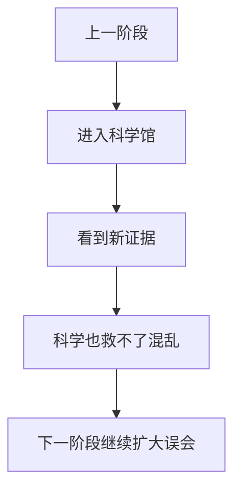

### 第六章——科学馆

### Story

At the science hall, Mia found a camera recording of a robot pushing a huge covered object at dawn. The robot wore a sticker that said, "Property of the Festival Committee. Please do not teach me politics."

### 中文完整翻译

在科学馆，米娅找到一段监控录像：黎明时，一台机器人正推着一个盖起来的巨大物体。机器人身上贴着一张纸：“节庆委员会财产。请不要教我政治。”

#### Vocabulary Story Paragraph 66

The town report mentioned **oxygen**, and Mia underlined it twice. The mayor said they might **pacify** if the search became harder. The mayor suddenly asked about **pact**, which made everyone look at him. The mayor insisted that the plan was **palpable**, which did not calm anyone. The guide called the situation **paltry**, and Mia wrote the word down. Mia found a note about **panacea** beside the next blue arrow. The mayor suddenly asked about **paparazzo**, which made everyone look at him. The strange instructions told the team to **paraphrase**, which sounded suspicious.

#### 第 66 段：中文完整翻译（逐句，不省略）

1. 镇上的报告提到了 **oxygen**（n. 氧，氧气），米娅把这个词划了两遍下划线。

2. 市长说，如果搜寻变得更困难，他们可能会采取 **pacify**（v. 使安静，抚慰） 这样的做法。

3. 市长突然问起了 **pact**（n. 协议，条约），这让所有人一下子都转头看着他。

4. 市长坚持认为这项计划是 **palpable**（a. 易于察觉的；明显的） 的，但这并没有让任何人安心下来。

5. 向导把当前的情况称作 **paltry**（a. 无价值的，微不足道的），米娅把这个词记了下来。

6. 米娅在下一个蓝色箭头旁边发现了一张关于 **panacea**（n. 万灵药） 的纸条。

7. 市长突然问起了 **paparazzo**（n. 狗仔队），这让所有人一下子都转头看着他。

8. 那份奇怪的指示要求团队去做 **paraphrase**（v. 将…释义或意译，转述），这听起来很可疑。

#### 本段词汇讲解

| 词汇 | 原书词义 | 本段中的理解方式 |
|---|---|---|
| **oxygen** | n. 氧，氧气 | 作为人物、事物、概念或线索名词来理解 |
| **pacify** | v. 使安静，抚慰 | 作为动作/行为来理解 |
| **pact** | n. 协议，条约 | 作为人物、事物、概念或线索名词来理解 |
| **palpable** | a. 易于察觉的；明显的 | 作为性质、状态或评价来理解 |
| **paltry** | a. 无价值的，微不足道的 | 作为性质、状态或评价来理解 |
| **panacea** | n. 万灵药 | 作为人物、事物、概念或线索名词来理解 |
| **paparazzo** | n. 狗仔队 | 作为人物、事物、概念或线索名词来理解 |
| **paraphrase** | v. 将…释义或意译，转述 | 作为动作/行为来理解 |

#### Vocabulary Story Paragraph 67

The guide called the situation **patent**, and Mia wrote the word down. Mia found a note about **patronage** beside the next blue arrow. The mayor suddenly asked about **payment**, which made everyone look at him. A museum poster explained **penalty**, but Sir Biscuit tried to eat the poster. Someone tried to **penetrate** before Mia could ask why. The notebook had a whole line about **per capita**, although nobody knew why. The mayor suddenly asked about **performance**, which made everyone look at him. The strange instructions told the team to **perpetrate**, which sounded suspicious.

#### 第 67 段：中文完整翻译（逐句，不省略）

1. 向导把当前的情况称作 **patent**（a. 有专利的；受专利保护的；明显的；赤裸裸的），米娅把这个词记了下来。

2. 米娅在下一个蓝色箭头旁边发现了一张关于 **patronage**（n. 赞助，惠顾；保护） 的纸条。

3. 市长突然问起了 **payment**（n. 付款，支付；报酬；偿还），这让所有人一下子都转头看着他。

4. 博物馆的一张海报正在解释 **penalty**（n. 处罚；罚款），可是 Sir Biscuit 那只山羊却试图把海报吃掉。

5. 还没等米娅问“为什么”，就有人试图去做 **penetrate**（v. 穿透；渗透；看穿，洞察） 这件事。

6. 笔记本里居然整整写了一行关于 **per capita**（每人的，按人头计算的） 的内容，尽管谁也不知道为什么。

7. 市长突然问起了 **performance**（n. 性能；技能，本事），这让所有人一下子都转头看着他。

8. 那份奇怪的指示要求团队去做 **perpetrate**（v. 做坏事；犯（罪）），这听起来很可疑。

#### 本段词汇讲解

| 词汇 | 原书词义 | 本段中的理解方式 |
|---|---|---|
| **patent** | a. 有专利的；受专利保护的；明显的；赤裸裸的 | 作为性质、状态或评价来理解 |
| **patronage** | n. 赞助，惠顾；保护 | 作为人物、事物、概念或线索名词来理解 |
| **payment** | n. 付款，支付；报酬；偿还 | 作为人物、事物、概念或线索名词来理解 |
| **penalty** | n. 处罚；罚款 | 作为人物、事物、概念或线索名词来理解 |
| **penetrate** | v. 穿透；渗透；看穿，洞察 | 作为动作/行为来理解 |
| **per capita** | 每人的，按人头计算的 | 作为固定短语或概念整体记忆 |
| **performance** | n. 性能；技能，本事 | 作为人物、事物、概念或线索名词来理解 |
| **perpetrate** | v. 做坏事；犯（罪） | 作为动作/行为来理解 |

#### Vocabulary Story Paragraph 68

The town report mentioned **perspective**, and Mia underlined it twice. The mayor said they might **peruse** if the search became harder. Mia watched someone **petition** and wrote the action in her notebook. The mayor insisted that the plan was **phony**, which did not calm anyone. The town report mentioned **pickpocket**, and Mia underlined it twice. The old plan looked **pious**, even before the goat stepped on it. The mayor suddenly asked about **piracy**, which made everyone look at him. The strange instructions told the team to **plagiarize**, which sounded suspicious.

#### 第 68 段：中文完整翻译（逐句，不省略）

1. 镇上的报告提到了 **perspective**（n. 观点，看法；远景；展望），米娅把这个词划了两遍下划线。

2. 市长说，如果搜寻变得更困难，他们可能会采取 **peruse**（v. 细读；研读） 这样的做法。

3. 米娅看到有人做了 **petition**（v. 请愿；请求） 这个动作，于是把这件事记进了她的笔记本。

4. 市长坚持认为这项计划是 **phony**（a. 假的；欺骗的） 的，但这并没有让任何人安心下来。

5. 镇上的报告提到了 **pickpocket**（n. 扒手；小偷），米娅把这个词划了两遍下划线。

6. 那份旧计划看上去很 **pious**（a. 虔诚的；伪善的）；甚至在那只山羊踩到它之前，就已经给人这种感觉了。

7. 市长突然问起了 **piracy**（n. 盗版行为；非法复制），这让所有人一下子都转头看着他。

8. 那份奇怪的指示要求团队去做 **plagiarize**（v. 抄袭，剽窃），这听起来很可疑。

#### 本段词汇讲解

| 词汇 | 原书词义 | 本段中的理解方式 |
|---|---|---|
| **perspective** | n. 观点，看法；远景；展望 | 作为人物、事物、概念或线索名词来理解 |
| **peruse** | v. 细读；研读 | 作为动作/行为来理解 |
| **petition** | v. 请愿；请求 | 作为动作/行为来理解 |
| **phony** | a. 假的；欺骗的 | 作为性质、状态或评价来理解 |
| **pickpocket** | n. 扒手；小偷 | 作为人物、事物、概念或线索名词来理解 |
| **pious** | a. 虔诚的；伪善的 | 作为性质、状态或评价来理解 |
| **piracy** | n. 盗版行为；非法复制 | 作为人物、事物、概念或线索名词来理解 |
| **plagiarize** | v. 抄袭，剽窃 | 作为动作/行为来理解 |

#### Vocabulary Story Paragraph 69

Someone tried to **plant** before Mia could ask why. The notebook had a whole line about **plea bargain**, although nobody knew why. The mayor suddenly asked about **pneumonia**, which made everyone look at him. The strange instructions told the team to **ponder**, which sounded suspicious. The guide called the situation **portly**, and Mia wrote the word down. The old plan looked **positive**, even before the goat stepped on it. Mia watched someone **predominate** and wrote the action in her notebook. The mayor insisted that the plan was **pre-emptive**, which did not calm anyone.

#### 第 69 段：中文完整翻译（逐句，不省略）

1. 还没等米娅问“为什么”，就有人试图去做 **plant**（v. 种植，播种；安插） 这件事。

2. 笔记本里居然整整写了一行关于 **plea bargain**（辩诉交易（经法庭批准，控辩双方就被告人认罪之避重就轻达成的协议）） 的内容，尽管谁也不知道为什么。

3. 市长突然问起了 **pneumonia**（n. 肺炎），这让所有人一下子都转头看着他。

4. 那份奇怪的指示要求团队去做 **ponder**（v. 仔细考虑，衡量），这听起来很可疑。

5. 向导把当前的情况称作 **portly**（a. 肥胖的，发福的），米娅把这个词记了下来。

6. 那份旧计划看上去很 **positive**（a. 确实的；积极的；正的）；甚至在那只山羊踩到它之前，就已经给人这种感觉了。

7. 米娅看到有人做了 **predominate**（v. 掌握，控制；占优势，占大多数） 这个动作，于是把这件事记进了她的笔记本。

8. 市长坚持认为这项计划是 **pre-emptive**（a. 优先购买的；先发制人的） 的，但这并没有让任何人安心下来。

#### 本段词汇讲解

| 词汇 | 原书词义 | 本段中的理解方式 |
|---|---|---|
| **plant** | v. 种植，播种；安插 | 作为动作/行为来理解 |
| **plea bargain** | 辩诉交易（经法庭批准，控辩双方就被告人认罪之避重就轻达成的协议） | 作为固定短语或概念整体记忆 |
| **pneumonia** | n. 肺炎 | 作为人物、事物、概念或线索名词来理解 |
| **ponder** | v. 仔细考虑，衡量 | 作为动作/行为来理解 |
| **portly** | a. 肥胖的，发福的 | 作为性质、状态或评价来理解 |
| **positive** | a. 确实的；积极的；正的 | 作为性质、状态或评价来理解 |
| **predominate** | v. 掌握，控制；占优势，占大多数 | 作为动作/行为来理解 |
| **pre-emptive** | a. 优先购买的；先发制人的 | 作为性质、状态或评价来理解 |

#### Vocabulary Story Paragraph 70

The town report mentioned **prejudice**, and Mia underlined it twice. The mayor said they might **preoccupy** if the search became harder. Mia watched someone **prescribe** and wrote the action in her notebook. The mayor insisted that the plan was **present**, which did not calm anyone. Someone tried to **preserve** before Mia could ask why. The notebook had a whole line about **press release**, although nobody knew why. Mia watched someone **pretend** and wrote the action in her notebook. The mayor insisted that the plan was **preventative**, which did not calm anyone.

#### 第 70 段：中文完整翻译（逐句，不省略）

1. 镇上的报告提到了 **prejudice**（n. 偏见，成见），米娅把这个词划了两遍下划线。

2. 市长说，如果搜寻变得更困难，他们可能会采取 **preoccupy**（v. 抢先占据，抢先占有；使入神） 这样的做法。

3. 米娅看到有人做了 **prescribe**（v. 指示，规定；处方，开药） 这个动作，于是把这件事记进了她的笔记本。

4. 市长坚持认为这项计划是 **present**（a. 现在的；出席的） 的，但这并没有让任何人安心下来。

5. 还没等米娅问“为什么”，就有人试图去做 **preserve**（v. 保存；保护；保持） 这件事。

6. 笔记本里居然整整写了一行关于 **press release**（新闻稿） 的内容，尽管谁也不知道为什么。

7. 米娅看到有人做了 **pretend**（v. 假装，佯装；装扮，扮作） 这个动作，于是把这件事记进了她的笔记本。

8. 市长坚持认为这项计划是 **preventative**（a. 预防的，防止的） 的，但这并没有让任何人安心下来。

#### 本段词汇讲解

| 词汇 | 原书词义 | 本段中的理解方式 |
|---|---|---|
| **prejudice** | n. 偏见，成见 | 作为人物、事物、概念或线索名词来理解 |
| **preoccupy** | v. 抢先占据，抢先占有；使入神 | 作为动作/行为来理解 |
| **prescribe** | v. 指示，规定；处方，开药 | 作为动作/行为来理解 |
| **present** | a. 现在的；出席的 | 作为性质、状态或评价来理解 |
| **preserve** | v. 保存；保护；保持 | 作为动作/行为来理解 |
| **press release** | 新闻稿 | 作为固定短语或概念整体记忆 |
| **pretend** | v. 假装，佯装；装扮，扮作 | 作为动作/行为来理解 |
| **preventative** | a. 预防的，防止的 | 作为性质、状态或评价来理解 |

#### Vocabulary Story Paragraph 71

The notebook had a whole line about **prime rate**, although nobody knew why. The old plan looked **principal**, even before the goat stepped on it. Mia said the idea sounded **pristine**, but the mayor still liked it. A museum poster explained **probe**, but Sir Biscuit tried to eat the poster. Someone tried to **procrastinate** before Mia could ask why. The mayor said they might **produce** if the search became harder. The mayor suddenly asked about **productivity**, which made everyone look at him. A museum poster explained **profile**, but Sir Biscuit tried to eat the poster.

#### 第 71 段：中文完整翻译（逐句，不省略）

1. 笔记本里居然整整写了一行关于 **prime rate**（最优惠利率，基本利率） 的内容，尽管谁也不知道为什么。

2. 那份旧计划看上去很 **principal**（a. 主要的，首要的）；甚至在那只山羊踩到它之前，就已经给人这种感觉了。

3. 米娅说，这个想法听起来很 **pristine**（a. 原始的；清新的；纯朴的），但市长还是很喜欢它。

4. 博物馆的一张海报正在解释 **probe**（n. 探索；彻底调查），可是 Sir Biscuit 那只山羊却试图把海报吃掉。

5. 还没等米娅问“为什么”，就有人试图去做 **procrastinate**（v. 拖延，耽搁） 这件事。

6. 市长说，如果搜寻变得更困难，他们可能会采取 **produce**（v. 生产，产生，制作） 这样的做法。

7. 市长突然问起了 **productivity**（n. 生产力，生产率），这让所有人一下子都转头看着他。

8. 博物馆的一张海报正在解释 **profile**（n. 轮廓，外形；形象），可是 Sir Biscuit 那只山羊却试图把海报吃掉。

#### 本段词汇讲解

| 词汇 | 原书词义 | 本段中的理解方式 |
|---|---|---|
| **prime rate** | 最优惠利率，基本利率 | 作为固定短语或概念整体记忆 |
| **principal** | a. 主要的，首要的 | 作为性质、状态或评价来理解 |
| **pristine** | a. 原始的；清新的；纯朴的 | 作为性质、状态或评价来理解 |
| **probe** | n. 探索；彻底调查 | 作为人物、事物、概念或线索名词来理解 |
| **procrastinate** | v. 拖延，耽搁 | 作为动作/行为来理解 |
| **produce** | v. 生产，产生，制作 | 作为动作/行为来理解 |
| **productivity** | n. 生产力，生产率 | 作为人物、事物、概念或线索名词来理解 |
| **profile** | n. 轮廓，外形；形象 | 作为人物、事物、概念或线索名词来理解 |

#### Vocabulary Story Paragraph 72

The town report mentioned **profit**, and Mia underlined it twice. The mayor said they might **prohibit** if the search became harder. Mia said the idea sounded **prolific**, but the mayor still liked it. The strange instructions told the team to **promote**, which sounded suspicious. The town report mentioned **propaganda**, and Mia underlined it twice. Mia found a note about **property** beside the next blue arrow. The mayor suddenly asked about **proselyte**, which made everyone look at him. A museum poster explained **protectionism**, but Sir Biscuit tried to eat the poster.

#### 第 72 段：中文完整翻译（逐句，不省略）

1. 镇上的报告提到了 **profit**（n. 益处；利润），米娅把这个词划了两遍下划线。

2. 市长说，如果搜寻变得更困难，他们可能会采取 **prohibit**（v. 禁止，阻止） 这样的做法。

3. 米娅说，这个想法听起来很 **prolific**（a. 多产的，多育的；丰富的），但市长还是很喜欢它。

4. 那份奇怪的指示要求团队去做 **promote**（v. 促进，发扬；提升，升级），这听起来很可疑。

5. 镇上的报告提到了 **propaganda**（n. 宣传，宣传活动），米娅把这个词划了两遍下划线。

6. 米娅在下一个蓝色箭头旁边发现了一张关于 **property**（n. 特性，性能；所有物，资产；不动产，房地产） 的纸条。

7. 市长突然问起了 **proselyte**（n. 改变宗教信仰者），这让所有人一下子都转头看着他。

8. 博物馆的一张海报正在解释 **protectionism**（n. 贸易保护主义，保护贸易制度），可是 Sir Biscuit 那只山羊却试图把海报吃掉。

#### 本段词汇讲解

| 词汇 | 原书词义 | 本段中的理解方式 |
|---|---|---|
| **profit** | n. 益处；利润 | 作为人物、事物、概念或线索名词来理解 |
| **prohibit** | v. 禁止，阻止 | 作为动作/行为来理解 |
| **prolific** | a. 多产的，多育的；丰富的 | 作为性质、状态或评价来理解 |
| **promote** | v. 促进，发扬；提升，升级 | 作为动作/行为来理解 |
| **propaganda** | n. 宣传，宣传活动 | 作为人物、事物、概念或线索名词来理解 |
| **property** | n. 特性，性能；所有物，资产；不动产，房地产 | 作为人物、事物、概念或线索名词来理解 |
| **proselyte** | n. 改变宗教信仰者 | 作为人物、事物、概念或线索名词来理解 |
| **protectionism** | n. 贸易保护主义，保护贸易制度 | 作为人物、事物、概念或线索名词来理解 |

#### Vocabulary Story Paragraph 73

Someone tried to **prove** before Mia could ask why. The old plan looked **provincial**, even before the goat stepped on it. The mayor suddenly asked about **psychiatrist**, which made everyone look at him. A museum poster explained **publicity**, but Sir Biscuit tried to eat the poster. A sign near the next clue mentioned **quality control**, which seemed oddly specific. The mayor said they might **quote** if the search became harder. The mayor suddenly asked about **radioactivity**, which made everyone look at him. A museum poster explained **rage**, but Sir Biscuit tried to eat the poster.

#### 第 73 段：中文完整翻译（逐句，不省略）

1. 还没等米娅问“为什么”，就有人试图去做 **prove**（v. 实验，试验；证实，证明） 这件事。

2. 那份旧计划看上去很 **provincial**（a. 省的，州的，地方的）；甚至在那只山羊踩到它之前，就已经给人这种感觉了。

3. 市长突然问起了 **psychiatrist**（n. 精神病医生，精神病学家），这让所有人一下子都转头看着他。

4. 博物馆的一张海报正在解释 **publicity**（n. 宣传，推广；广告），可是 Sir Biscuit 那只山羊却试图把海报吃掉。

5. 下一条线索旁边的一块牌子提到了 **quality control**（质量管理，质量控制）；这个细节具体得有些奇怪。

6. 市长说，如果搜寻变得更困难，他们可能会采取 **quote**（v. 引用，引证） 这样的做法。

7. 市长突然问起了 **radioactivity**（n. 放射性；放射线），这让所有人一下子都转头看着他。

8. 博物馆的一张海报正在解释 **rage**（n. 狂怒，盛怒），可是 Sir Biscuit 那只山羊却试图把海报吃掉。

#### 本段词汇讲解

| 词汇 | 原书词义 | 本段中的理解方式 |
|---|---|---|
| **prove** | v. 实验，试验；证实，证明 | 作为动作/行为来理解 |
| **provincial** | a. 省的，州的，地方的 | 作为性质、状态或评价来理解 |
| **psychiatrist** | n. 精神病医生，精神病学家 | 作为人物、事物、概念或线索名词来理解 |
| **publicity** | n. 宣传，推广；广告 | 作为人物、事物、概念或线索名词来理解 |
| **quality control** | 质量管理，质量控制 | 作为固定短语或概念整体记忆 |
| **quote** | v. 引用，引证 | 作为动作/行为来理解 |
| **radioactivity** | n. 放射性；放射线 | 作为人物、事物、概念或线索名词来理解 |
| **rage** | n. 狂怒，盛怒 | 作为人物、事物、概念或线索名词来理解 |

#### Vocabulary Story Paragraph 74

The town report mentioned **raise**, and Mia underlined it twice. The mayor said they might **ratify** if the search became harder. Mia watched someone **raze** and wrote the action in her notebook. The strange instructions told the team to **realize**, which sounded suspicious. Someone tried to **recede** before Mia could ask why. Mia found a note about **recession** beside the next blue arrow. The mayor suddenly asked about **reconciliation**, which made everyone look at him. The strange instructions told the team to **recycle**, which sounded suspicious.

#### 第 74 段：中文完整翻译（逐句，不省略）

1. 镇上的报告提到了 **raise**（n. （工资的）上升，增加），米娅把这个词划了两遍下划线。

2. 市长说，如果搜寻变得更困难，他们可能会采取 **ratify**（v. 批准，认可） 这样的做法。

3. 米娅看到有人做了 **raze**（v. 消除，抹去；破坏） 这个动作，于是把这件事记进了她的笔记本。

4. 那份奇怪的指示要求团队去做 **realize**（v. 领悟，了解；实现，使…成为现实），这听起来很可疑。

5. 还没等米娅问“为什么”，就有人试图去做 **recede**（v. 向后退，退却；减弱） 这件事。

6. 米娅在下一个蓝色箭头旁边发现了一张关于 **recession**（n. 退回，退后；衰退，不景气） 的纸条。

7. 市长突然问起了 **reconciliation**（n. 和解，和好），这让所有人一下子都转头看着他。

8. 那份奇怪的指示要求团队去做 **recycle**（v. 再利用，使再循环），这听起来很可疑。

#### 本段词汇讲解

| 词汇 | 原书词义 | 本段中的理解方式 |
|---|---|---|
| **raise** | n. （工资的）上升，增加 | 作为人物、事物、概念或线索名词来理解 |
| **ratify** | v. 批准，认可 | 作为动作/行为来理解 |
| **raze** | v. 消除，抹去；破坏 | 作为动作/行为来理解 |
| **realize** | v. 领悟，了解；实现，使…成为现实 | 作为动作/行为来理解 |
| **recede** | v. 向后退，退却；减弱 | 作为动作/行为来理解 |
| **recession** | n. 退回，退后；衰退，不景气 | 作为人物、事物、概念或线索名词来理解 |
| **reconciliation** | n. 和解，和好 | 作为人物、事物、概念或线索名词来理解 |
| **recycle** | v. 再利用，使再循环 | 作为动作/行为来理解 |

#### Vocabulary Story Paragraph 75

The town report mentioned **reference**, and Mia underlined it twice. The mayor said they might **reflect** if the search became harder. Mia watched someone **refund** and wrote the action in her notebook. The strange instructions told the team to **register**, which sounded suspicious. The town report mentioned **regulator**, and Mia underlined it twice. The mayor said they might **reign** if the search became harder. Mia watched someone **rekindle** and wrote the action in her notebook. The notebook had a whole line about **reliable source**, although nobody knew why.

#### 第 75 段：中文完整翻译（逐句，不省略）

1. 镇上的报告提到了 **reference**（n. 提到，谈及；参考，查阅；出处），米娅把这个词划了两遍下划线。

2. 市长说，如果搜寻变得更困难，他们可能会采取 **reflect**（v. 反映；思考） 这样的做法。

3. 米娅看到有人做了 **refund**（v. 归还，偿还） 这个动作，于是把这件事记进了她的笔记本。

4. 那份奇怪的指示要求团队去做 **register**（v. 登记，注册；记录；流露出，表达出），这听起来很可疑。

5. 镇上的报告提到了 **regulator**（n. 管理者，调控者；调节器，校准器），米娅把这个词划了两遍下划线。

6. 市长说，如果搜寻变得更困难，他们可能会采取 **reign**（v. 统治，支配） 这样的做法。

7. 米娅看到有人做了 **rekindle**（v. 重新点燃；恢复） 这个动作，于是把这件事记进了她的笔记本。

8. 笔记本里居然整整写了一行关于 **reliable source**（可靠的来源） 的内容，尽管谁也不知道为什么。

#### 本段词汇讲解

| 词汇 | 原书词义 | 本段中的理解方式 |
|---|---|---|
| **reference** | n. 提到，谈及；参考，查阅；出处 | 作为人物、事物、概念或线索名词来理解 |
| **reflect** | v. 反映；思考 | 作为动作/行为来理解 |
| **refund** | v. 归还，偿还 | 作为动作/行为来理解 |
| **register** | v. 登记，注册；记录；流露出，表达出 | 作为动作/行为来理解 |
| **regulator** | n. 管理者，调控者；调节器，校准器 | 作为人物、事物、概念或线索名词来理解 |
| **reign** | v. 统治，支配 | 作为动作/行为来理解 |
| **rekindle** | v. 重新点燃；恢复 | 作为动作/行为来理解 |
| **reliable source** | 可靠的来源 | 作为固定短语或概念整体记忆 |

#### Vocabulary Story Paragraph 76

The town report mentioned **relish**, and Mia underlined it twice. The mayor said they might **rely** if the search became harder. The mayor suddenly asked about **remedy**, which made everyone look at him. The strange instructions told the team to **remove**, which sounded suspicious. The town report mentioned **renaissance**, and Mia underlined it twice. The mayor said they might **renovate** if the search became harder. Mia said the idea sounded **renowned**, but the mayor still liked it. The strange instructions told the team to **repent**, which sounded suspicious.

#### 第 76 段：中文完整翻译（逐句，不省略）

1. 镇上的报告提到了 **relish**（n. 享受；乐趣；风味佐料），米娅把这个词划了两遍下划线。

2. 市长说，如果搜寻变得更困难，他们可能会采取 **rely**（v. 依赖，信赖，指望） 这样的做法。

3. 市长突然问起了 **remedy**（n. 药物；疗法；治疗），这让所有人一下子都转头看着他。

4. 那份奇怪的指示要求团队去做 **remove**（v. 移动；拿开；将…免职），这听起来很可疑。

5. 镇上的报告提到了 **renaissance**（n. 新生；文艺复兴），米娅把这个词划了两遍下划线。

6. 市长说，如果搜寻变得更困难，他们可能会采取 **renovate**（v. 翻新；修复） 这样的做法。

7. 米娅说，这个想法听起来很 **renowned**（a. 有名的，有声誉的），但市长还是很喜欢它。

8. 那份奇怪的指示要求团队去做 **repent**（v. 后悔，懊悔），这听起来很可疑。

#### 本段词汇讲解

| 词汇 | 原书词义 | 本段中的理解方式 |
|---|---|---|
| **relish** | n. 享受；乐趣；风味佐料 | 作为人物、事物、概念或线索名词来理解 |
| **rely** | v. 依赖，信赖，指望 | 作为动作/行为来理解 |
| **remedy** | n. 药物；疗法；治疗 | 作为人物、事物、概念或线索名词来理解 |
| **remove** | v. 移动；拿开；将…免职 | 作为动作/行为来理解 |
| **renaissance** | n. 新生；文艺复兴 | 作为人物、事物、概念或线索名词来理解 |
| **renovate** | v. 翻新；修复 | 作为动作/行为来理解 |
| **renowned** | a. 有名的，有声誉的 | 作为性质、状态或评价来理解 |
| **repent** | v. 后悔，懊悔 | 作为动作/行为来理解 |

#### Vocabulary Story Paragraph 77

The town report mentioned **report**, and Mia underlined it twice. Mia found a note about **representative** beside the next blue arrow. The mayor suddenly asked about **reprieve**, which made everyone look at him. The strange instructions told the team to **require**, which sounded suspicious. The town report mentioned **rescue**, and Mia underlined it twice. The mayor said they might **resign** if the search became harder. Mia said the idea sounded **resistant**, but the mayor still liked it. The mayor insisted that the plan was **responsible**, which did not calm anyone.

#### 第 77 段：中文完整翻译（逐句，不省略）

1. 镇上的报告提到了 **report**（n. 报告；报道；成绩单），米娅把这个词划了两遍下划线。

2. 米娅在下一个蓝色箭头旁边发现了一张关于 **representative**（n. 典型；代表） 的纸条。

3. 市长突然问起了 **reprieve**（n. 延缓，缓解；刑罚终止令，缓刑令），这让所有人一下子都转头看着他。

4. 那份奇怪的指示要求团队去做 **require**（v. 需要；要求，命令），这听起来很可疑。

5. 镇上的报告提到了 **rescue**（n. 援救，营救），米娅把这个词划了两遍下划线。

6. 市长说，如果搜寻变得更困难，他们可能会采取 **resign**（v. 放弃；辞去，辞职） 这样的做法。

7. 米娅说，这个想法听起来很 **resistant**（a. 抵抗的，反抗的），但市长还是很喜欢它。

8. 市长坚持认为这项计划是 **responsible**（a. 有责任的，负责的，作为原因，成为原因） 的，但这并没有让任何人安心下来。

#### 本段词汇讲解

| 词汇 | 原书词义 | 本段中的理解方式 |
|---|---|---|
| **report** | n. 报告；报道；成绩单 | 作为人物、事物、概念或线索名词来理解 |
| **representative** | n. 典型；代表 | 作为人物、事物、概念或线索名词来理解 |
| **reprieve** | n. 延缓，缓解；刑罚终止令，缓刑令 | 作为人物、事物、概念或线索名词来理解 |
| **require** | v. 需要；要求，命令 | 作为动作/行为来理解 |
| **rescue** | n. 援救，营救 | 作为人物、事物、概念或线索名词来理解 |
| **resign** | v. 放弃；辞去，辞职 | 作为动作/行为来理解 |
| **resistant** | a. 抵抗的，反抗的 | 作为性质、状态或评价来理解 |
| **responsible** | a. 有责任的，负责的，作为原因，成为原因 | 作为性质、状态或评价来理解 |

#### Vocabulary Story Paragraph 78

Someone tried to **restrict** before Mia could ask why. Mia found a note about **result** beside the next blue arrow.

#### 第 78 段：中文完整翻译（逐句，不省略）

1. 还没等米娅问“为什么”，就有人试图去做 **restrict**（v. 限制，限定；约束，管束） 这件事。

2. 米娅在下一个蓝色箭头旁边发现了一张关于 **result**（n. 结果；成绩；答案） 的纸条。

#### 本段词汇讲解

| 词汇 | 原书词义 | 本段中的理解方式 |
|---|---|---|
| **restrict** | v. 限制，限定；约束，管束 | 作为动作/行为来理解 |
| **result** | n. 结果；成绩；答案 | 作为人物、事物、概念或线索名词来理解 |

---

## Chapter 7 — The Reporter Makes It Worse


### 本章剧情导图

> 记者把事件越报道越离谱


### 本章在线索链中的位置

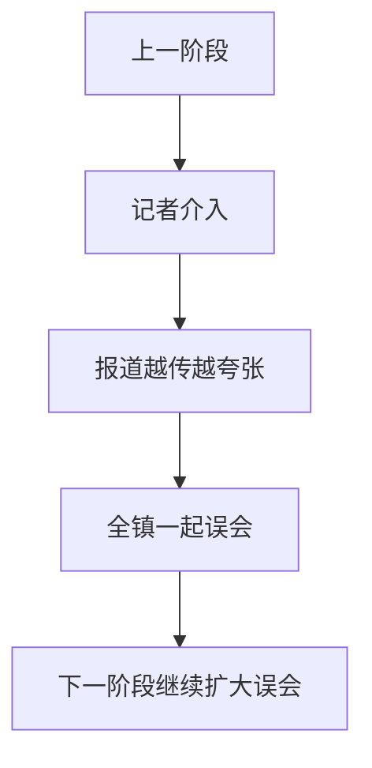

### 第七章——记者把事情搞得更糟

### Story

A reporter named Nina heard about the mystery and announced on live television that the sandwich might have been stolen by an international criminal network. Five minutes later, tourists arrived to take selfies with the empty table.

### 中文完整翻译

一名叫 Nina 的记者听说此事后，在电视直播里宣布：巨型三明治“可能被国际犯罪网络盗走”。五分钟后，大批游客赶来和空桌子自拍。

#### Vocabulary Story Paragraph 79

Someone tried to **resurrect** before Mia could ask why. Mia found a note about **retail** beside the next blue arrow. Mia watched someone **retaliate** and wrote the action in her notebook. The strange instructions told the team to **retire**, which sounded suspicious. Someone tried to **retrieve** before Mia could ask why. Mia found a note about **review** beside the next blue arrow. The mayor suddenly asked about **revolution**, which made everyone look at him. The strange instructions told the team to **rip**, which sounded suspicious.

#### 第 79 段：中文完整翻译（逐句，不省略）

1. 还没等米娅问“为什么”，就有人试图去做 **resurrect**（v. 使复活；使复苏；重新应用） 这件事。

2. 米娅在下一个蓝色箭头旁边发现了一张关于 **retail**（n. 零售；a. 零售的；v. 零售） 的纸条。

3. 米娅看到有人做了 **retaliate**（v. 报复；复仇；回敬） 这个动作，于是把这件事记进了她的笔记本。

4. 那份奇怪的指示要求团队去做 **retire**（v. 退休；隐居），这听起来很可疑。

5. 还没等米娅问“为什么”，就有人试图去做 **retrieve**（v. 取回，收回，恢复） 这件事。

6. 米娅在下一个蓝色箭头旁边发现了一张关于 **review**（n. 检查，审查；评价，评论；述评，回顾） 的纸条。

7. 市长突然问起了 **revolution**（n. 革命；巨变，大变革；旋转；转数），这让所有人一下子都转头看着他。

8. 那份奇怪的指示要求团队去做 **rip**（v. 撕裂，扯开），这听起来很可疑。

#### 本段词汇讲解

| 词汇 | 原书词义 | 本段中的理解方式 |
|---|---|---|
| **resurrect** | v. 使复活；使复苏；重新应用 | 作为动作/行为来理解 |
| **retail** | n. 零售；a. 零售的；v. 零售 | 作为人物、事物、概念或线索名词来理解 |
| **retaliate** | v. 报复；复仇；回敬 | 作为动作/行为来理解 |
| **retire** | v. 退休；隐居 | 作为动作/行为来理解 |
| **retrieve** | v. 取回，收回，恢复 | 作为动作/行为来理解 |
| **review** | n. 检查，审查；评价，评论；述评，回顾 | 作为人物、事物、概念或线索名词来理解 |
| **revolution** | n. 革命；巨变，大变革；旋转；转数 | 作为人物、事物、概念或线索名词来理解 |
| **rip** | v. 撕裂，扯开 | 作为动作/行为来理解 |

#### Vocabulary Story Paragraph 80

The town report mentioned **robotics**, and Mia underlined it twice. Mia found a note about **routine** beside the next blue arrow. The mayor suddenly asked about **sabotage**, which made everyone look at him. The mayor insisted that the plan was **sacrilegious**, which did not calm anyone. The town report mentioned **salesman**, and Mia underlined it twice. Mia found a note about **sampling** beside the next blue arrow. Mia said the idea sounded **sanitary**, but the mayor still liked it. The strange instructions told the team to **saturate**, which sounded suspicious.

#### 第 80 段：中文完整翻译（逐句，不省略）

1. 镇上的报告提到了 **robotics**（n. 机器人学），米娅把这个词划了两遍下划线。

2. 米娅在下一个蓝色箭头旁边发现了一张关于 **routine**（n. 例行公事，常规，惯例） 的纸条。

3. 市长突然问起了 **sabotage**（n. 阴谋破坏，颠覆活动），这让所有人一下子都转头看着他。

4. 市长坚持认为这项计划是 **sacrilegious**（a. 亵渎神圣的） 的，但这并没有让任何人安心下来。

5. 镇上的报告提到了 **salesman**（n. 售货员，推销员），米娅把这个词划了两遍下划线。

6. 米娅在下一个蓝色箭头旁边发现了一张关于 **sampling**（n. 抽样；取样） 的纸条。

7. 米娅说，这个想法听起来很 **sanitary**（a. 卫生的，清洁的），但市长还是很喜欢它。

8. 那份奇怪的指示要求团队去做 **saturate**（v. 使饱和，使充满；浸透），这听起来很可疑。

#### 本段词汇讲解

| 词汇 | 原书词义 | 本段中的理解方式 |
|---|---|---|
| **robotics** | n. 机器人学 | 作为人物、事物、概念或线索名词来理解 |
| **routine** | n. 例行公事，常规，惯例 | 作为人物、事物、概念或线索名词来理解 |
| **sabotage** | n. 阴谋破坏，颠覆活动 | 作为人物、事物、概念或线索名词来理解 |
| **sacrilegious** | a. 亵渎神圣的 | 作为性质、状态或评价来理解 |
| **salesman** | n. 售货员，推销员 | 作为人物、事物、概念或线索名词来理解 |
| **sampling** | n. 抽样；取样 | 作为人物、事物、概念或线索名词来理解 |
| **sanitary** | a. 卫生的，清洁的 | 作为性质、状态或评价来理解 |
| **saturate** | v. 使饱和，使充满；浸透 | 作为动作/行为来理解 |

#### Vocabulary Story Paragraph 81

The town report mentioned **scare**, and Mia underlined it twice. Mia found a note about **score** beside the next blue arrow. Mia watched someone **seclude** and wrote the action in her notebook. The notebook had a whole line about **security system**, although nobody knew why. The town report mentioned **seismograph**, and Mia underlined it twice. Mia found a note about **seizure** beside the next blue arrow. Mia watched someone **serve** and wrote the action in her notebook. A museum poster explained **sewage**, but Sir Biscuit tried to eat the poster.

#### 第 81 段：中文完整翻译（逐句，不省略）

1. 镇上的报告提到了 **scare**（n. 惊恐，恐慌），米娅把这个词划了两遍下划线。

2. 米娅在下一个蓝色箭头旁边发现了一张关于 **score**（n. 得分；比数；二十） 的纸条。

3. 米娅看到有人做了 **seclude**（v. 隔离，隔绝） 这个动作，于是把这件事记进了她的笔记本。

4. 笔记本里居然整整写了一行关于 **security system**（安全系统） 的内容，尽管谁也不知道为什么。

5. 镇上的报告提到了 **seismograph**（n. 地震仪，测震仪），米娅把这个词划了两遍下划线。

6. 米娅在下一个蓝色箭头旁边发现了一张关于 **seizure**（n. 没收；（病的）发作） 的纸条。

7. 米娅看到有人做了 **serve**（v. 服务，招待；对…有用，能满足…需要） 这个动作，于是把这件事记进了她的笔记本。

8. 博物馆的一张海报正在解释 **sewage**（n. 脏水，污水），可是 Sir Biscuit 那只山羊却试图把海报吃掉。

#### 本段词汇讲解

| 词汇 | 原书词义 | 本段中的理解方式 |
|---|---|---|
| **scare** | n. 惊恐，恐慌 | 作为人物、事物、概念或线索名词来理解 |
| **score** | n. 得分；比数；二十 | 作为人物、事物、概念或线索名词来理解 |
| **seclude** | v. 隔离，隔绝 | 作为动作/行为来理解 |
| **security system** | 安全系统 | 作为固定短语或概念整体记忆 |
| **seismograph** | n. 地震仪，测震仪 | 作为人物、事物、概念或线索名词来理解 |
| **seizure** | n. 没收；（病的）发作 | 作为人物、事物、概念或线索名词来理解 |
| **serve** | v. 服务，招待；对…有用，能满足…需要 | 作为动作/行为来理解 |
| **sewage** | n. 脏水，污水 | 作为人物、事物、概念或线索名词来理解 |

#### Vocabulary Story Paragraph 82

The town report mentioned **share**, and Mia underlined it twice. The mayor said they might **shatter** if the search became harder. The mayor suddenly asked about **shoot**, which made everyone look at him. The strange instructions told the team to **shrink**, which sounded suspicious. The notebook had a whole line about **side effect**, although nobody knew why. The mayor said they might **simulate** if the search became harder. The mayor suddenly asked about **simulator**, which made everyone look at him. The mayor insisted that the plan was **skeptical**, which did not calm anyone.

#### 第 82 段：中文完整翻译（逐句，不省略）

1. 镇上的报告提到了 **share**（n. 部分；股份，股票），米娅把这个词划了两遍下划线。

2. 市长说，如果搜寻变得更困难，他们可能会采取 **shatter**（v. 打碎，碎裂；粉碎，破灭） 这样的做法。

3. 市长突然问起了 **shoot**（n. 嫩芽，幼苗；射击，发射；拍摄），这让所有人一下子都转头看着他。

4. 那份奇怪的指示要求团队去做 **shrink**（v. 起皱；收缩；退缩），这听起来很可疑。

5. 笔记本里居然整整写了一行关于 **side effect**（副作用） 的内容，尽管谁也不知道为什么。

6. 市长说，如果搜寻变得更困难，他们可能会采取 **simulate**（v. 假装，装作；模拟，冒充，模仿） 这样的做法。

7. 市长突然问起了 **simulator**（n. 模拟装置），这让所有人一下子都转头看着他。

8. 市长坚持认为这项计划是 **skeptical**（a. 怀疑的） 的，但这并没有让任何人安心下来。

#### 本段词汇讲解

| 词汇 | 原书词义 | 本段中的理解方式 |
|---|---|---|
| **share** | n. 部分；股份，股票 | 作为人物、事物、概念或线索名词来理解 |
| **shatter** | v. 打碎，碎裂；粉碎，破灭 | 作为动作/行为来理解 |
| **shoot** | n. 嫩芽，幼苗；射击，发射；拍摄 | 作为人物、事物、概念或线索名词来理解 |
| **shrink** | v. 起皱；收缩；退缩 | 作为动作/行为来理解 |
| **side effect** | 副作用 | 作为固定短语或概念整体记忆 |
| **simulate** | v. 假装，装作；模拟，冒充，模仿 | 作为动作/行为来理解 |
| **simulator** | n. 模拟装置 | 作为人物、事物、概念或线索名词来理解 |
| **skeptical** | a. 怀疑的 | 作为性质、状态或评价来理解 |

#### Vocabulary Story Paragraph 83

The town report mentioned **skin**, and Mia underlined it twice. The old plan looked **slight**, even before the goat stepped on it. The mayor suddenly asked about **slump**, which made everyone look at him. The strange instructions told the team to **snap**, which sounded suspicious. The town report mentioned **socialism**, and Mia underlined it twice. Mia found a note about **sociologist** beside the next blue arrow. The mayor suddenly asked about **soil**, which made everyone look at him. A sign near the next clue mentioned **sole proprietor**, which seemed oddly specific.

#### 第 83 段：中文完整翻译（逐句，不省略）

1. 镇上的报告提到了 **skin**（n. 皮肤；毛皮；（水果、蔬菜等的）皮、壳），米娅把这个词划了两遍下划线。

2. 那份旧计划看上去很 **slight**（a. 轻微的，略微的；纤细的，瘦小的）；甚至在那只山羊踩到它之前，就已经给人这种感觉了。

3. 市长突然问起了 **slump**（n. 暴跌，骤降，锐减；衰退；意气消沉），这让所有人一下子都转头看着他。

4. 那份奇怪的指示要求团队去做 **snap**（v. 猛咬；厉声责骂），这听起来很可疑。

5. 镇上的报告提到了 **socialism**（n. 社会主义），米娅把这个词划了两遍下划线。

6. 米娅在下一个蓝色箭头旁边发现了一张关于 **sociologist**（n. 社会学家） 的纸条。

7. 市长突然问起了 **soil**（n. 泥土，土地，土壤），这让所有人一下子都转头看着他。

8. 下一条线索旁边的一块牌子提到了 **sole proprietor**（独资业主，独资所有人）；这个细节具体得有些奇怪。

#### 本段词汇讲解

| 词汇 | 原书词义 | 本段中的理解方式 |
|---|---|---|
| **skin** | n. 皮肤；毛皮；（水果、蔬菜等的）皮、壳 | 作为人物、事物、概念或线索名词来理解 |
| **slight** | a. 轻微的，略微的；纤细的，瘦小的 | 作为性质、状态或评价来理解 |
| **slump** | n. 暴跌，骤降，锐减；衰退；意气消沉 | 作为人物、事物、概念或线索名词来理解 |
| **snap** | v. 猛咬；厉声责骂 | 作为动作/行为来理解 |
| **socialism** | n. 社会主义 | 作为人物、事物、概念或线索名词来理解 |
| **sociologist** | n. 社会学家 | 作为人物、事物、概念或线索名词来理解 |
| **soil** | n. 泥土，土地，土壤 | 作为人物、事物、概念或线索名词来理解 |
| **sole proprietor** | 独资业主，独资所有人 | 作为固定短语或概念整体记忆 |

#### Vocabulary Story Paragraph 84

The notebook had a whole line about **sound system**, although nobody knew why. Mia found a note about **spacecraft** beside the next blue arrow. Mia watched someone **specialize** and wrote the action in her notebook. A museum poster explained **spectacle**, but Sir Biscuit tried to eat the poster. Someone tried to **speculate** before Mia could ask why. Mia found a note about **spillover** beside the next blue arrow. The notebook had a whole line about **spin doctor**, although nobody knew why. The strange instructions told the team to **spoil**, which sounded suspicious.

#### 第 84 段：中文完整翻译（逐句，不省略）

1. 笔记本里居然整整写了一行关于 **sound system**（音响系统） 的内容，尽管谁也不知道为什么。

2. 米娅在下一个蓝色箭头旁边发现了一张关于 **spacecraft**（n. 宇宙飞船） 的纸条。

3. 米娅看到有人做了 **specialize**（v. 特殊化；专攻；专门从事） 这个动作，于是把这件事记进了她的笔记本。

4. 博物馆的一张海报正在解释 **spectacle**（n. 光景；眼镜；奇观），可是 Sir Biscuit 那只山羊却试图把海报吃掉。

5. 还没等米娅问“为什么”，就有人试图去做 **speculate**（v. 猜测，推测；投机，做投机买卖） 这件事。

6. 米娅在下一个蓝色箭头旁边发现了一张关于 **spillover**（n. 溢出部分；容纳不下的部分） 的纸条。

7. 笔记本里居然整整写了一行关于 **spin doctor**（（政治家、组织等的）舆论导向专家） 的内容，尽管谁也不知道为什么。

8. 那份奇怪的指示要求团队去做 **spoil**（v. 损坏，糟蹋；溺爱，宠坏），这听起来很可疑。

#### 本段词汇讲解

| 词汇 | 原书词义 | 本段中的理解方式 |
|---|---|---|
| **sound system** | 音响系统 | 作为固定短语或概念整体记忆 |
| **spacecraft** | n. 宇宙飞船 | 作为人物、事物、概念或线索名词来理解 |
| **specialize** | v. 特殊化；专攻；专门从事 | 作为动作/行为来理解 |
| **spectacle** | n. 光景；眼镜；奇观 | 作为人物、事物、概念或线索名词来理解 |
| **speculate** | v. 猜测，推测；投机，做投机买卖 | 作为动作/行为来理解 |
| **spillover** | n. 溢出部分；容纳不下的部分 | 作为人物、事物、概念或线索名词来理解 |
| **spin doctor** | （政治家、组织等的）舆论导向专家 | 作为固定短语或概念整体记忆 |
| **spoil** | v. 损坏，糟蹋；溺爱，宠坏 | 作为动作/行为来理解 |

#### Vocabulary Story Paragraph 85

The town report mentioned **sport**, and Mia underlined it twice. Mia found a note about **square** beside the next blue arrow. The mayor suddenly asked about **stack**, which made everyone look at him. A museum poster explained **stall**, but Sir Biscuit tried to eat the poster. The guide called the situation **state-run**, and Mia wrote the word down. The old plan looked **statutory**, even before the goat stepped on it. Mia watched someone **stimulate** and wrote the action in her notebook. The strange instructions told the team to **stir**, which sounded suspicious.

#### 第 85 段：中文完整翻译（逐句，不省略）

1. 镇上的报告提到了 **sport**（n. 运动，体育运动），米娅把这个词划了两遍下划线。

2. 米娅在下一个蓝色箭头旁边发现了一张关于 **square**（n. 正方形；街区；平方；守旧的人） 的纸条。

3. 市长突然问起了 **stack**（n. 堆，一叠；很多），这让所有人一下子都转头看着他。

4. 博物馆的一张海报正在解释 **stall**（n. 货摊；托词），可是 Sir Biscuit 那只山羊却试图把海报吃掉。

5. 向导把当前的情况称作 **state-run**（a. 国营的），米娅把这个词记了下来。

6. 那份旧计划看上去很 **statutory**（a. 法令的，法规的）；甚至在那只山羊踩到它之前，就已经给人这种感觉了。

7. 米娅看到有人做了 **stimulate**（v. 刺激；激励，鼓舞；促进） 这个动作，于是把这件事记进了她的笔记本。

8. 那份奇怪的指示要求团队去做 **stir**（v. 搅拌；煽动，鼓动；唤起，引起），这听起来很可疑。

#### 本段词汇讲解

| 词汇 | 原书词义 | 本段中的理解方式 |
|---|---|---|
| **sport** | n. 运动，体育运动 | 作为人物、事物、概念或线索名词来理解 |
| **square** | n. 正方形；街区；平方；守旧的人 | 作为人物、事物、概念或线索名词来理解 |
| **stack** | n. 堆，一叠；很多 | 作为人物、事物、概念或线索名词来理解 |
| **stall** | n. 货摊；托词 | 作为人物、事物、概念或线索名词来理解 |
| **state-run** | a. 国营的 | 作为性质、状态或评价来理解 |
| **statutory** | a. 法令的，法规的 | 作为性质、状态或评价来理解 |
| **stimulate** | v. 刺激；激励，鼓舞；促进 | 作为动作/行为来理解 |
| **stir** | v. 搅拌；煽动，鼓动；唤起，引起 | 作为动作/行为来理解 |

#### Vocabulary Story Paragraph 86

The town report mentioned **stomach**, and Mia underlined it twice. The mayor said they might **strangle** if the search became harder. The mayor suddenly asked about **strategy**, which made everyone look at him. The strange instructions told the team to **strengthen**, which sounded suspicious. The town report mentioned **strip**, and Mia underlined it twice. The mayor said they might **stun** if the search became harder. Mia watched someone **submit** and wrote the action in her notebook. The strange instructions told the team to **subside**, which sounded suspicious.

#### 第 86 段：中文完整翻译（逐句，不省略）

1. 镇上的报告提到了 **stomach**（n. 胃；胃口，食欲），米娅把这个词划了两遍下划线。

2. 市长说，如果搜寻变得更困难，他们可能会采取 **strangle**（v. 勒死，使窒息；抑制，扼杀） 这样的做法。

3. 市长突然问起了 **strategy**（n. 策略，计策；策划，部署；战略），这让所有人一下子都转头看着他。

4. 那份奇怪的指示要求团队去做 **strengthen**（v. 加强；增强；巩固），这听起来很可疑。

5. 镇上的报告提到了 **strip**（n. 条，带；狭长地带），米娅把这个词划了两遍下划线。

6. 市长说，如果搜寻变得更困难，他们可能会采取 **stun**（v. 使昏迷，使震惊） 这样的做法。

7. 米娅看到有人做了 **submit**（v. 服从；提交，提出） 这个动作，于是把这件事记进了她的笔记本。

8. 那份奇怪的指示要求团队去做 **subside**（v. 消退；沉降；平息），这听起来很可疑。

#### 本段词汇讲解

| 词汇 | 原书词义 | 本段中的理解方式 |
|---|---|---|
| **stomach** | n. 胃；胃口，食欲 | 作为人物、事物、概念或线索名词来理解 |
| **strangle** | v. 勒死，使窒息；抑制，扼杀 | 作为动作/行为来理解 |
| **strategy** | n. 策略，计策；策划，部署；战略 | 作为人物、事物、概念或线索名词来理解 |
| **strengthen** | v. 加强；增强；巩固 | 作为动作/行为来理解 |
| **strip** | n. 条，带；狭长地带 | 作为人物、事物、概念或线索名词来理解 |
| **stun** | v. 使昏迷，使震惊 | 作为动作/行为来理解 |
| **submit** | v. 服从；提交，提出 | 作为动作/行为来理解 |
| **subside** | v. 消退；沉降；平息 | 作为动作/行为来理解 |

#### Vocabulary Story Paragraph 87

The guide called the situation **subsidiary**, and Mia wrote the word down. The old plan looked **substantial**, even before the goat stepped on it. Mia said the idea sounded **sufficient**, but the mayor still liked it. A museum poster explained **supermarket**, but Sir Biscuit tried to eat the poster. The town report mentioned **supplier**, and Mia underlined it twice. Mia found a note about **suppression** beside the next blue arrow. The mayor suddenly asked about **surge**, which made everyone look at him. A museum poster explained **surgery**, but Sir Biscuit tried to eat the poster.

#### 第 87 段：中文完整翻译（逐句，不省略）

1. 向导把当前的情况称作 **subsidiary**（a. 辅助的，次要的；补充的；附属的），米娅把这个词记了下来。

2. 那份旧计划看上去很 **substantial**（a. 真实的；实质上的）；甚至在那只山羊踩到它之前，就已经给人这种感觉了。

3. 米娅说，这个想法听起来很 **sufficient**（a. 足够的，充分的），但市长还是很喜欢它。

4. 博物馆的一张海报正在解释 **supermarket**（n. 超市），可是 Sir Biscuit 那只山羊却试图把海报吃掉。

5. 镇上的报告提到了 **supplier**（n. 供应者，供货商），米娅把这个词划了两遍下划线。

6. 米娅在下一个蓝色箭头旁边发现了一张关于 **suppression**（n. 压制；镇压；抑制） 的纸条。

7. 市长突然问起了 **surge**（n. 涌，汹涌；急剧上升，激增），这让所有人一下子都转头看着他。

8. 博物馆的一张海报正在解释 **surgery**（n. 外科，外科手术），可是 Sir Biscuit 那只山羊却试图把海报吃掉。

#### 本段词汇讲解

| 词汇 | 原书词义 | 本段中的理解方式 |
|---|---|---|
| **subsidiary** | a. 辅助的，次要的；补充的；附属的 | 作为性质、状态或评价来理解 |
| **substantial** | a. 真实的；实质上的 | 作为性质、状态或评价来理解 |
| **sufficient** | a. 足够的，充分的 | 作为性质、状态或评价来理解 |
| **supermarket** | n. 超市 | 作为人物、事物、概念或线索名词来理解 |
| **supplier** | n. 供应者，供货商 | 作为人物、事物、概念或线索名词来理解 |
| **suppression** | n. 压制；镇压；抑制 | 作为人物、事物、概念或线索名词来理解 |
| **surge** | n. 涌，汹涌；急剧上升，激增 | 作为人物、事物、概念或线索名词来理解 |
| **surgery** | n. 外科，外科手术 | 作为人物、事物、概念或线索名词来理解 |

#### Vocabulary Story Paragraph 88

The town report mentioned **survey**, and Mia underlined it twice. The mayor said they might **survive** if the search became harder. The mayor suddenly asked about **suspect**, which made everyone look at him. The mayor insisted that the plan was **suspicious**, which did not calm anyone. The town report mentioned **sway**, and Mia underlined it twice. Mia found a note about **symbiosis** beside the next blue arrow. The mayor suddenly asked about **symptom**, which made everyone look at him. A museum poster explained **tablet**, but Sir Biscuit tried to eat the poster.

#### 第 88 段：中文完整翻译（逐句，不省略）

1. 镇上的报告提到了 **survey**（n. 俯瞰；调查；测量），米娅把这个词划了两遍下划线。

2. 市长说，如果搜寻变得更困难，他们可能会采取 **survive**（v. 生存，生还） 这样的做法。

3. 市长突然问起了 **suspect**（n. 嫌疑犯，可疑分子），这让所有人一下子都转头看着他。

4. 市长坚持认为这项计划是 **suspicious**（a. 可疑的，猜疑的） 的，但这并没有让任何人安心下来。

5. 镇上的报告提到了 **sway**（n. 摇动，摇摆；支配，控制，影响），米娅把这个词划了两遍下划线。

6. 米娅在下一个蓝色箭头旁边发现了一张关于 **symbiosis**（n. 共生；合作关系） 的纸条。

7. 市长突然问起了 **symptom**（n. 症状；征兆，征候），这让所有人一下子都转头看着他。

8. 博物馆的一张海报正在解释 **tablet**（n. 药片；小片；刻写板），可是 Sir Biscuit 那只山羊却试图把海报吃掉。

#### 本段词汇讲解

| 词汇 | 原书词义 | 本段中的理解方式 |
|---|---|---|
| **survey** | n. 俯瞰；调查；测量 | 作为人物、事物、概念或线索名词来理解 |
| **survive** | v. 生存，生还 | 作为动作/行为来理解 |
| **suspect** | n. 嫌疑犯，可疑分子 | 作为人物、事物、概念或线索名词来理解 |
| **suspicious** | a. 可疑的，猜疑的 | 作为性质、状态或评价来理解 |
| **sway** | n. 摇动，摇摆；支配，控制，影响 | 作为人物、事物、概念或线索名词来理解 |
| **symbiosis** | n. 共生；合作关系 | 作为人物、事物、概念或线索名词来理解 |
| **symptom** | n. 症状；征兆，征候 | 作为人物、事物、概念或线索名词来理解 |
| **tablet** | n. 药片；小片；刻写板 | 作为人物、事物、概念或线索名词来理解 |

#### Vocabulary Story Paragraph 89

The town report mentioned **tangle**, and Mia underlined it twice. Mia found a note about **tarnish** beside the next blue arrow. The mayor suddenly asked about **tax**, which made everyone look at him. At the next booth, Mia saw a poster about **technology art** and followed another arrow. Someone tried to **telescope** before Mia could ask why. The mayor said they might **tend** if the search became harder. Mia watched someone **terminate** and wrote the action in her notebook. The mayor insisted that the plan was **theatrical**, which did not calm anyone.

#### 第 89 段：中文完整翻译（逐句，不省略）

1. 镇上的报告提到了 **tangle**（n. 混乱状态），米娅把这个词划了两遍下划线。

2. 米娅在下一个蓝色箭头旁边发现了一张关于 **tarnish**（n. 晦暗；锈迹；污点） 的纸条。

3. 市长突然问起了 **tax**（n. 税；负担），这让所有人一下子都转头看着他。

4. 到了下一个摊位，米娅看到了一张关于 **technology art**（技术工艺） 的海报，然后继续沿着另一个箭头走。

5. 还没等米娅问“为什么”，就有人试图去做 **telescope**（n. 望远镜 v. 叠缩；缩短，精简，压缩） 这件事。

6. 市长说，如果搜寻变得更困难，他们可能会采取 **tend**（v. 常常会，往往会；倾向，趋于；照料，照管） 这样的做法。

7. 米娅看到有人做了 **terminate**（v. 停止，结束，终止；到达终点站） 这个动作，于是把这件事记进了她的笔记本。

8. 市长坚持认为这项计划是 **theatrical**（a. 戏剧的，剧场的；夸张的） 的，但这并没有让任何人安心下来。

#### 本段词汇讲解

| 词汇 | 原书词义 | 本段中的理解方式 |
|---|---|---|
| **tangle** | n. 混乱状态 | 作为人物、事物、概念或线索名词来理解 |
| **tarnish** | n. 晦暗；锈迹；污点 | 作为人物、事物、概念或线索名词来理解 |
| **tax** | n. 税；负担 | 作为人物、事物、概念或线索名词来理解 |
| **technology art** | 技术工艺 | 作为固定短语或概念整体记忆 |
| **telescope** | n. 望远镜 v. 叠缩；缩短，精简，压缩 | 作为动作/行为来理解 |
| **tend** | v. 常常会，往往会；倾向，趋于；照料，照管 | 作为动作/行为来理解 |
| **terminate** | v. 停止，结束，终止；到达终点站 | 作为动作/行为来理解 |
| **theatrical** | a. 戏剧的，剧场的；夸张的 | 作为性质、状态或评价来理解 |

#### Vocabulary Story Paragraph 90

The town report mentioned **therapy**, and Mia underlined it twice. Mia found a note about **thrift** beside the next blue arrow. The mayor suddenly asked about **throng**, which made everyone look at him. A museum poster explained **tone**, but Sir Biscuit tried to eat the poster. The town report mentioned **toss**, and Mia underlined it twice. The mayor said they might **tout** if the search became harder. The mayor suddenly asked about **trade**, which made everyone look at him. At the next booth, Mia saw a poster about **trade fair** and followed another arrow.

#### 第 90 段：中文完整翻译（逐句，不省略）

1. 镇上的报告提到了 **therapy**（n. 治疗；疗法），米娅把这个词划了两遍下划线。

2. 米娅在下一个蓝色箭头旁边发现了一张关于 **thrift**（n. 节俭，节约） 的纸条。

3. 市长突然问起了 **throng**（n. 聚集的人群，一大群人），这让所有人一下子都转头看着他。

4. 博物馆的一张海报正在解释 **tone**（n. 音调，音色；气氛；语气），可是 Sir Biscuit 那只山羊却试图把海报吃掉。

5. 镇上的报告提到了 **toss**（n. 投掷；掷硬币决定），米娅把这个词划了两遍下划线。

6. 市长说，如果搜寻变得更困难，他们可能会采取 **tout**（v. 兜售，招徕；标榜，吹嘘） 这样的做法。

7. 市长突然问起了 **trade**（n. 贸易，交易；行业，职业；营业额，交易量），这让所有人一下子都转头看着他。

8. 到了下一个摊位，米娅看到了一张关于 **trade fair**（商品交易会，商展） 的海报，然后继续沿着另一个箭头走。

#### 本段词汇讲解

| 词汇 | 原书词义 | 本段中的理解方式 |
|---|---|---|
| **therapy** | n. 治疗；疗法 | 作为人物、事物、概念或线索名词来理解 |
| **thrift** | n. 节俭，节约 | 作为人物、事物、概念或线索名词来理解 |
| **throng** | n. 聚集的人群，一大群人 | 作为人物、事物、概念或线索名词来理解 |
| **tone** | n. 音调，音色；气氛；语气 | 作为人物、事物、概念或线索名词来理解 |
| **toss** | n. 投掷；掷硬币决定 | 作为人物、事物、概念或线索名词来理解 |
| **tout** | v. 兜售，招徕；标榜，吹嘘 | 作为动作/行为来理解 |
| **trade** | n. 贸易，交易；行业，职业；营业额，交易量 | 作为人物、事物、概念或线索名词来理解 |
| **trade fair** | 商品交易会，商展 | 作为固定短语或概念整体记忆 |

#### Vocabulary Story Paragraph 91

A sign near the next clue mentioned **trade union**, which seemed oddly specific. The mayor said they might **transact** if the search became harder.

#### 第 91 段：中文完整翻译（逐句，不省略）

1. 下一条线索旁边的一块牌子提到了 **trade union**（工会）；这个细节具体得有些奇怪。

2. 市长说，如果搜寻变得更困难，他们可能会采取 **transact**（v. 处理（业务），做交易） 这样的做法。

#### 本段词汇讲解

| 词汇 | 原书词义 | 本段中的理解方式 |
|---|---|---|
| **trade union** | 工会 | 作为固定短语或概念整体记忆 |
| **transact** | v. 处理（业务），做交易 | 作为动作/行为来理解 |

---

## Chapter 8 — The Election Nobody Needed


### 本章剧情导图

> 不必要的竞选把案件政治化


### 本章在线索链中的位置

```mermaid
flowchart TD
    X[上一阶段] --> Y[案件政治化]
    Y --> Z[竞选口号满天飞]
    Z --> W[真相更被遮住]
    W --> N[下一阶段继续扩大误会]
```

### 第八章——根本没必要的选举

### Story

Because the mayor looked nervous, the town council suddenly held an emergency vote about whether he should remain mayor during the sandwich crisis. Sir Biscuit received three votes even though he was not a candidate.

### 中文完整翻译

因为市长显得很紧张，镇议会竟然临时投票，决定三明治危机期间他是否还能继续当市长。Sir Biscuit 明明没有参选，却得到了三票。

#### Vocabulary Story Paragraph 92

The town report mentioned **transfusion**, and Mia underlined it twice. Mia found a note about **translation** beside the next blue arrow. The mayor suddenly asked about **trash**, which made everyone look at him. The strange instructions told the team to **traverse**, which sounded suspicious. The town report mentioned **trek**, and Mia underlined it twice. Mia found a note about **trend** beside the next blue arrow. A sign near the next clue mentioned **tropical rainforest**, which seemed oddly specific. A museum poster explained **truism**, but Sir Biscuit tried to eat the poster.

#### 第 92 段：中文完整翻译（逐句，不省略）

1. 镇上的报告提到了 **transfusion**（n. 倾注；渗透；输血），米娅把这个词划了两遍下划线。

2. 米娅在下一个蓝色箭头旁边发现了一张关于 **translation**（n. 翻译，译文） 的纸条。

3. 市长突然问起了 **trash**（n. 垃圾；拙劣的作品），这让所有人一下子都转头看着他。

4. 那份奇怪的指示要求团队去做 **traverse**（v. 横过；穿过），这听起来很可疑。

5. 镇上的报告提到了 **trek**（n. 艰苦的长途旅行，长途跋涉），米娅把这个词划了两遍下划线。

6. 米娅在下一个蓝色箭头旁边发现了一张关于 **trend**（n. 走向，趋势；时尚） 的纸条。

7. 下一条线索旁边的一块牌子提到了 **tropical rainforest**（热带雨林）；这个细节具体得有些奇怪。

8. 博物馆的一张海报正在解释 **truism**（n. 自明之理；不言而喻的道理），可是 Sir Biscuit 那只山羊却试图把海报吃掉。

#### 本段词汇讲解

| 词汇 | 原书词义 | 本段中的理解方式 |
|---|---|---|
| **transfusion** | n. 倾注；渗透；输血 | 作为人物、事物、概念或线索名词来理解 |
| **translation** | n. 翻译，译文 | 作为人物、事物、概念或线索名词来理解 |
| **trash** | n. 垃圾；拙劣的作品 | 作为人物、事物、概念或线索名词来理解 |
| **traverse** | v. 横过；穿过 | 作为动作/行为来理解 |
| **trek** | n. 艰苦的长途旅行，长途跋涉 | 作为人物、事物、概念或线索名词来理解 |
| **trend** | n. 走向，趋势；时尚 | 作为人物、事物、概念或线索名词来理解 |
| **tropical rainforest** | 热带雨林 | 作为固定短语或概念整体记忆 |
| **truism** | n. 自明之理；不言而喻的道理 | 作为人物、事物、概念或线索名词来理解 |

#### Vocabulary Story Paragraph 93

The town report mentioned **tumor**, and Mia underlined it twice. The old plan looked **turbid**, even before the goat stepped on it. The mayor suddenly asked about **turbulence**, which made everyone look at him. A museum poster explained **turnover**, but Sir Biscuit tried to eat the poster. The guide called the situation **ubiquitous**, and Mia wrote the word down. The notebook had a whole line about **ultraviolet rays**, although nobody knew why. Mia watched someone **uncover** and wrote the action in her notebook. The strange instructions told the team to **undermine**, which sounded suspicious.

#### 第 93 段：中文完整翻译（逐句，不省略）

1. 镇上的报告提到了 **tumor**（n. 瘤；肿瘤；肿块），米娅把这个词划了两遍下划线。

2. 那份旧计划看上去很 **turbid**（a. 浑浊的，污浊的；混乱的）；甚至在那只山羊踩到它之前，就已经给人这种感觉了。

3. 市长突然问起了 **turbulence**（n. 喧嚣，骚乱；涡流），这让所有人一下子都转头看着他。

4. 博物馆的一张海报正在解释 **turnover**（n. 翻转；营业额；人事变更率），可是 Sir Biscuit 那只山羊却试图把海报吃掉。

5. 向导把当前的情况称作 **ubiquitous**（a. 到处存在的），米娅把这个词记了下来。

6. 笔记本里居然整整写了一行关于 **ultraviolet rays**（紫外线） 的内容，尽管谁也不知道为什么。

7. 米娅看到有人做了 **uncover**（v. 揭露；脱帽） 这个动作，于是把这件事记进了她的笔记本。

8. 那份奇怪的指示要求团队去做 **undermine**（v. 渐渐削弱，使逐步减少效力；从根基处破），这听起来很可疑。

#### 本段词汇讲解

| 词汇 | 原书词义 | 本段中的理解方式 |
|---|---|---|
| **tumor** | n. 瘤；肿瘤；肿块 | 作为人物、事物、概念或线索名词来理解 |
| **turbid** | a. 浑浊的，污浊的；混乱的 | 作为性质、状态或评价来理解 |
| **turbulence** | n. 喧嚣，骚乱；涡流 | 作为人物、事物、概念或线索名词来理解 |
| **turnover** | n. 翻转；营业额；人事变更率 | 作为人物、事物、概念或线索名词来理解 |
| **ubiquitous** | a. 到处存在的 | 作为性质、状态或评价来理解 |
| **ultraviolet rays** | 紫外线 | 作为固定短语或概念整体记忆 |
| **uncover** | v. 揭露；脱帽 | 作为动作/行为来理解 |
| **undermine** | v. 渐渐削弱，使逐步减少效力；从根基处破 | 作为动作/行为来理解 |

#### Vocabulary Story Paragraph 94

Someone tried to **undertake** before Mia could ask why. The mayor said they might **unearth** if the search became harder. Mia watched someone **unify** and wrote the action in her notebook. The mayor insisted that the plan was **unofficial**, which did not calm anyone. The guide called the situation **untenable**, and Mia wrote the word down. The mayor said they might **update** if the search became harder. Mia watched someone **uproot** and wrote the action in her notebook. A museum poster explained **urge**, but Sir Biscuit tried to eat the poster.

#### 第 94 段：中文完整翻译（逐句，不省略）

1. 还没等米娅问“为什么”，就有人试图去做 **undertake**（v. 从事；承担；允诺，保证） 这件事。

2. 市长说，如果搜寻变得更困难，他们可能会采取 **unearth**（v. 发掘；发现，找到） 这样的做法。

3. 米娅看到有人做了 **unify**（v. 统一，使成一体） 这个动作，于是把这件事记进了她的笔记本。

4. 市长坚持认为这项计划是 **unofficial**（a. 非官方的，非正式的） 的，但这并没有让任何人安心下来。

5. 向导把当前的情况称作 **untenable**（a. 难以捍卫的；站不住脚的；不堪一击的），米娅把这个词记了下来。

6. 市长说，如果搜寻变得更困难，他们可能会采取 **update**（v. 更新；补充最新资料） 这样的做法。

7. 米娅看到有人做了 **uproot**（v. 将…连根拔起） 这个动作，于是把这件事记进了她的笔记本。

8. 博物馆的一张海报正在解释 **urge**（n. 强烈的欲望；冲动），可是 Sir Biscuit 那只山羊却试图把海报吃掉。

#### 本段词汇讲解

| 词汇 | 原书词义 | 本段中的理解方式 |
|---|---|---|
| **undertake** | v. 从事；承担；允诺，保证 | 作为动作/行为来理解 |
| **unearth** | v. 发掘；发现，找到 | 作为动作/行为来理解 |
| **unify** | v. 统一，使成一体 | 作为动作/行为来理解 |
| **unofficial** | a. 非官方的，非正式的 | 作为性质、状态或评价来理解 |
| **untenable** | a. 难以捍卫的；站不住脚的；不堪一击的 | 作为性质、状态或评价来理解 |
| **update** | v. 更新；补充最新资料 | 作为动作/行为来理解 |
| **uproot** | v. 将…连根拔起 | 作为动作/行为来理解 |
| **urge** | n. 强烈的欲望；冲动 | 作为人物、事物、概念或线索名词来理解 |

#### Vocabulary Story Paragraph 95

Someone tried to **vaccinate** before Mia could ask why. The mayor said they might **vacillate** if the search became harder. Mia said the idea sounded **vain**, but the mayor still liked it. The mayor insisted that the plan was **vapid**, which did not calm anyone. The town report mentioned **vector**, and Mia underlined it twice. Mia found a note about **vein** beside the next blue arrow. Mia said the idea sounded **vertical**, but the mayor still liked it. The mayor insisted that the plan was **vicious**, which did not calm anyone.

#### 第 95 段：中文完整翻译（逐句，不省略）

1. 还没等米娅问“为什么”，就有人试图去做 **vaccinate**（v. 接种疫苗） 这件事。

2. 市长说，如果搜寻变得更困难，他们可能会采取 **vacillate**（v. 动摇；犹豫） 这样的做法。

3. 米娅说，这个想法听起来很 **vain**（a. 徒然的，无结果的；虚荣的，自视过高的），但市长还是很喜欢它。

4. 市长坚持认为这项计划是 **vapid**（a. 乏味的；枯燥的；单调的） 的，但这并没有让任何人安心下来。

5. 镇上的报告提到了 **vector**（n. 介体，载体；矢量，向量），米娅把这个词划了两遍下划线。

6. 米娅在下一个蓝色箭头旁边发现了一张关于 **vein**（n. 静脉；气质，心情） 的纸条。

7. 米娅说，这个想法听起来很 **vertical**（a. 垂直的，竖的），但市长还是很喜欢它。

8. 市长坚持认为这项计划是 **vicious**（a. 邪恶的；堕落的） 的，但这并没有让任何人安心下来。

#### 本段词汇讲解

| 词汇 | 原书词义 | 本段中的理解方式 |
|---|---|---|
| **vaccinate** | v. 接种疫苗 | 作为动作/行为来理解 |
| **vacillate** | v. 动摇；犹豫 | 作为动作/行为来理解 |
| **vain** | a. 徒然的，无结果的；虚荣的，自视过高的 | 作为性质、状态或评价来理解 |
| **vapid** | a. 乏味的；枯燥的；单调的 | 作为性质、状态或评价来理解 |
| **vector** | n. 介体，载体；矢量，向量 | 作为人物、事物、概念或线索名词来理解 |
| **vein** | n. 静脉；气质，心情 | 作为人物、事物、概念或线索名词来理解 |
| **vertical** | a. 垂直的，竖的 | 作为性质、状态或评价来理解 |
| **vicious** | a. 邪恶的；堕落的 | 作为性质、状态或评价来理解 |

#### Vocabulary Story Paragraph 96

The town report mentioned **vigor**, and Mia underlined it twice. The mayor said they might **vindicate** if the search became harder. Mia said the idea sounded **virtual**, but the mayor still liked it. The mayor insisted that the plan was **vital**, which did not calm anyone. The town report mentioned **void**, and Mia underlined it twice. Mia found a note about **volume** beside the next blue arrow. Mia said the idea sounded **vulnerable**, but the mayor still liked it. A museum poster explained **wage**, but Sir Biscuit tried to eat the poster.

#### 第 96 段：中文完整翻译（逐句，不省略）

1. 镇上的报告提到了 **vigor**（n. 活力，精力；气势），米娅把这个词划了两遍下划线。

2. 市长说，如果搜寻变得更困难，他们可能会采取 **vindicate**（v. 证实，证明有理，澄清，辩解） 这样的做法。

3. 米娅说，这个想法听起来很 **virtual**（a. 实质上的；实际上的），但市长还是很喜欢它。

4. 市长坚持认为这项计划是 **vital**（a. 必不可少的，极重要的；生命的；生机勃勃的） 的，但这并没有让任何人安心下来。

5. 镇上的报告提到了 **void**（n. 空虚；空白），米娅把这个词划了两遍下划线。

6. 米娅在下一个蓝色箭头旁边发现了一张关于 **volume**（n. 音量；体积，容量；书卷，卷，册，集） 的纸条。

7. 米娅说，这个想法听起来很 **vulnerable**（a. 易受…伤害的，脆弱的），但市长还是很喜欢它。

8. 博物馆的一张海报正在解释 **wage**（n. 工资，报酬），可是 Sir Biscuit 那只山羊却试图把海报吃掉。

#### 本段词汇讲解

| 词汇 | 原书词义 | 本段中的理解方式 |
|---|---|---|
| **vigor** | n. 活力，精力；气势 | 作为人物、事物、概念或线索名词来理解 |
| **vindicate** | v. 证实，证明有理，澄清，辩解 | 作为动作/行为来理解 |
| **virtual** | a. 实质上的；实际上的 | 作为性质、状态或评价来理解 |
| **vital** | a. 必不可少的，极重要的；生命的；生机勃勃的 | 作为性质、状态或评价来理解 |
| **void** | n. 空虚；空白 | 作为人物、事物、概念或线索名词来理解 |
| **volume** | n. 音量；体积，容量；书卷，卷，册，集 | 作为人物、事物、概念或线索名词来理解 |
| **vulnerable** | a. 易受…伤害的，脆弱的 | 作为性质、状态或评价来理解 |
| **wage** | n. 工资，报酬 | 作为人物、事物、概念或线索名词来理解 |

#### Vocabulary Story Paragraph 97

Someone tried to **wallow** before Mia could ask why. The old plan looked **wanton**, even before the goat stepped on it. Mia watched someone **wax** and wrote the action in her notebook. The mayor insisted that the plan was **weary**, which did not calm anyone. The guide called the situation **wedded**, and Mia wrote the word down. The mayor said they might **whisk** if the search became harder. Mia said the idea sounded **widespread**, but the mayor still liked it. A museum poster explained **witness**, but Sir Biscuit tried to eat the poster.

#### 第 97 段：中文完整翻译（逐句，不省略）

1. 还没等米娅问“为什么”，就有人试图去做 **wallow**（v. 放纵，沉溺于） 这件事。

2. 那份旧计划看上去很 **wanton**（a. 无节制的，放纵的）；甚至在那只山羊踩到它之前，就已经给人这种感觉了。

3. 米娅看到有人做了 **wax**（n. 蜡，蜂蜡 v. 打蜡；增加，变大） 这个动作，于是把这件事记进了她的笔记本。

4. 市长坚持认为这项计划是 **weary**（a. 疲倦的，疲劳的；不再感兴趣的，感到厌烦的） 的，但这并没有让任何人安心下来。

5. 向导把当前的情况称作 **wedded**（a. 已婚的；结合在一起的），米娅把这个词记了下来。

6. 市长说，如果搜寻变得更困难，他们可能会采取 **whisk**（v. 迅速带走；迅速拿开） 这样的做法。

7. 米娅说，这个想法听起来很 **widespread**（a. 分布广的，普遍的），但市长还是很喜欢它。

8. 博物馆的一张海报正在解释 **witness**（n. 目击者；证人；见证人），可是 Sir Biscuit 那只山羊却试图把海报吃掉。

#### 本段词汇讲解

| 词汇 | 原书词义 | 本段中的理解方式 |
|---|---|---|
| **wallow** | v. 放纵，沉溺于 | 作为动作/行为来理解 |
| **wanton** | a. 无节制的，放纵的 | 作为性质、状态或评价来理解 |
| **wax** | n. 蜡，蜂蜡 v. 打蜡；增加，变大 | 作为动作/行为来理解 |
| **weary** | a. 疲倦的，疲劳的；不再感兴趣的，感到厌烦的 | 作为性质、状态或评价来理解 |
| **wedded** | a. 已婚的；结合在一起的 | 作为性质、状态或评价来理解 |
| **whisk** | v. 迅速带走；迅速拿开 | 作为动作/行为来理解 |
| **widespread** | a. 分布广的，普遍的 | 作为性质、状态或评价来理解 |
| **witness** | n. 目击者；证人；见证人 | 作为人物、事物、概念或线索名词来理解 |

#### Vocabulary Story Paragraph 98

The town report mentioned **workaholic**, and Mia underlined it twice. The mayor said they might **wreak** if the search became harder. The mayor suddenly asked about **zenith**, which made everyone look at him. The strange instructions told the team to **abbreviate**, which sounded suspicious. The town report mentioned **abortion**, and Mia underlined it twice. The mayor said they might **abstract** if the search became harder. Mia said the idea sounded **academic**, but the mayor still liked it. The mayor insisted that the plan was **acceptable**, which did not calm anyone.

#### 第 98 段：中文完整翻译（逐句，不省略）

1. 镇上的报告提到了 **workaholic**（n. 工作狂；醉心于工作的人），米娅把这个词划了两遍下划线。

2. 市长说，如果搜寻变得更困难，他们可能会采取 **wreak**（v. 造成（巨大的破坏或伤害）） 这样的做法。

3. 市长突然问起了 **zenith**（n. 最高点，顶点；鼎盛时期，顶峰），这让所有人一下子都转头看着他。

4. 那份奇怪的指示要求团队去做 **abbreviate**（v. 缩写，缩短；使省略），这听起来很可疑。

5. 镇上的报告提到了 **abortion**（n. 流产，堕胎），米娅把这个词划了两遍下划线。

6. 市长说，如果搜寻变得更困难，他们可能会采取 **abstract**（v. 使抽象化；抽取，提取） 这样的做法。

7. 米娅说，这个想法听起来很 **academic**（a. 学术的，学究的；学院的），但市长还是很喜欢它。

8. 市长坚持认为这项计划是 **acceptable**（a. 可以接受的；令人满意的） 的，但这并没有让任何人安心下来。

#### 本段词汇讲解

| 词汇 | 原书词义 | 本段中的理解方式 |
|---|---|---|
| **workaholic** | n. 工作狂；醉心于工作的人 | 作为人物、事物、概念或线索名词来理解 |
| **wreak** | v. 造成（巨大的破坏或伤害） | 作为动作/行为来理解 |
| **zenith** | n. 最高点，顶点；鼎盛时期，顶峰 | 作为人物、事物、概念或线索名词来理解 |
| **abbreviate** | v. 缩写，缩短；使省略 | 作为动作/行为来理解 |
| **abortion** | n. 流产，堕胎 | 作为人物、事物、概念或线索名词来理解 |
| **abstract** | v. 使抽象化；抽取，提取 | 作为动作/行为来理解 |
| **academic** | a. 学术的，学究的；学院的 | 作为性质、状态或评价来理解 |
| **acceptable** | a. 可以接受的；令人满意的 | 作为性质、状态或评价来理解 |

#### Vocabulary Story Paragraph 99

The guide called the situation **accidental**, and Mia wrote the word down. The mayor said they might **accomplish** if the search became harder. Mia said the idea sounded **accountable**, but the mayor still liked it. A museum poster explained **accounting**, but Sir Biscuit tried to eat the poster. A sign near the next clue mentioned **acid rain**, which seemed oddly specific. Mia found a note about **adaptation** beside the next blue arrow. Mia said the idea sounded **additional**, but the mayor still liked it. The strange instructions told the team to **adjust**, which sounded suspicious.

#### 第 99 段：中文完整翻译（逐句，不省略）

1. 向导把当前的情况称作 **accidental**（a. 偶然的，意外的；非主要的；附属的），米娅把这个词记了下来。

2. 市长说，如果搜寻变得更困难，他们可能会采取 **accomplish**（v. 达到（目的）；完成；实现） 这样的做法。

3. 米娅说，这个想法听起来很 **accountable**（a. 有义务解释的；应负责任的），但市长还是很喜欢它。

4. 博物馆的一张海报正在解释 **accounting**（n. 会计；记账），可是 Sir Biscuit 那只山羊却试图把海报吃掉。

5. 下一条线索旁边的一块牌子提到了 **acid rain**（酸雨）；这个细节具体得有些奇怪。

6. 米娅在下一个蓝色箭头旁边发现了一张关于 **adaptation**（n. 适应；适合；改编，改写） 的纸条。

7. 米娅说，这个想法听起来很 **additional**（a. 添加的，附加的，额外的），但市长还是很喜欢它。

8. 那份奇怪的指示要求团队去做 **adjust**（v. 调整，调节；校正；适应；整顿；安排），这听起来很可疑。

#### 本段词汇讲解

| 词汇 | 原书词义 | 本段中的理解方式 |
|---|---|---|
| **accidental** | a. 偶然的，意外的；非主要的；附属的 | 作为性质、状态或评价来理解 |
| **accomplish** | v. 达到（目的）；完成；实现 | 作为动作/行为来理解 |
| **accountable** | a. 有义务解释的；应负责任的 | 作为性质、状态或评价来理解 |
| **accounting** | n. 会计；记账 | 作为人物、事物、概念或线索名词来理解 |
| **acid rain** | 酸雨 | 作为固定短语或概念整体记忆 |
| **adaptation** | n. 适应；适合；改编，改写 | 作为人物、事物、概念或线索名词来理解 |
| **additional** | a. 添加的，附加的，额外的 | 作为性质、状态或评价来理解 |
| **adjust** | v. 调整，调节；校正；适应；整顿；安排 | 作为动作/行为来理解 |

#### Vocabulary Story Paragraph 100

The town report mentioned **admission**, and Mia underlined it twice. The mayor said they might **adopt** if the search became harder. The mayor suddenly asked about **advantage**, which made everyone look at him. The strange instructions told the team to **advertise**, which sounded suspicious. Someone tried to **advocate** before Mia could ask why. The mayor said they might **affect** if the search became harder. Mia watched someone **affiliate** and wrote the action in her notebook. The strange instructions told the team to **afford**, which sounded suspicious.

#### 第 100 段：中文完整翻译（逐句，不省略）

1. 镇上的报告提到了 **admission**（n. 允许进入；入场费；坦白），米娅把这个词划了两遍下划线。

2. 市长说，如果搜寻变得更困难，他们可能会采取 **adopt**（v. 收养；采用，采取） 这样的做法。

3. 市长突然问起了 **advantage**（n. 优势，有利条件；利益），这让所有人一下子都转头看着他。

4. 那份奇怪的指示要求团队去做 **advertise**（v. 做广告，宣传；公布），这听起来很可疑。

5. 还没等米娅问“为什么”，就有人试图去做 **advocate**（v. 主张；提倡；支持） 这件事。

6. 市长说，如果搜寻变得更困难，他们可能会采取 **affect**（v. 影响；使感动，打动） 这样的做法。

7. 米娅看到有人做了 **affiliate**（v. 使紧密联系；使隶属于；接纳…为会员） 这个动作，于是把这件事记进了她的笔记本。

8. 那份奇怪的指示要求团队去做 **afford**（v. 担负得起；提供），这听起来很可疑。

#### 本段词汇讲解

| 词汇 | 原书词义 | 本段中的理解方式 |
|---|---|---|
| **admission** | n. 允许进入；入场费；坦白 | 作为人物、事物、概念或线索名词来理解 |
| **adopt** | v. 收养；采用，采取 | 作为动作/行为来理解 |
| **advantage** | n. 优势，有利条件；利益 | 作为人物、事物、概念或线索名词来理解 |
| **advertise** | v. 做广告，宣传；公布 | 作为动作/行为来理解 |
| **advocate** | v. 主张；提倡；支持 | 作为动作/行为来理解 |
| **affect** | v. 影响；使感动，打动 | 作为动作/行为来理解 |
| **affiliate** | v. 使紧密联系；使隶属于；接纳…为会员 | 作为动作/行为来理解 |
| **afford** | v. 担负得起；提供 | 作为动作/行为来理解 |

#### Vocabulary Story Paragraph 101

The town report mentioned **aftermath**, and Mia underlined it twice. Mia found a note about **agenda** beside the next blue arrow. Mia watched someone **aggravate** and wrote the action in her notebook. A sign near the next clue mentioned **aging society**, which seemed oddly specific. The town report mentioned **agriculture**, and Mia underlined it twice. The mayor said they might **alert** if the search became harder. The reporter acted **allegedly**, and the camera operator raised an eyebrow. The strange instructions told the team to **alleviate**, which sounded suspicious.

#### 第 101 段：中文完整翻译（逐句，不省略）

1. 镇上的报告提到了 **aftermath**（n. 后果，余波），米娅把这个词划了两遍下划线。

2. 米娅在下一个蓝色箭头旁边发现了一张关于 **agenda**（n. 议程） 的纸条。

3. 米娅看到有人做了 **aggravate**（v. 恶化，加重；激怒） 这个动作，于是把这件事记进了她的笔记本。

4. 下一条线索旁边的一块牌子提到了 **aging society**（老龄化社会）；这个细节具体得有些奇怪。

5. 镇上的报告提到了 **agriculture**（n. 农业；农学；农艺），米娅把这个词划了两遍下划线。

6. 市长说，如果搜寻变得更困难，他们可能会采取 **alert**（v. 使警觉，使注意；通知） 这样的做法。

7. 记者表现得很 **allegedly**（ad. 据说，据宣称），连摄影师都忍不住挑了一下眉毛。

8. 那份奇怪的指示要求团队去做 **alleviate**（v. 减轻，缓和），这听起来很可疑。

#### 本段词汇讲解

| 词汇 | 原书词义 | 本段中的理解方式 |
|---|---|---|
| **aftermath** | n. 后果，余波 | 作为人物、事物、概念或线索名词来理解 |
| **agenda** | n. 议程 | 作为人物、事物、概念或线索名词来理解 |
| **aggravate** | v. 恶化，加重；激怒 | 作为动作/行为来理解 |
| **aging society** | 老龄化社会 | 作为固定短语或概念整体记忆 |
| **agriculture** | n. 农业；农学；农艺 | 作为人物、事物、概念或线索名词来理解 |
| **alert** | v. 使警觉，使注意；通知 | 作为动作/行为来理解 |
| **allegedly** | ad. 据说，据宣称 | 作为动作方式来理解 |
| **alleviate** | v. 减轻，缓和 | 作为动作/行为来理解 |

#### Vocabulary Story Paragraph 102

Someone tried to **allude** before Mia could ask why. Mia found a note about **altitude** beside the next blue arrow. Mia said the idea sounded **ambiguous**, but the mayor still liked it. A museum poster explained **amenity**, but Sir Biscuit tried to eat the poster. The town report mentioned **analyst**, and Mia underlined it twice. The mayor said they might **anguish** if the search became harder. The mayor suddenly asked about **anniversary**, which made everyone look at him. The mayor answered **anonymously**, while Mia kept taking notes.

#### 第 102 段：中文完整翻译（逐句，不省略）

1. 还没等米娅问“为什么”，就有人试图去做 **allude**（v. 暗指；影射；间接提到） 这件事。

2. 米娅在下一个蓝色箭头旁边发现了一张关于 **altitude**（n. 高，高度；海拔；高处） 的纸条。

3. 米娅说，这个想法听起来很 **ambiguous**（a. 含混不清的，有歧义的），但市长还是很喜欢它。

4. 博物馆的一张海报正在解释 **amenity**（n. 惬意，舒适；便利设施），可是 Sir Biscuit 那只山羊却试图把海报吃掉。

5. 镇上的报告提到了 **analyst**（n. 分析者；化验员），米娅把这个词划了两遍下划线。

6. 市长说，如果搜寻变得更困难，他们可能会采取 **anguish**（v. 使极度痛苦；感到痛苦） 这样的做法。

7. 市长突然问起了 **anniversary**（n. 周年纪念，周年纪念日），这让所有人一下子都转头看着他。

8. 市长以 **anonymously**（ad. 匿名地；不知姓名地） 的方式作了回答，而米娅继续不停地做笔记。

#### 本段词汇讲解

| 词汇 | 原书词义 | 本段中的理解方式 |
|---|---|---|
| **allude** | v. 暗指；影射；间接提到 | 作为动作/行为来理解 |
| **altitude** | n. 高，高度；海拔；高处 | 作为人物、事物、概念或线索名词来理解 |
| **ambiguous** | a. 含混不清的，有歧义的 | 作为性质、状态或评价来理解 |
| **amenity** | n. 惬意，舒适；便利设施 | 作为人物、事物、概念或线索名词来理解 |
| **analyst** | n. 分析者；化验员 | 作为人物、事物、概念或线索名词来理解 |
| **anguish** | v. 使极度痛苦；感到痛苦 | 作为动作/行为来理解 |
| **anniversary** | n. 周年纪念，周年纪念日 | 作为人物、事物、概念或线索名词来理解 |
| **anonymously** | ad. 匿名地；不知姓名地 | 作为动作方式来理解 |

#### Vocabulary Story Paragraph 103

Someone tried to **anticipate** before Mia could ask why. Mia found a note about **anxiety** beside the next blue arrow. Mia watched someone **apologize** and wrote the action in her notebook. The strange instructions told the team to **appall**, which sounded suspicious. Someone tried to **appease** before Mia could ask why. The mayor said they might **appoint** if the search became harder. Mia watched someone **appreciate** and wrote the action in her notebook. The strange instructions told the team to **argue**, which sounded suspicious.

#### 第 103 段：中文完整翻译（逐句，不省略）

1. 还没等米娅问“为什么”，就有人试图去做 **anticipate**（v. 预期，期望；预料） 这件事。

2. 米娅在下一个蓝色箭头旁边发现了一张关于 **anxiety**（n. 忧虑，担心；渴望） 的纸条。

3. 米娅看到有人做了 **apologize**（v. 道歉） 这个动作，于是把这件事记进了她的笔记本。

4. 那份奇怪的指示要求团队去做 **appall**（v. 使惊恐，使胆寒），这听起来很可疑。

5. 还没等米娅问“为什么”，就有人试图去做 **appease**（v. 平息，缓和；满足） 这件事。

6. 市长说，如果搜寻变得更困难，他们可能会采取 **appoint**（v. 任命，指派；指定；安排） 这样的做法。

7. 米娅看到有人做了 **appreciate**（v. 欣赏；感谢；体会） 这个动作，于是把这件事记进了她的笔记本。

8. 那份奇怪的指示要求团队去做 **argue**（v. 争论；主张；论证；说服），这听起来很可疑。

#### 本段词汇讲解

| 词汇 | 原书词义 | 本段中的理解方式 |
|---|---|---|
| **anticipate** | v. 预期，期望；预料 | 作为动作/行为来理解 |
| **anxiety** | n. 忧虑，担心；渴望 | 作为人物、事物、概念或线索名词来理解 |
| **apologize** | v. 道歉 | 作为动作/行为来理解 |
| **appall** | v. 使惊恐，使胆寒 | 作为动作/行为来理解 |
| **appease** | v. 平息，缓和；满足 | 作为动作/行为来理解 |
| **appoint** | v. 任命，指派；指定；安排 | 作为动作/行为来理解 |
| **appreciate** | v. 欣赏；感谢；体会 | 作为动作/行为来理解 |
| **argue** | v. 争论；主张；论证；说服 | 作为动作/行为来理解 |

#### Vocabulary Story Paragraph 104

Someone tried to **arrest** before Mia could ask why. Mia found a note about **artifact** beside the next blue arrow.

#### 第 104 段：中文完整翻译（逐句，不省略）

1. 还没等米娅问“为什么”，就有人试图去做 **arrest**（v. 逮捕，拘留；阻止；吸引） 这件事。

2. 米娅在下一个蓝色箭头旁边发现了一张关于 **artifact**（n. 人工制品，手工艺品） 的纸条。

#### 本段词汇讲解

| 词汇 | 原书词义 | 本段中的理解方式 |
|---|---|---|
| **arrest** | v. 逮捕，拘留；阻止；吸引 | 作为动作/行为来理解 |
| **artifact** | n. 人工制品，手工艺品 | 作为人物、事物、概念或线索名词来理解 |

---

## Chapter 9 — The Night Search


### 本章剧情导图

> 夜间搜查展开，气氛升级

```mermaid
flowchart LR
    A[夜搜开始] --> B[气氛紧张] --> C[线索仍不可靠]
```

### 本章在线索链中的位置

```mermaid
flowchart TD
    X[上一阶段] --> Y[夜搜开始]
    Y --> Z[气氛紧张]
    Z --> W[线索仍不可靠]
    W --> N[下一阶段继续扩大误会]
```

### 第九章——夜间搜查

### Story

That night, Mia, Nina, Dr. Chen, two police officers, and the goat followed the blue arrows across town. The goat was surprisingly useful because it ate every "Do Not Enter" sign before the police could read it.

### 中文完整翻译

当天晚上，米娅、Nina、陈医生、两名警察和那只山羊沿着蓝色箭头继续搜查。山羊出人意料地很有用，因为每次警察还没来得及读完“禁止进入”的牌子，它就先把牌子吃掉了。

#### Vocabulary Story Paragraph 105

The town report mentioned **ascent**, and Mia underlined it twice. Mia found a note about **assassin** beside the next blue arrow. Mia watched someone **assault** and wrote the action in her notebook. A sign near the next clue mentioned **assembly line**, which seemed oddly specific. The town report mentioned **assessment**, and Mia underlined it twice. The mayor said they might **assign** if the search became harder. Mia watched someone **assuage** and wrote the action in her notebook. A museum poster explained **astronaut**, but Sir Biscuit tried to eat the poster.

#### 第 105 段：中文完整翻译（逐句，不省略）

1. 镇上的报告提到了 **ascent**（n. 攀登；提高，提升；追溯），米娅把这个词划了两遍下划线。

2. 米娅在下一个蓝色箭头旁边发现了一张关于 **assassin**（n. 暗杀者，刺客） 的纸条。

3. 米娅看到有人做了 **assault**（v. 攻击，袭击；谴责，抨击） 这个动作，于是把这件事记进了她的笔记本。

4. 下一条线索旁边的一块牌子提到了 **assembly line**（装配线）；这个细节具体得有些奇怪。

5. 镇上的报告提到了 **assessment**（n. 估价；评价，评估），米娅把这个词划了两遍下划线。

6. 市长说，如果搜寻变得更困难，他们可能会采取 **assign**（v. 分配，分派，指定） 这样的做法。

7. 米娅看到有人做了 **assuage**（v. 缓和，减轻；镇定） 这个动作，于是把这件事记进了她的笔记本。

8. 博物馆的一张海报正在解释 **astronaut**（n. 宇航员），可是 Sir Biscuit 那只山羊却试图把海报吃掉。

#### 本段词汇讲解

| 词汇 | 原书词义 | 本段中的理解方式 |
|---|---|---|
| **ascent** | n. 攀登；提高，提升；追溯 | 作为人物、事物、概念或线索名词来理解 |
| **assassin** | n. 暗杀者，刺客 | 作为人物、事物、概念或线索名词来理解 |
| **assault** | v. 攻击，袭击；谴责，抨击 | 作为动作/行为来理解 |
| **assembly line** | 装配线 | 作为固定短语或概念整体记忆 |
| **assessment** | n. 估价；评价，评估 | 作为人物、事物、概念或线索名词来理解 |
| **assign** | v. 分配，分派，指定 | 作为动作/行为来理解 |
| **assuage** | v. 缓和，减轻；镇定 | 作为动作/行为来理解 |
| **astronaut** | n. 宇航员 | 作为人物、事物、概念或线索名词来理解 |

#### Vocabulary Story Paragraph 106

The town report mentioned **atmosphere**, and Mia underlined it twice. Mia found a note about **atrocity** beside the next blue arrow. Mia watched someone **attend** and wrote the action in her notebook. A museum poster explained **attitude**, but Sir Biscuit tried to eat the poster. Someone tried to **auction** before Mia could ask why. The mayor said they might **augment** if the search became harder. Mia watched someone **authenticate** and wrote the action in her notebook. The mayor insisted that the plan was **automatic**, which did not calm anyone.

#### 第 106 段：中文完整翻译（逐句，不省略）

1. 镇上的报告提到了 **atmosphere**（n. 大气；大气层；气氛；情趣；魅力），米娅把这个词划了两遍下划线。

2. 米娅在下一个蓝色箭头旁边发现了一张关于 **atrocity**（n. 残暴，残酷；残暴的行为） 的纸条。

3. 米娅看到有人做了 **attend**（v. 注意；出席，参加；照顾） 这个动作，于是把这件事记进了她的笔记本。

4. 博物馆的一张海报正在解释 **attitude**（n. 态度，意见，看法；姿势），可是 Sir Biscuit 那只山羊却试图把海报吃掉。

5. 还没等米娅问“为什么”，就有人试图去做 **auction**（v. 拍卖，把…拍卖掉 n. 拍卖） 这件事。

6. 市长说，如果搜寻变得更困难，他们可能会采取 **augment**（v. 扩大；增强；提高） 这样的做法。

7. 米娅看到有人做了 **authenticate**（v. 证明…为真） 这个动作，于是把这件事记进了她的笔记本。

8. 市长坚持认为这项计划是 **automatic**（a. 自动的；无意识的） 的，但这并没有让任何人安心下来。

#### 本段词汇讲解

| 词汇 | 原书词义 | 本段中的理解方式 |
|---|---|---|
| **atmosphere** | n. 大气；大气层；气氛；情趣；魅力 | 作为人物、事物、概念或线索名词来理解 |
| **atrocity** | n. 残暴，残酷；残暴的行为 | 作为人物、事物、概念或线索名词来理解 |
| **attend** | v. 注意；出席，参加；照顾 | 作为动作/行为来理解 |
| **attitude** | n. 态度，意见，看法；姿势 | 作为人物、事物、概念或线索名词来理解 |
| **auction** | v. 拍卖，把…拍卖掉 n. 拍卖 | 作为动作/行为来理解 |
| **augment** | v. 扩大；增强；提高 | 作为动作/行为来理解 |
| **authenticate** | v. 证明…为真 | 作为动作/行为来理解 |
| **automatic** | a. 自动的；无意识的 | 作为性质、状态或评价来理解 |

#### Vocabulary Story Paragraph 107

The guide called the situation **average**, and Mia wrote the word down. Mia found a note about **backlash** beside the next blue arrow. The mayor suddenly asked about **bacteria**, which made everyone look at him. The strange instructions told the team to **balk**, which sounded suspicious. The town report mentioned **bandit**, and Mia underlined it twice. The mayor said they might **banish** if the search became harder. The mayor suddenly asked about **banking**, which made everyone look at him. The strange instructions told the team to **bankrupt**, which sounded suspicious.

#### 第 107 段：中文完整翻译（逐句，不省略）

1. 向导把当前的情况称作 **average**（a. 平均的；一般的，普通的），米娅把这个词记了下来。

2. 米娅在下一个蓝色箭头旁边发现了一张关于 **backlash**（n. 反冲；强烈反应；强烈反对） 的纸条。

3. 市长突然问起了 **bacteria**（n. 细菌），这让所有人一下子都转头看着他。

4. 那份奇怪的指示要求团队去做 **balk**（v. 阻碍，阻止；畏怯；犹豫），这听起来很可疑。

5. 镇上的报告提到了 **bandit**（n. 强盗，土匪，恶棍，歹徒），米娅把这个词划了两遍下划线。

6. 市长说，如果搜寻变得更困难，他们可能会采取 **banish**（v. 流放，放逐；消除；排除） 这样的做法。

7. 市长突然问起了 **banking**（n. 银行业），这让所有人一下子都转头看着他。

8. 那份奇怪的指示要求团队去做 **bankrupt**（v. 使破产；使赤贫；使枯竭），这听起来很可疑。

#### 本段词汇讲解

| 词汇 | 原书词义 | 本段中的理解方式 |
|---|---|---|
| **average** | a. 平均的；一般的，普通的 | 作为性质、状态或评价来理解 |
| **backlash** | n. 反冲；强烈反应；强烈反对 | 作为人物、事物、概念或线索名词来理解 |
| **bacteria** | n. 细菌 | 作为人物、事物、概念或线索名词来理解 |
| **balk** | v. 阻碍，阻止；畏怯；犹豫 | 作为动作/行为来理解 |
| **bandit** | n. 强盗，土匪，恶棍，歹徒 | 作为人物、事物、概念或线索名词来理解 |
| **banish** | v. 流放，放逐；消除；排除 | 作为动作/行为来理解 |
| **banking** | n. 银行业 | 作为人物、事物、概念或线索名词来理解 |
| **bankrupt** | v. 使破产；使赤贫；使枯竭 | 作为动作/行为来理解 |

#### Vocabulary Story Paragraph 108

Someone tried to **bar** before Mia could ask why. The mayor said they might **barter** if the search became harder. The mayor suddenly asked about **bedrock**, which made everyone look at him. The strange instructions told the team to **beg**, which sounded suspicious. The town report mentioned **behavior**, and Mia underlined it twice. The mayor said they might **bemuse** if the search became harder. Mia watched someone **benefit** and wrote the action in her notebook. The strange instructions told the team to **bid**, which sounded suspicious.

#### 第 108 段：中文完整翻译（逐句，不省略）

1. 还没等米娅问“为什么”，就有人试图去做 **bar**（v. 阻挡；关上；禁止） 这件事。

2. 市长说，如果搜寻变得更困难，他们可能会采取 **barter**（v. 以（等价物或劳务）作为交换） 这样的做法。

3. 市长突然问起了 **bedrock**（n. 床岩；根底，底部；基础），这让所有人一下子都转头看着他。

4. 那份奇怪的指示要求团队去做 **beg**（v. 乞讨；请求；恳求），这听起来很可疑。

5. 镇上的报告提到了 **behavior**（n. 行为；举止），米娅把这个词划了两遍下划线。

6. 市长说，如果搜寻变得更困难，他们可能会采取 **bemuse**（v. 使困惑；使茫然；使发呆） 这样的做法。

7. 米娅看到有人做了 **benefit**（v. 有利于，有益于，有助于） 这个动作，于是把这件事记进了她的笔记本。

8. 那份奇怪的指示要求团队去做 **bid**（v. 报价，投标；祝愿；命令），这听起来很可疑。

#### 本段词汇讲解

| 词汇 | 原书词义 | 本段中的理解方式 |
|---|---|---|
| **bar** | v. 阻挡；关上；禁止 | 作为动作/行为来理解 |
| **barter** | v. 以（等价物或劳务）作为交换 | 作为动作/行为来理解 |
| **bedrock** | n. 床岩；根底，底部；基础 | 作为人物、事物、概念或线索名词来理解 |
| **beg** | v. 乞讨；请求；恳求 | 作为动作/行为来理解 |
| **behavior** | n. 行为；举止 | 作为人物、事物、概念或线索名词来理解 |
| **bemuse** | v. 使困惑；使茫然；使发呆 | 作为动作/行为来理解 |
| **benefit** | v. 有利于，有益于，有助于 | 作为动作/行为来理解 |
| **bid** | v. 报价，投标；祝愿；命令 | 作为动作/行为来理解 |

#### Vocabulary Story Paragraph 109

Someone tried to **bill** before Mia could ask why. The old plan looked **biochemical**, even before the goat stepped on it. The mayor suddenly asked about **bionics**, which made everyone look at him. A museum poster explained **biotechnology**, but Sir Biscuit tried to eat the poster. The guide called the situation **bitter**, and Mia wrote the word down. The mayor said they might **blame** if the search became harder. Mia watched someone **blemish** and wrote the action in her notebook. The strange instructions told the team to **board**, which sounded suspicious.

#### 第 109 段：中文完整翻译（逐句，不省略）

1. 还没等米娅问“为什么”，就有人试图去做 **bill**（v. 给…开账单；要…付款） 这件事。

2. 那份旧计划看上去很 **biochemical**（a. 生物化学的）；甚至在那只山羊踩到它之前，就已经给人这种感觉了。

3. 市长突然问起了 **bionics**（n. 仿生学），这让所有人一下子都转头看着他。

4. 博物馆的一张海报正在解释 **biotechnology**（n. 生物技术），可是 Sir Biscuit 那只山羊却试图把海报吃掉。

5. 向导把当前的情况称作 **bitter**（a. 苦的，苦味的；痛苦的），米娅把这个词记了下来。

6. 市长说，如果搜寻变得更困难，他们可能会采取 **blame**（v. 责备，把…归咎于） 这样的做法。

7. 米娅看到有人做了 **blemish**（v. 玷污；使有缺点；损害） 这个动作，于是把这件事记进了她的笔记本。

8. 那份奇怪的指示要求团队去做 **board**（v. 上（船），登上；提供膳宿），这听起来很可疑。

#### 本段词汇讲解

| 词汇 | 原书词义 | 本段中的理解方式 |
|---|---|---|
| **bill** | v. 给…开账单；要…付款 | 作为动作/行为来理解 |
| **biochemical** | a. 生物化学的 | 作为性质、状态或评价来理解 |
| **bionics** | n. 仿生学 | 作为人物、事物、概念或线索名词来理解 |
| **biotechnology** | n. 生物技术 | 作为人物、事物、概念或线索名词来理解 |
| **bitter** | a. 苦的，苦味的；痛苦的 | 作为性质、状态或评价来理解 |
| **blame** | v. 责备，把…归咎于 | 作为动作/行为来理解 |
| **blemish** | v. 玷污；使有缺点；损害 | 作为动作/行为来理解 |
| **board** | v. 上（船），登上；提供膳宿 | 作为动作/行为来理解 |

#### Vocabulary Story Paragraph 110

Someone tried to **bomb** before Mia could ask why. The mayor said they might **bone** if the search became harder. Mia watched someone **boost** and wrote the action in her notebook. The strange instructions told the team to **bore**, which sounded suspicious. Someone tried to **bother** before Mia could ask why. A sign near the next clue mentioned **bottom line**, which seemed oddly specific. The notebook had a whole line about **bounced check**, although nobody knew why. The mayor insisted that the plan was **bountiful**, which did not calm anyone.

#### 第 110 段：中文完整翻译（逐句，不省略）

1. 还没等米娅问“为什么”，就有人试图去做 **bomb**（v. 轰炸；惨败） 这件事。

2. 市长说，如果搜寻变得更困难，他们可能会采取 **bone**（v. 除去骨头；用功，刻苦学习） 这样的做法。

3. 米娅看到有人做了 **boost**（v. 推动，促进；提高；增加） 这个动作，于是把这件事记进了她的笔记本。

4. 那份奇怪的指示要求团队去做 **bore**（v. 使厌烦，烦扰；钻），这听起来很可疑。

5. 还没等米娅问“为什么”，就有人试图去做 **bother**（v. 打扰；麻烦；担心） 这件事。

6. 下一条线索旁边的一块牌子提到了 **bottom line**（最终赢利（亏损）；底线；首要之事；要旨）；这个细节具体得有些奇怪。

7. 笔记本里居然整整写了一行关于 **bounced check**（退票） 的内容，尽管谁也不知道为什么。

8. 市长坚持认为这项计划是 **bountiful**（a. 慷慨的；宽大的；充足的） 的，但这并没有让任何人安心下来。

#### 本段词汇讲解

| 词汇 | 原书词义 | 本段中的理解方式 |
|---|---|---|
| **bomb** | v. 轰炸；惨败 | 作为动作/行为来理解 |
| **bone** | v. 除去骨头；用功，刻苦学习 | 作为动作/行为来理解 |
| **boost** | v. 推动，促进；提高；增加 | 作为动作/行为来理解 |
| **bore** | v. 使厌烦，烦扰；钻 | 作为动作/行为来理解 |
| **bother** | v. 打扰；麻烦；担心 | 作为动作/行为来理解 |
| **bottom line** | 最终赢利（亏损）；底线；首要之事；要旨 | 作为固定短语或概念整体记忆 |
| **bounced check** | 退票 | 作为固定短语或概念整体记忆 |
| **bountiful** | a. 慷慨的；宽大的；充足的 | 作为性质、状态或评价来理解 |

#### Vocabulary Story Paragraph 111

The town report mentioned **brain**, and Mia underlined it twice. Mia found a note about **breakthrough** beside the next blue arrow. Mia watched someone **breathe** and wrote the action in her notebook. The mayor insisted that the plan was **brief**, which did not calm anyone. The town report mentioned **bronchitis**, and Mia underlined it twice. The old plan looked **brutal**, even before the goat stepped on it. Mia said the idea sounded **bullish**, but the mayor still liked it. The mayor insisted that the plan was **buoyant**, which did not calm anyone.

#### 第 111 段：中文完整翻译（逐句，不省略）

1. 镇上的报告提到了 **brain**（n. 大脑；心智；聪明人；智囊），米娅把这个词划了两遍下划线。

2. 米娅在下一个蓝色箭头旁边发现了一张关于 **breakthrough**（n. 突围；突破，突破性进展） 的纸条。

3. 米娅看到有人做了 **breathe**（v. 呼吸；说出；泄露） 这个动作，于是把这件事记进了她的笔记本。

4. 市长坚持认为这项计划是 **brief**（a. 简短的；短暂的） 的，但这并没有让任何人安心下来。

5. 镇上的报告提到了 **bronchitis**（n. 支气管炎），米娅把这个词划了两遍下划线。

6. 那份旧计划看上去很 **brutal**（a. 残忍的；严峻的；严酷的）；甚至在那只山羊踩到它之前，就已经给人这种感觉了。

7. 米娅说，这个想法听起来很 **bullish**（a. 似公牛的；看涨的；乐观的），但市长还是很喜欢它。

8. 市长坚持认为这项计划是 **buoyant**（a. 有浮力的；上涨的；心情愉快的） 的，但这并没有让任何人安心下来。

#### 本段词汇讲解

| 词汇 | 原书词义 | 本段中的理解方式 |
|---|---|---|
| **brain** | n. 大脑；心智；聪明人；智囊 | 作为人物、事物、概念或线索名词来理解 |
| **breakthrough** | n. 突围；突破，突破性进展 | 作为人物、事物、概念或线索名词来理解 |
| **breathe** | v. 呼吸；说出；泄露 | 作为动作/行为来理解 |
| **brief** | a. 简短的；短暂的 | 作为性质、状态或评价来理解 |
| **bronchitis** | n. 支气管炎 | 作为人物、事物、概念或线索名词来理解 |
| **brutal** | a. 残忍的；严峻的；严酷的 | 作为性质、状态或评价来理解 |
| **bullish** | a. 似公牛的；看涨的；乐观的 | 作为性质、状态或评价来理解 |
| **buoyant** | a. 有浮力的；上涨的；心情愉快的 | 作为性质、状态或评价来理解 |

#### Vocabulary Story Paragraph 112

The town report mentioned **calamity**, and Mia underlined it twice. Mia found a note about **cancer** beside the next blue arrow. The mayor suddenly asked about **candidate**, which made everyone look at him. A museum poster explained **capacity**, but Sir Biscuit tried to eat the poster. The town report mentioned **capitalism**, and Mia underlined it twice. The mayor said they might **captivate** if the search became harder. Mia watched someone **career** and wrote the action in her notebook. A sign near the next clue mentioned **case history**, which seemed oddly specific.

#### 第 112 段：中文完整翻译（逐句，不省略）

1. 镇上的报告提到了 **calamity**（n. 灾难，大祸，不幸），米娅把这个词划了两遍下划线。

2. 米娅在下一个蓝色箭头旁边发现了一张关于 **cancer**（n. 癌；弊端） 的纸条。

3. 市长突然问起了 **candidate**（n. 候选人，求职应征者），这让所有人一下子都转头看着他。

4. 博物馆的一张海报正在解释 **capacity**（n. 容量；能力；能量），可是 Sir Biscuit 那只山羊却试图把海报吃掉。

5. 镇上的报告提到了 **capitalism**（n. 资本主义（制度）），米娅把这个词划了两遍下划线。

6. 市长说，如果搜寻变得更困难，他们可能会采取 **captivate**（v. 使着迷，蛊惑） 这样的做法。

7. 米娅看到有人做了 **career**（v. 疾驰，飞奔 n. 生涯；经历；职业） 这个动作，于是把这件事记进了她的笔记本。

8. 下一条线索旁边的一块牌子提到了 **case history**（病历；个案纪录）；这个细节具体得有些奇怪。

#### 本段词汇讲解

| 词汇 | 原书词义 | 本段中的理解方式 |
|---|---|---|
| **calamity** | n. 灾难，大祸，不幸 | 作为人物、事物、概念或线索名词来理解 |
| **cancer** | n. 癌；弊端 | 作为人物、事物、概念或线索名词来理解 |
| **candidate** | n. 候选人，求职应征者 | 作为人物、事物、概念或线索名词来理解 |
| **capacity** | n. 容量；能力；能量 | 作为人物、事物、概念或线索名词来理解 |
| **capitalism** | n. 资本主义（制度） | 作为人物、事物、概念或线索名词来理解 |
| **captivate** | v. 使着迷，蛊惑 | 作为动作/行为来理解 |
| **career** | v. 疾驰，飞奔 n. 生涯；经历；职业 | 作为动作/行为来理解 |
| **case history** | 病历；个案纪录 | 作为固定短语或概念整体记忆 |

#### Vocabulary Story Paragraph 113

The town report mentioned **casualty**, and Mia underlined it twice. Mia found a note about **catastrophe** beside the next blue arrow. Mia watched someone **categorize** and wrote the action in her notebook. The strange instructions told the team to **caution**, which sounded suspicious. The town report mentioned **celebrity**, and Mia underlined it twice. The mayor said they might **censor** if the search became harder. The mayor suddenly asked about **centralization**, which made everyone look at him. The mayor insisted that the plan was **chaotic**, which did not calm anyone.

#### 第 113 段：中文完整翻译（逐句，不省略）

1. 镇上的报告提到了 **casualty**（n. 死者，受害人；意外事故），米娅把这个词划了两遍下划线。

2. 米娅在下一个蓝色箭头旁边发现了一张关于 **catastrophe**（n. 大灾难；大败，惨败） 的纸条。

3. 米娅看到有人做了 **categorize**（v. 把…分类，将…归类） 这个动作，于是把这件事记进了她的笔记本。

4. 那份奇怪的指示要求团队去做 **caution**（v. 警告，告诫，使小心），这听起来很可疑。

5. 镇上的报告提到了 **celebrity**（n. 名人，名流；名声，著名），米娅把这个词划了两遍下划线。

6. 市长说，如果搜寻变得更困难，他们可能会采取 **censor**（v. 检查，审查） 这样的做法。

7. 市长突然问起了 **centralization**（n. 中央集权；集中化），这让所有人一下子都转头看着他。

8. 市长坚持认为这项计划是 **chaotic**（a. 混乱的） 的，但这并没有让任何人安心下来。

#### 本段词汇讲解

| 词汇 | 原书词义 | 本段中的理解方式 |
|---|---|---|
| **casualty** | n. 死者，受害人；意外事故 | 作为人物、事物、概念或线索名词来理解 |
| **catastrophe** | n. 大灾难；大败，惨败 | 作为人物、事物、概念或线索名词来理解 |
| **categorize** | v. 把…分类，将…归类 | 作为动作/行为来理解 |
| **caution** | v. 警告，告诫，使小心 | 作为动作/行为来理解 |
| **celebrity** | n. 名人，名流；名声，著名 | 作为人物、事物、概念或线索名词来理解 |
| **censor** | v. 检查，审查 | 作为动作/行为来理解 |
| **centralization** | n. 中央集权；集中化 | 作为人物、事物、概念或线索名词来理解 |
| **chaotic** | a. 混乱的 | 作为性质、状态或评价来理解 |

#### Vocabulary Story Paragraph 114

Someone tried to **charge** before Mia could ask why. The mayor said they might **charter** if the search became harder. Mia watched someone **check** and wrote the action in her notebook. A museum poster explained **cholesterol**, but Sir Biscuit tried to eat the poster. Someone tried to **chuck** before Mia could ask why. Mia found a note about **circumference** beside the next blue arrow. A sign near the next clue mentioned **civil servant**, which seemed oddly specific. The strange instructions told the team to **clamor**, which sounded suspicious.

#### 第 114 段：中文完整翻译（逐句，不省略）

1. 还没等米娅问“为什么”，就有人试图去做 **charge**（v. 收费；控告；指责，谴责） 这件事。

2. 市长说，如果搜寻变得更困难，他们可能会采取 **charter**（v. 发执照给；给予…特权；包租） 这样的做法。

3. 米娅看到有人做了 **check**（v. 检查；校对；阻止；控制） 这个动作，于是把这件事记进了她的笔记本。

4. 博物馆的一张海报正在解释 **cholesterol**（n. 胆固醇），可是 Sir Biscuit 那只山羊却试图把海报吃掉。

5. 还没等米娅问“为什么”，就有人试图去做 **chuck**（v. 轻击；扔，放弃；咯咯地叫） 这件事。

6. 米娅在下一个蓝色箭头旁边发现了一张关于 **circumference**（n. 圆周；周长） 的纸条。

7. 下一条线索旁边的一块牌子提到了 **civil servant**（文职人员，公务员）；这个细节具体得有些奇怪。

8. 那份奇怪的指示要求团队去做 **clamor**（v. 发出喧嚣声；大声疾呼；吵闹着要求），这听起来很可疑。

#### 本段词汇讲解

| 词汇 | 原书词义 | 本段中的理解方式 |
|---|---|---|
| **charge** | v. 收费；控告；指责，谴责 | 作为动作/行为来理解 |
| **charter** | v. 发执照给；给予…特权；包租 | 作为动作/行为来理解 |
| **check** | v. 检查；校对；阻止；控制 | 作为动作/行为来理解 |
| **cholesterol** | n. 胆固醇 | 作为人物、事物、概念或线索名词来理解 |
| **chuck** | v. 轻击；扔，放弃；咯咯地叫 | 作为动作/行为来理解 |
| **circumference** | n. 圆周；周长 | 作为人物、事物、概念或线索名词来理解 |
| **civil servant** | 文职人员，公务员 | 作为固定短语或概念整体记忆 |
| **clamor** | v. 发出喧嚣声；大声疾呼；吵闹着要求 | 作为动作/行为来理解 |

#### Vocabulary Story Paragraph 115

Someone tried to **clarify** before Mia could ask why. Mia found a note about **cleanup** beside the next blue arrow. The mayor suddenly asked about **clientele**, which made everyone look at him. The strange instructions told the team to **cling**, which sounded suspicious. The town report mentioned **coalition**, and Mia underlined it twice. The mayor said they might **cobble** if the search became harder. Mia watched someone **code** and wrote the action in her notebook. The strange instructions told the team to **collaborate**, which sounded suspicious.

#### 第 115 段：中文完整翻译（逐句，不省略）

1. 还没等米娅问“为什么”，就有人试图去做 **clarify**（v. 澄清，阐明） 这件事。

2. 米娅在下一个蓝色箭头旁边发现了一张关于 **cleanup**（n. 大扫除；清除；获利） 的纸条。

3. 市长突然问起了 **clientele**（n. ［总］ 诉讼委托人；顾客），这让所有人一下子都转头看着他。

4. 那份奇怪的指示要求团队去做 **cling**（v. 黏着；依附，依靠；坚持），这听起来很可疑。

5. 镇上的报告提到了 **coalition**（n. 结合，联合，联盟），米娅把这个词划了两遍下划线。

6. 市长说，如果搜寻变得更困难，他们可能会采取 **cobble**（v. 修补；把…草率地拼凑起来 n. 鹅卵石；圆石；圆石） 这样的做法。

7. 米娅看到有人做了 **code**（v. 为…编码；把…转换成密码等） 这个动作，于是把这件事记进了她的笔记本。

8. 那份奇怪的指示要求团队去做 **collaborate**（v. 合作，共同工作；勾结），这听起来很可疑。

#### 本段词汇讲解

| 词汇 | 原书词义 | 本段中的理解方式 |
|---|---|---|
| **clarify** | v. 澄清，阐明 | 作为动作/行为来理解 |
| **cleanup** | n. 大扫除；清除；获利 | 作为人物、事物、概念或线索名词来理解 |
| **clientele** | n. ［总］ 诉讼委托人；顾客 | 作为人物、事物、概念或线索名词来理解 |
| **cling** | v. 黏着；依附，依靠；坚持 | 作为动作/行为来理解 |
| **coalition** | n. 结合，联合，联盟 | 作为人物、事物、概念或线索名词来理解 |
| **cobble** | v. 修补；把…草率地拼凑起来 n. 鹅卵石；圆石；圆石 | 作为动作/行为来理解 |
| **code** | v. 为…编码；把…转换成密码等 | 作为动作/行为来理解 |
| **collaborate** | v. 合作，共同工作；勾结 | 作为动作/行为来理解 |

#### Vocabulary Story Paragraph 116

The town report mentioned **colleague**, and Mia underlined it twice. Mia found a note about **collusion** beside the next blue arrow. Mia said the idea sounded **comfortable**, but the mayor still liked it. The mayor insisted that the plan was **commercial**, which did not calm anyone. Someone tried to **commission** before Mia could ask why. Mia found a note about **committee** beside the next blue arrow. Mia said the idea sounded **commonplace**, but the mayor still liked it. A museum poster explained **community**, but Sir Biscuit tried to eat the poster.

#### 第 116 段：中文完整翻译（逐句，不省略）

1. 镇上的报告提到了 **colleague**（n. 同事；同伙；同行），米娅把这个词划了两遍下划线。

2. 米娅在下一个蓝色箭头旁边发现了一张关于 **collusion**（n. 共谋，勾结） 的纸条。

3. 米娅说，这个想法听起来很 **comfortable**（a. 舒服的，舒适的；丰富的），但市长还是很喜欢它。

4. 市长坚持认为这项计划是 **commercial**（a. 商业的，商务的） 的，但这并没有让任何人安心下来。

5. 还没等米娅问“为什么”，就有人试图去做 **commission**（v. 委任，委托，任命） 这件事。

6. 米娅在下一个蓝色箭头旁边发现了一张关于 **committee**（n. 委员会） 的纸条。

7. 米娅说，这个想法听起来很 **commonplace**（a. 平淡无味的；普通的），但市长还是很喜欢它。

8. 博物馆的一张海报正在解释 **community**（n. 社区；共同体；公众），可是 Sir Biscuit 那只山羊却试图把海报吃掉。

#### 本段词汇讲解

| 词汇 | 原书词义 | 本段中的理解方式 |
|---|---|---|
| **colleague** | n. 同事；同伙；同行 | 作为人物、事物、概念或线索名词来理解 |
| **collusion** | n. 共谋，勾结 | 作为人物、事物、概念或线索名词来理解 |
| **comfortable** | a. 舒服的，舒适的；丰富的 | 作为性质、状态或评价来理解 |
| **commercial** | a. 商业的，商务的 | 作为性质、状态或评价来理解 |
| **commission** | v. 委任，委托，任命 | 作为动作/行为来理解 |
| **committee** | n. 委员会 | 作为人物、事物、概念或线索名词来理解 |
| **commonplace** | a. 平淡无味的；普通的 | 作为性质、状态或评价来理解 |
| **community** | n. 社区；共同体；公众 | 作为人物、事物、概念或线索名词来理解 |

#### Vocabulary Story Paragraph 117

Someone tried to **compensate** before Mia could ask why. The mayor said they might **compete** if the search became harder.

#### 第 117 段：中文完整翻译（逐句，不省略）

1. 还没等米娅问“为什么”，就有人试图去做 **compensate**（v. 补偿，赔偿；弥补） 这件事。

2. 市长说，如果搜寻变得更困难，他们可能会采取 **compete**（v. 竞争，媲美，比得上） 这样的做法。

#### 本段词汇讲解

| 词汇 | 原书词义 | 本段中的理解方式 |
|---|---|---|
| **compensate** | v. 补偿，赔偿；弥补 | 作为动作/行为来理解 |
| **compete** | v. 竞争，媲美，比得上 | 作为动作/行为来理解 |

---

## Chapter 10 — The Factory Door


### 本章剧情导图

> 工厂大门后的线索似乎指向真相

```mermaid
flowchart LR
    A[找到工厂门口] --> B[大家冲向新地点] --> C[希望和误会并存]
```

### 本章在线索链中的位置

```mermaid
flowchart TD
    X[上一阶段] --> Y[找到工厂门口]
    Y --> Z[大家冲向新地点]
    Z --> W[希望和误会并存]
    W --> N[下一阶段继续扩大误会]
```

### 第十章——工厂大门

### Story

The arrows finally ended at an old food factory. Inside, the team found boxes, cables, fans, medical masks, campaign posters, tax forms, and one very clean empty refrigerator. The sandwich was still missing.

### 中文完整翻译

箭头最终停在一家旧食品工厂。里面堆着箱子、电缆、风扇、医用口罩、竞选海报、税务表格，还有一台干净得可疑的空冰箱。三明治还是没找到。

#### Vocabulary Story Paragraph 118

The guide called the situation **competitive**, and Mia wrote the word down. The old plan looked **complex**, even before the goat stepped on it. Mia watched someone **comply** and wrote the action in her notebook. The mayor insisted that the plan was **comprehensive**, which did not calm anyone. The guide called the situation **concave**, and Mia wrote the word down. The mayor said they might **concede** if the search became harder. Mia watched someone **conclude** and wrote the action in her notebook. A museum poster explained **concord**, but Sir Biscuit tried to eat the poster.

#### 第 118 段：中文完整翻译（逐句，不省略）

1. 向导把当前的情况称作 **competitive**（a. 竞争的；好竞争的），米娅把这个词记了下来。

2. 那份旧计划看上去很 **complex**（a. 复杂的，难懂的）；甚至在那只山羊踩到它之前，就已经给人这种感觉了。

3. 米娅看到有人做了 **comply**（v. 顺从，答应，同意） 这个动作，于是把这件事记进了她的笔记本。

4. 市长坚持认为这项计划是 **comprehensive**（a. 综合的，全面的） 的，但这并没有让任何人安心下来。

5. 向导把当前的情况称作 **concave**（a. 凹的，凹面的），米娅把这个词记了下来。

6. 市长说，如果搜寻变得更困难，他们可能会采取 **concede**（v. 承认；让步，退让） 这样的做法。

7. 米娅看到有人做了 **conclude**（v. 结束；推断；决定） 这个动作，于是把这件事记进了她的笔记本。

8. 博物馆的一张海报正在解释 **concord**（n. 和睦；协调；公约），可是 Sir Biscuit 那只山羊却试图把海报吃掉。

#### 本段词汇讲解

| 词汇 | 原书词义 | 本段中的理解方式 |
|---|---|---|
| **competitive** | a. 竞争的；好竞争的 | 作为性质、状态或评价来理解 |
| **complex** | a. 复杂的，难懂的 | 作为性质、状态或评价来理解 |
| **comply** | v. 顺从，答应，同意 | 作为动作/行为来理解 |
| **comprehensive** | a. 综合的，全面的 | 作为性质、状态或评价来理解 |
| **concave** | a. 凹的，凹面的 | 作为性质、状态或评价来理解 |
| **concede** | v. 承认；让步，退让 | 作为动作/行为来理解 |
| **conclude** | v. 结束；推断；决定 | 作为动作/行为来理解 |
| **concord** | n. 和睦；协调；公约 | 作为人物、事物、概念或线索名词来理解 |

#### Vocabulary Story Paragraph 119

Someone tried to **condole** before Mia could ask why. Mia found a note about **conductor** beside the next blue arrow. Mia watched someone **confer** and wrote the action in her notebook. The strange instructions told the team to **confide**, which sounded suspicious. The guide called the situation **confidential**, and Mia wrote the word down. The mayor said they might **confuse** if the search became harder. Mia watched someone **conglomerate** and wrote the action in her notebook. The strange instructions told the team to **conjure**, which sounded suspicious.

#### 第 119 段：中文完整翻译（逐句，不省略）

1. 还没等米娅问“为什么”，就有人试图去做 **condole**（v. 哀悼；同情） 这件事。

2. 米娅在下一个蓝色箭头旁边发现了一张关于 **conductor**（n. 管理人；向导；售票员，列车员） 的纸条。

3. 米娅看到有人做了 **confer**（v. 商谈，商议；授予） 这个动作，于是把这件事记进了她的笔记本。

4. 那份奇怪的指示要求团队去做 **confide**（v. 吐露；信托；信赖），这听起来很可疑。

5. 向导把当前的情况称作 **confidential**（a. 秘密的，机密的），米娅把这个词记了下来。

6. 市长说，如果搜寻变得更困难，他们可能会采取 **confuse**（v. 把…弄糊涂，使困惑） 这样的做法。

7. 米娅看到有人做了 **conglomerate**（v. 凝聚成一团；使聚集） 这个动作，于是把这件事记进了她的笔记本。

8. 那份奇怪的指示要求团队去做 **conjure**（v. 唤起，使想起；变魔术），这听起来很可疑。

#### 本段词汇讲解

| 词汇 | 原书词义 | 本段中的理解方式 |
|---|---|---|
| **condole** | v. 哀悼；同情 | 作为动作/行为来理解 |
| **conductor** | n. 管理人；向导；售票员，列车员 | 作为人物、事物、概念或线索名词来理解 |
| **confer** | v. 商谈，商议；授予 | 作为动作/行为来理解 |
| **confide** | v. 吐露；信托；信赖 | 作为动作/行为来理解 |
| **confidential** | a. 秘密的，机密的 | 作为性质、状态或评价来理解 |
| **confuse** | v. 把…弄糊涂，使困惑 | 作为动作/行为来理解 |
| **conglomerate** | v. 凝聚成一团；使聚集 | 作为动作/行为来理解 |
| **conjure** | v. 唤起，使想起；变魔术 | 作为动作/行为来理解 |

#### Vocabulary Story Paragraph 120

The guide called the situation **conscious**, and Mia wrote the word down. Mia found a note about **consensus** beside the next blue arrow. The mayor suddenly asked about **conservation**, which made everyone look at him. The strange instructions told the team to **consist**, which sounded suspicious. The town report mentioned **constellation**, and Mia underlined it twice. The mayor said they might **constitute** if the search became harder. Mia watched someone **consult** and wrote the action in her notebook. A museum poster explained **consumer**, but Sir Biscuit tried to eat the poster.

#### 第 120 段：中文完整翻译（逐句，不省略）

1. 向导把当前的情况称作 **conscious**（a. 意识到的；有知觉的），米娅把这个词记了下来。

2. 米娅在下一个蓝色箭头旁边发现了一张关于 **consensus**（n. 一致，同意；舆论） 的纸条。

3. 市长突然问起了 **conservation**（n. 保存，保护；管理），这让所有人一下子都转头看着他。

4. 那份奇怪的指示要求团队去做 **consist**（v. 组成，构成；在于，存在于），这听起来很可疑。

5. 镇上的报告提到了 **constellation**（n. 星座；荟萃；群集），米娅把这个词划了两遍下划线。

6. 市长说，如果搜寻变得更困难，他们可能会采取 **constitute**（v. 组成，构成；建立；任命） 这样的做法。

7. 米娅看到有人做了 **consult**（v. 请教；磋商；查看；当顾问） 这个动作，于是把这件事记进了她的笔记本。

8. 博物馆的一张海报正在解释 **consumer**（n. 消费者，顾客），可是 Sir Biscuit 那只山羊却试图把海报吃掉。

#### 本段词汇讲解

| 词汇 | 原书词义 | 本段中的理解方式 |
|---|---|---|
| **conscious** | a. 意识到的；有知觉的 | 作为性质、状态或评价来理解 |
| **consensus** | n. 一致，同意；舆论 | 作为人物、事物、概念或线索名词来理解 |
| **conservation** | n. 保存，保护；管理 | 作为人物、事物、概念或线索名词来理解 |
| **consist** | v. 组成，构成；在于，存在于 | 作为动作/行为来理解 |
| **constellation** | n. 星座；荟萃；群集 | 作为人物、事物、概念或线索名词来理解 |
| **constitute** | v. 组成，构成；建立；任命 | 作为动作/行为来理解 |
| **consult** | v. 请教；磋商；查看；当顾问 | 作为动作/行为来理解 |
| **consumer** | n. 消费者，顾客 | 作为人物、事物、概念或线索名词来理解 |

#### Vocabulary Story Paragraph 121

The town report mentioned **consumption**, and Mia underlined it twice. The old plan looked **contemporary**, even before the goat stepped on it. Mia said the idea sounded **contentious**, but the mayor still liked it. The strange instructions told the team to **contract**, which sounded suspicious. Someone tried to **contrast** before Mia could ask why. Mia found a note about **contribution** beside the next blue arrow. The mayor suddenly asked about **controversy**, which made everyone look at him. The mayor insisted that the plan was **convenient**, which did not calm anyone.

#### 第 121 段：中文完整翻译（逐句，不省略）

1. 镇上的报告提到了 **consumption**（n. 消费量；消耗；憔悴），米娅把这个词划了两遍下划线。

2. 那份旧计划看上去很 **contemporary**（a. 当代的；同时代的；同年龄的）；甚至在那只山羊踩到它之前，就已经给人这种感觉了。

3. 米娅说，这个想法听起来很 **contentious**（a. 爱争论的；有异议的，引起争论的），但市长还是很喜欢它。

4. 那份奇怪的指示要求团队去做 **contract**（v. 订合约；缩小；承包，承办），这听起来很可疑。

5. 还没等米娅问“为什么”，就有人试图去做 **contrast**（v. 使对比，使对照，形成对照） 这件事。

6. 米娅在下一个蓝色箭头旁边发现了一张关于 **contribution**（n. 贡献；捐赠；投稿） 的纸条。

7. 市长突然问起了 **controversy**（n. 争论，辩论；争议），这让所有人一下子都转头看着他。

8. 市长坚持认为这项计划是 **convenient**（a. 方便的，合适的） 的，但这并没有让任何人安心下来。

#### 本段词汇讲解

| 词汇 | 原书词义 | 本段中的理解方式 |
|---|---|---|
| **consumption** | n. 消费量；消耗；憔悴 | 作为人物、事物、概念或线索名词来理解 |
| **contemporary** | a. 当代的；同时代的；同年龄的 | 作为性质、状态或评价来理解 |
| **contentious** | a. 爱争论的；有异议的，引起争论的 | 作为性质、状态或评价来理解 |
| **contract** | v. 订合约；缩小；承包，承办 | 作为动作/行为来理解 |
| **contrast** | v. 使对比，使对照，形成对照 | 作为动作/行为来理解 |
| **contribution** | n. 贡献；捐赠；投稿 | 作为人物、事物、概念或线索名词来理解 |
| **controversy** | n. 争论，辩论；争议 | 作为人物、事物、概念或线索名词来理解 |
| **convenient** | a. 方便的，合适的 | 作为性质、状态或评价来理解 |

#### Vocabulary Story Paragraph 122

Someone tried to **convict** before Mia could ask why. The mayor said they might **convince** if the search became harder. The mayor suddenly asked about **copyright**, which made everyone look at him. The strange instructions told the team to **corner**, which sounded suspicious. A sign near the next clue mentioned **corporate profit**, which seemed oddly specific. The mayor said they might **correct** if the search became harder. Mia watched someone **corrode** and wrote the action in her notebook. A sign near the next clue mentioned **cost of living**, which seemed oddly specific.

#### 第 122 段：中文完整翻译（逐句，不省略）

1. 还没等米娅问“为什么”，就有人试图去做 **convict**（v. 证明…有罪；判决；使认罪） 这件事。

2. 市长说，如果搜寻变得更困难，他们可能会采取 **convince**（v. 说服，使…相信） 这样的做法。

3. 市长突然问起了 **copyright**（a. 受版权保护的 n. 版权；著作权），这让所有人一下子都转头看着他。

4. 那份奇怪的指示要求团队去做 **corner**（v. 使…陷入绝境；垄断；转弯），这听起来很可疑。

5. 下一条线索旁边的一块牌子提到了 **corporate profit**（公司利润）；这个细节具体得有些奇怪。

6. 市长说，如果搜寻变得更困难，他们可能会采取 **correct**（v. 改正；惩治） 这样的做法。

7. 米娅看到有人做了 **corrode**（v. 腐蚀，侵蚀；损害） 这个动作，于是把这件事记进了她的笔记本。

8. 下一条线索旁边的一块牌子提到了 **cost of living**（生活费用）；这个细节具体得有些奇怪。

#### 本段词汇讲解

| 词汇 | 原书词义 | 本段中的理解方式 |
|---|---|---|
| **convict** | v. 证明…有罪；判决；使认罪 | 作为动作/行为来理解 |
| **convince** | v. 说服，使…相信 | 作为动作/行为来理解 |
| **copyright** | a. 受版权保护的 n. 版权；著作权 | 作为人物、事物、概念或线索名词来理解 |
| **corner** | v. 使…陷入绝境；垄断；转弯 | 作为动作/行为来理解 |
| **corporate profit** | 公司利润 | 作为固定短语或概念整体记忆 |
| **correct** | v. 改正；惩治 | 作为动作/行为来理解 |
| **corrode** | v. 腐蚀，侵蚀；损害 | 作为动作/行为来理解 |
| **cost of living** | 生活费用 | 作为固定短语或概念整体记忆 |

#### Vocabulary Story Paragraph 123

The guide called the situation **costly**, and Mia wrote the word down. The mayor said they might **countenance** if the search became harder. The mayor suddenly asked about **courtesy**, which made everyone look at him. A museum poster explained **crackdown**, but Sir Biscuit tried to eat the poster. Someone tried to **crash** before Mia could ask why. The mayor said they might **create** if the search became harder. Mia watched someone **credit** and wrote the action in her notebook. The mayor insisted that the plan was **criminal**, which did not calm anyone.

#### 第 123 段：中文完整翻译（逐句，不省略）

1. 向导把当前的情况称作 **costly**（a. 贵重的，宝贵的；代价高的），米娅把这个词记了下来。

2. 市长说，如果搜寻变得更困难，他们可能会采取 **countenance**（v. 赞同；支援；鼓励） 这样的做法。

3. 市长突然问起了 **courtesy**（n. 礼貌；殷勤；好意），这让所有人一下子都转头看着他。

4. 博物馆的一张海报正在解释 **crackdown**（n. 压迫，镇压；痛击），可是 Sir Biscuit 那只山羊却试图把海报吃掉。

5. 还没等米娅问“为什么”，就有人试图去做 **crash**（v. 碰撞；坠毁；失败） 这件事。

6. 市长说，如果搜寻变得更困难，他们可能会采取 **create**（v. 创造，创建；引起） 这样的做法。

7. 米娅看到有人做了 **credit**（v. 相信；认为…有某优点；记入贷方） 这个动作，于是把这件事记进了她的笔记本。

8. 市长坚持认为这项计划是 **criminal**（a. 犯罪的，犯法的；刑事上的） 的，但这并没有让任何人安心下来。

#### 本段词汇讲解

| 词汇 | 原书词义 | 本段中的理解方式 |
|---|---|---|
| **costly** | a. 贵重的，宝贵的；代价高的 | 作为性质、状态或评价来理解 |
| **countenance** | v. 赞同；支援；鼓励 | 作为动作/行为来理解 |
| **courtesy** | n. 礼貌；殷勤；好意 | 作为人物、事物、概念或线索名词来理解 |
| **crackdown** | n. 压迫，镇压；痛击 | 作为人物、事物、概念或线索名词来理解 |
| **crash** | v. 碰撞；坠毁；失败 | 作为动作/行为来理解 |
| **create** | v. 创造，创建；引起 | 作为动作/行为来理解 |
| **credit** | v. 相信；认为…有某优点；记入贷方 | 作为动作/行为来理解 |
| **criminal** | a. 犯罪的，犯法的；刑事上的 | 作为性质、状态或评价来理解 |

#### Vocabulary Story Paragraph 124

Someone tried to **cringe** before Mia could ask why. Mia found a note about **critic** beside the next blue arrow. Mia watched someone **criticize** and wrote the action in her notebook. The strange instructions told the team to **crowd**, which sounded suspicious. Someone tried to **crush** before Mia could ask why. The old plan looked **cumulative**, even before the goat stepped on it. The mayor suddenly asked about **currency**, which made everyone look at him. The mayor insisted that the plan was **customary**, which did not calm anyone.

#### 第 124 段：中文完整翻译（逐句，不省略）

1. 还没等米娅问“为什么”，就有人试图去做 **cringe**（v. 畏缩；蜷缩；卑躬屈膝） 这件事。

2. 米娅在下一个蓝色箭头旁边发现了一张关于 **critic**（n. 批评家，评论家） 的纸条。

3. 米娅看到有人做了 **criticize**（v. 批评，批判；苛求，非难） 这个动作，于是把这件事记进了她的笔记本。

4. 那份奇怪的指示要求团队去做 **crowd**（v. 挤，拥挤；催促），这听起来很可疑。

5. 还没等米娅问“为什么”，就有人试图去做 **crush**（v. 压碎，压坏，碾碎；压榨） 这件事。

6. 那份旧计划看上去很 **cumulative**（a. 渐增的；蓄积的；累计的）；甚至在那只山羊踩到它之前，就已经给人这种感觉了。

7. 市长突然问起了 **currency**（n. 货币；流通），这让所有人一下子都转头看着他。

8. 市长坚持认为这项计划是 **customary**（a. 习惯上的；合乎习俗的） 的，但这并没有让任何人安心下来。

#### 本段词汇讲解

| 词汇 | 原书词义 | 本段中的理解方式 |
|---|---|---|
| **cringe** | v. 畏缩；蜷缩；卑躬屈膝 | 作为动作/行为来理解 |
| **critic** | n. 批评家，评论家 | 作为人物、事物、概念或线索名词来理解 |
| **criticize** | v. 批评，批判；苛求，非难 | 作为动作/行为来理解 |
| **crowd** | v. 挤，拥挤；催促 | 作为动作/行为来理解 |
| **crush** | v. 压碎，压坏，碾碎；压榨 | 作为动作/行为来理解 |
| **cumulative** | a. 渐增的；蓄积的；累计的 | 作为性质、状态或评价来理解 |
| **currency** | n. 货币；流通 | 作为人物、事物、概念或线索名词来理解 |
| **customary** | a. 习惯上的；合乎习俗的 | 作为性质、状态或评价来理解 |

#### Vocabulary Story Paragraph 125

At the next booth, Mia saw a poster about **cutting edge** and followed another arrow. The old plan looked **dairy**, even before the goat stepped on it. The mayor suddenly asked about **Darwinism**, which made everyone look at him. A museum poster explained **deadline**, but Sir Biscuit tried to eat the poster. The town report mentioned **dealer**, and Mia underlined it twice. The mayor said they might **debit** if the search became harder. Mia watched someone **decimate** and wrote the action in her notebook. The strange instructions told the team to **decline**, which sounded suspicious.

#### 第 125 段：中文完整翻译（逐句，不省略）

1. 到了下一个摊位，米娅看到了一张关于 **cutting edge**（最前沿，尖端；优势） 的海报，然后继续沿着另一个箭头走。

2. 那份旧计划看上去很 **dairy**（a. 牛奶的）；甚至在那只山羊踩到它之前，就已经给人这种感觉了。

3. 市长突然问起了 **Darwinism**（n. 达尔文主义，进化论），这让所有人一下子都转头看着他。

4. 博物馆的一张海报正在解释 **deadline**（n. 最后期限），可是 Sir Biscuit 那只山羊却试图把海报吃掉。

5. 镇上的报告提到了 **dealer**（n. 商人；贸易商；发牌者），米娅把这个词划了两遍下划线。

6. 市长说，如果搜寻变得更困难，他们可能会采取 **debit**（v. 把…记入借方 n. 借方） 这样的做法。

7. 米娅看到有人做了 **decimate**（v. 成批杀死；大量毁灭） 这个动作，于是把这件事记进了她的笔记本。

8. 那份奇怪的指示要求团队去做 **decline**（v. 下降，衰退；拒绝），这听起来很可疑。

#### 本段词汇讲解

| 词汇 | 原书词义 | 本段中的理解方式 |
|---|---|---|
| **cutting edge** | 最前沿，尖端；优势 | 作为固定短语或概念整体记忆 |
| **dairy** | a. 牛奶的 | 作为性质、状态或评价来理解 |
| **Darwinism** | n. 达尔文主义，进化论 | 作为人物、事物、概念或线索名词来理解 |
| **deadline** | n. 最后期限 | 作为人物、事物、概念或线索名词来理解 |
| **dealer** | n. 商人；贸易商；发牌者 | 作为人物、事物、概念或线索名词来理解 |
| **debit** | v. 把…记入借方 n. 借方 | 作为动作/行为来理解 |
| **decimate** | v. 成批杀死；大量毁灭 | 作为动作/行为来理解 |
| **decline** | v. 下降，衰退；拒绝 | 作为动作/行为来理解 |

#### Vocabulary Story Paragraph 126

Someone tried to **deduct** before Mia could ask why. The old plan looked **deep**, even before the goat stepped on it. Mia watched someone **defect** and wrote the action in her notebook. The strange instructions told the team to **defer**, which sounded suspicious. Someone tried to **define** before Mia could ask why. Mia found a note about **defoliant** beside the next blue arrow. Mia watched someone **defy** and wrote the action in her notebook. The strange instructions told the team to **deliberate**, which sounded suspicious.

#### 第 126 段：中文完整翻译（逐句，不省略）

1. 还没等米娅问“为什么”，就有人试图去做 **deduct**（v. 减去，扣除；演绎） 这件事。

2. 那份旧计划看上去很 **deep**（a. 深的；深奥的；强烈的）；甚至在那只山羊踩到它之前，就已经给人这种感觉了。

3. 米娅看到有人做了 **defect**（v. 逃跑；脱离；背叛） 这个动作，于是把这件事记进了她的笔记本。

4. 那份奇怪的指示要求团队去做 **defer**（v. 推迟，延期；听从；把…委托给），这听起来很可疑。

5. 还没等米娅问“为什么”，就有人试图去做 **define**（v. 解释，给…下定义；使明确） 这件事。

6. 米娅在下一个蓝色箭头旁边发现了一张关于 **defoliant**（n. 脱叶剂） 的纸条。

7. 米娅看到有人做了 **defy**（v. 公然反抗；藐视；向…挑战） 这个动作，于是把这件事记进了她的笔记本。

8. 那份奇怪的指示要求团队去做 **deliberate**（v. 仔细考虑，思考；商议），这听起来很可疑。

#### 本段词汇讲解

| 词汇 | 原书词义 | 本段中的理解方式 |
|---|---|---|
| **deduct** | v. 减去，扣除；演绎 | 作为动作/行为来理解 |
| **deep** | a. 深的；深奥的；强烈的 | 作为性质、状态或评价来理解 |
| **defect** | v. 逃跑；脱离；背叛 | 作为动作/行为来理解 |
| **defer** | v. 推迟，延期；听从；把…委托给 | 作为动作/行为来理解 |
| **define** | v. 解释，给…下定义；使明确 | 作为动作/行为来理解 |
| **defoliant** | n. 脱叶剂 | 作为人物、事物、概念或线索名词来理解 |
| **defy** | v. 公然反抗；藐视；向…挑战 | 作为动作/行为来理解 |
| **deliberate** | v. 仔细考虑，思考；商议 | 作为动作/行为来理解 |

#### Vocabulary Story Paragraph 127

Someone tried to **delude** before Mia could ask why. The mayor said they might **demarcate** if the search became harder. Mia watched someone **demolish** and wrote the action in her notebook. A museum poster explained **density**, but Sir Biscuit tried to eat the poster. Someone tried to **deny** before Mia could ask why. The old plan looked **dependent**, even before the goat stepped on it. Mia watched someone **deplete** and wrote the action in her notebook. A museum poster explained **depositor**, but Sir Biscuit tried to eat the poster.

#### 第 127 段：中文完整翻译（逐句，不省略）

1. 还没等米娅问“为什么”，就有人试图去做 **delude**（v. 欺骗，哄骗） 这件事。

2. 市长说，如果搜寻变得更困难，他们可能会采取 **demarcate**（v. 定…的界线；区分） 这样的做法。

3. 米娅看到有人做了 **demolish**（v. 毁坏，破坏；拆除；推翻） 这个动作，于是把这件事记进了她的笔记本。

4. 博物馆的一张海报正在解释 **density**（n. 密度；稠密；浓度），可是 Sir Biscuit 那只山羊却试图把海报吃掉。

5. 还没等米娅问“为什么”，就有人试图去做 **deny**（v. 否定，否认；拒绝给予） 这件事。

6. 那份旧计划看上去很 **dependent**（a. 依靠的，依赖的；隶属的）；甚至在那只山羊踩到它之前，就已经给人这种感觉了。

7. 米娅看到有人做了 **deplete**（v. 耗尽，使…枯竭） 这个动作，于是把这件事记进了她的笔记本。

8. 博物馆的一张海报正在解释 **depositor**（n. 存款人；存放者；沉积器），可是 Sir Biscuit 那只山羊却试图把海报吃掉。

#### 本段词汇讲解

| 词汇 | 原书词义 | 本段中的理解方式 |
|---|---|---|
| **delude** | v. 欺骗，哄骗 | 作为动作/行为来理解 |
| **demarcate** | v. 定…的界线；区分 | 作为动作/行为来理解 |
| **demolish** | v. 毁坏，破坏；拆除；推翻 | 作为动作/行为来理解 |
| **density** | n. 密度；稠密；浓度 | 作为人物、事物、概念或线索名词来理解 |
| **deny** | v. 否定，否认；拒绝给予 | 作为动作/行为来理解 |
| **dependent** | a. 依靠的，依赖的；隶属的 | 作为性质、状态或评价来理解 |
| **deplete** | v. 耗尽，使…枯竭 | 作为动作/行为来理解 |
| **depositor** | n. 存款人；存放者；沉积器 | 作为人物、事物、概念或线索名词来理解 |

#### Vocabulary Story Paragraph 128

The town report mentioned **deregulation**, and Mia underlined it twice. The mayor said they might **derive** if the search became harder. Mia watched someone **describe** and wrote the action in her notebook. The strange instructions told the team to **deserve**, which sounded suspicious. Someone tried to **detain** before Mia could ask why. Mia found a note about **detective** beside the next blue arrow. Mia watched someone **deter** and wrote the action in her notebook. The strange instructions told the team to **devalue**, which sounded suspicious.

#### 第 128 段：中文完整翻译（逐句，不省略）

1. 镇上的报告提到了 **deregulation**（n. 撤销管制规定），米娅把这个词划了两遍下划线。

2. 市长说，如果搜寻变得更困难，他们可能会采取 **derive**（v. 取得；衍生出；起源） 这样的做法。

3. 米娅看到有人做了 **describe**（v. 描写；叙述；把…说成） 这个动作，于是把这件事记进了她的笔记本。

4. 那份奇怪的指示要求团队去做 **deserve**（v. 值得；应该得到），这听起来很可疑。

5. 还没等米娅问“为什么”，就有人试图去做 **detain**（v. 留住；使耽搁；扣留，扣押） 这件事。

6. 米娅在下一个蓝色箭头旁边发现了一张关于 **detective**（a. 侦探的；侦察用的，探测用的 n. 侦探，私家侦探） 的纸条。

7. 米娅看到有人做了 **deter**（v. 威慑住；使断念；阻碍） 这个动作，于是把这件事记进了她的笔记本。

8. 那份奇怪的指示要求团队去做 **devalue**（v. 贬值），这听起来很可疑。

#### 本段词汇讲解

| 词汇 | 原书词义 | 本段中的理解方式 |
|---|---|---|
| **deregulation** | n. 撤销管制规定 | 作为人物、事物、概念或线索名词来理解 |
| **derive** | v. 取得；衍生出；起源 | 作为动作/行为来理解 |
| **describe** | v. 描写；叙述；把…说成 | 作为动作/行为来理解 |
| **deserve** | v. 值得；应该得到 | 作为动作/行为来理解 |
| **detain** | v. 留住；使耽搁；扣留，扣押 | 作为动作/行为来理解 |
| **detective** | a. 侦探的；侦察用的，探测用的 n. 侦探，私家侦探 | 作为人物、事物、概念或线索名词来理解 |
| **deter** | v. 威慑住；使断念；阻碍 | 作为动作/行为来理解 |
| **devalue** | v. 贬值 | 作为动作/行为来理解 |

#### Vocabulary Story Paragraph 129

The town report mentioned **diabetes**, and Mia underlined it twice. Mia found a note about **diarrhea** beside the next blue arrow. The mayor suddenly asked about **dietitian**, which made everyone look at him. The strange instructions told the team to **digest**, which sounded suspicious. The town report mentioned **dilemma**, and Mia underlined it twice. Mia found a note about **dioxin** beside the next blue arrow. Mia watched someone **direct** and wrote the action in her notebook. A museum poster explained **disaster**, but Sir Biscuit tried to eat the poster.

#### 第 129 段：中文完整翻译（逐句，不省略）

1. 镇上的报告提到了 **diabetes**（n. 糖尿病），米娅把这个词划了两遍下划线。

2. 米娅在下一个蓝色箭头旁边发现了一张关于 **diarrhea**（n. 痢疾，腹泻） 的纸条。

3. 市长突然问起了 **dietitian**（n. 营养学家），这让所有人一下子都转头看着他。

4. 那份奇怪的指示要求团队去做 **digest**（v. 消化；领悟，融会贯通），这听起来很可疑。

5. 镇上的报告提到了 **dilemma**（n. 困境；进退两难），米娅把这个词划了两遍下划线。

6. 米娅在下一个蓝色箭头旁边发现了一张关于 **dioxin**（n. 二 英） 的纸条。

7. 米娅看到有人做了 **direct**（v. 指向；管理；命令；指示） 这个动作，于是把这件事记进了她的笔记本。

8. 博物馆的一张海报正在解释 **disaster**（n. 灾难，不幸；彻底的失败），可是 Sir Biscuit 那只山羊却试图把海报吃掉。

#### 本段词汇讲解

| 词汇 | 原书词义 | 本段中的理解方式 |
|---|---|---|
| **diabetes** | n. 糖尿病 | 作为人物、事物、概念或线索名词来理解 |
| **diarrhea** | n. 痢疾，腹泻 | 作为人物、事物、概念或线索名词来理解 |
| **dietitian** | n. 营养学家 | 作为人物、事物、概念或线索名词来理解 |
| **digest** | v. 消化；领悟，融会贯通 | 作为动作/行为来理解 |
| **dilemma** | n. 困境；进退两难 | 作为人物、事物、概念或线索名词来理解 |
| **dioxin** | n. 二 英 | 作为人物、事物、概念或线索名词来理解 |
| **direct** | v. 指向；管理；命令；指示 | 作为动作/行为来理解 |
| **disaster** | n. 灾难，不幸；彻底的失败 | 作为人物、事物、概念或线索名词来理解 |

#### Vocabulary Story Paragraph 130

Someone tried to **disband** before Mia could ask why. The mayor said they might **discharge** if the search became harder.

#### 第 130 段：中文完整翻译（逐句，不省略）

1. 还没等米娅问“为什么”，就有人试图去做 **disband**（v. 解散） 这件事。

2. 市长说，如果搜寻变得更困难，他们可能会采取 **discharge**（v. 排出；释放；解雇；卸货） 这样的做法。

#### 本段词汇讲解

| 词汇 | 原书词义 | 本段中的理解方式 |
|---|---|---|
| **disband** | v. 解散 | 作为动作/行为来理解 |
| **discharge** | v. 排出；释放；解雇；卸货 | 作为动作/行为来理解 |

---

## Chapter 11 — The Robot Confesses


### 本章剧情导图

> 机器人“认罪”，但明显不太对劲

```mermaid
flowchart LR
    A[机器人开口] --> B[似乎主动认罪] --> C[所有人更加困惑]
```

### 本章在线索链中的位置

```mermaid
flowchart TD
    X[上一阶段] --> Y[机器人开口]
    Y --> Z[似乎主动认罪]
    Z --> W[所有人更加困惑]
    W --> N[下一阶段继续扩大误会]
```

### 第十一章——机器人“招供”

### Story

The festival robot suddenly rolled out from behind a door. Its screen displayed one sentence: "I moved the sandwich because the temperature was unsafe." Then it added, "Also, the mayor said not to tell the goat."

### 中文完整翻译

节庆机器人突然从门后滚了出来。屏幕上显示一句话：“因为温度不安全，所以我移动了三明治。”接着又补充了一句：“另外，市长说不要告诉那只山羊。”

#### Vocabulary Story Paragraph 131

Someone tried to **disclose** before Mia could ask why. The mayor said they might **discount** if the search became harder. The mayor suddenly asked about **disease**, which made everyone look at him. The mayor insisted that the plan was **dismal**, which did not calm anyone. Someone tried to **disparage** before Mia could ask why. The mayor said they might **dissatisfy** if the search became harder. Mia watched someone **distract** and wrote the action in her notebook. A museum poster explained **distribution**, but Sir Biscuit tried to eat the poster.

#### 第 131 段：中文完整翻译（逐句，不省略）

1. 还没等米娅问“为什么”，就有人试图去做 **disclose**（v. 使露出，使显露；揭发） 这件事。

2. 市长说，如果搜寻变得更困难，他们可能会采取 **discount**（v. 打折扣；怀疑；漠视） 这样的做法。

3. 市长突然问起了 **disease**（n. 病，疾病），这让所有人一下子都转头看着他。

4. 市长坚持认为这项计划是 **dismal**（a. 忧郁的；凄凉的；阴暗的） 的，但这并没有让任何人安心下来。

5. 还没等米娅问“为什么”，就有人试图去做 **disparage**（v. 贬低，轻视；毁谤） 这件事。

6. 市长说，如果搜寻变得更困难，他们可能会采取 **dissatisfy**（v. 不满足，使感到不满） 这样的做法。

7. 米娅看到有人做了 **distract**（v. 分散；转移；使分心） 这个动作，于是把这件事记进了她的笔记本。

8. 博物馆的一张海报正在解释 **distribution**（n. 分发；分配；分布；分类），可是 Sir Biscuit 那只山羊却试图把海报吃掉。

#### 本段词汇讲解

| 词汇 | 原书词义 | 本段中的理解方式 |
|---|---|---|
| **disclose** | v. 使露出，使显露；揭发 | 作为动作/行为来理解 |
| **discount** | v. 打折扣；怀疑；漠视 | 作为动作/行为来理解 |
| **disease** | n. 病，疾病 | 作为人物、事物、概念或线索名词来理解 |
| **dismal** | a. 忧郁的；凄凉的；阴暗的 | 作为性质、状态或评价来理解 |
| **disparage** | v. 贬低，轻视；毁谤 | 作为动作/行为来理解 |
| **dissatisfy** | v. 不满足，使感到不满 | 作为动作/行为来理解 |
| **distract** | v. 分散；转移；使分心 | 作为动作/行为来理解 |
| **distribution** | n. 分发；分配；分布；分类 | 作为人物、事物、概念或线索名词来理解 |

#### Vocabulary Story Paragraph 132

Someone tried to **diverge** before Mia could ask why. The mayor said they might **divert** if the search became harder. Mia said the idea sounded **divine**, but the mayor still liked it. The strange instructions told the team to **dominate**, which sounded suspicious. The town report mentioned **dormancy**, and Mia underlined it twice. The mayor said they might **dose** if the search became harder. Mia watched someone **download** and wrote the action in her notebook. A museum poster explained **downturn**, but Sir Biscuit tried to eat the poster.

#### 第 132 段：中文完整翻译（逐句，不省略）

1. 还没等米娅问“为什么”，就有人试图去做 **diverge**（v. 分叉；偏离，背离；相异） 这件事。

2. 市长说，如果搜寻变得更困难，他们可能会采取 **divert**（v. （使）转向，转移；娱乐） 这样的做法。

3. 米娅说，这个想法听起来很 **divine**（a. 神的；天赐的；非凡的），但市长还是很喜欢它。

4. 那份奇怪的指示要求团队去做 **dominate**（v. 支配，控制；统治；占优势），这听起来很可疑。

5. 镇上的报告提到了 **dormancy**（n. 休眠状态），米娅把这个词划了两遍下划线。

6. 市长说，如果搜寻变得更困难，他们可能会采取 **dose**（v. 使服药） 这样的做法。

7. 米娅看到有人做了 **download**（v. 下载） 这个动作，于是把这件事记进了她的笔记本。

8. 博物馆的一张海报正在解释 **downturn**（n. （景气、物价等）下降；衰退），可是 Sir Biscuit 那只山羊却试图把海报吃掉。

#### 本段词汇讲解

| 词汇 | 原书词义 | 本段中的理解方式 |
|---|---|---|
| **diverge** | v. 分叉；偏离，背离；相异 | 作为动作/行为来理解 |
| **divert** | v. （使）转向，转移；娱乐 | 作为动作/行为来理解 |
| **divine** | a. 神的；天赐的；非凡的 | 作为性质、状态或评价来理解 |
| **dominate** | v. 支配，控制；统治；占优势 | 作为动作/行为来理解 |
| **dormancy** | n. 休眠状态 | 作为人物、事物、概念或线索名词来理解 |
| **dose** | v. 使服药 | 作为动作/行为来理解 |
| **download** | v. 下载 | 作为动作/行为来理解 |
| **downturn** | n. （景气、物价等）下降；衰退 | 作为人物、事物、概念或线索名词来理解 |

#### Vocabulary Story Paragraph 133

The town report mentioned **drainage**, and Mia underlined it twice. The mayor said they might **drug** if the search became harder. Mia said the idea sounded **due**, but the mayor still liked it. A museum poster explained **dumping**, but Sir Biscuit tried to eat the poster. The guide called the situation **eager**, and Mia wrote the word down. Mia found a note about **eclipse** beside the next blue arrow. Mia said the idea sounded **eco-friendly**, but the mayor still liked it. A museum poster explained **economist**, but Sir Biscuit tried to eat the poster.

#### 第 133 段：中文完整翻译（逐句，不省略）

1. 镇上的报告提到了 **drainage**（n. 排水；排水设备），米娅把这个词划了两遍下划线。

2. 市长说，如果搜寻变得更困难，他们可能会采取 **drug**（v. 用药麻醉；下药） 这样的做法。

3. 米娅说，这个想法听起来很 **due**（a. 预期的；应给的；恰当的），但市长还是很喜欢它。

4. 博物馆的一张海报正在解释 **dumping**（n. 倾倒；抛下；倾销），可是 Sir Biscuit 那只山羊却试图把海报吃掉。

5. 向导把当前的情况称作 **eager**（a. 热心的，热切的；渴望的），米娅把这个词记了下来。

6. 米娅在下一个蓝色箭头旁边发现了一张关于 **eclipse**（n. （日、月）食；消失；黯然失色） 的纸条。

7. 米娅说，这个想法听起来很 **eco-friendly**（a. 不损害生态环境的），但市长还是很喜欢它。

8. 博物馆的一张海报正在解释 **economist**（n. 经济学家；节俭的人），可是 Sir Biscuit 那只山羊却试图把海报吃掉。

#### 本段词汇讲解

| 词汇 | 原书词义 | 本段中的理解方式 |
|---|---|---|
| **drainage** | n. 排水；排水设备 | 作为人物、事物、概念或线索名词来理解 |
| **drug** | v. 用药麻醉；下药 | 作为动作/行为来理解 |
| **due** | a. 预期的；应给的；恰当的 | 作为性质、状态或评价来理解 |
| **dumping** | n. 倾倒；抛下；倾销 | 作为人物、事物、概念或线索名词来理解 |
| **eager** | a. 热心的，热切的；渴望的 | 作为性质、状态或评价来理解 |
| **eclipse** | n. （日、月）食；消失；黯然失色 | 作为人物、事物、概念或线索名词来理解 |
| **eco-friendly** | a. 不损害生态环境的 | 作为性质、状态或评价来理解 |
| **economist** | n. 经济学家；节俭的人 | 作为人物、事物、概念或线索名词来理解 |

#### Vocabulary Story Paragraph 134

The town report mentioned **ecosystem**, and Mia underlined it twice. Mia found a note about **editorial** beside the next blue arrow. The mayor suddenly asked about **edutainment**, which made everyone look at him. The strange instructions told the team to **electrify**, which sounded suspicious. The town report mentioned **elite**, and Mia underlined it twice. The mayor said they might **embargo** if the search became harder. The mayor suddenly asked about **embezzlement**, which made everyone look at him. The strange instructions told the team to **emerge**, which sounded suspicious.

#### 第 134 段：中文完整翻译（逐句，不省略）

1. 镇上的报告提到了 **ecosystem**（n. 生态系统），米娅把这个词划了两遍下划线。

2. 米娅在下一个蓝色箭头旁边发现了一张关于 **editorial**（a. 编辑的，编者的；主管的 n. 社论；重要评论） 的纸条。

3. 市长突然问起了 **edutainment**（n. 兼具教育及娱乐双重功能的电视节目），这让所有人一下子都转头看着他。

4. 那份奇怪的指示要求团队去做 **electrify**（v. 使充电，使电气化；使震惊），这听起来很可疑。

5. 镇上的报告提到了 **elite**（n. 精英，优秀分子），米娅把这个词划了两遍下划线。

6. 市长说，如果搜寻变得更困难，他们可能会采取 **embargo**（v. 禁止（船只）出入港口；禁运（货物） n. 封） 这样的做法。

7. 市长突然问起了 **embezzlement**（n. 挪用；侵吞；盗用公款），这让所有人一下子都转头看着他。

8. 那份奇怪的指示要求团队去做 **emerge**（v. 浮现，露出，显现出来），这听起来很可疑。

#### 本段词汇讲解

| 词汇 | 原书词义 | 本段中的理解方式 |
|---|---|---|
| **ecosystem** | n. 生态系统 | 作为人物、事物、概念或线索名词来理解 |
| **editorial** | a. 编辑的，编者的；主管的 n. 社论；重要评论 | 作为人物、事物、概念或线索名词来理解 |
| **edutainment** | n. 兼具教育及娱乐双重功能的电视节目 | 作为人物、事物、概念或线索名词来理解 |
| **electrify** | v. 使充电，使电气化；使震惊 | 作为动作/行为来理解 |
| **elite** | n. 精英，优秀分子 | 作为人物、事物、概念或线索名词来理解 |
| **embargo** | v. 禁止（船只）出入港口；禁运（货物） n. 封 | 作为动作/行为来理解 |
| **embezzlement** | n. 挪用；侵吞；盗用公款 | 作为人物、事物、概念或线索名词来理解 |
| **emerge** | v. 浮现，露出，显现出来 | 作为动作/行为来理解 |

#### Vocabulary Story Paragraph 135

Someone tried to **employ** before Mia could ask why. Mia found a note about **employment** beside the next blue arrow. Mia watched someone **endanger** and wrote the action in her notebook. The mayor insisted that the plan was **endemic**, which did not calm anyone. Someone tried to **energize** before Mia could ask why. Mia found a note about **enforcement** beside the next blue arrow. Mia watched someone **enrapture** and wrote the action in her notebook. A museum poster explained **enterprise**, but Sir Biscuit tried to eat the poster.

#### 第 135 段：中文完整翻译（逐句，不省略）

1. 还没等米娅问“为什么”，就有人试图去做 **employ**（v. 雇用；忙于，使从事于；使用） 这件事。

2. 米娅在下一个蓝色箭头旁边发现了一张关于 **employment**（n. 雇用；职业；工作；使用） 的纸条。

3. 米娅看到有人做了 **endanger**（v. 危及，使有危险） 这个动作，于是把这件事记进了她的笔记本。

4. 市长坚持认为这项计划是 **endemic**（a. 地方的，某地特有的） 的，但这并没有让任何人安心下来。

5. 还没等米娅问“为什么”，就有人试图去做 **energize**（v. 激励；使精力充沛） 这件事。

6. 米娅在下一个蓝色箭头旁边发现了一张关于 **enforcement**（n. 实施，执行；强制，强迫） 的纸条。

7. 米娅看到有人做了 **enrapture**（v. 使着迷；使狂喜） 这个动作，于是把这件事记进了她的笔记本。

8. 博物馆的一张海报正在解释 **enterprise**（n. 进取心；企业，公司），可是 Sir Biscuit 那只山羊却试图把海报吃掉。

#### 本段词汇讲解

| 词汇 | 原书词义 | 本段中的理解方式 |
|---|---|---|
| **employ** | v. 雇用；忙于，使从事于；使用 | 作为动作/行为来理解 |
| **employment** | n. 雇用；职业；工作；使用 | 作为人物、事物、概念或线索名词来理解 |
| **endanger** | v. 危及，使有危险 | 作为动作/行为来理解 |
| **endemic** | a. 地方的，某地特有的 | 作为性质、状态或评价来理解 |
| **energize** | v. 激励；使精力充沛 | 作为动作/行为来理解 |
| **enforcement** | n. 实施，执行；强制，强迫 | 作为人物、事物、概念或线索名词来理解 |
| **enrapture** | v. 使着迷；使狂喜 | 作为动作/行为来理解 |
| **enterprise** | n. 进取心；企业，公司 | 作为人物、事物、概念或线索名词来理解 |

#### Vocabulary Story Paragraph 136

Someone tried to **entice** before Mia could ask why. The mayor said they might **entreat** if the search became harder. Mia said the idea sounded **environmental**, but the mayor still liked it. The notebook had a whole line about **environmental management**, although nobody knew why. The town report mentioned **epidemic**, and Mia underlined it twice. Mia found a note about **equilibrium** beside the next blue arrow. Mia said the idea sounded **equivalent**, but the mayor still liked it. The strange instructions told the team to **escape**, which sounded suspicious.

#### 第 136 段：中文完整翻译（逐句，不省略）

1. 还没等米娅问“为什么”，就有人试图去做 **entice**（v. 诱使；怂恿） 这件事。

2. 市长说，如果搜寻变得更困难，他们可能会采取 **entreat**（v. 恳求，请求，乞求） 这样的做法。

3. 米娅说，这个想法听起来很 **environmental**（a. 环境的；有关环境保护的），但市长还是很喜欢它。

4. 笔记本里居然整整写了一行关于 **environmental management**（环境管理） 的内容，尽管谁也不知道为什么。

5. 镇上的报告提到了 **epidemic**（a. 流行性的；传染的 n. 流行病；盛行），米娅把这个词划了两遍下划线。

6. 米娅在下一个蓝色箭头旁边发现了一张关于 **equilibrium**（n. 相称；平衡，均衡） 的纸条。

7. 米娅说，这个想法听起来很 **equivalent**（a. 相等的；等量的；等值的），但市长还是很喜欢它。

8. 那份奇怪的指示要求团队去做 **escape**（v. 逃脱；避开；溜走 n. 逃，逃亡，逃跑），这听起来很可疑。

#### 本段词汇讲解

| 词汇 | 原书词义 | 本段中的理解方式 |
|---|---|---|
| **entice** | v. 诱使；怂恿 | 作为动作/行为来理解 |
| **entreat** | v. 恳求，请求，乞求 | 作为动作/行为来理解 |
| **environmental** | a. 环境的；有关环境保护的 | 作为性质、状态或评价来理解 |
| **environmental management** | 环境管理 | 作为固定短语或概念整体记忆 |
| **epidemic** | a. 流行性的；传染的 n. 流行病；盛行 | 作为人物、事物、概念或线索名词来理解 |
| **equilibrium** | n. 相称；平衡，均衡 | 作为人物、事物、概念或线索名词来理解 |
| **equivalent** | a. 相等的；等量的；等值的 | 作为性质、状态或评价来理解 |
| **escape** | v. 逃脱；避开；溜走 n. 逃，逃亡，逃跑 | 作为动作/行为来理解 |

#### Vocabulary Story Paragraph 137

Someone tried to **establish** before Mia could ask why. The old plan looked **ethnic**, even before the goat stepped on it. The mayor suddenly asked about **euthanasia**, which made everyone look at him. A museum poster explained **evidence**, but Sir Biscuit tried to eat the poster. Someone tried to **examine** before Mia could ask why. The mayor said they might **exchange** if the search became harder. Mia said the idea sounded **exclusive**, but the mayor still liked it. The strange instructions told the team to **exhaust**, which sounded suspicious.

#### 第 137 段：中文完整翻译（逐句，不省略）

1. 还没等米娅问“为什么”，就有人试图去做 **establish**（v. 建立，创办；确立） 这件事。

2. 那份旧计划看上去很 **ethnic**（a. 种族上的；人种学的）；甚至在那只山羊踩到它之前，就已经给人这种感觉了。

3. 市长突然问起了 **euthanasia**（n. 安乐死），这让所有人一下子都转头看着他。

4. 博物馆的一张海报正在解释 **evidence**（n. 证据；迹象；表明），可是 Sir Biscuit 那只山羊却试图把海报吃掉。

5. 还没等米娅问“为什么”，就有人试图去做 **examine**（v. 检查，细看；询问，查问） 这件事。

6. 市长说，如果搜寻变得更困难，他们可能会采取 **exchange**（v. 交换；调换；兑换） 这样的做法。

7. 米娅说，这个想法听起来很 **exclusive**（a. 排外的；独占的；唯一的），但市长还是很喜欢它。

8. 那份奇怪的指示要求团队去做 **exhaust**（v. 使精疲力竭；用尽），这听起来很可疑。

#### 本段词汇讲解

| 词汇 | 原书词义 | 本段中的理解方式 |
|---|---|---|
| **establish** | v. 建立，创办；确立 | 作为动作/行为来理解 |
| **ethnic** | a. 种族上的；人种学的 | 作为性质、状态或评价来理解 |
| **euthanasia** | n. 安乐死 | 作为人物、事物、概念或线索名词来理解 |
| **evidence** | n. 证据；迹象；表明 | 作为人物、事物、概念或线索名词来理解 |
| **examine** | v. 检查，细看；询问，查问 | 作为动作/行为来理解 |
| **exchange** | v. 交换；调换；兑换 | 作为动作/行为来理解 |
| **exclusive** | a. 排外的；独占的；唯一的 | 作为性质、状态或评价来理解 |
| **exhaust** | v. 使精疲力竭；用尽 | 作为动作/行为来理解 |

#### Vocabulary Story Paragraph 138

Someone tried to **expand** before Mia could ask why. The mayor said they might **expel** if the search became harder. Mia watched someone **experiment** and wrote the action in her notebook. The strange instructions told the team to **explain**, which sounded suspicious. The town report mentioned **exploitation**, and Mia underlined it twice. Mia found a note about **export** beside the next blue arrow. Mia watched someone **exterminate** and wrote the action in her notebook. The strange instructions told the team to **extradite**, which sounded suspicious.

#### 第 138 段：中文完整翻译（逐句，不省略）

1. 还没等米娅问“为什么”，就有人试图去做 **expand**（v. 扩大；使膨胀；展开） 这件事。

2. 市长说，如果搜寻变得更困难，他们可能会采取 **expel**（v. 驱逐；开除；排出；射出） 这样的做法。

3. 米娅看到有人做了 **experiment**（n. 实验，试验 v. 做试验；尝试） 这个动作，于是把这件事记进了她的笔记本。

4. 那份奇怪的指示要求团队去做 **explain**（v. 解释，说明），这听起来很可疑。

5. 镇上的报告提到了 **exploitation**（n. 利用；开发；剥削），米娅把这个词划了两遍下划线。

6. 米娅在下一个蓝色箭头旁边发现了一张关于 **export**（n. 出口货；输出，出口） 的纸条。

7. 米娅看到有人做了 **exterminate**（v. 彻底毁灭，消灭；根除） 这个动作，于是把这件事记进了她的笔记本。

8. 那份奇怪的指示要求团队去做 **extradite**（v. 引渡回国），这听起来很可疑。

#### 本段词汇讲解

| 词汇 | 原书词义 | 本段中的理解方式 |
|---|---|---|
| **expand** | v. 扩大；使膨胀；展开 | 作为动作/行为来理解 |
| **expel** | v. 驱逐；开除；排出；射出 | 作为动作/行为来理解 |
| **experiment** | n. 实验，试验 v. 做试验；尝试 | 作为动作/行为来理解 |
| **explain** | v. 解释，说明 | 作为动作/行为来理解 |
| **exploitation** | n. 利用；开发；剥削 | 作为人物、事物、概念或线索名词来理解 |
| **export** | n. 出口货；输出，出口 | 作为人物、事物、概念或线索名词来理解 |
| **exterminate** | v. 彻底毁灭，消灭；根除 | 作为动作/行为来理解 |
| **extradite** | v. 引渡回国 | 作为动作/行为来理解 |

#### Vocabulary Story Paragraph 139

The guide called the situation **extravagant**, and Mia wrote the word down. Mia found a note about **eyesight** beside the next blue arrow. Mia watched someone **fabricate** and wrote the action in her notebook. The notebook had a whole line about **fair practice**, although nobody knew why. The town report mentioned **famine**, and Mia underlined it twice. Mia found a note about **fascist** beside the next blue arrow. The mayor suddenly asked about **fault**, which made everyone look at him. A museum poster explained **feminist**, but Sir Biscuit tried to eat the poster.

#### 第 139 段：中文完整翻译（逐句，不省略）

1. 向导把当前的情况称作 **extravagant**（a. 过分的；奢侈的，浪费的），米娅把这个词记了下来。

2. 米娅在下一个蓝色箭头旁边发现了一张关于 **eyesight**（n. 视力） 的纸条。

3. 米娅看到有人做了 **fabricate**（v. 捏造，伪造；制作） 这个动作，于是把这件事记进了她的笔记本。

4. 笔记本里居然整整写了一行关于 **fair practice**（公平惯例） 的内容，尽管谁也不知道为什么。

5. 镇上的报告提到了 **famine**（n. 饥荒），米娅把这个词划了两遍下划线。

6. 米娅在下一个蓝色箭头旁边发现了一张关于 **fascist**（n. 法西斯分子） 的纸条。

7. 市长突然问起了 **fault**（n. 缺点，毛病，缺陷；过错），这让所有人一下子都转头看着他。

8. 博物馆的一张海报正在解释 **feminist**（n. 女权主义者），可是 Sir Biscuit 那只山羊却试图把海报吃掉。

#### 本段词汇讲解

| 词汇 | 原书词义 | 本段中的理解方式 |
|---|---|---|
| **extravagant** | a. 过分的；奢侈的，浪费的 | 作为性质、状态或评价来理解 |
| **eyesight** | n. 视力 | 作为人物、事物、概念或线索名词来理解 |
| **fabricate** | v. 捏造，伪造；制作 | 作为动作/行为来理解 |
| **fair practice** | 公平惯例 | 作为固定短语或概念整体记忆 |
| **famine** | n. 饥荒 | 作为人物、事物、概念或线索名词来理解 |
| **fascist** | n. 法西斯分子 | 作为人物、事物、概念或线索名词来理解 |
| **fault** | n. 缺点，毛病，缺陷；过错 | 作为人物、事物、概念或线索名词来理解 |
| **feminist** | n. 女权主义者 | 作为人物、事物、概念或线索名词来理解 |

#### Vocabulary Story Paragraph 140

Someone tried to **fetch** before Mia could ask why. Mia found a note about **figure** beside the next blue arrow. Mia watched someone **finance** and wrote the action in her notebook. The strange instructions told the team to **fire**, which sounded suspicious. The notebook had a whole line about **fishery zone**, although nobody knew why. The mayor said they might **fleece** if the search became harder. Mia watched someone **flood** and wrote the action in her notebook. The strange instructions told the team to **flounder**, which sounded suspicious.

#### 第 140 段：中文完整翻译（逐句，不省略）

1. 还没等米娅问“为什么”，就有人试图去做 **fetch**（v. 拿来；请来） 这件事。

2. 米娅在下一个蓝色箭头旁边发现了一张关于 **figure**（n. 数字；身材；体形；人物） 的纸条。

3. 米娅看到有人做了 **finance**（n. 财政，金融 v. 供给…经费；负担经费） 这个动作，于是把这件事记进了她的笔记本。

4. 那份奇怪的指示要求团队去做 **fire**（v. 解雇，开除），这听起来很可疑。

5. 笔记本里居然整整写了一行关于 **fishery zone**（捕鱼区） 的内容，尽管谁也不知道为什么。

6. 市长说，如果搜寻变得更困难，他们可能会采取 **fleece**（v. 骗取，诈取） 这样的做法。

7. 米娅看到有人做了 **flood**（n. 大批，大量 v. 涌进；涌出；喷出；充斥） 这个动作，于是把这件事记进了她的笔记本。

8. 那份奇怪的指示要求团队去做 **flounder**（v. 挣扎；错乱地做事），这听起来很可疑。

#### 本段词汇讲解

| 词汇 | 原书词义 | 本段中的理解方式 |
|---|---|---|
| **fetch** | v. 拿来；请来 | 作为动作/行为来理解 |
| **figure** | n. 数字；身材；体形；人物 | 作为人物、事物、概念或线索名词来理解 |
| **finance** | n. 财政，金融 v. 供给…经费；负担经费 | 作为动作/行为来理解 |
| **fire** | v. 解雇，开除 | 作为动作/行为来理解 |
| **fishery zone** | 捕鱼区 | 作为固定短语或概念整体记忆 |
| **fleece** | v. 骗取，诈取 | 作为动作/行为来理解 |
| **flood** | n. 大批，大量 v. 涌进；涌出；喷出；充斥 | 作为动作/行为来理解 |
| **flounder** | v. 挣扎；错乱地做事 | 作为动作/行为来理解 |

#### Vocabulary Story Paragraph 141

The town report mentioned **flu**, and Mia underlined it twice. The mayor said they might **foist** if the search became harder. Mia watched someone **force** and wrote the action in her notebook. The strange instructions told the team to **foresee**, which sounded suspicious. The guide called the situation **former**, and Mia wrote the word down. The old plan looked **forthcoming**, even before the goat stepped on it. At the next booth, Mia saw a poster about **fossil fuel** and followed another arrow. A museum poster explained **founder**, but Sir Biscuit tried to eat the poster.

#### 第 141 段：中文完整翻译（逐句，不省略）

1. 镇上的报告提到了 **flu**（n. 流行性感冒），米娅把这个词划了两遍下划线。

2. 市长说，如果搜寻变得更困难，他们可能会采取 **foist**（v. 强迫接受；把…强加于；暗中（或擅自）把…加进） 这样的做法。

3. 米娅看到有人做了 **force**（v. 强迫，迫使） 这个动作，于是把这件事记进了她的笔记本。

4. 那份奇怪的指示要求团队去做 **foresee**（v. 预见，预知），这听起来很可疑。

5. 向导把当前的情况称作 **former**（a. 前面的；前任的；以前的），米娅把这个词记了下来。

6. 那份旧计划看上去很 **forthcoming**（a. 即将来临的；现有的）；甚至在那只山羊踩到它之前，就已经给人这种感觉了。

7. 到了下一个摊位，米娅看到了一张关于 **fossil fuel**（化石燃料） 的海报，然后继续沿着另一个箭头走。

8. 博物馆的一张海报正在解释 **founder**（n. 创立者，奠基者，缔造者），可是 Sir Biscuit 那只山羊却试图把海报吃掉。

#### 本段词汇讲解

| 词汇 | 原书词义 | 本段中的理解方式 |
|---|---|---|
| **flu** | n. 流行性感冒 | 作为人物、事物、概念或线索名词来理解 |
| **foist** | v. 强迫接受；把…强加于；暗中（或擅自）把…加进 | 作为动作/行为来理解 |
| **force** | v. 强迫，迫使 | 作为动作/行为来理解 |
| **foresee** | v. 预见，预知 | 作为动作/行为来理解 |
| **former** | a. 前面的；前任的；以前的 | 作为性质、状态或评价来理解 |
| **forthcoming** | a. 即将来临的；现有的 | 作为性质、状态或评价来理解 |
| **fossil fuel** | 化石燃料 | 作为固定短语或概念整体记忆 |
| **founder** | n. 创立者，奠基者，缔造者 | 作为人物、事物、概念或线索名词来理解 |

#### Vocabulary Story Paragraph 142

The town report mentioned **franchise**, and Mia underlined it twice. At the next booth, Mia saw a poster about **free trade** and followed another arrow. The mayor suddenly asked about **fringe**, which made everyone look at him. The mayor insisted that the plan was **fugitive**, which did not calm anyone. Someone tried to **furnish** before Mia could ask why. The mayor said they might **gain** if the search became harder. Mia watched someone **gape** and wrote the action in her notebook. The strange instructions told the team to **garnish**, which sounded suspicious.

#### 第 142 段：中文完整翻译（逐句，不省略）

1. 镇上的报告提到了 **franchise**（n. 特权；经销权），米娅把这个词划了两遍下划线。

2. 到了下一个摊位，米娅看到了一张关于 **free trade**（自由贸易） 的海报，然后继续沿着另一个箭头走。

3. 市长突然问起了 **fringe**（n. 边缘；端），这让所有人一下子都转头看着他。

4. 市长坚持认为这项计划是 **fugitive**（a. 逃亡的；易逝的） 的，但这并没有让任何人安心下来。

5. 还没等米娅问“为什么”，就有人试图去做 **furnish**（v. 供应，提供） 这件事。

6. 市长说，如果搜寻变得更困难，他们可能会采取 **gain**（v. 获得，得到） 这样的做法。

7. 米娅看到有人做了 **gape**（v. 张口结舌地看，目瞪口呆地盯着） 这个动作，于是把这件事记进了她的笔记本。

8. 那份奇怪的指示要求团队去做 **garnish**（v. 装饰；添加配菜于），这听起来很可疑。

#### 本段词汇讲解

| 词汇 | 原书词义 | 本段中的理解方式 |
|---|---|---|
| **franchise** | n. 特权；经销权 | 作为人物、事物、概念或线索名词来理解 |
| **free trade** | 自由贸易 | 作为固定短语或概念整体记忆 |
| **fringe** | n. 边缘；端 | 作为人物、事物、概念或线索名词来理解 |
| **fugitive** | a. 逃亡的；易逝的 | 作为性质、状态或评价来理解 |
| **furnish** | v. 供应，提供 | 作为动作/行为来理解 |
| **gain** | v. 获得，得到 | 作为动作/行为来理解 |
| **gape** | v. 张口结舌地看，目瞪口呆地盯着 | 作为动作/行为来理解 |
| **garnish** | v. 装饰；添加配菜于 | 作为动作/行为来理解 |

#### Vocabulary Story Paragraph 143

The town report mentioned **gene**, and Mia underlined it twice. The mayor said they might **generate** if the search became harder.

#### 第 143 段：中文完整翻译（逐句，不省略）

1. 镇上的报告提到了 **gene**（n. 基因，遗传因子），米娅把这个词划了两遍下划线。

2. 市长说，如果搜寻变得更困难，他们可能会采取 **generate**（v. 产生；生殖） 这样的做法。

#### 本段词汇讲解

| 词汇 | 原书词义 | 本段中的理解方式 |
|---|---|---|
| **gene** | n. 基因，遗传因子 | 作为人物、事物、概念或线索名词来理解 |
| **generate** | v. 产生；生殖 | 作为动作/行为来理解 |

---

## Chapter 12 — Everyone Blames the Mayor


### 本章剧情导图

> 全镇开始集体怀疑市长

```mermaid
flowchart LR
    A[舆论指向市长] --> B[怀疑迅速扩散] --> C[市长快顶不住了]
```

### 本章在线索链中的位置

```mermaid
flowchart TD
    X[上一阶段] --> Y[舆论指向市长]
    Y --> Z[怀疑迅速扩散]
    Z --> W[市长快顶不住了]
    W --> N[下一阶段继续扩大误会]
```

### 第十二章——大家开始怪市长

### Story

The crowd rushed to city hall. The mayor admitted that he had ordered the robot to move the sandwich into cold storage, but he insisted that he had not stolen it. He simply forgot to tell anyone where the storage room was.

### 中文完整翻译

人群冲到市政厅。市长承认是自己让机器人把三明治移进冷藏库，但坚持说自己并没有偷东西。他只是——非常单纯地——忘了告诉任何人冷藏库在哪里。

#### Vocabulary Story Paragraph 144

The town report mentioned **genetics**, and Mia underlined it twice. Mia found a note about **germ** beside the next blue arrow. Mia said the idea sounded **global**, but the mayor still liked it. The strange instructions told the team to **glower**, which sounded suspicious. The guide called the situation **gory**, and Mia wrote the word down. The mayor said they might **govern** if the search became harder. Mia said the idea sounded **green**, but the mayor still liked it. A museum poster explained **grievance**, but Sir Biscuit tried to eat the poster.

#### 第 144 段：中文完整翻译（逐句，不省略）

1. 镇上的报告提到了 **genetics**（n. 遗传学），米娅把这个词划了两遍下划线。

2. 米娅在下一个蓝色箭头旁边发现了一张关于 **germ**（n. 微生物；细菌；病菌；胚芽；起源） 的纸条。

3. 米娅说，这个想法听起来很 **global**（a. 全世界的，全球的），但市长还是很喜欢它。

4. 那份奇怪的指示要求团队去做 **glower**（v. 怒目而视），这听起来很可疑。

5. 向导把当前的情况称作 **gory**（a. 沾满血的，血迹斑斑的），米娅把这个词记了下来。

6. 市长说，如果搜寻变得更困难，他们可能会采取 **govern**（v. 统治；支配；管理；控制） 这样的做法。

7. 米娅说，这个想法听起来很 **green**（a. 绿的；未成熟的；无经验的），但市长还是很喜欢它。

8. 博物馆的一张海报正在解释 **grievance**（n. 不满，不平；抱怨，牢骚），可是 Sir Biscuit 那只山羊却试图把海报吃掉。

#### 本段词汇讲解

| 词汇 | 原书词义 | 本段中的理解方式 |
|---|---|---|
| **genetics** | n. 遗传学 | 作为人物、事物、概念或线索名词来理解 |
| **germ** | n. 微生物；细菌；病菌；胚芽；起源 | 作为人物、事物、概念或线索名词来理解 |
| **global** | a. 全世界的，全球的 | 作为性质、状态或评价来理解 |
| **glower** | v. 怒目而视 | 作为动作/行为来理解 |
| **gory** | a. 沾满血的，血迹斑斑的 | 作为性质、状态或评价来理解 |
| **govern** | v. 统治；支配；管理；控制 | 作为动作/行为来理解 |
| **green** | a. 绿的；未成熟的；无经验的 | 作为性质、状态或评价来理解 |
| **grievance** | n. 不满，不平；抱怨，牢骚 | 作为人物、事物、概念或线索名词来理解 |

#### Vocabulary Story Paragraph 145

The guide called the situation **gross**, and Mia wrote the word down. The mayor said they might **grudge** if the search became harder. Mia said the idea sounded **gullible**, but the mayor still liked it. A museum poster explained **habitat**, but Sir Biscuit tried to eat the poster. The town report mentioned **headline**, and Mia underlined it twice. Mia found a note about **hearing** beside the next blue arrow. Mia said the idea sounded **hedonistic**, but the mayor still liked it. A museum poster explained **heritage**, but Sir Biscuit tried to eat the poster.

#### 第 145 段：中文完整翻译（逐句，不省略）

1. 向导把当前的情况称作 **gross**（a. 总的；严重的；粗俗的），米娅把这个词记了下来。

2. 市长说，如果搜寻变得更困难，他们可能会采取 **grudge**（v. 吝惜；舍不得；妒忌） 这样的做法。

3. 米娅说，这个想法听起来很 **gullible**（a. 易受骗的），但市长还是很喜欢它。

4. 博物馆的一张海报正在解释 **habitat**（n. 栖息地；产地），可是 Sir Biscuit 那只山羊却试图把海报吃掉。

5. 镇上的报告提到了 **headline**（n. 大字标题；头条新闻），米娅把这个词划了两遍下划线。

6. 米娅在下一个蓝色箭头旁边发现了一张关于 **hearing**（n. 听力，听觉；申辩机会） 的纸条。

7. 米娅说，这个想法听起来很 **hedonistic**（a. 享乐的；享乐主义者的），但市长还是很喜欢它。

8. 博物馆的一张海报正在解释 **heritage**（n. 遗产；天性），可是 Sir Biscuit 那只山羊却试图把海报吃掉。

#### 本段词汇讲解

| 词汇 | 原书词义 | 本段中的理解方式 |
|---|---|---|
| **gross** | a. 总的；严重的；粗俗的 | 作为性质、状态或评价来理解 |
| **grudge** | v. 吝惜；舍不得；妒忌 | 作为动作/行为来理解 |
| **gullible** | a. 易受骗的 | 作为性质、状态或评价来理解 |
| **habitat** | n. 栖息地；产地 | 作为人物、事物、概念或线索名词来理解 |
| **headline** | n. 大字标题；头条新闻 | 作为人物、事物、概念或线索名词来理解 |
| **hearing** | n. 听力，听觉；申辩机会 | 作为人物、事物、概念或线索名词来理解 |
| **hedonistic** | a. 享乐的；享乐主义者的 | 作为性质、状态或评价来理解 |
| **heritage** | n. 遗产；天性 | 作为人物、事物、概念或线索名词来理解 |

#### Vocabulary Story Paragraph 146

The notebook had a whole line about **high-tech system**, although nobody knew why. The mayor said they might **hire** if the search became harder. A sign near the next clue mentioned **holding company**, which seemed oddly specific. A museum poster explained **homosexual**, but Sir Biscuit tried to eat the poster. The guide called the situation **hopeless**, and Mia wrote the word down. Mia found a note about **hormone** beside the next blue arrow. The mayor suddenly asked about **hostage**, which made everyone look at him. At the next booth, Mia saw a poster about **housing complex** and followed another arrow.

#### 第 146 段：中文完整翻译（逐句，不省略）

1. 笔记本里居然整整写了一行关于 **high-tech system**（高科技系统） 的内容，尽管谁也不知道为什么。

2. 市长说，如果搜寻变得更困难，他们可能会采取 **hire**（v. 租借；雇用） 这样的做法。

3. 下一条线索旁边的一块牌子提到了 **holding company**（控股公司，股权公司）；这个细节具体得有些奇怪。

4. 博物馆的一张海报正在解释 **homosexual**（n. 同性恋者），可是 Sir Biscuit 那只山羊却试图把海报吃掉。

5. 向导把当前的情况称作 **hopeless**（a. 绝望的，不抱希望的），米娅把这个词记了下来。

6. 米娅在下一个蓝色箭头旁边发现了一张关于 **hormone**（n. 荷尔蒙） 的纸条。

7. 市长突然问起了 **hostage**（n. 人质；抵押品），这让所有人一下子都转头看着他。

8. 到了下一个摊位，米娅看到了一张关于 **housing complex**（住宅区） 的海报，然后继续沿着另一个箭头走。

#### 本段词汇讲解

| 词汇 | 原书词义 | 本段中的理解方式 |
|---|---|---|
| **high-tech system** | 高科技系统 | 作为固定短语或概念整体记忆 |
| **hire** | v. 租借；雇用 | 作为动作/行为来理解 |
| **holding company** | 控股公司，股权公司 | 作为固定短语或概念整体记忆 |
| **homosexual** | n. 同性恋者 | 作为人物、事物、概念或线索名词来理解 |
| **hopeless** | a. 绝望的，不抱希望的 | 作为性质、状态或评价来理解 |
| **hormone** | n. 荷尔蒙 | 作为人物、事物、概念或线索名词来理解 |
| **hostage** | n. 人质；抵押品 | 作为人物、事物、概念或线索名词来理解 |
| **housing complex** | 住宅区 | 作为固定短语或概念整体记忆 |

#### Vocabulary Story Paragraph 147

Someone tried to **humanize** before Mia could ask why. Mia found a note about **hybrid** beside the next blue arrow. Mia said the idea sounded **hypocritical**, but the mayor still liked it. A museum poster explained **identification**, but Sir Biscuit tried to eat the poster. The town report mentioned **imbalance**, and Mia underlined it twice. The old plan looked **imminent**, even before the goat stepped on it. Mia watched someone **impair** and wrote the action in her notebook. The strange instructions told the team to **implant**, which sounded suspicious.

#### 第 147 段：中文完整翻译（逐句，不省略）

1. 还没等米娅问“为什么”，就有人试图去做 **humanize**（v. 赋予人性；教化；使通人情） 这件事。

2. 米娅在下一个蓝色箭头旁边发现了一张关于 **hybrid**（n. 杂种；混合物） 的纸条。

3. 米娅说，这个想法听起来很 **hypocritical**（a. 伪善的，虚伪的），但市长还是很喜欢它。

4. 博物馆的一张海报正在解释 **identification**（n. 辨认；鉴定；身份证明），可是 Sir Biscuit 那只山羊却试图把海报吃掉。

5. 镇上的报告提到了 **imbalance**（n. 不平衡，不均衡），米娅把这个词划了两遍下划线。

6. 那份旧计划看上去很 **imminent**（a. 逼近的；即将发生的）；甚至在那只山羊踩到它之前，就已经给人这种感觉了。

7. 米娅看到有人做了 **impair**（v. 损害） 这个动作，于是把这件事记进了她的笔记本。

8. 那份奇怪的指示要求团队去做 **implant**（v. 注入；灌输），这听起来很可疑。

#### 本段词汇讲解

| 词汇 | 原书词义 | 本段中的理解方式 |
|---|---|---|
| **humanize** | v. 赋予人性；教化；使通人情 | 作为动作/行为来理解 |
| **hybrid** | n. 杂种；混合物 | 作为人物、事物、概念或线索名词来理解 |
| **hypocritical** | a. 伪善的，虚伪的 | 作为性质、状态或评价来理解 |
| **identification** | n. 辨认；鉴定；身份证明 | 作为人物、事物、概念或线索名词来理解 |
| **imbalance** | n. 不平衡，不均衡 | 作为人物、事物、概念或线索名词来理解 |
| **imminent** | a. 逼近的；即将发生的 | 作为性质、状态或评价来理解 |
| **impair** | v. 损害 | 作为动作/行为来理解 |
| **implant** | v. 注入；灌输 | 作为动作/行为来理解 |

#### Vocabulary Story Paragraph 148

The guide called the situation **impregnable**, and Mia wrote the word down. The mayor said they might **incite** if the search became harder. Mia watched someone **incorporate** and wrote the action in her notebook. The mayor answered **independently**, while Mia kept taking notes. The town report mentioned **indication**, and Mia underlined it twice. The old plan looked **indigent**, even before the goat stepped on it. The mayor suddenly asked about **inertia**, which made everyone look at him. The strange instructions told the team to **infect**, which sounded suspicious.

#### 第 148 段：中文完整翻译（逐句，不省略）

1. 向导把当前的情况称作 **impregnable**（a. 攻不破的，征服不了的），米娅把这个词记了下来。

2. 市长说，如果搜寻变得更困难，他们可能会采取 **incite**（v. 激励；煽动） 这样的做法。

3. 米娅看到有人做了 **incorporate**（v. 结合；合并；收编） 这个动作，于是把这件事记进了她的笔记本。

4. 市长以 **independently**（ad. 独立地；自立地） 的方式作了回答，而米娅继续不停地做笔记。

5. 镇上的报告提到了 **indication**（n. 象征；迹象；指示；表示），米娅把这个词划了两遍下划线。

6. 那份旧计划看上去很 **indigent**（a. 贫穷的，贫困的）；甚至在那只山羊踩到它之前，就已经给人这种感觉了。

7. 市长突然问起了 **inertia**（n. 惯性；无活力；迟钝），这让所有人一下子都转头看着他。

8. 那份奇怪的指示要求团队去做 **infect**（v. 传染；感染），这听起来很可疑。

#### 本段词汇讲解

| 词汇 | 原书词义 | 本段中的理解方式 |
|---|---|---|
| **impregnable** | a. 攻不破的，征服不了的 | 作为性质、状态或评价来理解 |
| **incite** | v. 激励；煽动 | 作为动作/行为来理解 |
| **incorporate** | v. 结合；合并；收编 | 作为动作/行为来理解 |
| **independently** | ad. 独立地；自立地 | 作为动作方式来理解 |
| **indication** | n. 象征；迹象；指示；表示 | 作为人物、事物、概念或线索名词来理解 |
| **indigent** | a. 贫穷的，贫困的 | 作为性质、状态或评价来理解 |
| **inertia** | n. 惯性；无活力；迟钝 | 作为人物、事物、概念或线索名词来理解 |
| **infect** | v. 传染；感染 | 作为动作/行为来理解 |

#### Vocabulary Story Paragraph 149

The notebook had a whole line about **information technology**, although nobody knew why. Mia found a note about **infrastructure** beside the next blue arrow. The mayor suddenly asked about **ingredient**, which made everyone look at him. The strange instructions told the team to **inhibit**, which sounded suspicious. Someone tried to **initiate** before Mia could ask why. Mia found a note about **innuendo** beside the next blue arrow. Mia watched someone **insinuate** and wrote the action in her notebook. The mayor insisted that the plan was **insoluble**, which did not calm anyone.

#### 第 149 段：中文完整翻译（逐句，不省略）

1. 笔记本里居然整整写了一行关于 **information technology**（信息技术） 的内容，尽管谁也不知道为什么。

2. 米娅在下一个蓝色箭头旁边发现了一张关于 **infrastructure**（n. 公共建设，基础建设） 的纸条。

3. 市长突然问起了 **ingredient**（n. 配料；成分；因素），这让所有人一下子都转头看着他。

4. 那份奇怪的指示要求团队去做 **inhibit**（v. 禁止，抑制），这听起来很可疑。

5. 还没等米娅问“为什么”，就有人试图去做 **initiate**（v. 创始，开始） 这件事。

6. 米娅在下一个蓝色箭头旁边发现了一张关于 **innuendo**（n. 影射；讽刺） 的纸条。

7. 米娅看到有人做了 **insinuate**（v. 暗指，暗示） 这个动作，于是把这件事记进了她的笔记本。

8. 市长坚持认为这项计划是 **insoluble**（a. 不能溶解的；不能解决的） 的，但这并没有让任何人安心下来。

#### 本段词汇讲解

| 词汇 | 原书词义 | 本段中的理解方式 |
|---|---|---|
| **information technology** | 信息技术 | 作为固定短语或概念整体记忆 |
| **infrastructure** | n. 公共建设，基础建设 | 作为人物、事物、概念或线索名词来理解 |
| **ingredient** | n. 配料；成分；因素 | 作为人物、事物、概念或线索名词来理解 |
| **inhibit** | v. 禁止，抑制 | 作为动作/行为来理解 |
| **initiate** | v. 创始，开始 | 作为动作/行为来理解 |
| **innuendo** | n. 影射；讽刺 | 作为人物、事物、概念或线索名词来理解 |
| **insinuate** | v. 暗指，暗示 | 作为动作/行为来理解 |
| **insoluble** | a. 不能溶解的；不能解决的 | 作为性质、状态或评价来理解 |

#### Vocabulary Story Paragraph 150

Someone tried to **inspire** before Mia could ask why. The mayor said they might **insulate** if the search became harder. Mia watched someone **insure** and wrote the action in her notebook. The strange instructions told the team to **intend**, which sounded suspicious. The town report mentioned **interdependence**, and Mia underlined it twice. At the next booth, Mia saw a poster about **interest rate** and followed another arrow. The mayor suddenly asked about **interrogation**, which made everyone look at him. A museum poster explained **interview**, but Sir Biscuit tried to eat the poster.

#### 第 150 段：中文完整翻译（逐句，不省略）

1. 还没等米娅问“为什么”，就有人试图去做 **inspire**（v. 鼓舞；赋予…灵感；引起） 这件事。

2. 市长说，如果搜寻变得更困难，他们可能会采取 **insulate**（v. 隔离，使免受（不良影响）） 这样的做法。

3. 米娅看到有人做了 **insure**（v. 给…保险；保证，确保） 这个动作，于是把这件事记进了她的笔记本。

4. 那份奇怪的指示要求团队去做 **intend**（v. 想要，打算，计划），这听起来很可疑。

5. 镇上的报告提到了 **interdependence**（n. 互相依赖），米娅把这个词划了两遍下划线。

6. 到了下一个摊位，米娅看到了一张关于 **interest rate**（利率） 的海报，然后继续沿着另一个箭头走。

7. 市长突然问起了 **interrogation**（n. 讯问，审问，质问），这让所有人一下子都转头看着他。

8. 博物馆的一张海报正在解释 **interview**（n. 面谈，面试），可是 Sir Biscuit 那只山羊却试图把海报吃掉。

#### 本段词汇讲解

| 词汇 | 原书词义 | 本段中的理解方式 |
|---|---|---|
| **inspire** | v. 鼓舞；赋予…灵感；引起 | 作为动作/行为来理解 |
| **insulate** | v. 隔离，使免受（不良影响） | 作为动作/行为来理解 |
| **insure** | v. 给…保险；保证，确保 | 作为动作/行为来理解 |
| **intend** | v. 想要，打算，计划 | 作为动作/行为来理解 |
| **interdependence** | n. 互相依赖 | 作为人物、事物、概念或线索名词来理解 |
| **interest rate** | 利率 | 作为固定短语或概念整体记忆 |
| **interrogation** | n. 讯问，审问，质问 | 作为人物、事物、概念或线索名词来理解 |
| **interview** | n. 面谈，面试 | 作为人物、事物、概念或线索名词来理解 |

#### Vocabulary Story Paragraph 151

The guide called the situation **intrinsic**, and Mia wrote the word down. The mayor answered **invariably**, while Mia kept taking notes. Mia watched someone **invest** and wrote the action in her notebook. A museum poster explained **investment**, but Sir Biscuit tried to eat the poster. The town report mentioned **involvement**, and Mia underlined it twice. The mayor said they might **irritate** if the search became harder. The mayor suddenly asked about **journal**, which made everyone look at him. A museum poster explained **jurisdiction**, but Sir Biscuit tried to eat the poster.

#### 第 151 段：中文完整翻译（逐句，不省略）

1. 向导把当前的情况称作 **intrinsic**（a. 固有的，内在的，本质的），米娅把这个词记了下来。

2. 市长以 **invariably**（ad. 不变地，始终如一地） 的方式作了回答，而米娅继续不停地做笔记。

3. 米娅看到有人做了 **invest**（v. 投资；花费；授予） 这个动作，于是把这件事记进了她的笔记本。

4. 博物馆的一张海报正在解释 **investment**（n. 投资；投资额；投资物），可是 Sir Biscuit 那只山羊却试图把海报吃掉。

5. 镇上的报告提到了 **involvement**（n. 参与；卷入），米娅把这个词划了两遍下划线。

6. 市长说，如果搜寻变得更困难，他们可能会采取 **irritate**（v. 激怒；刺激） 这样的做法。

7. 市长突然问起了 **journal**（n. 日报；杂志；期刊），这让所有人一下子都转头看着他。

8. 博物馆的一张海报正在解释 **jurisdiction**（n. 司法权；审判权；管辖权），可是 Sir Biscuit 那只山羊却试图把海报吃掉。

#### 本段词汇讲解

| 词汇 | 原书词义 | 本段中的理解方式 |
|---|---|---|
| **intrinsic** | a. 固有的，内在的，本质的 | 作为性质、状态或评价来理解 |
| **invariably** | ad. 不变地，始终如一地 | 作为动作方式来理解 |
| **invest** | v. 投资；花费；授予 | 作为动作/行为来理解 |
| **investment** | n. 投资；投资额；投资物 | 作为人物、事物、概念或线索名词来理解 |
| **involvement** | n. 参与；卷入 | 作为人物、事物、概念或线索名词来理解 |
| **irritate** | v. 激怒；刺激 | 作为动作/行为来理解 |
| **journal** | n. 日报；杂志；期刊 | 作为人物、事物、概念或线索名词来理解 |
| **jurisdiction** | n. 司法权；审判权；管辖权 | 作为人物、事物、概念或线索名词来理解 |

#### Vocabulary Story Paragraph 152

Someone tried to **justify** before Mia could ask why. Mia found a note about **know-how** beside the next blue arrow. Mia watched someone **lack** and wrote the action in her notebook. A museum poster explained **landmark**, but Sir Biscuit tried to eat the poster. Someone tried to **languish** before Mia could ask why. The mayor said they might **launder** if the search became harder. Mia said the idea sounded **leading**, but the mayor still liked it. The strange instructions told the team to **lean**, which sounded suspicious.

#### 第 152 段：中文完整翻译（逐句，不省略）

1. 还没等米娅问“为什么”，就有人试图去做 **justify**（v. 证明…是正当的；为…的正当理由；为…辩护） 这件事。

2. 米娅在下一个蓝色箭头旁边发现了一张关于 **know-how**（n. 实际知识；技术；诀窍） 的纸条。

3. 米娅看到有人做了 **lack**（v. 缺乏，短少，不足） 这个动作，于是把这件事记进了她的笔记本。

4. 博物馆的一张海报正在解释 **landmark**（n. 地标；里程碑；有历史意义的建筑物或地方），可是 Sir Biscuit 那只山羊却试图把海报吃掉。

5. 还没等米娅问“为什么”，就有人试图去做 **languish**（v. 憔悴；凋萎；衰退；苦思） 这件事。

6. 市长说，如果搜寻变得更困难，他们可能会采取 **launder**（v. 洗涤，洗熨） 这样的做法。

7. 米娅说，这个想法听起来很 **leading**（a. 指导的；最主要的），但市长还是很喜欢它。

8. 那份奇怪的指示要求团队去做 **lean**（v. 依靠，依赖；倾斜），这听起来很可疑。

#### 本段词汇讲解

| 词汇 | 原书词义 | 本段中的理解方式 |
|---|---|---|
| **justify** | v. 证明…是正当的；为…的正当理由；为…辩护 | 作为动作/行为来理解 |
| **know-how** | n. 实际知识；技术；诀窍 | 作为人物、事物、概念或线索名词来理解 |
| **lack** | v. 缺乏，短少，不足 | 作为动作/行为来理解 |
| **landmark** | n. 地标；里程碑；有历史意义的建筑物或地方 | 作为人物、事物、概念或线索名词来理解 |
| **languish** | v. 憔悴；凋萎；衰退；苦思 | 作为动作/行为来理解 |
| **launder** | v. 洗涤，洗熨 | 作为动作/行为来理解 |
| **leading** | a. 指导的；最主要的 | 作为性质、状态或评价来理解 |
| **lean** | v. 依靠，依赖；倾斜 | 作为动作/行为来理解 |

#### Vocabulary Story Paragraph 153

The town report mentioned **legacy**, and Mia underlined it twice. The old plan looked **legendary**, even before the goat stepped on it. Mia said the idea sounded **legitimate**, but the mayor still liked it. The mayor insisted that the plan was **liable**, which did not calm anyone. The town report mentioned **liberation**, and Mia underlined it twice. At the next booth, Mia saw a poster about **life expectancy** and followed another arrow. Mia watched someone **liquidate** and wrote the action in her notebook. The mayor insisted that the plan was **literary**, which did not calm anyone.

#### 第 153 段：中文完整翻译（逐句，不省略）

1. 镇上的报告提到了 **legacy**（n. 遗产；遗赠），米娅把这个词划了两遍下划线。

2. 那份旧计划看上去很 **legendary**（a. 传说的，传奇的）；甚至在那只山羊踩到它之前，就已经给人这种感觉了。

3. 米娅说，这个想法听起来很 **legitimate**（a. 法定的，依法的，合法的），但市长还是很喜欢它。

4. 市长坚持认为这项计划是 **liable**（a. 可能的；（法律上）负有责任的） 的，但这并没有让任何人安心下来。

5. 镇上的报告提到了 **liberation**（n. 解放；解放运动），米娅把这个词划了两遍下划线。

6. 到了下一个摊位，米娅看到了一张关于 **life expectancy**（平均寿命） 的海报，然后继续沿着另一个箭头走。

7. 米娅看到有人做了 **liquidate**（v. 清算） 这个动作，于是把这件事记进了她的笔记本。

8. 市长坚持认为这项计划是 **literary**（a. 文学上的；精通文学的） 的，但这并没有让任何人安心下来。

#### 本段词汇讲解

| 词汇 | 原书词义 | 本段中的理解方式 |
|---|---|---|
| **legacy** | n. 遗产；遗赠 | 作为人物、事物、概念或线索名词来理解 |
| **legendary** | a. 传说的，传奇的 | 作为性质、状态或评价来理解 |
| **legitimate** | a. 法定的，依法的，合法的 | 作为性质、状态或评价来理解 |
| **liable** | a. 可能的；（法律上）负有责任的 | 作为性质、状态或评价来理解 |
| **liberation** | n. 解放；解放运动 | 作为人物、事物、概念或线索名词来理解 |
| **life expectancy** | 平均寿命 | 作为固定短语或概念整体记忆 |
| **liquidate** | v. 清算 | 作为动作/行为来理解 |
| **literary** | a. 文学上的；精通文学的 | 作为性质、状态或评价来理解 |

#### Vocabulary Story Paragraph 154

At the next booth, Mia saw a poster about **litmus test** and followed another arrow. A sign near the next clue mentioned **local edition**, which seemed oddly specific. The mayor suddenly asked about **lung**, which made everyone look at him. A museum poster explained **mainstream**, but Sir Biscuit tried to eat the poster. The town report mentioned **malady**, and Mia underlined it twice. Mia found a note about **malnutrition** beside the next blue arrow. Mia watched someone **manage** and wrote the action in her notebook. A museum poster explained **mandate**, but Sir Biscuit tried to eat the poster.

#### 第 154 段：中文完整翻译（逐句，不省略）

1. 到了下一个摊位，米娅看到了一张关于 **litmus test**（试金石） 的海报，然后继续沿着另一个箭头走。

2. 下一条线索旁边的一块牌子提到了 **local edition**（地方版）；这个细节具体得有些奇怪。

3. 市长突然问起了 **lung**（n. 肺），这让所有人一下子都转头看着他。

4. 博物馆的一张海报正在解释 **mainstream**（n. 主流），可是 Sir Biscuit 那只山羊却试图把海报吃掉。

5. 镇上的报告提到了 **malady**（n. 病；疾病；弊病），米娅把这个词划了两遍下划线。

6. 米娅在下一个蓝色箭头旁边发现了一张关于 **malnutrition**（n. 营养不良） 的纸条。

7. 米娅看到有人做了 **manage**（v. 管理，经营；处理） 这个动作，于是把这件事记进了她的笔记本。

8. 博物馆的一张海报正在解释 **mandate**（n. 命令；授权；任期），可是 Sir Biscuit 那只山羊却试图把海报吃掉。

#### 本段词汇讲解

| 词汇 | 原书词义 | 本段中的理解方式 |
|---|---|---|
| **litmus test** | 试金石 | 作为固定短语或概念整体记忆 |
| **local edition** | 地方版 | 作为固定短语或概念整体记忆 |
| **lung** | n. 肺 | 作为人物、事物、概念或线索名词来理解 |
| **mainstream** | n. 主流 | 作为人物、事物、概念或线索名词来理解 |
| **malady** | n. 病；疾病；弊病 | 作为人物、事物、概念或线索名词来理解 |
| **malnutrition** | n. 营养不良 | 作为人物、事物、概念或线索名词来理解 |
| **manage** | v. 管理，经营；处理 | 作为动作/行为来理解 |
| **mandate** | n. 命令；授权；任期 | 作为人物、事物、概念或线索名词来理解 |

#### Vocabulary Story Paragraph 155

Someone tried to **manufacture** before Mia could ask why. Mia found a note about **margin** beside the next blue arrow. A sign near the next clue mentioned **market research**, which seemed oddly specific. The notebook had a whole line about **mass media**, although nobody knew why. Someone tried to **matter** before Mia could ask why. A sign near the next clue mentioned **media psychology**, which seemed oddly specific. Mia said the idea sounded **medical**, but the mayor still liked it. A museum poster explained **medicine**, but Sir Biscuit tried to eat the poster.

#### 第 155 段：中文完整翻译（逐句，不省略）

1. 还没等米娅问“为什么”，就有人试图去做 **manufacture**（v. 制造，加工） 这件事。

2. 米娅在下一个蓝色箭头旁边发现了一张关于 **margin**（n. 余地；利润；边缘；页边空白） 的纸条。

3. 下一条线索旁边的一块牌子提到了 **market research**（市场调查）；这个细节具体得有些奇怪。

4. 笔记本里居然整整写了一行关于 **mass media**（大众传媒） 的内容，尽管谁也不知道为什么。

5. 还没等米娅问“为什么”，就有人试图去做 **matter**（n. 事件；物质；原因 v. 有关系） 这件事。

6. 下一条线索旁边的一块牌子提到了 **media psychology**（媒体心理学）；这个细节具体得有些奇怪。

7. 米娅说，这个想法听起来很 **medical**（a. 医疗的，医学的），但市长还是很喜欢它。

8. 博物馆的一张海报正在解释 **medicine**（n. 药；医学），可是 Sir Biscuit 那只山羊却试图把海报吃掉。

#### 本段词汇讲解

| 词汇 | 原书词义 | 本段中的理解方式 |
|---|---|---|
| **manufacture** | v. 制造，加工 | 作为动作/行为来理解 |
| **margin** | n. 余地；利润；边缘；页边空白 | 作为人物、事物、概念或线索名词来理解 |
| **market research** | 市场调查 | 作为固定短语或概念整体记忆 |
| **mass media** | 大众传媒 | 作为固定短语或概念整体记忆 |
| **matter** | n. 事件；物质；原因 v. 有关系 | 作为动作/行为来理解 |
| **media psychology** | 媒体心理学 | 作为固定短语或概念整体记忆 |
| **medical** | a. 医疗的，医学的 | 作为性质、状态或评价来理解 |
| **medicine** | n. 药；医学 | 作为人物、事物、概念或线索名词来理解 |

#### Vocabulary Story Paragraph 156

The town report mentioned **merchandise**, and Mia underlined it twice. The mayor said they might **merge** if the search became harder.

#### 第 156 段：中文完整翻译（逐句，不省略）

1. 镇上的报告提到了 **merchandise**（n. 商品，货品），米娅把这个词划了两遍下划线。

2. 市长说，如果搜寻变得更困难，他们可能会采取 **merge**（v. 合并；吞没） 这样的做法。

#### 本段词汇讲解

| 词汇 | 原书词义 | 本段中的理解方式 |
|---|---|---|
| **merchandise** | n. 商品，货品 | 作为人物、事物、概念或线索名词来理解 |
| **merge** | v. 合并；吞没 | 作为动作/行为来理解 |

---

## Chapter 13 — The Empty Cold Room


### 本章剧情导图

> 冷藏室是空的，真相再次反转

```mermaid
flowchart LR
    A[打开冷藏室] --> B[发现里面是空的] --> C[关键误解浮现]
```

### 本章在线索链中的位置

```mermaid
flowchart TD
    X[上一阶段] --> Y[打开冷藏室]
    Y --> Z[发现里面是空的]
    Z --> W[关键误解浮现]
    W --> N[下一阶段继续扩大误会]
```

### 第十三章——空掉的冷藏库

### Story

They opened the cold-storage room and found nothing except crumbs. The mayor looked shocked. The robot looked shocked. Sir Biscuit looked full.

### 中文完整翻译

大家打开冷藏库，却只看到一地面包屑。市长震惊了，机器人也震惊了。只有 Sir Biscuit 看起来吃得非常饱。

#### Vocabulary Story Paragraph 157

Someone tried to **merit** before Mia could ask why. Mia found a note about **meteor** beside the next blue arrow. The mayor suddenly asked about **mineral**, which made everyone look at him. The strange instructions told the team to **mire**, which sounded suspicious. Someone tried to **mislead** before Mia could ask why. The mayor said they might **mitigate** if the search became harder. The mayor suddenly asked about **mogul**, which made everyone look at him. The strange instructions told the team to **mollify**, which sounded suspicious.

#### 第 157 段：中文完整翻译（逐句，不省略）

1. 还没等米娅问“为什么”，就有人试图去做 **merit**（v. 值得） 这件事。

2. 米娅在下一个蓝色箭头旁边发现了一张关于 **meteor**（n. 流星，陨星） 的纸条。

3. 市长突然问起了 **mineral**（n. 矿物；矿石），这让所有人一下子都转头看着他。

4. 那份奇怪的指示要求团队去做 **mire**（v. 使…陷入泥泞；使…陷入困境），这听起来很可疑。

5. 还没等米娅问“为什么”，就有人试图去做 **mislead**（v. 使误入歧途，误导） 这件事。

6. 市长说，如果搜寻变得更困难，他们可能会采取 **mitigate**（v. 减轻，缓和） 这样的做法。

7. 市长突然问起了 **mogul**（n. 大人物，有权势的人），这让所有人一下子都转头看着他。

8. 那份奇怪的指示要求团队去做 **mollify**（v. 安慰，安抚；缓和），这听起来很可疑。

#### 本段词汇讲解

| 词汇 | 原书词义 | 本段中的理解方式 |
|---|---|---|
| **merit** | v. 值得 | 作为动作/行为来理解 |
| **meteor** | n. 流星，陨星 | 作为人物、事物、概念或线索名词来理解 |
| **mineral** | n. 矿物；矿石 | 作为人物、事物、概念或线索名词来理解 |
| **mire** | v. 使…陷入泥泞；使…陷入困境 | 作为动作/行为来理解 |
| **mislead** | v. 使误入歧途，误导 | 作为动作/行为来理解 |
| **mitigate** | v. 减轻，缓和 | 作为动作/行为来理解 |
| **mogul** | n. 大人物，有权势的人 | 作为人物、事物、概念或线索名词来理解 |
| **mollify** | v. 安慰，安抚；缓和 | 作为动作/行为来理解 |

#### Vocabulary Story Paragraph 158

Someone tried to **monitor** before Mia could ask why. Mia found a note about **monopoly** beside the next blue arrow. Mia said the idea sounded **moribund**, but the mayor still liked it. A museum poster explained **motive**, but Sir Biscuit tried to eat the poster. The guide called the situation **multinational**, and Mia wrote the word down. The old plan looked **municipal**, even before the goat stepped on it. Mia watched someone **mystify** and wrote the action in her notebook. A sign near the next clue mentioned **national interest**, which seemed oddly specific.

#### 第 158 段：中文完整翻译（逐句，不省略）

1. 还没等米娅问“为什么”，就有人试图去做 **monitor**（v. 监视，监听，监督） 这件事。

2. 米娅在下一个蓝色箭头旁边发现了一张关于 **monopoly**（n. 垄断；专利权） 的纸条。

3. 米娅说，这个想法听起来很 **moribund**（a. 垂死的，濒死的；即将灭亡的），但市长还是很喜欢它。

4. 博物馆的一张海报正在解释 **motive**（n. 动机，目的），可是 Sir Biscuit 那只山羊却试图把海报吃掉。

5. 向导把当前的情况称作 **multinational**（a. 多国的；跨国的），米娅把这个词记了下来。

6. 那份旧计划看上去很 **municipal**（a. 市的；市政的）；甚至在那只山羊踩到它之前，就已经给人这种感觉了。

7. 米娅看到有人做了 **mystify**（v. 神秘化；使困惑不解，使迷惑） 这个动作，于是把这件事记进了她的笔记本。

8. 下一条线索旁边的一块牌子提到了 **national interest**（国家利益；民族利益）；这个细节具体得有些奇怪。

#### 本段词汇讲解

| 词汇 | 原书词义 | 本段中的理解方式 |
|---|---|---|
| **monitor** | v. 监视，监听，监督 | 作为动作/行为来理解 |
| **monopoly** | n. 垄断；专利权 | 作为人物、事物、概念或线索名词来理解 |
| **moribund** | a. 垂死的，濒死的；即将灭亡的 | 作为性质、状态或评价来理解 |
| **motive** | n. 动机，目的 | 作为人物、事物、概念或线索名词来理解 |
| **multinational** | a. 多国的；跨国的 | 作为性质、状态或评价来理解 |
| **municipal** | a. 市的；市政的 | 作为性质、状态或评价来理解 |
| **mystify** | v. 神秘化；使困惑不解，使迷惑 | 作为动作/行为来理解 |
| **national interest** | 国家利益；民族利益 | 作为固定短语或概念整体记忆 |

#### Vocabulary Story Paragraph 159

The town report mentioned **nationality**, and Mia underlined it twice. Mia found a note about **naturalist** beside the next blue arrow. The mayor suddenly asked about **nature**, which made everyone look at him. A museum poster explained **negotiation**, but Sir Biscuit tried to eat the poster. The guide called the situation **nervous**, and Mia wrote the word down. A sign near the next clue mentioned **news conference**, which seemed oddly specific. The mayor suddenly asked about **nomination**, which made everyone look at him. The strange instructions told the team to **notify**, which sounded suspicious.

#### 第 159 段：中文完整翻译（逐句，不省略）

1. 镇上的报告提到了 **nationality**（n. 国籍），米娅把这个词划了两遍下划线。

2. 米娅在下一个蓝色箭头旁边发现了一张关于 **naturalist**（n. 自然主义者；博物学家） 的纸条。

3. 市长突然问起了 **nature**（n. 自然界；性质；天性，本性），这让所有人一下子都转头看着他。

4. 博物馆的一张海报正在解释 **negotiation**（n. 交涉，谈判，磋商），可是 Sir Biscuit 那只山羊却试图把海报吃掉。

5. 向导把当前的情况称作 **nervous**（a. 紧张的），米娅把这个词记了下来。

6. 下一条线索旁边的一块牌子提到了 **news conference**（记者招待会，新闻发布会）；这个细节具体得有些奇怪。

7. 市长突然问起了 **nomination**（n. 提名；任命；提名权），这让所有人一下子都转头看着他。

8. 那份奇怪的指示要求团队去做 **notify**（v. 通知，告知），这听起来很可疑。

#### 本段词汇讲解

| 词汇 | 原书词义 | 本段中的理解方式 |
|---|---|---|
| **nationality** | n. 国籍 | 作为人物、事物、概念或线索名词来理解 |
| **naturalist** | n. 自然主义者；博物学家 | 作为人物、事物、概念或线索名词来理解 |
| **nature** | n. 自然界；性质；天性，本性 | 作为人物、事物、概念或线索名词来理解 |
| **negotiation** | n. 交涉，谈判，磋商 | 作为人物、事物、概念或线索名词来理解 |
| **nervous** | a. 紧张的 | 作为性质、状态或评价来理解 |
| **news conference** | 记者招待会，新闻发布会 | 作为固定短语或概念整体记忆 |
| **nomination** | n. 提名；任命；提名权 | 作为人物、事物、概念或线索名词来理解 |
| **notify** | v. 通知，告知 | 作为动作/行为来理解 |

#### Vocabulary Story Paragraph 160

The town report mentioned **nutrient**, and Mia underlined it twice. Mia found a note about **obesity** beside the next blue arrow. Mia said the idea sounded **obnoxious**, but the mayor still liked it. The strange instructions told the team to **observe**, which sounded suspicious. Someone tried to **obstruct** before Mia could ask why. Mia found a note about **occupation** beside the next blue arrow. Mia watched someone **offer** and wrote the action in her notebook. The strange instructions told the team to **offset**, which sounded suspicious.

#### 第 160 段：中文完整翻译（逐句，不省略）

1. 镇上的报告提到了 **nutrient**（n. 营养物，滋养物），米娅把这个词划了两遍下划线。

2. 米娅在下一个蓝色箭头旁边发现了一张关于 **obesity**（n. 肥胖，过胖） 的纸条。

3. 米娅说，这个想法听起来很 **obnoxious**（a. 令人非常不快的；讨厌的；可憎的），但市长还是很喜欢它。

4. 那份奇怪的指示要求团队去做 **observe**（v. 观察，注意到；遵守），这听起来很可疑。

5. 还没等米娅问“为什么”，就有人试图去做 **obstruct**（v. 阻隔，妨碍，阻塞） 这件事。

6. 米娅在下一个蓝色箭头旁边发现了一张关于 **occupation**（n. 占领，占据；职业） 的纸条。

7. 米娅看到有人做了 **offer**（n. 出价，报价 v. 给予；提供；出价，开价） 这个动作，于是把这件事记进了她的笔记本。

8. 那份奇怪的指示要求团队去做 **offset**（v. 补偿；抵消），这听起来很可疑。

#### 本段词汇讲解

| 词汇 | 原书词义 | 本段中的理解方式 |
|---|---|---|
| **nutrient** | n. 营养物，滋养物 | 作为人物、事物、概念或线索名词来理解 |
| **obesity** | n. 肥胖，过胖 | 作为人物、事物、概念或线索名词来理解 |
| **obnoxious** | a. 令人非常不快的；讨厌的；可憎的 | 作为性质、状态或评价来理解 |
| **observe** | v. 观察，注意到；遵守 | 作为动作/行为来理解 |
| **obstruct** | v. 阻隔，妨碍，阻塞 | 作为动作/行为来理解 |
| **occupation** | n. 占领，占据；职业 | 作为人物、事物、概念或线索名词来理解 |
| **offer** | n. 出价，报价 v. 给予；提供；出价，开价 | 作为动作/行为来理解 |
| **offset** | v. 补偿；抵消 | 作为动作/行为来理解 |

#### Vocabulary Story Paragraph 161

The town report mentioned **operation**, and Mia underlined it twice. The mayor said they might **oppose** if the search became harder. Mia said the idea sounded **optional**, but the mayor still liked it. The strange instructions told the team to **ordain**, which sounded suspicious. The town report mentioned **organ**, and Mia underlined it twice. Mia found a note about **organization** beside the next blue arrow. The mayor suddenly asked about **outbreak**, which made everyone look at him. The strange instructions told the team to **outlive**, which sounded suspicious.

#### 第 161 段：中文完整翻译（逐句，不省略）

1. 镇上的报告提到了 **operation**（n. 操作，运转），米娅把这个词划了两遍下划线。

2. 市长说，如果搜寻变得更困难，他们可能会采取 **oppose**（v. 反对，反抗） 这样的做法。

3. 米娅说，这个想法听起来很 **optional**（a. 随意的；非必须的），但市长还是很喜欢它。

4. 那份奇怪的指示要求团队去做 **ordain**（v. 规定；决定；任命…为牧师，授…以圣职），这听起来很可疑。

5. 镇上的报告提到了 **organ**（n. 机关，机构），米娅把这个词划了两遍下划线。

6. 米娅在下一个蓝色箭头旁边发现了一张关于 **organization**（n. 组织，机构，团体） 的纸条。

7. 市长突然问起了 **outbreak**（n. （战争、愤怒等）爆发），这让所有人一下子都转头看着他。

8. 那份奇怪的指示要求团队去做 **outlive**（v. 比…活得长；经受住），这听起来很可疑。

#### 本段词汇讲解

| 词汇 | 原书词义 | 本段中的理解方式 |
|---|---|---|
| **operation** | n. 操作，运转 | 作为人物、事物、概念或线索名词来理解 |
| **oppose** | v. 反对，反抗 | 作为动作/行为来理解 |
| **optional** | a. 随意的；非必须的 | 作为性质、状态或评价来理解 |
| **ordain** | v. 规定；决定；任命…为牧师，授…以圣职 | 作为动作/行为来理解 |
| **organ** | n. 机关，机构 | 作为人物、事物、概念或线索名词来理解 |
| **organization** | n. 组织，机构，团体 | 作为人物、事物、概念或线索名词来理解 |
| **outbreak** | n. （战争、愤怒等）爆发 | 作为人物、事物、概念或线索名词来理解 |
| **outlive** | v. 比…活得长；经受住 | 作为动作/行为来理解 |

#### Vocabulary Story Paragraph 162

The town report mentioned **outrage**, and Mia underlined it twice. The old plan looked **overcast**, even before the goat stepped on it. The mayor suddenly asked about **overdose**, which made everyone look at him. The strange instructions told the team to **overextend**, which sounded suspicious. The reporter acted **overly**, and the camera operator raised an eyebrow. The mayor said they might **overpower** if the search became harder. The mayor suddenly asked about **overtime**, which made everyone look at him. A museum poster explained **oxidation**, but Sir Biscuit tried to eat the poster.

#### 第 162 段：中文完整翻译（逐句，不省略）

1. 镇上的报告提到了 **outrage**（n. 暴行；侮辱；愤怒），米娅把这个词划了两遍下划线。

2. 那份旧计划看上去很 **overcast**（a. 阴天的；阴暗的；愁闷的）；甚至在那只山羊踩到它之前，就已经给人这种感觉了。

3. 市长突然问起了 **overdose**（n. 用药过量），这让所有人一下子都转头看着他。

4. 那份奇怪的指示要求团队去做 **overextend**（v. 使延伸过长；过分扩展；使承担过多义务；使工作负担过重），这听起来很可疑。

5. 记者表现得很 **overly**（ad. 过度地，极度地），连摄影师都忍不住挑了一下眉毛。

6. 市长说，如果搜寻变得更困难，他们可能会采取 **overpower**（v. 击败；制伏） 这样的做法。

7. 市长突然问起了 **overtime**（n. 加班，加班时间 ad. 超时地），这让所有人一下子都转头看着他。

8. 博物馆的一张海报正在解释 **oxidation**（n. 氧化（作用）），可是 Sir Biscuit 那只山羊却试图把海报吃掉。

#### 本段词汇讲解

| 词汇 | 原书词义 | 本段中的理解方式 |
|---|---|---|
| **outrage** | n. 暴行；侮辱；愤怒 | 作为人物、事物、概念或线索名词来理解 |
| **overcast** | a. 阴天的；阴暗的；愁闷的 | 作为性质、状态或评价来理解 |
| **overdose** | n. 用药过量 | 作为人物、事物、概念或线索名词来理解 |
| **overextend** | v. 使延伸过长；过分扩展；使承担过多义务；使工作负担过重 | 作为动作/行为来理解 |
| **overly** | ad. 过度地，极度地 | 作为动作方式来理解 |
| **overpower** | v. 击败；制伏 | 作为动作/行为来理解 |
| **overtime** | n. 加班，加班时间 ad. 超时地 | 作为人物、事物、概念或线索名词来理解 |
| **oxidation** | n. 氧化（作用） | 作为人物、事物、概念或线索名词来理解 |

#### Vocabulary Story Paragraph 163

A sign near the next clue mentioned **ozone layer**, which seemed oddly specific. The mayor said they might **pack** if the search became harder. Mia watched someone **palliate** and wrote the action in her notebook. The strange instructions told the team to **palpitate**, which sounded suspicious. Someone tried to **pamper** before Mia could ask why. Mia found a note about **panic** beside the next blue arrow. Mia said the idea sounded **par**, but the mayor still liked it. A museum poster explained **partnership**, but Sir Biscuit tried to eat the poster.

#### 第 163 段：中文完整翻译（逐句，不省略）

1. 下一条线索旁边的一块牌子提到了 **ozone layer**（臭氧层）；这个细节具体得有些奇怪。

2. 市长说，如果搜寻变得更困难，他们可能会采取 **pack**（v. 捆扎，打包；挤满） 这样的做法。

3. 米娅看到有人做了 **palliate**（v. 减轻；掩饰） 这个动作，于是把这件事记进了她的笔记本。

4. 那份奇怪的指示要求团队去做 **palpitate**（v. （心脏）悸动；发抖），这听起来很可疑。

5. 还没等米娅问“为什么”，就有人试图去做 **pamper**（v. 纵容） 这件事。

6. 米娅在下一个蓝色箭头旁边发现了一张关于 **panic**（n. 恐慌，惊慌） 的纸条。

7. 米娅说，这个想法听起来很 **par**（a. 平价的；平均的；一般水平的），但市长还是很喜欢它。

8. 博物馆的一张海报正在解释 **partnership**（n. 合伙；合股），可是 Sir Biscuit 那只山羊却试图把海报吃掉。

#### 本段词汇讲解

| 词汇 | 原书词义 | 本段中的理解方式 |
|---|---|---|
| **ozone layer** | 臭氧层 | 作为固定短语或概念整体记忆 |
| **pack** | v. 捆扎，打包；挤满 | 作为动作/行为来理解 |
| **palliate** | v. 减轻；掩饰 | 作为动作/行为来理解 |
| **palpitate** | v. （心脏）悸动；发抖 | 作为动作/行为来理解 |
| **pamper** | v. 纵容 | 作为动作/行为来理解 |
| **panic** | n. 恐慌，惊慌 | 作为人物、事物、概念或线索名词来理解 |
| **par** | a. 平价的；平均的；一般水平的 | 作为性质、状态或评价来理解 |
| **partnership** | n. 合伙；合股 | 作为人物、事物、概念或线索名词来理解 |

#### Vocabulary Story Paragraph 164

The guide called the situation **patient**, and Mia wrote the word down. The old plan looked **payable**, even before the goat stepped on it. Mia said the idea sounded **pedantic**, but the mayor still liked it. The mayor insisted that the plan was **pending**, which did not calm anyone. The guide called the situation **penurious**, and Mia wrote the word down. Mia found a note about **percentage** beside the next blue arrow. The mayor suddenly asked about **periodical**, which made everyone look at him. A museum poster explained **personnel**, but Sir Biscuit tried to eat the poster.

#### 第 164 段：中文完整翻译（逐句，不省略）

1. 向导把当前的情况称作 **patient**（a. 有耐心的；能忍受的），米娅把这个词记了下来。

2. 那份旧计划看上去很 **payable**（a. 可付的，应付的）；甚至在那只山羊踩到它之前，就已经给人这种感觉了。

3. 米娅说，这个想法听起来很 **pedantic**（a. 迂腐的，学究式的），但市长还是很喜欢它。

4. 市长坚持认为这项计划是 **pending**（a. 未决定的，待决定的；即将发生的） 的，但这并没有让任何人安心下来。

5. 向导把当前的情况称作 **penurious**（a. 贫困的；吝啬的），米娅把这个词记了下来。

6. 米娅在下一个蓝色箭头旁边发现了一张关于 **percentage**（n. 百分率，百分比；利润的分成；提成） 的纸条。

7. 市长突然问起了 **periodical**（n. 期刊），这让所有人一下子都转头看着他。

8. 博物馆的一张海报正在解释 **personnel**（n. 职员，人员；人事部门），可是 Sir Biscuit 那只山羊却试图把海报吃掉。

#### 本段词汇讲解

| 词汇 | 原书词义 | 本段中的理解方式 |
|---|---|---|
| **patient** | a. 有耐心的；能忍受的 | 作为性质、状态或评价来理解 |
| **payable** | a. 可付的，应付的 | 作为性质、状态或评价来理解 |
| **pedantic** | a. 迂腐的，学究式的 | 作为性质、状态或评价来理解 |
| **pending** | a. 未决定的，待决定的；即将发生的 | 作为性质、状态或评价来理解 |
| **penurious** | a. 贫困的；吝啬的 | 作为性质、状态或评价来理解 |
| **percentage** | n. 百分率，百分比；利润的分成；提成 | 作为人物、事物、概念或线索名词来理解 |
| **periodical** | n. 期刊 | 作为人物、事物、概念或线索名词来理解 |
| **personnel** | n. 职员，人员；人事部门 | 作为人物、事物、概念或线索名词来理解 |

#### Vocabulary Story Paragraph 165

Someone tried to **perturb** before Mia could ask why. The mayor said they might **pervade** if the search became harder. The mayor suddenly asked about **petroleum**, which made everyone look at him. The mayor insisted that the plan was **physical**, which did not calm anyone. The town report mentioned **pill**, and Mia underlined it twice. The old plan looked **piquant**, even before the goat stepped on it. Mia said the idea sounded **pivotal**, but the mayor still liked it. The strange instructions told the team to **plague**, which sounded suspicious.

#### 第 165 段：中文完整翻译（逐句，不省略）

1. 还没等米娅问“为什么”，就有人试图去做 **perturb**（v. 使不安；烦扰） 这件事。

2. 市长说，如果搜寻变得更困难，他们可能会采取 **pervade**（v. 弥漫于，遍及于；流行于） 这样的做法。

3. 市长突然问起了 **petroleum**（n. 石油），这让所有人一下子都转头看着他。

4. 市长坚持认为这项计划是 **physical**（a. 身体的；物质的；自然的） 的，但这并没有让任何人安心下来。

5. 镇上的报告提到了 **pill**（n. 药丸，药片），米娅把这个词划了两遍下划线。

6. 那份旧计划看上去很 **piquant**（a. 辛辣的；痛快的；有趣的）；甚至在那只山羊踩到它之前，就已经给人这种感觉了。

7. 米娅说，这个想法听起来很 **pivotal**（a. 枢轴的，中枢的；关键的），但市长还是很喜欢它。

8. 那份奇怪的指示要求团队去做 **plague**（v. 折磨，使…苦恼），这听起来很可疑。

#### 本段词汇讲解

| 词汇 | 原书词义 | 本段中的理解方式 |
|---|---|---|
| **perturb** | v. 使不安；烦扰 | 作为动作/行为来理解 |
| **pervade** | v. 弥漫于，遍及于；流行于 | 作为动作/行为来理解 |
| **petroleum** | n. 石油 | 作为人物、事物、概念或线索名词来理解 |
| **physical** | a. 身体的；物质的；自然的 | 作为性质、状态或评价来理解 |
| **pill** | n. 药丸，药片 | 作为人物、事物、概念或线索名词来理解 |
| **piquant** | a. 辛辣的；痛快的；有趣的 | 作为性质、状态或评价来理解 |
| **pivotal** | a. 枢轴的，中枢的；关键的 | 作为性质、状态或评价来理解 |
| **plague** | v. 折磨，使…苦恼 | 作为动作/行为来理解 |

#### Vocabulary Story Paragraph 166

The town report mentioned **platform**, and Mia underlined it twice. Mia found a note about **plebiscite** beside the next blue arrow. The mayor suddenly asked about **pollution**, which made everyone look at him. A sign near the next clue mentioned **population explosion**, which seemed oddly specific. Someone tried to **portray** before Mia could ask why. Mia found a note about **potential** beside the next blue arrow. The mayor suddenly asked about **precaution**, which made everyone look at him. The mayor insisted that the plan was **pregnant**, which did not calm anyone.

#### 第 166 段：中文完整翻译（逐句，不省略）

1. 镇上的报告提到了 **platform**（n. 平台；月台；讲台），米娅把这个词划了两遍下划线。

2. 米娅在下一个蓝色箭头旁边发现了一张关于 **plebiscite**（n. 公民投票） 的纸条。

3. 市长突然问起了 **pollution**（n. 污染），这让所有人一下子都转头看着他。

4. 下一条线索旁边的一块牌子提到了 **population explosion**（人口爆炸，人口激增）；这个细节具体得有些奇怪。

5. 还没等米娅问“为什么”，就有人试图去做 **portray**（v. 描绘，描写，描述） 这件事。

6. 米娅在下一个蓝色箭头旁边发现了一张关于 **potential**（n. 潜力，潜能） 的纸条。

7. 市长突然问起了 **precaution**（n. 预防措施；留心；警戒），这让所有人一下子都转头看着他。

8. 市长坚持认为这项计划是 **pregnant**（a. 怀孕的；丰富的） 的，但这并没有让任何人安心下来。

#### 本段词汇讲解

| 词汇 | 原书词义 | 本段中的理解方式 |
|---|---|---|
| **platform** | n. 平台；月台；讲台 | 作为人物、事物、概念或线索名词来理解 |
| **plebiscite** | n. 公民投票 | 作为人物、事物、概念或线索名词来理解 |
| **pollution** | n. 污染 | 作为人物、事物、概念或线索名词来理解 |
| **population explosion** | 人口爆炸，人口激增 | 作为固定短语或概念整体记忆 |
| **portray** | v. 描绘，描写，描述 | 作为动作/行为来理解 |
| **potential** | n. 潜力，潜能 | 作为人物、事物、概念或线索名词来理解 |
| **precaution** | n. 预防措施；留心；警戒 | 作为人物、事物、概念或线索名词来理解 |
| **pregnant** | a. 怀孕的；丰富的 | 作为性质、状态或评价来理解 |

#### Vocabulary Story Paragraph 167

The guide called the situation **premature**, and Mia wrote the word down. The mayor said they might **prepare** if the search became harder. The mayor suddenly asked about **prescription**, which made everyone look at him. The mayor insisted that the plan was **presentable**, which did not calm anyone. A sign near the next clue mentioned **presidential election**, which seemed oddly specific. The mayor said they might **presume** if the search became harder. Mia watched someone **prevent** and wrote the action in her notebook. The mayor insisted that the plan was **primary**, which did not calm anyone.

#### 第 167 段：中文完整翻译（逐句，不省略）

1. 向导把当前的情况称作 **premature**（a. 早熟的；过早的），米娅把这个词记了下来。

2. 市长说，如果搜寻变得更困难，他们可能会采取 **prepare**（v. 准备，预备） 这样的做法。

3. 市长突然问起了 **prescription**（n. 指示；规定；处方，药方），这让所有人一下子都转头看着他。

4. 市长坚持认为这项计划是 **presentable**（a. 像样的；体面的；可接受的） 的，但这并没有让任何人安心下来。

5. 下一条线索旁边的一块牌子提到了 **presidential election**（总统选举）；这个细节具体得有些奇怪。

6. 市长说，如果搜寻变得更困难，他们可能会采取 **presume**（v. 假定；揣测；认为） 这样的做法。

7. 米娅看到有人做了 **prevent**（v. 预防；防止；阻止） 这个动作，于是把这件事记进了她的笔记本。

8. 市长坚持认为这项计划是 **primary**（a. 主要的；初级的；原来的） 的，但这并没有让任何人安心下来。

#### 本段词汇讲解

| 词汇 | 原书词义 | 本段中的理解方式 |
|---|---|---|
| **premature** | a. 早熟的；过早的 | 作为性质、状态或评价来理解 |
| **prepare** | v. 准备，预备 | 作为动作/行为来理解 |
| **prescription** | n. 指示；规定；处方，药方 | 作为人物、事物、概念或线索名词来理解 |
| **presentable** | a. 像样的；体面的；可接受的 | 作为性质、状态或评价来理解 |
| **presidential election** | 总统选举 | 作为固定短语或概念整体记忆 |
| **presume** | v. 假定；揣测；认为 | 作为动作/行为来理解 |
| **prevent** | v. 预防；防止；阻止 | 作为动作/行为来理解 |
| **primary** | a. 主要的；初级的；原来的 | 作为性质、状态或评价来理解 |

#### Vocabulary Story Paragraph 168

The guide called the situation **primitive**, and Mia wrote the word down. The old plan looked **prior**, even before the goat stepped on it. The mayor suddenly asked about **privacy**, which made everyone look at him. The strange instructions told the team to **proclaim**, which sounded suspicious. Someone tried to **procure** before Mia could ask why. Mia found a note about **product** beside the next blue arrow. Mia said the idea sounded **professional**, but the mayor still liked it. The mayor insisted that the plan was **profitable**, which did not calm anyone.

#### 第 168 段：中文完整翻译（逐句，不省略）

1. 向导把当前的情况称作 **primitive**（a. 原始的；粗糙的；简单的），米娅把这个词记了下来。

2. 那份旧计划看上去很 **prior**（a. 居先的；优先的；更重要的）；甚至在那只山羊踩到它之前，就已经给人这种感觉了。

3. 市长突然问起了 **privacy**（n. 隐私；清静；隐居），这让所有人一下子都转头看着他。

4. 那份奇怪的指示要求团队去做 **proclaim**（v. 宣布，公开声明），这听起来很可疑。

5. 还没等米娅问“为什么”，就有人试图去做 **procure**（v. 获得，取得；促成） 这件事。

6. 米娅在下一个蓝色箭头旁边发现了一张关于 **product**（n. 产品；成果；结果） 的纸条。

7. 米娅说，这个想法听起来很 **professional**（a. 专业的，职业的），但市长还是很喜欢它。

8. 市长坚持认为这项计划是 **profitable**（a. 有利的，有益的；可赚钱的） 的，但这并没有让任何人安心下来。

#### 本段词汇讲解

| 词汇 | 原书词义 | 本段中的理解方式 |
|---|---|---|
| **primitive** | a. 原始的；粗糙的；简单的 | 作为性质、状态或评价来理解 |
| **prior** | a. 居先的；优先的；更重要的 | 作为性质、状态或评价来理解 |
| **privacy** | n. 隐私；清静；隐居 | 作为人物、事物、概念或线索名词来理解 |
| **proclaim** | v. 宣布，公开声明 | 作为动作/行为来理解 |
| **procure** | v. 获得，取得；促成 | 作为动作/行为来理解 |
| **product** | n. 产品；成果；结果 | 作为人物、事物、概念或线索名词来理解 |
| **professional** | a. 专业的，职业的 | 作为性质、状态或评价来理解 |
| **profitable** | a. 有利的，有益的；可赚钱的 | 作为性质、状态或评价来理解 |

#### Vocabulary Story Paragraph 169

The town report mentioned **project**, and Mia underlined it twice. The old plan looked **prominent**, even before the goat stepped on it.

#### 第 169 段：中文完整翻译（逐句，不省略）

1. 镇上的报告提到了 **project**（n. 方案，工程），米娅把这个词划了两遍下划线。

2. 那份旧计划看上去很 **prominent**（a. 突起的；突出的；卓越的）；甚至在那只山羊踩到它之前，就已经给人这种感觉了。

#### 本段词汇讲解

| 词汇 | 原书词义 | 本段中的理解方式 |
|---|---|---|
| **project** | n. 方案，工程 | 作为人物、事物、概念或线索名词来理解 |
| **prominent** | a. 突起的；突出的；卓越的 | 作为性质、状态或评价来理解 |

---

## Chapter 14 — The Second Twist


### 本章剧情导图

> 第二次重大反转：丢失物可能根本不是实物

```mermaid
flowchart LR
    A[重新整理证据] --> B[发现模型与实物可能不同] --> C[第二反转成立]
```

### 本章在线索链中的位置

```mermaid
flowchart TD
    X[上一阶段] --> Y[重新整理证据]
    Y --> Z[发现模型与实物可能不同]
    Z --> W[第二反转成立]
    W --> N[下一阶段继续扩大误会]
```

### 第十四章——第二次反转

### Story

For one dramatic minute, everyone believed the goat had eaten the giant sandwich. Then Dr. Chen measured the crumbs and laughed. They were made of painted foam, not bread.

### 中文完整翻译

整整一分钟，所有人都以为那只山羊吃掉了巨型三明治。然后陈医生检查了那些碎屑，突然笑了出来：那些碎屑是上过漆的泡沫，不是面包。

#### Vocabulary Story Paragraph 170

The town report mentioned **promotion**, and Mia underlined it twice. The mayor said they might **propagate** if the search became harder. Mia watched someone **prosecute** and wrote the action in her notebook. A museum poster explained **protein**, but Sir Biscuit tried to eat the poster. Someone tried to **provide** before Mia could ask why. Mia found a note about **proxy** beside the next blue arrow. A sign near the next clue mentioned **public relations**, which seemed oddly specific. The strange instructions told the team to **purchase**, which sounded suspicious.

#### 第 170 段：中文完整翻译（逐句，不省略）

1. 镇上的报告提到了 **promotion**（n. 促进；发扬；提升；促销活动），米娅把这个词划了两遍下划线。

2. 市长说，如果搜寻变得更困难，他们可能会采取 **propagate**（v. 繁殖；宣传；传播） 这样的做法。

3. 米娅看到有人做了 **prosecute**（v. 告发；起诉；检举） 这个动作，于是把这件事记进了她的笔记本。

4. 博物馆的一张海报正在解释 **protein**（n. 蛋白质），可是 Sir Biscuit 那只山羊却试图把海报吃掉。

5. 还没等米娅问“为什么”，就有人试图去做 **provide**（v. 规定；供给，提供） 这件事。

6. 米娅在下一个蓝色箭头旁边发现了一张关于 **proxy**（n. 代理权；代理人，代表者） 的纸条。

7. 下一条线索旁边的一块牌子提到了 **public relations**（公共关系；公关工作）；这个细节具体得有些奇怪。

8. 那份奇怪的指示要求团队去做 **purchase**（v. 买，购买），这听起来很可疑。

#### 本段词汇讲解

| 词汇 | 原书词义 | 本段中的理解方式 |
|---|---|---|
| **promotion** | n. 促进；发扬；提升；促销活动 | 作为人物、事物、概念或线索名词来理解 |
| **propagate** | v. 繁殖；宣传；传播 | 作为动作/行为来理解 |
| **prosecute** | v. 告发；起诉；检举 | 作为动作/行为来理解 |
| **protein** | n. 蛋白质 | 作为人物、事物、概念或线索名词来理解 |
| **provide** | v. 规定；供给，提供 | 作为动作/行为来理解 |
| **proxy** | n. 代理权；代理人，代表者 | 作为人物、事物、概念或线索名词来理解 |
| **public relations** | 公共关系；公关工作 | 作为固定短语或概念整体记忆 |
| **purchase** | v. 买，购买 | 作为动作/行为来理解 |

#### Vocabulary Story Paragraph 171

The town report mentioned **quota**, and Mia underlined it twice. The old plan looked **radical**, even before the goat stepped on it. The mayor suddenly asked about **radiologist**, which made everyone look at him. A museum poster explained **raid**, but Sir Biscuit tried to eat the poster. The town report mentioned **ratification**, and Mia underlined it twice. The mayor said they might **rationalize** if the search became harder. At the next booth, Mia saw a poster about **real estate** and followed another arrow. The strange instructions told the team to **recall**, which sounded suspicious.

#### 第 171 段：中文完整翻译（逐句，不省略）

1. 镇上的报告提到了 **quota**（n. 配额；定额；限额），米娅把这个词划了两遍下划线。

2. 那份旧计划看上去很 **radical**（a. 根本的；基本的；激进的）；甚至在那只山羊踩到它之前，就已经给人这种感觉了。

3. 市长突然问起了 **radiologist**（n. 放射科医生），这让所有人一下子都转头看着他。

4. 博物馆的一张海报正在解释 **raid**（n. 袭击；突然搜查），可是 Sir Biscuit 那只山羊却试图把海报吃掉。

5. 镇上的报告提到了 **ratification**（n. 批准，认可），米娅把这个词划了两遍下划线。

6. 市长说，如果搜寻变得更困难，他们可能会采取 **rationalize**（v. 使合理化） 这样的做法。

7. 到了下一个摊位，米娅看到了一张关于 **real estate**（房地产，不动产） 的海报，然后继续沿着另一个箭头走。

8. 那份奇怪的指示要求团队去做 **recall**（v. 回想；召回；撤销；取消），这听起来很可疑。

#### 本段词汇讲解

| 词汇 | 原书词义 | 本段中的理解方式 |
|---|---|---|
| **quota** | n. 配额；定额；限额 | 作为人物、事物、概念或线索名词来理解 |
| **radical** | a. 根本的；基本的；激进的 | 作为性质、状态或评价来理解 |
| **radiologist** | n. 放射科医生 | 作为人物、事物、概念或线索名词来理解 |
| **raid** | n. 袭击；突然搜查 | 作为人物、事物、概念或线索名词来理解 |
| **ratification** | n. 批准，认可 | 作为人物、事物、概念或线索名词来理解 |
| **rationalize** | v. 使合理化 | 作为动作/行为来理解 |
| **real estate** | 房地产，不动产 | 作为固定短语或概念整体记忆 |
| **recall** | v. 回想；召回；撤销；取消 | 作为动作/行为来理解 |

#### Vocabulary Story Paragraph 172

The guide called the situation **receivable**, and Mia wrote the word down. The mayor said they might **recognize** if the search became harder. Mia watched someone **recuperate** and wrote the action in her notebook. The strange instructions told the team to **reduce**, which sounded suspicious. The town report mentioned **referendum**, and Mia underlined it twice. The mayor said they might **reform** if the search became harder. Mia watched someone **refute** and wrote the action in her notebook. A museum poster explained **regulation**, but Sir Biscuit tried to eat the poster.

#### 第 172 段：中文完整翻译（逐句，不省略）

1. 向导把当前的情况称作 **receivable**（a. 可接受的；可信的），米娅把这个词记了下来。

2. 市长说，如果搜寻变得更困难，他们可能会采取 **recognize**（v. 认出；认可；承认） 这样的做法。

3. 米娅看到有人做了 **recuperate**（v. 恢复；挽回） 这个动作，于是把这件事记进了她的笔记本。

4. 那份奇怪的指示要求团队去做 **reduce**（v. 减少；降低；迫使），这听起来很可疑。

5. 镇上的报告提到了 **referendum**（n. 公民投票；请示书），米娅把这个词划了两遍下划线。

6. 市长说，如果搜寻变得更困难，他们可能会采取 **reform**（v. 改革；改良；改造） 这样的做法。

7. 米娅看到有人做了 **refute**（v. 驳斥，反驳，驳倒） 这个动作，于是把这件事记进了她的笔记本。

8. 博物馆的一张海报正在解释 **regulation**（n. 规则，规章），可是 Sir Biscuit 那只山羊却试图把海报吃掉。

#### 本段词汇讲解

| 词汇 | 原书词义 | 本段中的理解方式 |
|---|---|---|
| **receivable** | a. 可接受的；可信的 | 作为性质、状态或评价来理解 |
| **recognize** | v. 认出；认可；承认 | 作为动作/行为来理解 |
| **recuperate** | v. 恢复；挽回 | 作为动作/行为来理解 |
| **reduce** | v. 减少；降低；迫使 | 作为动作/行为来理解 |
| **referendum** | n. 公民投票；请示书 | 作为人物、事物、概念或线索名词来理解 |
| **reform** | v. 改革；改良；改造 | 作为动作/行为来理解 |
| **refute** | v. 驳斥，反驳，驳倒 | 作为动作/行为来理解 |
| **regulation** | n. 规则，规章 | 作为人物、事物、概念或线索名词来理解 |

#### Vocabulary Story Paragraph 173

Someone tried to **rehabilitate** before Mia could ask why. Mia found a note about **reimbursement** beside the next blue arrow. Mia watched someone **relapse** and wrote the action in her notebook. The strange instructions told the team to **relieve**, which sounded suspicious. The guide called the situation **reluctant**, and Mia wrote the word down. The mayor said they might **remain** if the search became harder. Mia watched someone **remind** and wrote the action in her notebook. A museum poster explained **remuneration**, but Sir Biscuit tried to eat the poster.

#### 第 173 段：中文完整翻译（逐句，不省略）

1. 还没等米娅问“为什么”，就有人试图去做 **rehabilitate**（v. 修复；恢复（职位等）） 这件事。

2. 米娅在下一个蓝色箭头旁边发现了一张关于 **reimbursement**（n. 偿还；赔偿） 的纸条。

3. 米娅看到有人做了 **relapse**（v. 旧病复发，再恶化） 这个动作，于是把这件事记进了她的笔记本。

4. 那份奇怪的指示要求团队去做 **relieve**（v. 减轻；救济；解除），这听起来很可疑。

5. 向导把当前的情况称作 **reluctant**（a. 勉强的；不情愿的），米娅把这个词记了下来。

6. 市长说，如果搜寻变得更困难，他们可能会采取 **remain**（v. 剩下；保持） 这样的做法。

7. 米娅看到有人做了 **remind**（v. 提醒，使想起，使记起） 这个动作，于是把这件事记进了她的笔记本。

8. 博物馆的一张海报正在解释 **remuneration**（n. 报酬），可是 Sir Biscuit 那只山羊却试图把海报吃掉。

#### 本段词汇讲解

| 词汇 | 原书词义 | 本段中的理解方式 |
|---|---|---|
| **rehabilitate** | v. 修复；恢复（职位等） | 作为动作/行为来理解 |
| **reimbursement** | n. 偿还；赔偿 | 作为人物、事物、概念或线索名词来理解 |
| **relapse** | v. 旧病复发，再恶化 | 作为动作/行为来理解 |
| **relieve** | v. 减轻；救济；解除 | 作为动作/行为来理解 |
| **reluctant** | a. 勉强的；不情愿的 | 作为性质、状态或评价来理解 |
| **remain** | v. 剩下；保持 | 作为动作/行为来理解 |
| **remind** | v. 提醒，使想起，使记起 | 作为动作/行为来理解 |
| **remuneration** | n. 报酬 | 作为人物、事物、概念或线索名词来理解 |

#### Vocabulary Story Paragraph 174

The town report mentioned **renewal**, and Mia underlined it twice. Mia found a note about **renovation** beside the next blue arrow. The mayor suddenly asked about **rental**, which made everyone look at him. The strange instructions told the team to **replace**, which sounded suspicious. Someone tried to **represent** before Mia could ask why. The old plan looked **repressive**, even before the goat stepped on it. The mayor suddenly asked about **reputation**, which made everyone look at him. The strange instructions told the team to **rescind**, which sounded suspicious.

#### 第 174 段：中文完整翻译（逐句，不省略）

1. 镇上的报告提到了 **renewal**（n. 更新；革新；复兴），米娅把这个词划了两遍下划线。

2. 米娅在下一个蓝色箭头旁边发现了一张关于 **renovation**（n. 更新；修理） 的纸条。

3. 市长突然问起了 **rental**（n. 租金；地租；地租收入），这让所有人一下子都转头看着他。

4. 那份奇怪的指示要求团队去做 **replace**（v. 把…放回；取代，以…代替），这听起来很可疑。

5. 还没等米娅问“为什么”，就有人试图去做 **represent**（v. 描述；表示；象征，代表） 这件事。

6. 那份旧计划看上去很 **repressive**（a. 压抑的；抑制的；镇压的）；甚至在那只山羊踩到它之前，就已经给人这种感觉了。

7. 市长突然问起了 **reputation**（n. 名誉，名声，声望），这让所有人一下子都转头看着他。

8. 那份奇怪的指示要求团队去做 **rescind**（v. 废除，取消），这听起来很可疑。

#### 本段词汇讲解

| 词汇 | 原书词义 | 本段中的理解方式 |
|---|---|---|
| **renewal** | n. 更新；革新；复兴 | 作为人物、事物、概念或线索名词来理解 |
| **renovation** | n. 更新；修理 | 作为人物、事物、概念或线索名词来理解 |
| **rental** | n. 租金；地租；地租收入 | 作为人物、事物、概念或线索名词来理解 |
| **replace** | v. 把…放回；取代，以…代替 | 作为动作/行为来理解 |
| **represent** | v. 描述；表示；象征，代表 | 作为动作/行为来理解 |
| **repressive** | a. 压抑的；抑制的；镇压的 | 作为性质、状态或评价来理解 |
| **reputation** | n. 名誉，名声，声望 | 作为人物、事物、概念或线索名词来理解 |
| **rescind** | v. 废除，取消 | 作为动作/行为来理解 |

#### Vocabulary Story Paragraph 175

The town report mentioned **reserve**, and Mia underlined it twice. The mayor said they might **resist** if the search became harder. The mayor suddenly asked about **resource**, which made everyone look at him. The strange instructions told the team to **restore**, which sounded suspicious. The town report mentioned **restriction**, and Mia underlined it twice. Mia found a note about **resume** beside the next blue arrow. Mia watched someone **resuscitate** and wrote the action in her notebook. A museum poster explained **retainer**, but Sir Biscuit tried to eat the poster.

#### 第 175 段：中文完整翻译（逐句，不省略）

1. 镇上的报告提到了 **reserve**（n. 储藏；预备；保留；保留地），米娅把这个词划了两遍下划线。

2. 市长说，如果搜寻变得更困难，他们可能会采取 **resist**（v. 抵抗；忍住） 这样的做法。

3. 市长突然问起了 **resource**（n. 资源），这让所有人一下子都转头看着他。

4. 那份奇怪的指示要求团队去做 **restore**（v. 回复，恢复；归还），这听起来很可疑。

5. 镇上的报告提到了 **restriction**（n. 限制，约束），米娅把这个词划了两遍下划线。

6. 米娅在下一个蓝色箭头旁边发现了一张关于 **resume**（n. 摘要，梗概；简历） 的纸条。

7. 米娅看到有人做了 **resuscitate**（v. 使复活；使苏醒） 这个动作，于是把这件事记进了她的笔记本。

8. 博物馆的一张海报正在解释 **retainer**（n. 家臣；公仆；保持者），可是 Sir Biscuit 那只山羊却试图把海报吃掉。

#### 本段词汇讲解

| 词汇 | 原书词义 | 本段中的理解方式 |
|---|---|---|
| **reserve** | n. 储藏；预备；保留；保留地 | 作为人物、事物、概念或线索名词来理解 |
| **resist** | v. 抵抗；忍住 | 作为动作/行为来理解 |
| **resource** | n. 资源 | 作为人物、事物、概念或线索名词来理解 |
| **restore** | v. 回复，恢复；归还 | 作为动作/行为来理解 |
| **restriction** | n. 限制，约束 | 作为人物、事物、概念或线索名词来理解 |
| **resume** | n. 摘要，梗概；简历 | 作为人物、事物、概念或线索名词来理解 |
| **resuscitate** | v. 使复活；使苏醒 | 作为动作/行为来理解 |
| **retainer** | n. 家臣；公仆；保持者 | 作为人物、事物、概念或线索名词来理解 |

#### Vocabulary Story Paragraph 176

The town report mentioned **retaliation**, and Mia underlined it twice. Mia found a note about **retreat** beside the next blue arrow. The mayor suddenly asked about **revenue**, which made everyone look at him. The strange instructions told the team to **revile**, which sounded suspicious. The town report mentioned **rhetoric**, and Mia underlined it twice. Mia found a note about **risk** beside the next blue arrow. Mia said the idea sounded **rocky**, but the mayor still liked it. A museum poster explained **ruin**, but Sir Biscuit tried to eat the poster.

#### 第 176 段：中文完整翻译（逐句，不省略）

1. 镇上的报告提到了 **retaliation**（n. 报复；反击），米娅把这个词划了两遍下划线。

2. 米娅在下一个蓝色箭头旁边发现了一张关于 **retreat**（n. 撤退，退却；休养所） 的纸条。

3. 市长突然问起了 **revenue**（n. 收入；税收），这让所有人一下子都转头看着他。

4. 那份奇怪的指示要求团队去做 **revile**（v. 辱骂；斥责），这听起来很可疑。

5. 镇上的报告提到了 **rhetoric**（n. 修辞；修辞学；浮夸的语言），米娅把这个词划了两遍下划线。

6. 米娅在下一个蓝色箭头旁边发现了一张关于 **risk**（n. 风险；危险） 的纸条。

7. 米娅说，这个想法听起来很 **rocky**（a. 岩石的；顽固的；不稳的），但市长还是很喜欢它。

8. 博物馆的一张海报正在解释 **ruin**（n. 毁灭，废墟，遗迹），可是 Sir Biscuit 那只山羊却试图把海报吃掉。

#### 本段词汇讲解

| 词汇 | 原书词义 | 本段中的理解方式 |
|---|---|---|
| **retaliation** | n. 报复；反击 | 作为人物、事物、概念或线索名词来理解 |
| **retreat** | n. 撤退，退却；休养所 | 作为人物、事物、概念或线索名词来理解 |
| **revenue** | n. 收入；税收 | 作为人物、事物、概念或线索名词来理解 |
| **revile** | v. 辱骂；斥责 | 作为动作/行为来理解 |
| **rhetoric** | n. 修辞；修辞学；浮夸的语言 | 作为人物、事物、概念或线索名词来理解 |
| **risk** | n. 风险；危险 | 作为人物、事物、概念或线索名词来理解 |
| **rocky** | a. 岩石的；顽固的；不稳的 | 作为性质、状态或评价来理解 |
| **ruin** | n. 毁灭，废墟，遗迹 | 作为人物、事物、概念或线索名词来理解 |

#### Vocabulary Story Paragraph 177

The town report mentioned **sacrifice**, and Mia underlined it twice. Mia found a note about **salary** beside the next blue arrow. The mayor suddenly asked about **sample**, which made everyone look at him. A museum poster explained **sanction**, but Sir Biscuit tried to eat the poster. The town report mentioned **satellite**, and Mia underlined it twice. Mia found a note about **saving** beside the next blue arrow. The mayor suddenly asked about **scoop**, which made everyone look at him. The strange instructions told the team to **scrutinize**, which sounded suspicious.

#### 第 177 段：中文完整翻译（逐句，不省略）

1. 镇上的报告提到了 **sacrifice**（n. 祭品；牺牲），米娅把这个词划了两遍下划线。

2. 米娅在下一个蓝色箭头旁边发现了一张关于 **salary**（n. 工资，薪水） 的纸条。

3. 市长突然问起了 **sample**（n. 范例；样品；标本），这让所有人一下子都转头看着他。

4. 博物馆的一张海报正在解释 **sanction**（n. 批准；认可；制裁；处罚），可是 Sir Biscuit 那只山羊却试图把海报吃掉。

5. 镇上的报告提到了 **satellite**（n. 卫星；人造卫星），米娅把这个词划了两遍下划线。

6. 米娅在下一个蓝色箭头旁边发现了一张关于 **saving**（n. 存款；节约） 的纸条。

7. 市长突然问起了 **scoop**（n. 勺，铲子；舀取；独家新闻），这让所有人一下子都转头看着他。

8. 那份奇怪的指示要求团队去做 **scrutinize**（v. 细查，彻查），这听起来很可疑。

#### 本段词汇讲解

| 词汇 | 原书词义 | 本段中的理解方式 |
|---|---|---|
| **sacrifice** | n. 祭品；牺牲 | 作为人物、事物、概念或线索名词来理解 |
| **salary** | n. 工资，薪水 | 作为人物、事物、概念或线索名词来理解 |
| **sample** | n. 范例；样品；标本 | 作为人物、事物、概念或线索名词来理解 |
| **sanction** | n. 批准；认可；制裁；处罚 | 作为人物、事物、概念或线索名词来理解 |
| **satellite** | n. 卫星；人造卫星 | 作为人物、事物、概念或线索名词来理解 |
| **saving** | n. 存款；节约 | 作为人物、事物、概念或线索名词来理解 |
| **scoop** | n. 勺，铲子；舀取；独家新闻 | 作为人物、事物、概念或线索名词来理解 |
| **scrutinize** | v. 细查，彻查 | 作为动作/行为来理解 |

#### Vocabulary Story Paragraph 178

The guide called the situation **secure**, and Mia wrote the word down. The mayor said they might **seek** if the search became harder. Mia watched someone **seize** and wrote the action in her notebook. A museum poster explained **senior**, but Sir Biscuit tried to eat the poster. Someone tried to **settle** before Mia could ask why. Mia found a note about **sexism** beside the next blue arrow. The mayor suddenly asked about **shareholder**, which made everyone look at him. A museum poster explained **shipment**, but Sir Biscuit tried to eat the poster.

#### 第 178 段：中文完整翻译（逐句，不省略）

1. 向导把当前的情况称作 **secure**（a. 安全的；无虑的），米娅把这个词记了下来。

2. 市长说，如果搜寻变得更困难，他们可能会采取 **seek**（v. 寻求，寻找，搜索） 这样的做法。

3. 米娅看到有人做了 **seize**（v. 抓住，捉住） 这个动作，于是把这件事记进了她的笔记本。

4. 博物馆的一张海报正在解释 **senior**（n. 年长者；上司），可是 Sir Biscuit 那只山羊却试图把海报吃掉。

5. 还没等米娅问“为什么”，就有人试图去做 **settle**（v. 安顿；安定；定居；决定） 这件事。

6. 米娅在下一个蓝色箭头旁边发现了一张关于 **sexism**（n. 性别歧视） 的纸条。

7. 市长突然问起了 **shareholder**（n. 股东），这让所有人一下子都转头看着他。

8. 博物馆的一张海报正在解释 **shipment**（n. 装运；装载的货物），可是 Sir Biscuit 那只山羊却试图把海报吃掉。

#### 本段词汇讲解

| 词汇 | 原书词义 | 本段中的理解方式 |
|---|---|---|
| **secure** | a. 安全的；无虑的 | 作为性质、状态或评价来理解 |
| **seek** | v. 寻求，寻找，搜索 | 作为动作/行为来理解 |
| **seize** | v. 抓住，捉住 | 作为动作/行为来理解 |
| **senior** | n. 年长者；上司 | 作为人物、事物、概念或线索名词来理解 |
| **settle** | v. 安顿；安定；定居；决定 | 作为动作/行为来理解 |
| **sexism** | n. 性别歧视 | 作为人物、事物、概念或线索名词来理解 |
| **shareholder** | n. 股东 | 作为人物、事物、概念或线索名词来理解 |
| **shipment** | n. 装运；装载的货物 | 作为人物、事物、概念或线索名词来理解 |

#### Vocabulary Story Paragraph 179

The town report mentioned **showdown**, and Mia underlined it twice. Mia found a note about **shrug** beside the next blue arrow. The mayor suddenly asked about **sidekick**, which made everyone look at him. A museum poster explained **skeleton**, but Sir Biscuit tried to eat the poster. The guide called the situation **skillful**, and Mia wrote the word down. Mia found a note about **skull** beside the next blue arrow. Mia said the idea sounded **sluggish**, but the mayor still liked it. The strange instructions told the team to **smolder**, which sounded suspicious.

#### 第 179 段：中文完整翻译（逐句，不省略）

1. 镇上的报告提到了 **showdown**（n. 摊牌），米娅把这个词划了两遍下划线。

2. 米娅在下一个蓝色箭头旁边发现了一张关于 **shrug**（n. 耸肩） 的纸条。

3. 市长突然问起了 **sidekick**（n. 伙伴；共犯），这让所有人一下子都转头看着他。

4. 博物馆的一张海报正在解释 **skeleton**（n. 骨架，骨骼；纲要），可是 Sir Biscuit 那只山羊却试图把海报吃掉。

5. 向导把当前的情况称作 **skillful**（a. 有技巧的；熟练的；擅长的），米娅把这个词记了下来。

6. 米娅在下一个蓝色箭头旁边发现了一张关于 **skull**（n. 头骨；头脑） 的纸条。

7. 米娅说，这个想法听起来很 **sluggish**（a. 偷懒的；迟钝的；不活跃的），但市长还是很喜欢它。

8. 那份奇怪的指示要求团队去做 **smolder**（v. 无火焰地闷烧；流露难以抑制的强烈感情），这听起来很可疑。

#### 本段词汇讲解

| 词汇 | 原书词义 | 本段中的理解方式 |
|---|---|---|
| **showdown** | n. 摊牌 | 作为人物、事物、概念或线索名词来理解 |
| **shrug** | n. 耸肩 | 作为人物、事物、概念或线索名词来理解 |
| **sidekick** | n. 伙伴；共犯 | 作为人物、事物、概念或线索名词来理解 |
| **skeleton** | n. 骨架，骨骼；纲要 | 作为人物、事物、概念或线索名词来理解 |
| **skillful** | a. 有技巧的；熟练的；擅长的 | 作为性质、状态或评价来理解 |
| **skull** | n. 头骨；头脑 | 作为人物、事物、概念或线索名词来理解 |
| **sluggish** | a. 偷懒的；迟钝的；不活跃的 | 作为性质、状态或评价来理解 |
| **smolder** | v. 无火焰地闷烧；流露难以抑制的强烈感情 | 作为动作/行为来理解 |

#### Vocabulary Story Paragraph 180

Someone tried to **soar** before Mia could ask why. The mayor said they might **socialize** if the search became harder. The mayor suddenly asked about **software**, which made everyone look at him. The mayor insisted that the plan was **solar**, which did not calm anyone. The town report mentioned **sort**, and Mia underlined it twice. Mia found a note about **source** beside the next blue arrow. The mayor suddenly asked about **spearhead**, which made everyone look at him. A museum poster explained **species**, but Sir Biscuit tried to eat the poster.

#### 第 180 段：中文完整翻译（逐句，不省略）

1. 还没等米娅问“为什么”，就有人试图去做 **soar**（v. 高飞；高涨；猛增） 这件事。

2. 市长说，如果搜寻变得更困难，他们可能会采取 **socialize**（v. 参与社交，交际） 这样的做法。

3. 市长突然问起了 **software**（n. 软件），这让所有人一下子都转头看着他。

4. 市长坚持认为这项计划是 **solar**（a. 太阳的；日光的） 的，但这并没有让任何人安心下来。

5. 镇上的报告提到了 **sort**（n. 种类，类别），米娅把这个词划了两遍下划线。

6. 米娅在下一个蓝色箭头旁边发现了一张关于 **source**（n. 来源） 的纸条。

7. 市长突然问起了 **spearhead**（n. 矛头；先锋部队），这让所有人一下子都转头看着他。

8. 博物馆的一张海报正在解释 **species**（n. 物种，种类），可是 Sir Biscuit 那只山羊却试图把海报吃掉。

#### 本段词汇讲解

| 词汇 | 原书词义 | 本段中的理解方式 |
|---|---|---|
| **soar** | v. 高飞；高涨；猛增 | 作为动作/行为来理解 |
| **socialize** | v. 参与社交，交际 | 作为动作/行为来理解 |
| **software** | n. 软件 | 作为人物、事物、概念或线索名词来理解 |
| **solar** | a. 太阳的；日光的 | 作为性质、状态或评价来理解 |
| **sort** | n. 种类，类别 | 作为人物、事物、概念或线索名词来理解 |
| **source** | n. 来源 | 作为人物、事物、概念或线索名词来理解 |
| **spearhead** | n. 矛头；先锋部队 | 作为人物、事物、概念或线索名词来理解 |
| **species** | n. 物种，种类 | 作为人物、事物、概念或线索名词来理解 |

#### Vocabulary Story Paragraph 181

The guide called the situation **spectacular**, and Mia wrote the word down. Mia found a note about **spell** beside the next blue arrow. Mia said the idea sounded **spiritual**, but the mayor still liked it. A museum poster explained **sponsor**, but Sir Biscuit tried to eat the poster. The town report mentioned **sprain**, and Mia underlined it twice. The mayor said they might **stabilize** if the search became harder. The mayor suddenly asked about **stalemate**, which made everyone look at him. The strange instructions told the team to **stampede**, which sounded suspicious.

#### 第 181 段：中文完整翻译（逐句，不省略）

1. 向导把当前的情况称作 **spectacular**（a. 惊人的，壮观的），米娅把这个词记了下来。

2. 米娅在下一个蓝色箭头旁边发现了一张关于 **spell**（n. 一段时间；咒语） 的纸条。

3. 米娅说，这个想法听起来很 **spiritual**（a. 精神的，心灵的），但市长还是很喜欢它。

4. 博物馆的一张海报正在解释 **sponsor**（n. 保证人，担保人；赞助者），可是 Sir Biscuit 那只山羊却试图把海报吃掉。

5. 镇上的报告提到了 **sprain**（n. 扭伤），米娅把这个词划了两遍下划线。

6. 市长说，如果搜寻变得更困难，他们可能会采取 **stabilize**（v. 使稳定，使稳固） 这样的做法。

7. 市长突然问起了 **stalemate**（n. 僵持状态；陷于困境），这让所有人一下子都转头看着他。

8. 那份奇怪的指示要求团队去做 **stampede**（v. 冲动行事；惊逃），这听起来很可疑。

#### 本段词汇讲解

| 词汇 | 原书词义 | 本段中的理解方式 |
|---|---|---|
| **spectacular** | a. 惊人的，壮观的 | 作为性质、状态或评价来理解 |
| **spell** | n. 一段时间；咒语 | 作为人物、事物、概念或线索名词来理解 |
| **spiritual** | a. 精神的，心灵的 | 作为性质、状态或评价来理解 |
| **sponsor** | n. 保证人，担保人；赞助者 | 作为人物、事物、概念或线索名词来理解 |
| **sprain** | n. 扭伤 | 作为人物、事物、概念或线索名词来理解 |
| **stabilize** | v. 使稳定，使稳固 | 作为动作/行为来理解 |
| **stalemate** | n. 僵持状态；陷于困境 | 作为人物、事物、概念或线索名词来理解 |
| **stampede** | v. 冲动行事；惊逃 | 作为动作/行为来理解 |

#### Vocabulary Story Paragraph 182

The town report mentioned **status**, and Mia underlined it twice. The mayor said they might **stick** if the search became harder.

#### 第 182 段：中文完整翻译（逐句，不省略）

1. 镇上的报告提到了 **status**（n. 地位；身份；状况），米娅把这个词划了两遍下划线。

2. 市长说，如果搜寻变得更困难，他们可能会采取 **stick**（n. 枝；杆；手杖 v. 刺；粘贴；坚持） 这样的做法。

#### 本段词汇讲解

| 词汇 | 原书词义 | 本段中的理解方式 |
|---|---|---|
| **status** | n. 地位；身份；状况 | 作为人物、事物、概念或线索名词来理解 |
| **stick** | n. 枝；杆；手杖 v. 刺；粘贴；坚持 | 作为动作/行为来理解 |

---

## Chapter 15 — The Final Twist


### 本章剧情导图

> 最终反转：真正吃掉的和真正丢的并不是同一样东西

```mermaid
flowchart LR
    A[最终核对时间线] --> B[拼出真正经过] --> C[全镇尴尬沉默]
```

### 本章在线索链中的位置

```mermaid
flowchart TD
    X[上一阶段] --> Y[最终核对时间线]
    Y --> Z[拼出真正经过]
    Z --> W[全镇尴尬沉默]
    W --> N[下一阶段继续扩大误会]
```

### 第十五章——最终反转

### Story

The Golden Bite had never been real food. It was only a festival prop. The real sandwich had been cut into hundreds of small pieces and served free at breakfast. Mia, Nina, the police, the mayor, and even Dr. Chen had already eaten it before the mystery began.

### 中文完整翻译

原来“Golden Bite”从来就不是真食物，只是节日用的展示道具。真正的三明治早就被切成几百小块，在早餐时免费发给所有人。米娅、Nina、警察、市长，甚至陈医生，在所谓“失踪案”开始之前就已经把真正的三明治吃进肚子里了。

#### Vocabulary Story Paragraph 183

The town report mentioned **stock**, and Mia underlined it twice. Mia found a note about **storm** beside the next blue arrow. The mayor suddenly asked about **string**, which made everyone look at him. The mayor insisted that the plan was **stultifying**, which did not calm anyone. The town report mentioned **subcontractor**, and Mia underlined it twice. The mayor said they might **subpoena** if the search became harder. The mayor suddenly asked about **subsidence**, which made everyone look at him. A museum poster explained **subsidy**, but Sir Biscuit tried to eat the poster.

#### 第 183 段：中文完整翻译（逐句，不省略）

1. 镇上的报告提到了 **stock**（n. 贮存；存货；股票），米娅把这个词划了两遍下划线。

2. 米娅在下一个蓝色箭头旁边发现了一张关于 **storm**（n. 暴风雨；激动；爆发） 的纸条。

3. 市长突然问起了 **string**（n. 一串；字串；弦；线），这让所有人一下子都转头看着他。

4. 市长坚持认为这项计划是 **stultifying**（a. 极其单调乏味的；使人变迟钝的） 的，但这并没有让任何人安心下来。

5. 镇上的报告提到了 **subcontractor**（n. 转包商，次承包商），米娅把这个词划了两遍下划线。

6. 市长说，如果搜寻变得更困难，他们可能会采取 **subpoena**（v. 传唤，传讯） 这样的做法。

7. 市长突然问起了 **subsidence**（n. 沉降，下沉），这让所有人一下子都转头看着他。

8. 博物馆的一张海报正在解释 **subsidy**（n. 补助金，津贴），可是 Sir Biscuit 那只山羊却试图把海报吃掉。

#### 本段词汇讲解

| 词汇 | 原书词义 | 本段中的理解方式 |
|---|---|---|
| **stock** | n. 贮存；存货；股票 | 作为人物、事物、概念或线索名词来理解 |
| **storm** | n. 暴风雨；激动；爆发 | 作为人物、事物、概念或线索名词来理解 |
| **string** | n. 一串；字串；弦；线 | 作为人物、事物、概念或线索名词来理解 |
| **stultifying** | a. 极其单调乏味的；使人变迟钝的 | 作为性质、状态或评价来理解 |
| **subcontractor** | n. 转包商，次承包商 | 作为人物、事物、概念或线索名词来理解 |
| **subpoena** | v. 传唤，传讯 | 作为动作/行为来理解 |
| **subsidence** | n. 沉降，下沉 | 作为人物、事物、概念或线索名词来理解 |
| **subsidy** | n. 补助金，津贴 | 作为人物、事物、概念或线索名词来理解 |

#### Vocabulary Story Paragraph 184

Someone tried to **suffer** before Mia could ask why. Mia found a note about **suicide** beside the next blue arrow. Mia watched someone **supervise** and wrote the action in her notebook. The strange instructions told the team to **suppress**, which sounded suspicious. The town report mentioned **surcharge**, and Mia underlined it twice. Mia found a note about **surgeon** beside the next blue arrow. The mayor suddenly asked about **surplus**, which made everyone look at him. A museum poster explained **surroundings**, but Sir Biscuit tried to eat the poster.

#### 第 184 段：中文完整翻译（逐句，不省略）

1. 还没等米娅问“为什么”，就有人试图去做 **suffer**（v. 遭受；经历；忍受） 这件事。

2. 米娅在下一个蓝色箭头旁边发现了一张关于 **suicide**（n. 自杀；自杀行为） 的纸条。

3. 米娅看到有人做了 **supervise**（v. 监督；管理；指导） 这个动作，于是把这件事记进了她的笔记本。

4. 那份奇怪的指示要求团队去做 **suppress**（v. 镇压；使…止住；禁止；封锁），这听起来很可疑。

5. 镇上的报告提到了 **surcharge**（n. 装载过多；附加费），米娅把这个词划了两遍下划线。

6. 米娅在下一个蓝色箭头旁边发现了一张关于 **surgeon**（n. 外科医生） 的纸条。

7. 市长突然问起了 **surplus**（n. 过剩；剩余物；剩余额），这让所有人一下子都转头看着他。

8. 博物馆的一张海报正在解释 **surroundings**（n. 周围的事物；环境），可是 Sir Biscuit 那只山羊却试图把海报吃掉。

#### 本段词汇讲解

| 词汇 | 原书词义 | 本段中的理解方式 |
|---|---|---|
| **suffer** | v. 遭受；经历；忍受 | 作为动作/行为来理解 |
| **suicide** | n. 自杀；自杀行为 | 作为人物、事物、概念或线索名词来理解 |
| **supervise** | v. 监督；管理；指导 | 作为动作/行为来理解 |
| **suppress** | v. 镇压；使…止住；禁止；封锁 | 作为动作/行为来理解 |
| **surcharge** | n. 装载过多；附加费 | 作为人物、事物、概念或线索名词来理解 |
| **surgeon** | n. 外科医生 | 作为人物、事物、概念或线索名词来理解 |
| **surplus** | n. 过剩；剩余物；剩余额 | 作为人物、事物、概念或线索名词来理解 |
| **surroundings** | n. 周围的事物；环境 | 作为人物、事物、概念或线索名词来理解 |

#### Vocabulary Story Paragraph 185

The town report mentioned **survival**, and Mia underlined it twice. The mayor said they might **suspend** if the search became harder. Mia watched someone **sustain** and wrote the action in her notebook. The strange instructions told the team to **swear**, which sounded suspicious. Someone tried to **sympathize** before Mia could ask why. Mia found a note about **syndicate** beside the next blue arrow. The mayor suddenly asked about **tabloid**, which made everyone look at him. A museum poster explained **tariff**, but Sir Biscuit tried to eat the poster.

#### 第 185 段：中文完整翻译（逐句，不省略）

1. 镇上的报告提到了 **survival**（n. 生存），米娅把这个词划了两遍下划线。

2. 市长说，如果搜寻变得更困难，他们可能会采取 **suspend**（v. 悬挂；暂停；取消） 这样的做法。

3. 米娅看到有人做了 **sustain**（v. 承受；支援；维持） 这个动作，于是把这件事记进了她的笔记本。

4. 那份奇怪的指示要求团队去做 **swear**（v. 发誓，宣誓；诅咒），这听起来很可疑。

5. 还没等米娅问“为什么”，就有人试图去做 **sympathize**（v. 同情，体谅） 这件事。

6. 米娅在下一个蓝色箭头旁边发现了一张关于 **syndicate**（n. 企业联合） 的纸条。

7. 市长突然问起了 **tabloid**（n. 小报；文摘），这让所有人一下子都转头看着他。

8. 博物馆的一张海报正在解释 **tariff**（n. 关税），可是 Sir Biscuit 那只山羊却试图把海报吃掉。

#### 本段词汇讲解

| 词汇 | 原书词义 | 本段中的理解方式 |
|---|---|---|
| **survival** | n. 生存 | 作为人物、事物、概念或线索名词来理解 |
| **suspend** | v. 悬挂；暂停；取消 | 作为动作/行为来理解 |
| **sustain** | v. 承受；支援；维持 | 作为动作/行为来理解 |
| **swear** | v. 发誓，宣誓；诅咒 | 作为动作/行为来理解 |
| **sympathize** | v. 同情，体谅 | 作为动作/行为来理解 |
| **syndicate** | n. 企业联合 | 作为人物、事物、概念或线索名词来理解 |
| **tabloid** | n. 小报；文摘 | 作为人物、事物、概念或线索名词来理解 |
| **tariff** | n. 关税 | 作为人物、事物、概念或线索名词来理解 |

#### Vocabulary Story Paragraph 186

Someone tried to **tarry** before Mia could ask why. Mia found a note about **tear** beside the next blue arrow. The mayor suddenly asked about **telecommunication**, which made everyone look at him. A museum poster explained **temperance**, but Sir Biscuit tried to eat the poster. The guide called the situation **tendentious**, and Mia wrote the word down. The mayor said they might **testify** if the search became harder. The mayor suddenly asked about **theory**, which made everyone look at him. The strange instructions told the team to **threaten**, which sounded suspicious.

#### 第 186 段：中文完整翻译（逐句，不省略）

1. 还没等米娅问“为什么”，就有人试图去做 **tarry**（v. 滞留；停留；耽搁） 这件事。

2. 米娅在下一个蓝色箭头旁边发现了一张关于 **tear**（n. 眼泪；裂缝） 的纸条。

3. 市长突然问起了 **telecommunication**（n. 电信；电讯），这让所有人一下子都转头看着他。

4. 博物馆的一张海报正在解释 **temperance**（n. 节制，不过分，适度），可是 Sir Biscuit 那只山羊却试图把海报吃掉。

5. 向导把当前的情况称作 **tendentious**（a. 有偏见的，有倾向的），米娅把这个词记了下来。

6. 市长说，如果搜寻变得更困难，他们可能会采取 **testify**（v. 作证，证明；表明，声明） 这样的做法。

7. 市长突然问起了 **theory**（n. 理论），这让所有人一下子都转头看着他。

8. 那份奇怪的指示要求团队去做 **threaten**（v. 威胁，恐吓；是…的征兆），这听起来很可疑。

#### 本段词汇讲解

| 词汇 | 原书词义 | 本段中的理解方式 |
|---|---|---|
| **tarry** | v. 滞留；停留；耽搁 | 作为动作/行为来理解 |
| **tear** | n. 眼泪；裂缝 | 作为人物、事物、概念或线索名词来理解 |
| **telecommunication** | n. 电信；电讯 | 作为人物、事物、概念或线索名词来理解 |
| **temperance** | n. 节制，不过分，适度 | 作为人物、事物、概念或线索名词来理解 |
| **tendentious** | a. 有偏见的，有倾向的 | 作为性质、状态或评价来理解 |
| **testify** | v. 作证，证明；表明，声明 | 作为动作/行为来理解 |
| **theory** | n. 理论 | 作为人物、事物、概念或线索名词来理解 |
| **threaten** | v. 威胁，恐吓；是…的征兆 | 作为动作/行为来理解 |

#### Vocabulary Story Paragraph 187

The town report mentioned **throat**, and Mia underlined it twice. The old plan looked **tolerant**, even before the goat stepped on it. Mia watched someone **topple** and wrote the action in her notebook. The mayor insisted that the plan was **totalitarian**, which did not calm anyone. A sign near the next clue mentioned **towering debt**, which seemed oddly specific. The notebook had a whole line about **trade balance**, although nobody knew why. At the next booth, Mia saw a poster about **trade press** and followed another arrow. A museum poster explained **trademark**, but Sir Biscuit tried to eat the poster.

#### 第 187 段：中文完整翻译（逐句，不省略）

1. 镇上的报告提到了 **throat**（n. 喉咙），米娅把这个词划了两遍下划线。

2. 那份旧计划看上去很 **tolerant**（a. 宽容的，容忍的；能耐…的）；甚至在那只山羊踩到它之前，就已经给人这种感觉了。

3. 米娅看到有人做了 **topple**（v. 推翻；向前倒） 这个动作，于是把这件事记进了她的笔记本。

4. 市长坚持认为这项计划是 **totalitarian**（a. 极权主义的） 的，但这并没有让任何人安心下来。

5. 下一条线索旁边的一块牌子提到了 **towering debt**（深陷债务）；这个细节具体得有些奇怪。

6. 笔记本里居然整整写了一行关于 **trade balance**（贸易平衡；贸易差额） 的内容，尽管谁也不知道为什么。

7. 到了下一个摊位，米娅看到了一张关于 **trade press**（商业出版） 的海报，然后继续沿着另一个箭头走。

8. 博物馆的一张海报正在解释 **trademark**（n. 商标），可是 Sir Biscuit 那只山羊却试图把海报吃掉。

#### 本段词汇讲解

| 词汇 | 原书词义 | 本段中的理解方式 |
|---|---|---|
| **throat** | n. 喉咙 | 作为人物、事物、概念或线索名词来理解 |
| **tolerant** | a. 宽容的，容忍的；能耐…的 | 作为性质、状态或评价来理解 |
| **topple** | v. 推翻；向前倒 | 作为动作/行为来理解 |
| **totalitarian** | a. 极权主义的 | 作为性质、状态或评价来理解 |
| **towering debt** | 深陷债务 | 作为固定短语或概念整体记忆 |
| **trade balance** | 贸易平衡；贸易差额 | 作为固定短语或概念整体记忆 |
| **trade press** | 商业出版 | 作为固定短语或概念整体记忆 |
| **trademark** | n. 商标 | 作为人物、事物、概念或线索名词来理解 |

#### Vocabulary Story Paragraph 188

Someone tried to **transfer** before Mia could ask why. The mayor said they might **translate** if the search became harder. The mayor suddenly asked about **transplant**, which made everyone look at him. A museum poster explained **trauma**, but Sir Biscuit tried to eat the poster. The town report mentioned **treatment**, and Mia underlined it twice. The old plan looked **tremulous**, even before the goat stepped on it. The mayor suddenly asked about **trigger**, which made everyone look at him. The mayor insisted that the plan was **truculent**, which did not calm anyone.

#### 第 188 段：中文完整翻译（逐句，不省略）

1. 还没等米娅问“为什么”，就有人试图去做 **transfer**（v. 搬；转换，转变；调动） 这件事。

2. 市长说，如果搜寻变得更困难，他们可能会采取 **translate**（v. 翻译；解释，说明） 这样的做法。

3. 市长突然问起了 **transplant**（n. 移居；移植），这让所有人一下子都转头看着他。

4. 博物馆的一张海报正在解释 **trauma**（n. 精神创伤；外伤），可是 Sir Biscuit 那只山羊却试图把海报吃掉。

5. 镇上的报告提到了 **treatment**（n. 对待；处理；治疗），米娅把这个词划了两遍下划线。

6. 那份旧计划看上去很 **tremulous**（a. 颤动的；不安的）；甚至在那只山羊踩到它之前，就已经给人这种感觉了。

7. 市长突然问起了 **trigger**（n. 扳机），这让所有人一下子都转头看着他。

8. 市长坚持认为这项计划是 **truculent**（a. 野蛮的，粗野的；残酷的） 的，但这并没有让任何人安心下来。

#### 本段词汇讲解

| 词汇 | 原书词义 | 本段中的理解方式 |
|---|---|---|
| **transfer** | v. 搬；转换，转变；调动 | 作为动作/行为来理解 |
| **translate** | v. 翻译；解释，说明 | 作为动作/行为来理解 |
| **transplant** | n. 移居；移植 | 作为人物、事物、概念或线索名词来理解 |
| **trauma** | n. 精神创伤；外伤 | 作为人物、事物、概念或线索名词来理解 |
| **treatment** | n. 对待；处理；治疗 | 作为人物、事物、概念或线索名词来理解 |
| **tremulous** | a. 颤动的；不安的 | 作为性质、状态或评价来理解 |
| **trigger** | n. 扳机 | 作为人物、事物、概念或线索名词来理解 |
| **truculent** | a. 野蛮的，粗野的；残酷的 | 作为性质、状态或评价来理解 |

#### Vocabulary Story Paragraph 189

The town report mentioned **trump**, and Mia underlined it twice. Mia found a note about **tune** beside the next blue arrow. The mayor suddenly asked about **turbine**, which made everyone look at him. A museum poster explained **turn**, but Sir Biscuit tried to eat the poster. The town report mentioned **tyranny**, and Mia underlined it twice. Mia found a note about **ulcer** beside the next blue arrow. Mia said the idea sounded **unanimous**, but the mayor still liked it. The strange instructions told the team to **undercut**, which sounded suspicious.

#### 第 189 段：中文完整翻译（逐句，不省略）

1. 镇上的报告提到了 **trump**（n. 王牌，法宝），米娅把这个词划了两遍下划线。

2. 米娅在下一个蓝色箭头旁边发现了一张关于 **tune**（n. 歌曲；旋律；和谐） 的纸条。

3. 市长突然问起了 **turbine**（n. 涡轮机），这让所有人一下子都转头看着他。

4. 博物馆的一张海报正在解释 **turn**（n. 转动；轮班；倾向），可是 Sir Biscuit 那只山羊却试图把海报吃掉。

5. 镇上的报告提到了 **tyranny**（n. 高压统治；暴政），米娅把这个词划了两遍下划线。

6. 米娅在下一个蓝色箭头旁边发现了一张关于 **ulcer**（n. 溃疡） 的纸条。

7. 米娅说，这个想法听起来很 **unanimous**（a. 一致同意的；无异议的），但市长还是很喜欢它。

8. 那份奇怪的指示要求团队去做 **undercut**（v. 暗中破坏；廉价出售），这听起来很可疑。

#### 本段词汇讲解

| 词汇 | 原书词义 | 本段中的理解方式 |
|---|---|---|
| **trump** | n. 王牌，法宝 | 作为人物、事物、概念或线索名词来理解 |
| **tune** | n. 歌曲；旋律；和谐 | 作为人物、事物、概念或线索名词来理解 |
| **turbine** | n. 涡轮机 | 作为人物、事物、概念或线索名词来理解 |
| **turn** | n. 转动；轮班；倾向 | 作为人物、事物、概念或线索名词来理解 |
| **tyranny** | n. 高压统治；暴政 | 作为人物、事物、概念或线索名词来理解 |
| **ulcer** | n. 溃疡 | 作为人物、事物、概念或线索名词来理解 |
| **unanimous** | a. 一致同意的；无异议的 | 作为性质、状态或评价来理解 |
| **undercut** | v. 暗中破坏；廉价出售 | 作为动作/行为来理解 |

#### Vocabulary Story Paragraph 190

The town report mentioned **understatement**, and Mia underlined it twice. The mayor said they might **undulate** if the search became harder. The mayor suddenly asked about **unemployment**, which made everyone look at him. A museum poster explained **union**, but Sir Biscuit tried to eat the poster. The guide called the situation **unprecedented**, and Mia wrote the word down. The mayor said they might **upbraid** if the search became harder. At the next booth, Mia saw a poster about **upper class** and followed another arrow. A sign near the next clue mentioned **urban renewal**, which seemed oddly specific.

#### 第 190 段：中文完整翻译（逐句，不省略）

1. 镇上的报告提到了 **understatement**（n. 含蓄的陈述，保守的说法），米娅把这个词划了两遍下划线。

2. 市长说，如果搜寻变得更困难，他们可能会采取 **undulate**（v. 波动，起伏） 这样的做法。

3. 市长突然问起了 **unemployment**（n. 失业；失业人口），这让所有人一下子都转头看着他。

4. 博物馆的一张海报正在解释 **union**（n. 联盟；结合；和谐），可是 Sir Biscuit 那只山羊却试图把海报吃掉。

5. 向导把当前的情况称作 **unprecedented**（a. 空前的），米娅把这个词记了下来。

6. 市长说，如果搜寻变得更困难，他们可能会采取 **upbraid**（v. 谴责，斥责） 这样的做法。

7. 到了下一个摊位，米娅看到了一张关于 **upper class**（上层阶级，上等阶层） 的海报，然后继续沿着另一个箭头走。

8. 下一条线索旁边的一块牌子提到了 **urban renewal**（城市环境改造）；这个细节具体得有些奇怪。

#### 本段词汇讲解

| 词汇 | 原书词义 | 本段中的理解方式 |
|---|---|---|
| **understatement** | n. 含蓄的陈述，保守的说法 | 作为人物、事物、概念或线索名词来理解 |
| **undulate** | v. 波动，起伏 | 作为动作/行为来理解 |
| **unemployment** | n. 失业；失业人口 | 作为人物、事物、概念或线索名词来理解 |
| **union** | n. 联盟；结合；和谐 | 作为人物、事物、概念或线索名词来理解 |
| **unprecedented** | a. 空前的 | 作为性质、状态或评价来理解 |
| **upbraid** | v. 谴责，斥责 | 作为动作/行为来理解 |
| **upper class** | 上层阶级，上等阶层 | 作为固定短语或概念整体记忆 |
| **urban renewal** | 城市环境改造 | 作为固定短语或概念整体记忆 |

#### Vocabulary Story Paragraph 191

The town report mentioned **utopia**, and Mia underlined it twice. Mia found a note about **vaccination** beside the next blue arrow. The mayor suddenly asked about **vacuum**, which made everyone look at him. A museum poster explained **value**, but Sir Biscuit tried to eat the poster. The town report mentioned **vapor**, and Mia underlined it twice. The mayor answered **vehemently**, while Mia kept taking notes. The mayor suddenly asked about **venture**, which made everyone look at him. The strange instructions told the team to **vibrate**, which sounded suspicious.

#### 第 191 段：中文完整翻译（逐句，不省略）

1. 镇上的报告提到了 **utopia**（n. 理想国；乌托邦），米娅把这个词划了两遍下划线。

2. 米娅在下一个蓝色箭头旁边发现了一张关于 **vaccination**（n. 接种疫苗，种痘） 的纸条。

3. 市长突然问起了 **vacuum**（n. 真空；真空吸尘器），这让所有人一下子都转头看着他。

4. 博物馆的一张海报正在解释 **value**（n. 价值；重要性；币值），可是 Sir Biscuit 那只山羊却试图把海报吃掉。

5. 镇上的报告提到了 **vapor**（n. 蒸汽，水汽），米娅把这个词划了两遍下划线。

6. 市长以 **vehemently**（ad. 热烈地；强烈地） 的方式作了回答，而米娅继续不停地做笔记。

7. 市长突然问起了 **venture**（n. 冒险；风险），这让所有人一下子都转头看着他。

8. 那份奇怪的指示要求团队去做 **vibrate**（v. （使）振动；摇摆），这听起来很可疑。

#### 本段词汇讲解

| 词汇 | 原书词义 | 本段中的理解方式 |
|---|---|---|
| **utopia** | n. 理想国；乌托邦 | 作为人物、事物、概念或线索名词来理解 |
| **vaccination** | n. 接种疫苗，种痘 | 作为人物、事物、概念或线索名词来理解 |
| **vacuum** | n. 真空；真空吸尘器 | 作为人物、事物、概念或线索名词来理解 |
| **value** | n. 价值；重要性；币值 | 作为人物、事物、概念或线索名词来理解 |
| **vapor** | n. 蒸汽，水汽 | 作为人物、事物、概念或线索名词来理解 |
| **vehemently** | ad. 热烈地；强烈地 | 作为动作方式来理解 |
| **venture** | n. 冒险；风险 | 作为人物、事物、概念或线索名词来理解 |
| **vibrate** | v. （使）振动；摇摆 | 作为动作/行为来理解 |

#### Vocabulary Story Paragraph 192

The town report mentioned **victim**, and Mia underlined it twice. The mayor said they might **vilify** if the search became harder. Mia watched someone **violate** and wrote the action in her notebook. A museum poster explained **virus**, but Sir Biscuit tried to eat the poster. The guide called the situation **vivacious**, and Mia wrote the word down. Mia found a note about **voltage** beside the next blue arrow. Mia watched someone **volunteer** and wrote the action in her notebook. The strange instructions told the team to **wade**, which sounded suspicious.

#### 第 192 段：中文完整翻译（逐句，不省略）

1. 镇上的报告提到了 **victim**（n. 受害者；遇难者；祭品），米娅把这个词划了两遍下划线。

2. 市长说，如果搜寻变得更困难，他们可能会采取 **vilify**（v. 诽谤，中伤） 这样的做法。

3. 米娅看到有人做了 **violate**（v. 违犯；亵渎） 这个动作，于是把这件事记进了她的笔记本。

4. 博物馆的一张海报正在解释 **virus**（n. 病毒，滤过性病毒），可是 Sir Biscuit 那只山羊却试图把海报吃掉。

5. 向导把当前的情况称作 **vivacious**（a. 活泼的，快活的），米娅把这个词记了下来。

6. 米娅在下一个蓝色箭头旁边发现了一张关于 **voltage**（n. 电压） 的纸条。

7. 米娅看到有人做了 **volunteer**（n. 志愿者，义工 v. 志愿；志愿提供） 这个动作，于是把这件事记进了她的笔记本。

8. 那份奇怪的指示要求团队去做 **wade**（v. 跋涉，艰难地前进），这听起来很可疑。

#### 本段词汇讲解

| 词汇 | 原书词义 | 本段中的理解方式 |
|---|---|---|
| **victim** | n. 受害者；遇难者；祭品 | 作为人物、事物、概念或线索名词来理解 |
| **vilify** | v. 诽谤，中伤 | 作为动作/行为来理解 |
| **violate** | v. 违犯；亵渎 | 作为动作/行为来理解 |
| **virus** | n. 病毒，滤过性病毒 | 作为人物、事物、概念或线索名词来理解 |
| **vivacious** | a. 活泼的，快活的 | 作为性质、状态或评价来理解 |
| **voltage** | n. 电压 | 作为人物、事物、概念或线索名词来理解 |
| **volunteer** | n. 志愿者，义工 v. 志愿；志愿提供 | 作为动作/行为来理解 |
| **wade** | v. 跋涉，艰难地前进 | 作为动作/行为来理解 |

#### Vocabulary Story Paragraph 193

The town report mentioned **walkout**, and Mia underlined it twice. The mayor said they might **wane** if the search became harder. The mayor suddenly asked about **waste**, which made everyone look at him. A museum poster explained **wear**, but Sir Biscuit tried to eat the poster. The town report mentioned **weather**, and Mia underlined it twice. Mia found a note about **welfare** beside the next blue arrow. The mayor suddenly asked about **wholesale**, which made everyone look at him. A sign near the next clue mentioned **wind tunnel**, which seemed oddly specific.

#### 第 193 段：中文完整翻译（逐句，不省略）

1. 镇上的报告提到了 **walkout**（n. 拂袖而去；罢工），米娅把这个词划了两遍下划线。

2. 市长说，如果搜寻变得更困难，他们可能会采取 **wane**（v. 减少；衰微；亏缺） 这样的做法。

3. 市长突然问起了 **waste**（n. 废料；垃圾），这让所有人一下子都转头看着他。

4. 博物馆的一张海报正在解释 **wear**（n. 穿，戴；磨损；耐用性），可是 Sir Biscuit 那只山羊却试图把海报吃掉。

5. 镇上的报告提到了 **weather**（n. 天气；气候），米娅把这个词划了两遍下划线。

6. 米娅在下一个蓝色箭头旁边发现了一张关于 **welfare**（n. 福利；福利事业） 的纸条。

7. 市长突然问起了 **wholesale**（n. 批发），这让所有人一下子都转头看着他。

8. 下一条线索旁边的一块牌子提到了 **wind tunnel**（（检查风压的）风洞）；这个细节具体得有些奇怪。

#### 本段词汇讲解

| 词汇 | 原书词义 | 本段中的理解方式 |
|---|---|---|
| **walkout** | n. 拂袖而去；罢工 | 作为人物、事物、概念或线索名词来理解 |
| **wane** | v. 减少；衰微；亏缺 | 作为动作/行为来理解 |
| **waste** | n. 废料；垃圾 | 作为人物、事物、概念或线索名词来理解 |
| **wear** | n. 穿，戴；磨损；耐用性 | 作为人物、事物、概念或线索名词来理解 |
| **weather** | n. 天气；气候 | 作为人物、事物、概念或线索名词来理解 |
| **welfare** | n. 福利；福利事业 | 作为人物、事物、概念或线索名词来理解 |
| **wholesale** | n. 批发 | 作为人物、事物、概念或线索名词来理解 |
| **wind tunnel** | （检查风压的）风洞 | 作为固定短语或概念整体记忆 |

#### Vocabulary Story Paragraph 194

The town report mentioned **workforce**, and Mia underlined it twice. The old plan looked **worldly**, even before the goat stepped on it. Mia said the idea sounded **zealous**, but the mayor still liked it.

#### 第 194 段：中文完整翻译（逐句，不省略）

1. 镇上的报告提到了 **workforce**（n. 劳动力，受雇用的人），米娅把这个词划了两遍下划线。

2. 那份旧计划看上去很 **worldly**（a. 世间的，世俗的）；甚至在那只山羊踩到它之前，就已经给人这种感觉了。

3. 米娅说，这个想法听起来很 **zealous**（a. 热心的，热情的），但市长还是很喜欢它。

#### 本段词汇讲解

| 词汇 | 原书词义 | 本段中的理解方式 |
|---|---|---|
| **workforce** | n. 劳动力，受雇用的人 | 作为人物、事物、概念或线索名词来理解 |
| **worldly** | a. 世间的，世俗的 | 作为性质、状态或评价来理解 |
| **zealous** | a. 热心的，热情的 | 作为性质、状态或评价来理解 |

---

## Ending — What Really Happened?


### 真相还原图

```mermaid
flowchart TD
    A[大家看见了巨型三明治] --> B[大家以为它一直还在]
    B --> C[实际上真三明治早已被分食]
    C --> D[节日现场留下的是展示模型]
    D --> E[后来模型不见了]
    E --> F[所有人误以为“真三明治失踪”]
    F --> G[米娅最终理清：被找了一整天的是泡沫模型]
```

### 幽默反转总结图

```mermaid
flowchart LR
    S1[大家很紧张] --> S2[嫌疑人越来越多]
    S2 --> S3[记者越报越夸张]
    S3 --> S4[机器人也来认罪]
    S4 --> S5[市长差点背锅]
    S5 --> S6[最后发现：真东西早吃完了]
    S6 --> S7[全镇一起尴尬]
```


### 本章剧情导图

> 结局揭晓：大家早就把真三明治吃掉了

```mermaid
flowchart LR
    A[真相公布] --> B[大家意识到早吃完了] --> C[案件以笑话收场]
```

### 本章在线索链中的位置

```mermaid
flowchart TD
    X[上一阶段] --> Y[真相公布]
    Y --> Z[大家意识到早吃完了]
    Z --> W[案件以笑话收场]
    W --> N[下一阶段继续扩大误会]
```

Mia finally laughed. Nobody had stolen the real sandwich. Everyone had already eaten it at breakfast. The missing “Golden Bite” was only a foam model. Sir Biscuit had eaten some of the fake crumbs, the mayor had forgotten his own storage plan, and the whole town had created a giant mystery out of a problem that did not exist. Nina turned off her camera and said, “This is the best story I have ever reported, because almost nothing actually happened.”

### 结局的完整中文解释

米娅终于笑了。根本没有人偷走真正的三明治，因为大家在早餐时早就把它吃掉了。所谓失踪的“Golden Bite”只是一个泡沫模型。Sir Biscuit 吃掉的只是假的泡沫碎屑，市长忘了自己安排过冷藏，整个小镇却把一个根本不存在的问题硬生生变成了“世纪大案”。Nina 关掉摄像机，说：“这是我报道过最好的新闻，因为实际上几乎什么都没有发生。”

<!-- Coverage check will be verified by script. -->
