# TOEIC 990 商务剧情故事：逐段完整翻译最终版

> **本版修正重点：这里的“中文完整对照”不再是摘要。**
> 每一个英文段落都会紧跟一个对应的中文段落，按照原文句子顺序完整翻译；原文中为了覆盖词表而出现的特殊、夸张甚至不太自然的表达，也不会擅自删掉。重点词会尽量保留英文并附上中文释义，方便背诵。

## 人物关系图

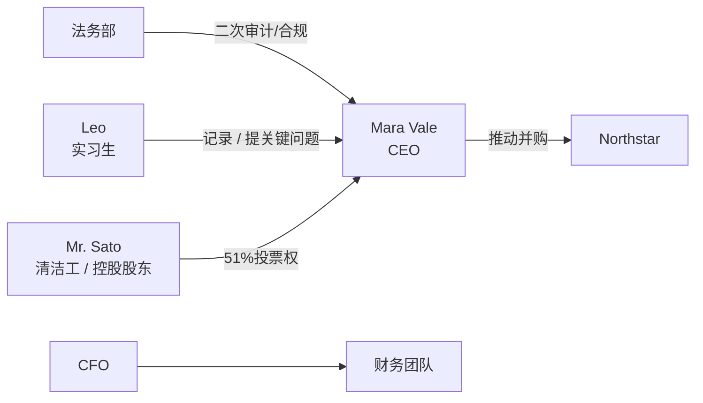

## 时间线

---
## 1. Monday: The Merger Nobody Read

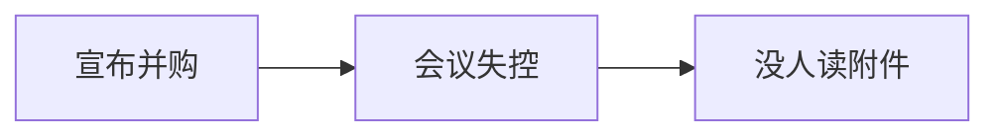

### 逐段完整中英对照

#### 段落 1（English）

The boardroom smelled of coffee, ambition, and one printer that had been “temporarily broken” since 2024.

#### 段落 1（中文完整翻译）

会议室里弥漫着咖啡、野心，以及一台从 2024 年起就一直“临时坏掉”的打印机所共同营造出的气息。

#### 段落 2（English）

The board chose to **abandon** the vanity project; someone tried to **abduct** our prototype drone; the parent company agreed to **absorb** the loss; we found an **abuse** of corporate privileges; the ceo wanted to **accelerate** the rollout. The dashboard was **accessible** to every department; security identified an alleged **accomplice**; the cfo had to **account for** every missing yen; our **accountant** stopped smiling.

#### 段落 2（中文完整翻译）

董事会决定 **abandon（抛弃，放弃）** 那个华而不实的项目；有人试图 **abduct（诱拐；绑架，劫持）** 我们的原型无人机；母公司同意 **absorb（吸收；使全神贯注，吸引（注意等））** 这笔损失；我们发现了对公司权限的 **abuse（滥用；辱骂；虐待）**；CEO 希望 **accelerate（增加，增长；使加速；促进）** 上线进度；这个仪表板对每个部门都是 **accessible（可接近的；可进入的）** 的；安保锁定了一名疑似 **accomplice（从犯，帮凶，同谋）**；CFO 必须 **account for** 每一笔去向不明的日元；我们的 **accountant（会计）** 终于笑不出来了。

#### 段落 3（English）

Small errors began to **accumulate**; the forecast proved surprisingly **accurate**; the minutes unexpectedly mentioned **activism**; one analyst seemed **addicted to** spreadsheets; the war room was **adjacent to** the cafeteria. The minutes unexpectedly mentioned **administration**; the vendor finally had to **admit** the mistake; the team tried to **advance** the negotiation; someone raised **adversity** during the meeting.

#### 段落 3（中文完整翻译）

小错误开始不断 **accumulate（累积，积聚）**；预测结果后来证明出奇地 **accurate（准确的，精确的）**；会议纪要里意外提到了 **activism（激进主义，行动主义）**；有位分析师似乎已经 **addicted to** 电子表格；作战室 **adjacent to** 食堂；会议纪要里意外提到了 **administration（经营，管理；行政，行政机关）**；供应商最终不得不 **admit（承认；允许入内；容许有）** 这个错误；团队试图 **advance（促进，提高；提出；前进）** 谈判；有人在会议上提出了 **adversity（不幸，灾祸；逆境）** 这个话题。

#### 段落 4（English）

The risk register added **advertisement**; the risk register added **aerospace**; the risk register added **affidavit**; the proposal looked **affluent** at first; the product had to remain **affordable**. Our lawyers suddenly cared about **aftershock**; the minutes unexpectedly mentioned **agent**; the consultant described the risk as **aggressive**; a slide was mysteriously titled **agony column**.

#### 段落 4（中文完整翻译）

风险登记表新增了 **advertisement（广告；做广告，登广告）**；风险登记表新增了 **aerospace（航空航天技术）**；风险登记表新增了 **affidavit（【律】宣誓书，口供书）**；这份提案起初看起来很 **affluent（富裕的，丰富的，富饶的）**；产品必须继续保持 **affordable（负担得起的）**；我们的律师突然开始关注 **aftershock（余震，余悸）**；会议纪要里意外提到了 **agent（代理人，代理商；起因）**；顾问把这项风险描述为 **aggressive（侵略的，好斗的；有进取精神的）**；有一页幻灯片神秘地以 **agony column（［'kɑːləm ］ （报刊）人事广告栏）** 为标题。

#### 段落 5（English）

Management decided to **aid** before lunch; management decided to **allege** before lunch; the minutes unexpectedly mentioned **allergy**; the risk register added **alliance**; the risk register added **allocation**. The new plan required us to **alter** immediately; the consultant described the risk as **amateur**; the minutes unexpectedly mentioned **ambulance**; the hidden fees **amounted to** a small fortune.

#### 段落 5（中文完整翻译）

管理层决定在午饭前先 **aid（说明；救助；有助于）**；管理层决定在午饭前先 **allege（（无充分证据而）断言，宣称；提出）**；会议纪要里意外提到了 **allergy（过敏症；厌恶，反感）**；风险登记表新增了 **alliance（结盟，同盟；联姻；类同，相似）**；风险登记表新增了 **allocation（分派，分配；分配额）**；新方案要求我们立即 **alter（改变，修改）**；顾问把这项风险描述为 **amateur（业余的，外行的；不熟练的）**；会议纪要里意外提到了 **ambulance（救护车）**；那些隐藏费用 **amounted to** 一笔不小的数目。

#### 段落 6（English）

The new plan required us to **anchor** immediately; the board called the situation **animated**; the new plan required us to **annoy** immediately; the audit trail contained **antibiotic**; the board called the situation **antitrust**. The market suddenly seemed **apologetic**; our lawyers suddenly cared about **apology**; the board asked whether we should **apparel**; the minutes unexpectedly mentioned **application**. Leo wrote all of this down, then asked whether “stakeholder alignment” was a medical condition.

#### 段落 6（中文完整翻译）

新方案要求我们立即 **anchor（抛锚泊船；（使）固定）**；董事会把当前局面称为 **animated（栩栩如生的；活跃的，热烈的）**；新方案要求我们立即 **annoy（使（某人）烦恼；打搅，骚扰（某人））**；审计记录中出现了 **antibiotic（抗生素）**；董事会把当前局面称为 **antitrust（反垄断的，反托拉斯的）**；市场突然显得很 **apologetic（道歉的，认错的，愧悔的；辩解的，辩）**；我们的律师突然开始关注 **apology（道歉，赔罪；辩解，辩护）**；董事会开始讨论我们是否应该 **apparel（给…穿衣服（尤指华丽或特殊的服装））**；会议纪要里意外提到了 **application（运用；申请，申请表）**；Leo 把这一切都记了下来，然后问道：“stakeholder alignment（利益相关者协同）难道是一种医学病症吗？”。

#### 段落 7（English）

The crisis forced us to **appraise**; one executive tried to **apprehend** without approval; someone raised **arraignment** during the meeting; someone raised **arson** during the meeting; the board called the situation **artificial**. The risk register added **assailant**; the board asked whether we should **assassinate**; management decided to **assemble** before lunch; management decided to **assert** before lunch.

#### 段落 7（中文完整翻译）

这场危机迫使我们 **appraise（估计，估价，评价）**；一名高管试图在未经批准的情况下 **apprehend（逮捕；担忧；理解，了解）**；有人在会议上提出了 **arraignment（传讯，传问；责难）** 这个话题；有人在会议上提出了 **arson（纵火，放火）** 这个话题；董事会把当前局面称为 **artificial（人工的，人造的；假的；矫揉造作的，不自然）**；风险登记表新增了 **assailant（攻击者，袭击者）**；董事会开始讨论我们是否应该 **assassinate（暗杀；诋毁；破坏）**；管理层决定在午饭前先 **assemble（集合，召集，聚集；配装）**；管理层决定在午饭前先 **assert（断言，声称；维护；坚持）**。

#### 段落 8（English）

The audit trail contained **asset**; management decided to **assimilate** before lunch; someone raised **asthma** during the meeting; someone raised **astronomer** during the meeting; the consultant described the risk as **atomic**. The board asked whether we should **attain**; the proposal looked **attentive** at first; we could **attribute** the outage **to** one bad script; one executive tried to **audit** without approval.

#### 段落 8（中文完整翻译）

审计记录中出现了 **asset（财产，资产；才能；有利条件）**；管理层决定在午饭前先 **assimilate（同化；吸收）**；有人在会议上提出了 **asthma（哮喘症，气喘）** 这个话题；有人在会议上提出了 **astronomer（天文学家）** 这个话题；顾问把这项风险描述为 **atomic（原子的，核能的；核武器的）**；董事会开始讨论我们是否应该 **attain（达到，获得）**；这份提案起初看起来很 **attentive（注意的，关心的；有礼貌的）**；我们可以把这次故障 **attribute（归因于）** **to（归于）** 一段有问题的脚本；一名高管试图在未经批准的情况下 **audit（审核；查账；旁听）**。

#### 段落 9（English）

The consultant described the risk as **authentic**; the proposal looked **authoritative** at first; the revised contract was **available for** review; a junior engineer helped **avert** disaster; the market suddenly seemed **backward**. We had to **balance** speed **against** reliability; legal proposed a **ban on** unofficial plug-ins; the minutes unexpectedly mentioned **bandwagon**; our lawyers suddenly cared about **banker**.

#### 段落 9（中文完整翻译）

顾问把这项风险描述为 **authentic（可信的，可靠的；真的）**；这份提案起初看起来很 **authoritative（权威性的，可信赖的；官方的，当局）**；修订后的合同已经 **available for（可供……使用/审阅）** 审查；一名初级工程师帮助公司 **avert（避免、防止）** 了灾难；市场突然显得很 **backward（向后的，落后的；畏缩的）**；我们必须在速度与可靠性之间进行 **balance（权衡）**，也就是把速度 **against（与……相比较/权衡）** 可靠性来考虑；法务提议对非官方插件实行 **ban on（对……的禁令）**；会议纪要里意外提到了 **bandwagon（乐队彩车；浪潮，时尚）**；我们的律师突然开始关注 **banker（银行家，银行业者；（赌博的）庄家）**。

#### 段落 10（English）

Someone raised **bankruptcy** during the meeting; procurement began to **bargain over** the price; the valuation was **based on** optimistic assumptions; we should have tested it **beforehand**; the new plan required us to **beguile** immediately. The board asked whether we should **belittle**; the delay was oddly **beneficial to** us; the new plan required us to **beset** immediately; the board called the situation **bilateral**.

#### 段落 10（中文完整翻译）

有人在会议上提出了 **bankruptcy（破产，倒闭；彻底失败）** 这个话题；采购部门开始围绕价格 **bargain over**；估值是 **based on** 乐观假设得出的；我们本来就应该 **beforehand（预先，事先，提前）** 对它进行测试；新方案要求我们立即 **beguile（欺骗；使陶醉，使着迷）**；董事会开始讨论我们是否应该 **belittle（轻视，贬低）**；这次延误反而出奇地对我们 **beneficial to**；新方案要求我们立即 **beset（困扰，使苦恼；围攻，包围住）**；董事会把当前局面称为 **bilateral（有两面的，双边的）**。

#### 段落 11（English）

The proposal looked **binocular** at first; the minutes unexpectedly mentioned **biohazard**; the risk register added **biosphere**; someone raised **birthrate** during the meeting; the message looked like an attempt to **blackmail** the ceo. Management decided to **blast** before lunch; the crisis forced us to **blood**; the proposal looked **bogus** at first; the crisis created an unexpected **bond** between rivals. Leo wrote all of this down, then asked whether “stakeholder alignment” was a medical condition.

#### 段落 11（中文完整翻译）

这份提案起初看起来很 **binocular（双目的）**；会议纪要里意外提到了 **biohazard（生物危害）**；风险登记表新增了 **biosphere（生物圈）**；有人在会议上提出了 **birthrate（出生率）** 这个话题；那条信息看起来像是在试图 **blackmail（敲诈，勒索，胁迫）** CEO；管理层决定在午饭前先 **blast（爆炸；吹奏；使枯萎；损坏）**；这场危机迫使我们 **blood（从…抽血；使初尝经验）**；这份提案起初看起来很 **bogus（伪造的，假货的）**；这场危机反而在竞争对手之间形成了一种意外的 **bond（结合；债券；束缚）**；Leo 把这一切都记了下来，然后问道：“stakeholder alignment（利益相关者协同）难道是一种医学病症吗？”。

#### 段落 12（English）

Ai consulting was enjoying a **boom**; one executive tried to **bootleg** without approval; someone raised **borrowing** during the meeting; one executive tried to **bounce** without approval; someone raised **boundary** during the meeting. The crisis forced us to **boycott**; the board asked whether we should **brand**; someone raised **breakup** during the meeting; the crisis forced us to **bribe**.

#### 段落 12（中文完整翻译）

AI 咨询行业正享受着一轮 **boom（（发出）隆隆声；繁荣）**；一名高管试图在未经批准的情况下 **bootleg（非法携带（或制造、贩卖））**；有人在会议上提出了 **borrowing（借，借用；借用的言语（或思想等））** 这个话题；一名高管试图在未经批准的情况下 **bounce（反跳，弹起，（使）跳起）**；有人在会议上提出了 **boundary（边界，分界线；界限，范围）** 这个话题；这场危机迫使我们 **boycott（联合抵制，拒绝参加（或购买等））**；董事会开始讨论我们是否应该 **brand（在…上打烙印（或标记）；铭记，铭刻）**；有人在会议上提出了 **breakup（中断，分离，分裂；崩溃，解体）** 这个话题；这场危机迫使我们 **bribe（向…行贿，行贿，收买）**。

#### 段落 13（English）

The board asked whether we should **broadcast**; management decided to **bruise** before lunch; the project was already **over budget**; the new plan required us to **bully** immediately; the risk register added **bystander**. The new plan required us to **calculate** immediately; the board called the situation **candid**; the board called the situation **canny**; the founder dreamed of a huge **capital gain**.

#### 段落 13（中文完整翻译）

董事会开始讨论我们是否应该 **broadcast（广播，播送；广为散播，传布）**；管理层决定在午饭前先 **bruise（碰伤，使青肿）**；项目已经处于 **over budget** 的状态；新方案要求我们立即 **bully（威吓，胁迫，欺侮）**；风险登记表新增了 **bystander（旁观者）**；新方案要求我们立即 **calculate（计算；推测；打算，计划）**；董事会把当前局面称为 **candid（公正的；直言的，坦率的）**；董事会把当前局面称为 **canny（精明的；谨慎的）**；创始人梦想获得一笔巨大的 **capital gain（［geɪn ］ 资本盈利（出售资本、资产所得的利）**。

#### 段落 14（English）

One executive tried to **capitalize** without approval; one executive tried to **capitulate** without approval; the board asked whether we should **care**; the consultant described the risk as **careless**; our **cash flow** suddenly mattered more than our slogans. The risk register added **catalyst**; the revised plan sounded **catching**; the proposal looked **causal** at first; the crisis forced us to **celebrate**.

#### 段落 14（中文完整翻译）

一名高管试图在未经批准的情况下 **capitalize（用大写字母书写；使资本化；计算…的现价）**；一名高管试图在未经批准的情况下 **capitulate（（有条件地）投降，屈从）**；董事会开始讨论我们是否应该 **care（关心；介意；愿意；喜欢）**；顾问把这项风险描述为 **careless（粗心的，疏忽的；自然的，无忧无虑的）**；此刻，我们的 **cash flow（［floʊ ］ 现金流）** 比公司的口号更重要；风险登记表新增了 **catalyst（催化剂，刺激因素）**；修订后的方案听起来很 **catching（传染性的；迷人的）**；这份提案起初看起来很 **causal（原因的，因果关系的）**；这场危机迫使我们 **celebrate（庆祝，庆贺；赞美）**。

#### 段落 15（English）

The proposal looked **cellular** at first; the board asked whether we should **censure**; the audit trail contained **chaos**; the revised plan sounded **characteristic**; the minutes unexpectedly mentioned **charisma**.

#### 段落 15（中文完整翻译）

这份提案起初看起来很 **cellular（细胞组成的；划分的；多孔的）**；董事会开始讨论我们是否应该 **censure（责备，谴责）**；审计记录中出现了 **chaos（混乱，杂乱的一团）**；修订后的方案听起来很 **characteristic（特有的，独特的，典型的）**；会议纪要里意外提到了 **charisma（非凡的领导力，魅力）**。

#### 段落 16（English）

The first day ended with one certainty: nobody had read the attachment titled FINAL_v7_REALLY_FINAL.pdf.

#### 段落 16（中文完整翻译）

第一天结束时，唯一可以确定的事情是：根本没有人读过那份名为 FINAL_v7_REALLY_FINAL.pdf 的附件。

---

## 2. Tuesday: The Prototype Disappears

### 逐段完整中英对照

#### 段落 1（English）

At 9:07 a.m., security called. The prototype was gone; the security camera, naturally, had excellent footage of an empty corridor.

#### 段落 1（中文完整翻译）

上午 9:07，安保部门打来电话。原型机不见了；而监控摄像头当然拍得“非常清楚”——只不过画面里是一条空荡荡的走廊。

#### 段落 2（English）

The crisis forced us to **chase**; our lawyers suddenly cared about **chemotherapy**; the revised plan sounded **chronic**; the board called the situation **civic**; the market suddenly seemed **civilian**. One executive tried to **clamp** without approval; one executive tried to **clash** without approval; the risk register added **clearance**; someone raised **climate** during the meeting.

#### 段落 2（中文完整翻译）

这场危机迫使我们 **chase（追逐；追赶；驱逐）**；我们的律师突然开始关注 **chemotherapy（化学疗法）**；修订后的方案听起来很 **chronic（长期的；慢性的）**；董事会把当前局面称为 **civic（市民的；公民的；城市的）**；市场突然显得很 **civilian（平民的，百姓的；民用的）**；一名高管试图在未经批准的情况下 **clamp（钳紧，夹住；强行实施）**；一名高管试图在未经批准的情况下 **clash（冲突，抵触）**；风险登记表新增了 **clearance（清除，清理；（人、交通工具等）通关；空）**；有人在会议上提出了 **climate（气候；风气，趋势；气氛）** 这个话题。

#### 段落 3（English）

The risk register added **clone**; the board called the situation **coarse**; the new plan required us to **coddle** immediately; the consultant described the risk as **coherent**; the revised plan sounded **collateral**. The consultant described the risk as **colloquial**; the market suddenly seemed **colonial**; our lawyers suddenly cared about **commerce**; the audit trail contained **commercialism**.

#### 段落 3（中文完整翻译）

风险登记表新增了 **clone（无性繁殖系；翻版，复制品）**；董事会把当前局面称为 **coarse（粗的，粗糙的；粗俗的）**；新方案要求我们立即 **coddle（溺爱；娇养；用文火煮（蛋等））**；顾问把这项风险描述为 **coherent（一致的，协调的，连贯的）**；修订后的方案听起来很 **collateral（并行的，附属的；旁系的）**；顾问把这项风险描述为 **colloquial（白话的，口语的）**；市场突然显得很 **colonial（殖民地的，殖民的）**；我们的律师突然开始关注 **commerce（商业，贸易；交流，社交）**；审计记录中出现了 **commercialism（商业精神；营利主义）**。

#### 段落 4（English）

The board refused to **commit to** a date; someone raised **commodity** during the meeting; the crisis forced us to **communicate**; the board called the situation **comparable**; hr discussed **compensation** for the overtime. The consultant described the risk as **competent**; the audit trail contained **competitor**; the proposal looked **complicated** at first; management decided to **compound** before lunch.

#### 段落 4（中文完整翻译）

董事会拒绝 **commit to** 一个日期；有人在会议上提出了 **commodity（商品；日用品；有用的东西）** 这个话题；这场危机迫使我们 **communicate（交际，交流；传送；通讯）**；董事会把当前局面称为 **comparable（可比较的，比得上的）**；HR 讨论了针对加班的 **compensation（补偿，赔偿；赔偿金）**；顾问把这项风险描述为 **competent（有能力的，能胜任的）**；审计记录中出现了 **competitor（竞争者，对手，敌手）**；这份提案起初看起来很 **complicated（复杂的，难懂的）**；管理层决定在午饭前先 **compound（增重；使混合，使化合）**。

#### 段落 5（English）

The proposal looked **computer-literate** at first; the crisis forced us to **conceal**; the risk register added **concession**; one executive tried to **concoct** without approval; the auditors **concurred with** legal counsel. The new plan required us to **condone** immediately; management decided to **confederate** before lunch; the audit trail contained **conference**; the market suddenly seemed **confident**.

#### 段落 5（中文完整翻译）

这份提案起初看起来很 **computer-literate（精通计算机的，懂计算机操）**；这场危机迫使我们 **conceal（隐蔽，隐瞒）**；风险登记表新增了 **concession（让步，妥协；特许权）**；一名高管试图在未经批准的情况下 **concoct（调制，调和；捏造；图谋）**；审计人员 **concurred with** 法律顾问的意见；新方案要求我们立即 **condone（宽恕，赦免）**；管理层决定在午饭前先 **confederate（（使）结盟，（使）联合）**；审计记录中出现了 **conference（会议，讨论会，协商会）**；市场突然显得很 **confident（自信的，有信心的）**。

#### 段落 6（English）

The new plan required us to **confirm** immediately; the market suddenly seemed **congenital**; the new plan required us to **conjecture** immediately; someone raised **conscience** during the meeting; the consultant described the risk as **consecutive**. The minutes unexpectedly mentioned **consequence**; the minutes unexpectedly mentioned **conservationist**; the consultant described the risk as **conspicuous**; the revised plan sounded **constituent**. Leo wrote all of this down, then asked whether “stakeholder alignment” was a medical condition.

#### 段落 6（中文完整翻译）

新方案要求我们立即 **confirm（证实，确认；加强；批准）**；市场突然显得很 **congenital（先天的，天生的）**；新方案要求我们立即 **conjecture（推测，猜想，揣摩）**；有人在会议上提出了 **conscience（良心）** 这个话题；顾问把这项风险描述为 **consecutive（连续不断的，连贯的）**；会议纪要里意外提到了 **consequence（结果，后果；重要性）**；会议纪要里意外提到了 **conservationist（自然环境保护主义者）**；顾问把这项风险描述为 **conspicuous（显著的，显而易见的）**；修订后的方案听起来很 **constituent（组成的，构成的；有宪法制定（或修改））**；Leo 把这一切都记了下来，然后问道：“stakeholder alignment（利益相关者协同）难道是一种医学病症吗？”。

#### 段落 7（English）

Someone raised **constitution** during the meeting; management decided to **consume** before lunch; a slide was mysteriously titled **consumer price index**; one executive tried to **contemplate** without approval; the risk register added **contempt**. One executive tried to **contort** without approval; the proposal looked **contrary** at first; each department had to **contribute to** the recovery plan; we struggled to **keep the situation under control**.

#### 段落 7（中文完整翻译）

有人在会议上提出了 **constitution（宪法；构造，构成；组成，形成）** 这个话题；管理层决定在午饭前先 **consume（消耗，花费；吃完）**；有一页幻灯片神秘地以 **consumer price index（［praɪs ］［'ɪndeks ］ 消费者价格）** 为标题；一名高管试图在未经批准的情况下 **contemplate（深思，考虑；注视；预期）**；风险登记表新增了 **contempt（轻视，蔑视；丢脸，受辱）**；一名高管试图在未经批准的情况下 **contort（扭曲，曲解）**；这份提案起初看起来很 **contrary（相反的，矛盾的，对抗的）**；每个部门都必须为恢复计划 **contribute to**；我们艰难地试图 **keep the situation under control**。

#### 段落 8（English）

The board asked whether we should **convene**; the new plan required us to **convey** immediately; the risk register added **conviction**; the new plan required us to **cooperate** immediately; the proposal looked **cordial** at first. The revised plan sounded **corporate**; our lawyers suddenly cared about **corporation**; the consultant described the risk as **correspondent**; the crisis forced us to **corrupt**.

#### 段落 8（中文完整翻译）

董事会开始讨论我们是否应该 **convene（召集，召开；聚集，集合）**；新方案要求我们立即 **convey（传达；转移；运输，输送）**；风险登记表新增了 **conviction（定罪，证明有罪；信念）**；新方案要求我们立即 **cooperate（合作，协作，配合）**；这份提案起初看起来很 **cordial（热忱的，友好的，真挚的）**；修订后的方案听起来很 **corporate（法人的，团体的；公司的；共同的）**；我们的律师突然开始关注 **corporation（法人，社团法人；公司）**；顾问把这项风险描述为 **correspondent（符合的，一致的）**；这场危机迫使我们 **corrupt（（使）腐败，（使）堕落）**。

#### 段落 9（English）

The risk register added **cost-conscious**; the board asked whether we should **count**; the crisis forced us to **counterfeit**; the consultant described the risk as **cozy**; our lawyers suddenly cared about **craft**. The proposal looked **crass** at first; the consultant described the risk as **credible**; someone raised **creditor** during the meeting; the audit trail contained **criminology**.

#### 段落 9（中文完整翻译）

风险登记表新增了 **cost-conscious（成本意识）**；董事会开始讨论我们是否应该 **count（计算；认为；考虑）**；这场危机迫使我们 **counterfeit（伪造，仿造；假装）**；顾问把这项风险描述为 **cozy（舒适的，惬意的）**；我们的律师突然开始关注 **craft（工艺；行业；手腕，诡计；狡猾）**；这份提案起初看起来很 **crass（粗鲁的，愚钝的；粗糙的）**；顾问把这项风险描述为 **credible（可信的，可靠的）**；有人在会议上提出了 **creditor（债权人）** 这个话题；审计记录中出现了 **criminology（犯罪学）**。

#### 段落 10（English）

Management decided to **cripple** before lunch; the minutes unexpectedly mentioned **criticality**; someone raised **critique** during the meeting; the revised plan sounded **crucial**; the crisis forced us to **culminate**. Management decided to **cure** before lunch; the risk register added **custody**; the new plan required us to **cut** immediately; the minutes unexpectedly mentioned **cyberspace**.

#### 段落 10（中文完整翻译）

管理层决定在午饭前先 **cripple（使残废；严重削弱；使陷入瘫痪）**；会议纪要里意外提到了 **criticality（临界状态，临界点）**；有人在会议上提出了 **critique（批评；评论，评论文章）** 这个话题；修订后的方案听起来很 **crucial（关键的，决定性的）**；这场危机迫使我们 **culminate（达到最高点；告终，使结束）**；管理层决定在午饭前先 **cure（治好，治愈；矫正；改正）**；风险登记表新增了 **custody（保管，照管；监护；拘留，监禁）**；新方案要求我们立即 **cut（切，割，砍，削；伤害）**；会议纪要里意外提到了 **cyberspace（计算机空间）**。

#### 段落 11（English）

Management decided to **dangle** before lunch; one executive tried to **daunt** without approval; management decided to **deal** before lunch; the new plan required us to **debate** immediately; the risk register added **debtor**. The crisis forced us to **declare**; one executive tried to **deduce** without approval; our lawyers suddenly cared about **deduction**; the borrower was close to **default on** its loan. Leo wrote all of this down, then asked whether “stakeholder alignment” was a medical condition.

#### 段落 11（中文完整翻译）

管理层决定在午饭前先 **dangle（（使）悬荡，（使）吊着；追随）**；一名高管试图在未经批准的情况下 **daunt（使胆怯；使气馁；使失去信心）**；管理层决定在午饭前先 **deal（处理，应付；分配；发牌）**；新方案要求我们立即 **debate（辩论，讨论，争论；思考）**；风险登记表新增了 **debtor（借方，债务人）**；这场危机迫使我们 **declare（宣告，声明；申报）**；一名高管试图在未经批准的情况下 **deduce（演绎，推断；追溯）**；我们的律师突然开始关注 **deduction（扣除，扣除额；推论，演绎）**；借款方已经接近 **default on（对……违约）** 贷款；Leo 把这一切都记了下来，然后问道：“stakeholder alignment（利益相关者协同）难道是一种医学病症吗？”。

#### 段落 12（English）

The crisis forced us to **defend**; someone raised **deficit** during the meeting; our lawyers suddenly cared about **deflation**; the new plan required us to **defuse** immediately; one executive tried to **delete** without approval. The crisis forced us to **deliver**; customers continued to **demand** an explanation; the new plan required us to **demean** immediately; the crisis forced us to **denounce**.

#### 段落 12（中文完整翻译）

这场危机迫使我们 **defend（防御，保卫，保护；为…辩护）**；有人在会议上提出了 **deficit（不足额，赤字，亏空）** 这个话题；我们的律师突然开始关注 **deflation（放气，缩小；通货紧缩；泄气）**；新方案要求我们立即 **defuse（拆去…的雷管；除去危险性；缓和，平息）**；一名高管试图在未经批准的情况下 **delete（删除，划掉）**；这场危机迫使我们 **deliver（投递，送交；发表；接生）**；客户继续 **demand（要求）** 公司作出解释；新方案要求我们立即 **demean（贬低…的身份）**；这场危机迫使我们 **denounce（指责，谴责；告发；指控）**。

#### 段落 13（English）

The revised plan sounded **dental**; one executive tried to **depart** without approval; the board asked whether we should **depict**; the buyer paid a **deposit on** the equipment; the audit trail contained **depression**. The consultant described the risk as **derelict**; the audit trail contained **dermatologist**; management decided to **desert** before lunch; the risk register added **desktop**.

#### 段落 13（中文完整翻译）

修订后的方案听起来很 **dental（牙齿的；牙科的）**；一名高管试图在未经批准的情况下 **depart（起程，出发，离开；背离）**；董事会开始讨论我们是否应该 **depict（描绘，描述，描画）**；买方为设备支付了 **deposit on（……的定金）**；审计记录中出现了 **depression（沮丧，意志消沉；不景气，萧条）**；顾问把这项风险描述为 **derelict（荒废的，被弃置的；玩忽职守的）**；审计记录中出现了 **dermatologist（皮肤学专家，皮肤科医生）**；管理层决定在午饭前先 **desert（遗弃，抛弃）**；风险登记表新增了 **desktop（台式计算机；（电脑）桌面）**。

#### 段落 14（English）

The risk register added **detection**; the minutes unexpectedly mentioned **detention**; the board asked whether we should **deteriorate**; the minutes unexpectedly mentioned **device**; the new plan required us to **diagnose** immediately. Our lawyers suddenly cared about **dictator**; the crisis forced us to **diffuse**; the consultant described the risk as **digital**; the crisis forced us to **diminish**.

#### 段落 14（中文完整翻译）

风险登记表新增了 **detection（发现，发觉；侦查，探知）**；会议纪要里意外提到了 **detention（滞留，延迟；拘留）**；董事会开始讨论我们是否应该 **deteriorate（（使）恶化；（使）下降；（使）退化；）**；会议纪要里意外提到了 **device（装置，设备；手段，谋略）**；新方案要求我们立即 **diagnose（诊断）**；我们的律师突然开始关注 **dictator（独裁者）**；这场危机迫使我们 **diffuse（（使）扩散，传播，散布）**；顾问把这项风险描述为 **digital（数字的，数码的）**；这场危机迫使我们 **diminish（缩小，减少，递减；削弱…的权势）**。

#### 段落 15（English）

The proposal looked **dire** at first; the proposal looked **disabled** at first; the proposal looked **disastrous** at first; the crisis forced us to **discern**; management decided to **disclaim** before lunch.

#### 段落 15（中文完整翻译）

这份提案起初看起来很 **dire（可怕的；悲惨的；极度的；紧迫的）**；这份提案起初看起来很 **disabled（残废的；有缺陷的）**；这份提案起初看起来很 **disastrous（灾害的，灾难性的；悲惨的）**；这场危机迫使我们 **discern（认出，发现；辨别，识别）**；管理层决定在午饭前先 **disclaim（放弃，否认，拒绝承认）**。

#### 段落 16（English）

Security found the missing prototype in a delivery crate addressed to Helix itself. Nobody laughed except the courier.

#### 段落 16（中文完整翻译）

安保最终在一个收件人写着 Helix 自己的送货箱里找到了失踪的原型机。除了快递员之外，没有人笑得出来。

---

## 3. Wednesday: Finance Discovers Gravity

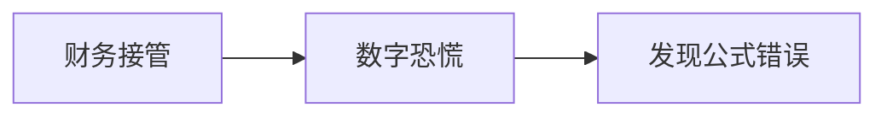

### 逐段完整中英对照

#### 段落 1（English）

Finance entered the story like a thunderstorm wearing a tie.

#### 段落 1（中文完整翻译）

财务部门像一场系着领带的雷暴一样闯进了故事。

#### 段落 2（English）

The minutes unexpectedly mentioned **disclosure**; the board asked whether we should **discredit**; management decided to **disinfect** before lunch; the new plan required us to **dismiss** immediately; the risk register added **disruption**. The board asked whether we should **dissipate**; one executive tried to **distribute** without approval; the crisis forced us to **dive**; the board wanted to **diversify into** health technology.

#### 段落 2（中文完整翻译）

会议纪要里意外提到了 **disclosure（揭发，透露，公开）**；董事会开始讨论我们是否应该 **discredit（使丢脸，败坏…的名声；使不足信）**；管理层决定在午饭前先 **disinfect（给…消毒（或杀菌））**；新方案要求我们立即 **dismiss（解散；开除）**；风险登记表新增了 **disruption（分裂，崩溃，瓦解；混乱）**；董事会开始讨论我们是否应该 **dissipate（驱散，使消散；浪费，挥霍）**；一名高管试图在未经批准的情况下 **distribute（分发；分配；散布）**；这场危机迫使我们 **dive（跳水，潜水；潜心钻研，探究）**；董事会希望 **diversify into** 健康科技领域。

#### 段落 3（English）

Shareholders still asked about the **dividend**; our lawyers suddenly cared about **dizziness**; the risk register added **donor**; the consultant described the risk as **dormant**; the consultant described the risk as **dour**. Management quietly planned to **downsize** one division; one executive tried to **draft** without approval; the crisis forced us to **drift**; the market suddenly seemed **dubious**.

#### 段落 3（中文完整翻译）

股东们仍在追问 **dividend（红利，股息；被除数）**；我们的律师突然开始关注 **dizziness（头昏眼花，眩晕）**；风险登记表新增了 **donor（赠送人，捐赠者）**；顾问把这项风险描述为 **dormant（睡着的；冬眠的，休眠的）**；顾问把这项风险描述为 **dour（阴郁的；严厉的；倔强的）**；管理层悄悄计划 **downsize（以较小尺寸设计或制造；裁减（员工）人数）** 一个业务部门；一名高管试图在未经批准的情况下 **draft（起草；设计；选派；征兵）**；这场危机迫使我们 **drift（漂流；漂泊，游荡；渐渐趋向）**；市场突然显得很 **dubious（半信半疑的，怀疑的；犹豫不决的）**。

#### 段落 4（English）

The market suddenly seemed **dumb**; the risk register added **duty**; the minutes unexpectedly mentioned **earnings**; the proposal looked **eco-conscious** at first; the audit trail contained **economics**. Someone raised **economy** during the meeting; the audit trail contained **editor**; a slide was mysteriously titled **educational toys**; the new policy **took effect** at midnight.

#### 段落 4（中文完整翻译）

市场突然显得很 **dumb（哑的，无言的；迟钝的，笨的）**；风险登记表新增了 **duty（职责，本分，责任；税）**；会议纪要里意外提到了 **earnings（收入，工资；利润，收益）**；这份提案起初看起来很 **eco-conscious（有环保意识的）**；审计记录中出现了 **economics（经济学；经济情况，经济）**；有人在会议上提出了 **economy（节约，节省；经济）** 这个话题；审计记录中出现了 **editor（编辑）**；有一页幻灯片神秘地以 **educational toys（［tɔɪz ］ 教学玩具）** 为标题；新政策在午夜 **took effect**。

#### 段落 5（English）

One executive tried to **elicit** without approval; management decided to **emancipate** before lunch; management decided to **embed** before lunch; management decided to **embrace** before lunch; one executive tried to **empathize** without approval. Someone raised **employee** during the meeting; the minutes unexpectedly mentioned **encryption**; the crisis forced us to **endeavor**; the crisis forced us to **endorse**.

#### 段落 5（中文完整翻译）

一名高管试图在未经批准的情况下 **elicit（引出，诱出，引起）**；管理层决定在午饭前先 **emancipate（释放，解放）**；管理层决定在午饭前先 **embed（使插入，使嵌入；使深留脑中（或记忆中））**；管理层决定在午饭前先 **embrace（拥抱；包括；欣然接受）**；一名高管试图在未经批准的情况下 **empathize（（使）同情，有同感，产生共鸣）**；有人在会议上提出了 **employee（受雇者，雇工，雇员）** 这个话题；会议纪要里意外提到了 **encryption（加密）**；这场危机迫使我们 **endeavor（努力，尽力；力图）**；这场危机迫使我们 **endorse（背书，签署；赞同，批准）**。

#### 段落 6（English）

The risk register added **energy**; the new plan required us to **engineer** immediately; we added tests to **ensure that** it would not happen again; one executive tried to **entertain** without approval; the risk register added **entrepreneur**. A slide was mysteriously titled **environmental assessment**; the risk register added **envy**; the revised plan sounded **equal**; the audit trail contained **equipment**. Leo wrote all of this down, then asked whether “stakeholder alignment” was a medical condition.

#### 段落 6（中文完整翻译）

风险登记表新增了 **energy（能量，精力，活力）**；新方案要求我们立即 **engineer（设计，建造；操纵，策划）**；我们增加了更多测试，以 **ensure that** 同类问题不会再次发生；一名高管试图在未经批准的情况下 **entertain（使欢乐，使娱乐；招待；持有）**；风险登记表新增了 **entrepreneur（企业家）**；有一页幻灯片神秘地以 **environmental assessment（［ə'sesmənt ］ 环境评估）** 为标题；风险登记表新增了 **envy（妒忌，羡慕）**；修订后的方案听起来很 **equal（相等的，平等的；能胜任的）**；审计记录中出现了 **equipment（装备，设备）**；Leo 把这一切都记了下来，然后问道：“stakeholder alignment（利益相关者协同）难道是一种医学病症吗？”。

#### 段落 7（English）

The risk register added **eradication**; the proposal looked **essential** at first; the audit trail contained **estate**; the emergency checklist included **ethnic minority**; management decided to **evaluate** before lunch. The minutes unexpectedly mentioned **evolution**; our lawyers suddenly cared about **excess**; management decided to **exclude** before lunch; the proposal looked **executive** at first.

#### 段落 7（中文完整翻译）

风险登记表新增了 **eradication（根除；消灭）**；这份提案起初看起来很 **essential（本质的，实质的；基本的）**；审计记录中出现了 **estate（房地产，不动产；社会等级）**；应急清单中列入了 **ethnic minority（［maɪ'nɔːrəti ］ 少数民族）**；管理层决定在午饭前先 **evaluate（估价，评价）**；会议纪要里意外提到了 **evolution（发展；渐进；进化）**；我们的律师突然开始关注 **excess（超越；过量；（饮食等的）过度，无节制）**；管理层决定在午饭前先 **exclude（排除；拒绝）**；这份提案起初看起来很 **executive（执行的；行政的，管理的）**。

#### 段落 8（English）

The crisis forced us to **exhibit**; the crisis forced us to **expedite**; travel **expenses** became a running joke; one executive tried to **expire** without approval; one executive tried to **explode** without approval. The audit trail contained **explosive**; the risk register added **exposure**; the audit trail contained **extinction**; the proposal looked **extraordinary** at first.

#### 段落 8（中文完整翻译）

这场危机迫使我们 **exhibit（显示，陈列，展览，展出）**；这场危机迫使我们 **expedite（使加速，促进）**；差旅 **expenses** 已经成了反复被拿来开玩笑的话题；一名高管试图在未经批准的情况下 **expire（断气；终止，期满）**；一名高管试图在未经批准的情况下 **explode（（使）爆炸；勃然（大怒）;大发（雷霆））**；审计记录中出现了 **explosive（炸药，爆炸物）**；风险登记表新增了 **exposure（暴露；揭露；曝光）**；审计记录中出现了 **extinction（消灭，灭绝；熄灭，灭火）**；这份提案起初看起来很 **extraordinary（非同寻常的，特别的）**。

#### 段落 9（English）

The risk register added **eyewitness**; one executive tried to **facilitate** without approval; the minutes unexpectedly mentioned **farce**; one executive tried to **fascinate** without approval; the revised plan sounded **fastidious**. The audit trail contained **feature**; the board asked whether we should **ferment**; the market suddenly seemed **festive**; our lawyers suddenly cared about **fever**.

#### 段落 9（中文完整翻译）

风险登记表新增了 **eyewitness（目击者，见证人）**；一名高管试图在未经批准的情况下 **facilitate（使容易，促进，帮助）**；会议纪要里意外提到了 **farce（笑剧，闹剧，滑稽戏）**；一名高管试图在未经批准的情况下 **fascinate（迷住；深深吸引）**；修订后的方案听起来很 **fastidious（难取悦的，挑剔的）**；审计记录中出现了 **feature（特征，特色；面貌，相貌；脸的一部分）**；董事会开始讨论我们是否应该 **ferment（（使）发酵；骚动）**；市场突然显得很 **festive（节日的，喜庆的，欢乐的）**；我们的律师突然开始关注 **fever（发热，发烧；狂热，高度兴奋）**。

#### 段落 10（English）

The audit trail contained **file**; the board called the situation **financial**; the board called the situation **fiscal**; the board asked whether we should **flee**; the crisis forced us to **flock**. The minutes unexpectedly mentioned **flora**; the new plan required us to **flourish** immediately; the new plan required us to **focus** immediately; the agenda carried the phrase **food poisoning**.

#### 段落 10（中文完整翻译）

审计记录中出现了 **file（档案，文件，活页夹 v. 把…归档；排成纵队前进）**；董事会把当前局面称为 **financial（财政的，金融的）**；董事会把当前局面称为 **fiscal（财政的）**；董事会开始讨论我们是否应该 **flee（逃避，逃跑，逃走）**；这场危机迫使我们 **flock（群集，聚集 n. 群；大量，众多）**；会议纪要里意外提到了 **flora（植物群）**；新方案要求我们立即 **flourish（繁荣，兴旺）**；新方案要求我们立即 **focus（聚焦，集中）**；议程上出现了 **food poisoning（［'pɔɪzənɪŋ ］ 食物中毒）** 这个词组。

#### 段落 11（English）

The **foreign exchange** desk noticed the first anomaly; someone raised **forgery** during the meeting; the minutes unexpectedly mentioned **formula**; the minutes unexpectedly mentioned **fortune**; the new plan required us to **found** immediately. The market suddenly seemed **frail**; our lawyers suddenly cared about **fraud**; the new plan required us to **freeze** immediately; the crisis forced us to **frustrate**. Leo wrote all of this down, then asked whether “stakeholder alignment” was a medical condition.

#### 段落 11（中文完整翻译）

**foreign exchange（［ɪks'tʃeɪnʤ ］ 外汇）** 交易台最先注意到了异常；有人在会议上提出了 **forgery（伪造；赝品）** 这个话题；会议纪要里意外提到了 **formula（公式；规则；客套语）**；会议纪要里意外提到了 **fortune（运气；命运；财产，大笔的钱）**；新方案要求我们立即 **found（打基础；建立）**；市场突然显得很 **frail（虚弱的；脆弱的；薄弱的）**；我们的律师突然开始关注 **fraud（欺骗罪，欺诈罪；骗子）**；新方案要求我们立即 **freeze（冻结；不许动）**；这场危机迫使我们 **frustrate（使懊恼，使沮丧；阻止，挫败）**；Leo 把这一切都记了下来，然后问道：“stakeholder alignment（利益相关者协同）难道是一种医学病症吗？”。

#### 段落 12（English）

The board agreed to **fund** the rescue plan; the minutes unexpectedly mentioned **future**; our lawyers suddenly cared about **galaxy**; the minutes unexpectedly mentioned **garbage**; the crisis forced us to **gather**. The agenda carried the phrase **general strike**; the emergency checklist included **genetic engineering**; the proposal looked **genial** at first; the crisis forced us to **gloat**.

#### 段落 12（中文完整翻译）

董事会同意为救援计划 **fund（资金，基金；存款）**；会议纪要里意外提到了 **future（将来；前途，前景）**；我们的律师突然开始关注 **galaxy（星系，银河；群英，人才荟萃）**；会议纪要里意外提到了 **garbage（垃圾，废物；废话）**；这场危机迫使我们 **gather（聚集，集合）**；议程上出现了 **general strike（［straɪk ］ 总罢工）** 这个词组；应急清单中列入了 **genetic engineering（［ˌenʤɪ'nɪrɪŋ ］ 基因工程，遗传工程）**；这份提案起初看起来很 **genial（友好的；亲切的；欢快的）**；这场危机迫使我们 **gloat（幸灾乐祸地看（或想）；贪婪地盯视）**。

#### 段落 13（English）

A slide was mysteriously titled **global warming**; management decided to **gnaw** before lunch; the new plan required us to **goad** immediately; the crisis forced us to **gossip**; our lawyers suddenly cared about **gravity**. The emergency checklist included **greenhouse effect**; management decided to **groom** before lunch; the emergency checklist included **gross domestic product**; no consultant could **guarantee** success.

#### 段落 13（中文完整翻译）

有一页幻灯片神秘地以 **global warming（［'wɔːrmɪŋ ］ 全球变暖）** 为标题；管理层决定在午饭前先 **gnaw（使烦恼，折磨）**；新方案要求我们立即 **goad（刺激；驱使；唆使）**；这场危机迫使我们 **gossip（闲聊；传播流言蜚语）**；我们的律师突然开始关注 **gravity（地心引力；重力）**；应急清单中列入了 **greenhouse effect（［ɪ'fekt ］ 温室效应）**；管理层决定在午饭前先 **groom（使整洁；打扮）**；应急清单中列入了 **gross domestic product（［də'mestɪk ］［'prɑːdʌkt ］ 国内生产）**；没有任何顾问能够 **guarantee（保证、担保）** 成功。

#### 段落 14（English）

Management decided to **gush** before lunch; one executive tried to **head** without approval; hr changed the **health insurance** provider; our lawyers suddenly cared about **hearsay**; the consultant described the risk as **herbivorous**. The emergency checklist included **high-definition television**; the board asked whether we should **hijack**; someone raised **holding** during the meeting; the risk register added **homicide**.

#### 段落 14（中文完整翻译）

管理层决定在午饭前先 **gush（涌出；滔滔不绝地说）**；一名高管试图在未经批准的情况下 **head（为首；朝（某方向）前进）**；HR 更换了 **health insurance（［ɪn'ʃʊrəns ］ 健康保险）** 的服务提供商；我们的律师突然开始关注 **hearsay（谣传，道听途说）**；顾问把这项风险描述为 **herbivorous（草食性的）**；应急清单中列入了 **high-definition television（［'telɪvɪʒn ］ 高清晰度电视）**；董事会开始讨论我们是否应该 **hijack（抢劫，劫持）**；有人在会议上提出了 **holding（持有；支持；所有物，财产）** 这个话题；风险登记表新增了 **homicide（杀人；杀人者）**。

#### 段落 15（English）

Someone raised **hook** during the meeting; the risk register added **horizon**; the board asked whether we should **hospitalize**; the audit trail contained **house**; the risk register added **humanism**.

#### 段落 15（中文完整翻译）

有人在会议上提出了 **hook（挂钩，钩）** 这个话题；风险登记表新增了 **horizon（地平线；眼界，见识）**；董事会开始讨论我们是否应该 **hospitalize（使住院治疗）**；审计记录中出现了 **house（房子，住宅）**；风险登记表新增了 **humanism（人文主义，人道主义）**。

#### 段落 16（English）

The CFO proved that the “missing millions” were mostly a spreadsheet formula copied one column too far.

#### 段落 16（中文完整翻译）

CFO 最终证明，所谓“失踪的数百万资金”，主要只是因为电子表格公式向右多复制了一列。

---

## 4. Thursday: Legal Learns to Sweat

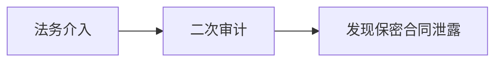

### 逐段完整中英对照

#### 段落 1（English）

Legal arrived with three laptops, five warnings, and the emotional warmth of a parking ticket.

#### 段落 1（中文完整翻译）

法务部门带着三台笔记本电脑、五条警告，以及像停车罚单一样的情感温度登场了。

#### 段落 2（English）

The board asked whether we should **humiliate**; the audit trail contained **hydrocarbon**; someone raised **hypothesis** during the meeting; management decided to **identify** before lunch; the minutes unexpectedly mentioned **immigrant**. The market suddenly seemed **immune**; the new plan required us to **imperil** immediately; the new plan required us to **impose** immediately; the minutes unexpectedly mentioned **impunity**.

#### 段落 2（中文完整翻译）

董事会开始讨论我们是否应该 **humiliate（羞辱，使丧失尊严，使丢脸）**；审计记录中出现了 **hydrocarbon（【化】 碳氢化合物）**；有人在会议上提出了 **hypothesis（假设，假说）** 这个话题；管理层决定在午饭前先 **identify（识别，鉴定；使等同于）**；会议纪要里意外提到了 **immigrant（移民，侨民）**；市场突然显得很 **immune（免疫的；免除的；不受影响的）**；新方案要求我们立即 **imperil（使陷于危险中，危及）**；新方案要求我们立即 **impose（强加于，强迫；课征，征收（税款））**；会议纪要里意外提到了 **impunity（（惩罚、损失等的）免除）**。

#### 段落 3（English）

The minutes unexpectedly mentioned **income**; costs continued to **increase by** nearly ten percent; the new plan required us to **indicate** immediately; the board called the situation **indifferent**; our lawyers suddenly cared about **industry**. The revised plan sounded **infatuated**; the risk register added **inflation**; a slide was mysteriously titled **informed source**; management decided to **infuse** before lunch.

#### 段落 3（中文完整翻译）

会议纪要里意外提到了 **income（收入；收益；所得）**；成本继续 **increase by** 接近百分之十；新方案要求我们立即 **indicate（指示，指出；象征；表示）**；董事会把当前局面称为 **indifferent（不感兴趣的，冷淡的）**；我们的律师突然开始关注 **industry（工业；勤勉，孜孜不倦）**；修订后的方案听起来很 **infatuated（入迷的）**；风险登记表新增了 **inflation（通货膨胀；充气）**；有一页幻灯片神秘地以 **informed source（［sɔːrs ］ 消息来源）** 为标题；管理层决定在午饭前先 **infuse（将…注入；灌输）**。

#### 段落 4（English）

The crisis forced us to **inherit**; the revised plan sounded **initial**; the board asked whether we should **inject**; the risk register added **insider**; the chair **insisted on** a second audit. One executive tried to **inspect** without approval; our lawyers suddenly cared about **institution**; the claim was covered by **insurance**; someone raised **intake** during the meeting.

#### 段落 4（中文完整翻译）

这场危机迫使我们 **inherit（继承，从前任接过（某事物））**；修订后的方案听起来很 **initial（开始的，最初的）**；董事会开始讨论我们是否应该 **inject（投入；注射）**；风险登记表新增了 **insider（局内人，圈内人，内部人士）**；主席 **insisted on** 进行第二次审计；一名高管试图在未经批准的情况下 **inspect（检查，审查）**；我们的律师突然开始关注 **institution（公共团体，机构；建立，设立）**；这项索赔由 **insurance（保险；保险业）** 承保；有人在会议上提出了 **intake（吸入；通风口；吸收；纳入人员）** 这个话题。

#### 段落 5（English）

The consultant described the risk as **interactive**; the deal attracted **interest from** overseas investors; the consultant described the risk as **intergovernmental**; the minutes unexpectedly mentioned **intervention**; the new plan required us to **interweave** immediately. The board asked whether we should **invalidate**; the minutes unexpectedly mentioned **inventory**; the risk register added **investigation**; the revised plan sounded **invincible**.

#### 段落 5（中文完整翻译）

顾问把这项风险描述为 **interactive（相互作用的）**；这笔交易吸引了海外投资者的 **interest from**；顾问把这项风险描述为 **intergovernmental（政府间的）**；会议纪要里意外提到了 **intervention（插入，介入；调停，斡旋）**；新方案要求我们立即 **interweave（使交织，使混杂）**；董事会开始讨论我们是否应该 **invalidate（使无效，证明无效）**；会议纪要里意外提到了 **inventory（财产目录；存货清单；存货；盘存）**；风险登记表新增了 **investigation（研究；调查）**；修订后的方案听起来很 **invincible（无敌的，无法征服的，不屈不挠的）**。

#### 段落 6（English）

The minutes unexpectedly mentioned **irrigation**; legal raised an **issue with** the licensing terms; the minutes unexpectedly mentioned **jail**; the consultant described the risk as **judicial**; the risk register added **jury**. The revised plan sounded **kinetic**; a slide was mysteriously titled **labor law**; the new plan required us to **lament** immediately; the risk register added **landscape**. Leo wrote all of this down, then asked whether “stakeholder alignment” was a medical condition.

#### 段落 6（中文完整翻译）

会议纪要里意外提到了 **irrigation（灌溉）**；法务就许可条款提出了 **issue with**；会议纪要里意外提到了 **jail（监狱，拘留所；监禁 v. 监禁，拘留）**；顾问把这项风险描述为 **judicial（司法的；公正的；审判上的）**；风险登记表新增了 **jury（陪审团）**；修订后的方案听起来很 **kinetic（运动的）**；有一页幻灯片神秘地以 **labor law（［lɔː ］ 劳动法）** 为标题；新方案要求我们立即 **lament（哀悼，悲痛；痛哭）**；风险登记表新增了 **landscape（风景，景色，景致；风景画）**；Leo 把这一切都记了下来，然后问道：“stakeholder alignment（利益相关者协同）难道是一种医学病症吗？”。

#### 段落 7（English）

Someone raised **larceny** during the meeting; the risk register added **layoff**; the board asked whether we should **leak**; we signed a **lease on** a smaller office; the consultant described the risk as **legal**. One executive tried to **legislate** without approval; the board asked whether we should **levy**; the minutes unexpectedly mentioned **liberalization**; management decided to **liberalize** before lunch.

#### 段落 7（中文完整翻译）

有人在会议上提出了 **larceny（盗窃（罪））** 这个话题；风险登记表新增了 **layoff（临时解雇；停止活动，停工）**；董事会开始讨论我们是否应该 **leak（漏；泄漏）**；我们为一个更小的办公室签署了 **lease on**；顾问把这项风险描述为 **legal（合法的；法律的）**；一名高管试图在未经批准的情况下 **legislate（立法，制定（或通过）法律）**；董事会开始讨论我们是否应该 **levy（征收，征集；强加某事物）**；会议纪要里意外提到了 **liberalization（自由化，自由主义化）**；管理层决定在午饭前先 **liberalize（使自由化）**。

#### 段落 8（English）

The emergency checklist included **life cycle**; the market suddenly seemed **lightweight**; the revised plan sounded **listless**; management decided to **litigate** before lunch; the bank approved a **loan for** working capital. The incident forced a new **long-term strategy**; the proposal looked **lucrative** at first; the board asked whether we should **maim**; the risk register added **majority**.

#### 段落 8（中文完整翻译）

应急清单中列入了 **life cycle（［'saɪkl ］ 生命周期，盛衰周期）**；市场突然显得很 **lightweight（无足轻重的，没有影响力的）**；修订后的方案听起来很 **listless（无精打采的，无聊的）**；管理层决定在午饭前先 **litigate（诉讼，提起诉讼）**；银行批准了一笔用于营运资金的 **loan for**；这起事件迫使公司制定新的 **long-term strategy（［'strætəʤi ］ 长期的策略）**；这份提案起初看起来很 **lucrative（赚钱的，有利可图的）**；董事会开始讨论我们是否应该 **maim（使残废；使受重伤）**；风险登记表新增了 **majority（多数，大多数）**。

#### 段落 9（English）

The board asked whether we should **malign**; the risk register added **malpractice**; the audit trail contained **management**; our lawyers suddenly cared about **manhunt**; one executive tried to **mar** without approval. Our lawyers suddenly cared about **market**; the ceo worried about losing **market share**; the agenda carried the phrase **mass production**; the minutes unexpectedly mentioned **measles**.

#### 段落 9（中文完整翻译）

董事会开始讨论我们是否应该 **malign（诽谤，中伤）**；风险登记表新增了 **malpractice（不法行为，营私舞弊；误诊）**；审计记录中出现了 **management（管理，经营；管理部门）**；我们的律师突然开始关注 **manhunt（搜索；追捕）**；一名高管试图在未经批准的情况下 **mar（毁损；损伤；玷污）**；我们的律师突然开始关注 **market（市场；交易；行销地区）**；CEO 担心失去 **market share（［ʃer ］ 市场占有率，市场份额）**；议程上出现了 **mass production（［prə'dʌkʃn ］ 大量生产，批量生产）** 这个词组；会议纪要里意外提到了 **measles（麻疹）**。

#### 段落 10（English）

The minutes unexpectedly mentioned **medicaid**; the risk register added **medicare**; the consultant described the risk as **mellow**; the minutes unexpectedly mentioned **merchant**; everyone thought the **merger with** northstar was inevitable. Someone raised **message** during the meeting; our lawyers suddenly cared about **microscope**; the proposal exceeded the statutory **minimum wage**; our lawyers suddenly cared about **mishap**.

#### 段落 10（中文完整翻译）

会议纪要里意外提到了 **medicaid（医疗补助制度）**；风险登记表新增了 **medicare（医疗保险制度）**；顾问把这项风险描述为 **mellow（醇香的；柔美的；老练的）**；会议纪要里意外提到了 **merchant（商人）**；所有人都认为与 Northstar 的 **merger with** 已经不可避免；有人在会议上提出了 **message（消息，信息）** 这个话题；我们的律师突然开始关注 **microscope（显微镜）**；这份方案超过了法定的 **minimum wage（［weɪʤ ］ 最低工资）**；我们的律师突然开始关注 **mishap（灾祸，不幸）**。

#### 段落 11（English）

The board called the situation **missing**; one executive tried to **mock** without approval; the risk register added **molecule**; the minutes unexpectedly mentioned **monarchy**; the revised plan sounded **monolithic**. The revised plan sounded **morbid**; the founder joked that his house **mortgage** felt safer than our shares; management decided to **mourn** before lunch; the board asked whether we should **multiply**. Leo wrote all of this down, then asked whether “stakeholder alignment” was a medical condition.

#### 段落 11（中文完整翻译）

董事会把当前局面称为 **missing（漏掉的；失去的；失踪的）**；一名高管试图在未经批准的情况下 **mock（嘲弄，轻视；模仿）**；风险登记表新增了 **molecule（分子；微小颗粒）**；会议纪要里意外提到了 **monarchy（君主政体，君主政治）**；修订后的方案听起来很 **monolithic（单块巨石的；整体的；庞大的）**；修订后的方案听起来很 **morbid（病态的，不正常的）**；创始人开玩笑说，他家的 **mortgage（抵押贷款）** 感觉都比公司的股票更安全；管理层决定在午饭前先 **mourn（哀痛；哀悼；服丧）**；董事会开始讨论我们是否应该 **multiply（繁殖；乘；增加）**；Leo 把这一切都记了下来，然后问道：“stakeholder alignment（利益相关者协同）难道是一种医学病症吗？”。

#### 段落 12（English）

The risk register added **muscle**; the board called the situation **national**; the minutes unexpectedly mentioned **nationalism**; someone raised **nationalization** during the meeting; the emergency checklist included **natural selection**. One executive tried to **neglect** without approval; our lawyers suddenly cared about **neighborhood**; the board called the situation **neurotic**; the agenda carried the phrase **news flash**.

#### 段落 12（中文完整翻译）

风险登记表新增了 **muscle（肌肉；体力；力量）**；董事会把当前局面称为 **national（国家的；民族的）**；会议纪要里意外提到了 **nationalism（民族主义，国家主义）**；有人在会议上提出了 **nationalization（国有化；收归国有）** 这个话题；应急清单中列入了 **natural selection（［sɪ'lekʃn ］ 自然选择，物竞天择）**；一名高管试图在未经批准的情况下 **neglect（疏忽；忽视，不顾）**；我们的律师突然开始关注 **neighborhood（附近，邻近）**；董事会把当前局面称为 **neurotic（神经病的，神经质的）**；议程上出现了 **news flash（［flæʃ ］ 新闻快讯）** 这个词组。

#### 段落 13（English）

The risk register added **nostalgia**; the crisis forced us to **nurture**; the audit trail contained **nutrition**; management decided to **obfuscate** before lunch; the board called the situation **obscure**. The board asked whether we should **obsess**; the market suddenly seemed **obvious**; the crisis forced us to **occupy**; someone raised **office** during the meeting.

#### 段落 13（中文完整翻译）

风险登记表新增了 **nostalgia（对往事的怀恋，怀旧）**；这场危机迫使我们 **nurture（养育，培育，教养）**；审计记录中出现了 **nutrition（营养，滋养）**；管理层决定在午饭前先 **obfuscate（使困惑，使迷惑；使不清楚）**；董事会把当前局面称为 **obscure（模糊的，含糊不清的；晦涩的）**；董事会开始讨论我们是否应该 **obsess（使着迷；困扰，使心神不宁）**；市场突然显得很 **obvious（明显的，显而易见的）**；这场危机迫使我们 **occupy（使用，占用；占领，占据）**；有人在会议上提出了 **office（办公室）** 这个话题。

#### 段落 14（English）

The risk register added **oligarchy**; the minutes unexpectedly mentioned **operator**; the market suddenly seemed **opposite**; the minutes unexpectedly mentioned **orbit**; procurement placed an **order for** replacement servers. The audit trail contained **organism**; the crisis forced us to **organize**; the final **outcome** depended on one email; the risk register added **output**.

#### 段落 14（中文完整翻译）

风险登记表新增了 **oligarchy（寡头政治；寡头统治集团）**；会议纪要里意外提到了 **operator（操作员；（电话）接线员）**；市场突然显得很 **opposite（相反的，对立的）**；会议纪要里意外提到了 **orbit（轨道；势力范围；生活常规）**；采购部门下达了 **order for（……的订单）**，订购替换服务器；审计记录中出现了 **organism（生物体，有机体）**；这场危机迫使我们 **organize（组织，创办；安排）**；最终的 **outcome（结果）** 竟然取决于一封电子邮件；风险登记表新增了 **output（产出；产量；输出）**。

#### 段落 15（English）

One executive tried to **outweigh** without approval; the board asked whether we should **overcome**; the board asked whether we should **overdraw**; the crisis forced us to **overflow**; the risk register added **overpopulation**.

#### 段落 15（中文完整翻译）

一名高管试图在未经批准的情况下 **outweigh（比…重要，优于，胜过）**；董事会开始讨论我们是否应该 **overcome（战胜，克服）**；董事会开始讨论我们是否应该 **overdraw（夸大，夸张；透支）**；这场危机迫使我们 **overflow（溢出；容纳不下）**；风险登记表新增了 **overpopulation（人口过剩）**。

#### 段落 16（English）

Legal then discovered the supposedly confidential contract had been attached to a public calendar invitation.

#### 段落 16（中文完整翻译）

随后法务又发现，那份本应保密的合同竟然被附在了一封公开的日历邀请里。

---

## 5. Friday Morning: The Press Conference from Hell

### 逐段完整中英对照

#### 段落 1（English）

The press conference began badly and then discovered new ways to become worse.

#### 段落 1（中文完整翻译）

记者会一开始就很糟，随后又不断发现新的方式，让自己变得更糟。

#### 段落 2（English）

The proposal looked **overt** at first; the crisis forced us to **overwhelm**; the audit trail contained **oxygen**; the board asked whether we should **pacify**; someone raised **pact** during the meeting. The proposal looked **palpable** at first; the revised plan sounded **paltry**; someone raised **panacea** during the meeting; our lawyers suddenly cared about **paparazzo**.

#### 段落 2（中文完整翻译）

这份提案起初看起来很 **overt（公开的，非秘密的）**；这场危机迫使我们 **overwhelm（压倒，控制；使不知所措）**；审计记录中出现了 **oxygen（氧，氧气）**；董事会开始讨论我们是否应该 **pacify（使安静，抚慰）**；有人在会议上提出了 **pact（协议，条约）** 这个话题；这份提案起初看起来很 **palpable（易于察觉的；明显的）**；修订后的方案听起来很 **paltry（无价值的，微不足道的）**；有人在会议上提出了 **panacea（万灵药）** 这个话题；我们的律师突然开始关注 **paparazzo（狗仔队）**。

#### 段落 3（English）

One executive tried to **paraphrase** without approval; the consultant described the risk as **patent**; someone raised **patronage** during the meeting; the vendor demanded **payment in advance**; the contract imposed a **penalty for** late delivery. Management decided to **penetrate** before lunch; the agenda carried the phrase **per capita**; the board reviewed **performance against** quarterly targets; the board asked whether we should **perpetrate**.

#### 段落 3（中文完整翻译）

一名高管试图在未经批准的情况下 **paraphrase（将…释义或意译，转述）**；顾问把这项风险描述为 **patent（有专利的；受专利保护的；明显的；赤裸裸的）**；有人在会议上提出了 **patronage（赞助，惠顾；保护）** 这个话题；供应商要求 **payment in advance**；合同针对延迟交付规定了 **penalty for**；管理层决定在午饭前先 **penetrate（穿透；渗透；看穿，洞察）**；议程上出现了 **per capita（每人的，按人头计算的）** 这个词组；董事会根据季度目标审查了 **performance against**；董事会开始讨论我们是否应该 **perpetrate（做坏事；犯（罪））**。

#### 段落 4（English）

The risk register added **perspective**; the new plan required us to **peruse** immediately; employees signed a **petition against** the layoffs; the revised plan sounded **phony**; the minutes unexpectedly mentioned **pickpocket**. The proposal looked **pious** at first; our lawyers suddenly cared about **piracy**; one executive tried to **plagiarize** without approval; the board asked whether we should **plant**.

#### 段落 4（中文完整翻译）

风险登记表新增了 **perspective（观点，看法；远景；展望）**；新方案要求我们立即 **peruse（细读；研读）**；员工签署了一份 **petition against** 裁员的文件；修订后的方案听起来很 **phony（假的；欺骗的）**；会议纪要里意外提到了 **pickpocket（扒手；小偷）**；这份提案起初看起来很 **pious（虔诚的；伪善的）**；我们的律师突然开始关注 **piracy（盗版行为；非法复制）**；一名高管试图在未经批准的情况下 **plagiarize（抄袭，剽窃）**；董事会开始讨论我们是否应该 **plant（种植，播种；安插）**。

#### 段落 5（English）

The emergency checklist included **plea bargain**; someone raised **pneumonia** during the meeting; one executive tried to **ponder** without approval; the consultant described the risk as **portly**; the consultant described the risk as **positive**. Management decided to **predominate** before lunch; the market suddenly seemed **pre-emptive**; our lawyers suddenly cared about **prejudice**; the crisis forced us to **preoccupy**.

#### 段落 5（中文完整翻译）

应急清单中列入了 **plea bargain（［'bɑːrgən ］ 辩诉交易（经法庭批准，控辩双方就）**；有人在会议上提出了 **pneumonia（肺炎）** 这个话题；一名高管试图在未经批准的情况下 **ponder（仔细考虑，衡量）**；顾问把这项风险描述为 **portly（肥胖的，发福的）**；顾问把这项风险描述为 **positive（确实的；积极的；正的）**；管理层决定在午饭前先 **predominate（掌握，控制；占优势，占大多数）**；市场突然显得很 **pre-emptive（优先购买的；先发制人的）**；我们的律师突然开始关注 **prejudice（偏见，成见）**；这场危机迫使我们 **preoccupy（抢先占据，抢先占有；使入神）**。

#### 段落 6（English）

The board asked whether we should **prescribe**; the proposal looked **present** at first; one executive tried to **preserve** without approval; the agenda carried the phrase **press release**; the new plan required us to **pretend** immediately. The consultant described the risk as **preventative**; the bank linked the loan to the **prime rate**; the board called the situation **principal**; the revised plan sounded **pristine**. Leo wrote all of this down, then asked whether “stakeholder alignment” was a medical condition.

#### 段落 6（中文完整翻译）

董事会开始讨论我们是否应该 **prescribe（指示，规定；处方，开药）**；这份提案起初看起来很 **present（现在的；出席的）**；一名高管试图在未经批准的情况下 **preserve（保存；保护；保持）**；议程上出现了 **press release（［rɪ'liːs ］ 新闻稿）** 这个词组；新方案要求我们立即 **pretend（假装，佯装；装扮，扮作）**；顾问把这项风险描述为 **preventative（预防的，防止的）**；银行把这笔贷款与 **prime rate（最优惠利率、基本利率）** 挂钩；董事会把当前局面称为 **principal（主要的，首要的）**；修订后的方案听起来很 **pristine（原始的；清新的；纯朴的）**；Leo 把这一切都记了下来，然后问道：“stakeholder alignment（利益相关者协同）难道是一种医学病症吗？”。

#### 段落 7（English）

The audit trail contained **probe**; management decided to **procrastinate** before lunch; the board asked whether we should **produce**; our lawyers suddenly cared about **productivity**; someone raised **profile** during the meeting. The new service finally **turned a profit**; policy would **prohibit employees from** using personal cloud drives; the proposal looked **prolific** at first; the board asked whether we should **promote**.

#### 段落 7（中文完整翻译）

审计记录中出现了 **probe（探索；彻底调查）**；管理层决定在午饭前先 **procrastinate（拖延，耽搁）**；董事会开始讨论我们是否应该 **produce（生产，产生，制作）**；我们的律师突然开始关注 **productivity（生产力，生产率）**；有人在会议上提出了 **profile（轮廓，外形；形象）** 这个话题；这项新服务终于 **turned a profit（实现盈利）**；政策将 **prohibit employees from（禁止员工……）** 使用个人云盘；这份提案起初看起来很 **prolific（多产的，多育的；丰富的）**；董事会开始讨论我们是否应该 **promote（促进，发扬；提升，升级）**。

#### 段落 8（English）

Our lawyers suddenly cared about **propaganda**; someone raised **property** during the meeting; the audit trail contained **proselyte**; someone raised **protectionism** during the meeting; one executive tried to **prove** without approval. The revised plan sounded **provincial**; our lawyers suddenly cared about **psychiatrist**; the risk register added **publicity**; the factory tightened **quality control**.

#### 段落 8（中文完整翻译）

我们的律师突然开始关注 **propaganda（宣传，宣传活动）**；有人在会议上提出了 **property（特性，性能；所有物，资产；不动产，房地产）** 这个话题；审计记录中出现了 **proselyte（改变宗教信仰者）**；有人在会议上提出了 **protectionism（贸易保护主义，保护贸易制度）** 这个话题；一名高管试图在未经批准的情况下 **prove（实验，试验；证实，证明）**；修订后的方案听起来很 **provincial（省的，州的，地方的）**；我们的律师突然开始关注 **psychiatrist（精神病医生，精神病学家）**；风险登记表新增了 **publicity（宣传，推广；广告）**；工厂加强了 **quality control（质量管理、质量控制）**。

#### 段落 9（English）

The crisis forced us to **quote**; the audit trail contained **radioactivity**; the audit trail contained **rage**; the risk register added **raise**; the new plan required us to **ratify** immediately. The new plan required us to **raze** immediately; the board asked whether we should **realize**; one executive tried to **recede** without approval; our lawyers suddenly cared about **recession**.

#### 段落 9（中文完整翻译）

这场危机迫使我们 **quote（引用，引证）**；审计记录中出现了 **radioactivity（放射性；放射线）**；审计记录中出现了 **rage（狂怒，盛怒）**；风险登记表新增了 **raise（（工资的）上升，增加）**；新方案要求我们立即 **ratify（批准，认可）**；新方案要求我们立即 **raze（消除，抹去；破坏）**；董事会开始讨论我们是否应该 **realize（领悟，了解；实现，使…成为现实）**；一名高管试图在未经批准的情况下 **recede（向后退，退却；减弱）**；我们的律师突然开始关注 **recession（退回，退后；衰退，不景气）**。

#### 段落 10（English）

The minutes unexpectedly mentioned **reconciliation**; the board asked whether we should **recycle**; someone raised **reference** during the meeting; the crisis forced us to **reflect**; one executive tried to **refund** without approval. The new plan required us to **register** immediately; our lawyers suddenly cared about **regulator**; the board asked whether we should **reign**; one executive tried to **rekindle** without approval.

#### 段落 10（中文完整翻译）

会议纪要里意外提到了 **reconciliation（和解，和好）**；董事会开始讨论我们是否应该 **recycle（再利用，使再循环）**；有人在会议上提出了 **reference（提到，谈及；参考，查阅；出处）** 这个话题；这场危机迫使我们 **reflect（反映；思考）**；一名高管试图在未经批准的情况下 **refund（归还，偿还）**；新方案要求我们立即 **register（登记，注册；记录；流露出，表达出）**；我们的律师突然开始关注 **regulator（管理者，调控者；调节器，校准器）**；董事会开始讨论我们是否应该 **reign（统治，支配）**；一名高管试图在未经批准的情况下 **rekindle（重新点燃；恢复）**。

#### 段落 11（English）

A slide was mysteriously titled **reliable source**; the audit trail contained **relish**; we could no longer **rely on** a single supplier; the risk register added **remedy**; the new plan required us to **remove** immediately. The audit trail contained **renaissance**; the crisis forced us to **renovate**; the proposal looked **renowned** at first; the board asked whether we should **repent**. Leo wrote all of this down, then asked whether “stakeholder alignment” was a medical condition.

#### 段落 11（中文完整翻译）

有一页幻灯片神秘地以 **reliable source（［sɔːrs ］ 可靠的来源）** 为标题；审计记录中出现了 **relish（享受；乐趣；风味佐料）**；我们再也不能 **rely on（依赖）** 单一供应商；风险登记表新增了 **remedy（药物；疗法；治疗）**；新方案要求我们立即 **remove（移动；拿开；将…免职）**；审计记录中出现了 **renaissance（新生；文艺复兴）**；这场危机迫使我们 **renovate（翻新；修复）**；这份提案起初看起来很 **renowned（有名的，有声誉的）**；董事会开始讨论我们是否应该 **repent（后悔，懊悔）**；Leo 把这一切都记了下来，然后问道：“stakeholder alignment（利益相关者协同）难道是一种医学病症吗？”。

#### 段落 12（English）

The auditor issued a **report on** the incident; our lawyers suddenly cared about **representative**; our lawyers suddenly cared about **reprieve**; the board asked whether we should **require**; the minutes unexpectedly mentioned **rescue**. The crisis forced us to **resign**; the revised plan sounded **resistant**; the coo was **responsible for** the recovery program; security began to **restrict access to** production systems.

#### 段落 12（中文完整翻译）

审计员针对本次事件出具了一份 **report on**；我们的律师突然开始关注 **representative（典型；代表）**；我们的律师突然开始关注 **reprieve（延缓，缓解；刑罚终止令，缓刑令）**；董事会开始讨论我们是否应该 **require（需要；要求，命令）**；会议纪要里意外提到了 **rescue（援救，营救）**；这场危机迫使我们 **resign（放弃；辞去，辞职）**；修订后的方案听起来很 **resistant（抵抗的，反抗的）**；COO 对恢复计划 **responsible for（负责）**；安保开始对生产系统 **restrict access to**。

#### 段落 13（English）

The outage **resulted in** thousands of support tickets; the crisis forced us to **resurrect**; the pilot launched in the **retail** market; the crisis forced us to **retaliate**; the crisis forced us to **retire**. Management decided to **retrieve** before lunch; the minutes unexpectedly mentioned **review**; the risk register added **revolution**; one executive tried to **rip** without approval.

#### 段落 13（中文完整翻译）

这次故障 **resulted in** 数以千计的支持工单；这场危机迫使我们 **resurrect（使复活；使复苏；重新应用）**；试点项目在 **retail（）** 市场启动；这场危机迫使我们 **retaliate（报复；复仇；回敬）**；这场危机迫使我们 **retire（退休；隐居）**；管理层决定在午饭前先 **retrieve（取回，收回，恢复）**；会议纪要里意外提到了 **review（检查，审查；评价，评论；述评，回顾）**；风险登记表新增了 **revolution（革命；巨变，大变革；旋转；转数）**；一名高管试图在未经批准的情况下 **rip（撕裂，扯开）**。

#### 段落 14（English）

Our lawyers suddenly cared about **robotics**; the minutes unexpectedly mentioned **routine**; the audit trail contained **sabotage**; the market suddenly seemed **sacrilegious**; our lawyers suddenly cared about **salesman**. The risk register added **sampling**; the market suddenly seemed **sanitary**; one executive tried to **saturate** without approval; the audit trail contained **scare**.

#### 段落 14（中文完整翻译）

我们的律师突然开始关注 **robotics（机器人学）**；会议纪要里意外提到了 **routine（例行公事，常规，惯例）**；审计记录中出现了 **sabotage（阴谋破坏，颠覆活动）**；市场突然显得很 **sacrilegious（亵渎神圣的）**；我们的律师突然开始关注 **salesman（售货员，推销员）**；风险登记表新增了 **sampling（抽样；取样）**；市场突然显得很 **sanitary（卫生的，清洁的）**；一名高管试图在未经批准的情况下 **saturate（使饱和，使充满；浸透）**；审计记录中出现了 **scare（惊恐，恐慌）**。

#### 段落 15（English）

The risk register added **score**; the crisis forced us to **seclude**; the emergency checklist included **security system**; the minutes unexpectedly mentioned **seismograph**; the minutes unexpectedly mentioned **seizure**.

#### 段落 15（中文完整翻译）

风险登记表新增了 **score（得分；比数；二十）**；这场危机迫使我们 **seclude（隔离，隔绝）**；应急清单中列入了 **security system（［'sɪstəm ］ 安全系统）**；会议纪要里意外提到了 **seismograph（地震仪，测震仪）**；会议纪要里意外提到了 **seizure（没收；（病的）发作）**。

#### 段落 16（English）

The “leaked” memo was genuine, but the scandalous paragraph was an autocorrect error. Public relations did not consider this comforting.

#### 段落 16（中文完整翻译）

那份“泄露”的备忘录确实是真的，但其中那段引发丑闻的文字其实只是自动纠错造成的错误；公关部门并不觉得这个解释能让人安心。

---

## 6. Friday Afternoon: The Market Bites Back

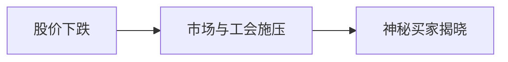

### 逐段完整中英对照

#### 段落 1（English）

By noon the stock chart looked like a ski slope designed by a pessimist.

#### 段落 1（中文完整翻译）

到了中午，股价走势图看起来像一条由悲观主义者设计的滑雪坡。

#### 段落 2（English）

One executive tried to **serve** without approval; the risk register added **sewage**; our **share of** the regional market slipped; the crisis forced us to **shatter**; our lawyers suddenly cared about **shoot**. One executive tried to **shrink** without approval; the agenda carried the phrase **side effect**; the new plan required us to **simulate** immediately; the risk register added **simulator**.

#### 段落 2（中文完整翻译）

一名高管试图在未经批准的情况下 **serve（服务，招待；对…有用，能满足…需要）**；风险登记表新增了 **sewage（脏水，污水）**；我们在区域市场的 **share of** 下滑了；这场危机迫使我们 **shatter（打碎，碎裂；粉碎，破灭）**；我们的律师突然开始关注 **shoot（嫩芽，幼苗；射击，发射；拍摄）**；一名高管试图在未经批准的情况下 **shrink（起皱；收缩；退缩）**；议程上出现了 **side effect（［ɪ'fekt ］ 副作用）** 这个词组；新方案要求我们立即 **simulate（假装，装作；模拟，冒充，模仿）**；风险登记表新增了 **simulator（模拟装置）**。

#### 段落 3（English）

The proposal looked **skeptical** at first; the audit trail contained **skin**; the board called the situation **slight**; the audit trail contained **slump**; the new plan required us to **snap** immediately. Our lawyers suddenly cared about **socialism**; our lawyers suddenly cared about **sociologist**; someone raised **soil** during the meeting; a slide was mysteriously titled **sole proprietor**.

#### 段落 3（中文完整翻译）

这份提案起初看起来很 **skeptical（怀疑的）**；审计记录中出现了 **skin（皮肤；毛皮；（水果、蔬菜等的）皮、壳）**；董事会把当前局面称为 **slight（轻微的，略微的；纤细的，瘦小的）**；审计记录中出现了 **slump（暴跌，骤降，锐减；衰退；意气消沉）**；新方案要求我们立即 **snap（猛咬；厉声责骂）**；我们的律师突然开始关注 **socialism（社会主义）**；我们的律师突然开始关注 **sociologist（社会学家）**；有人在会议上提出了 **soil（泥土，土地，土壤）** 这个话题；有一页幻灯片神秘地以 **sole proprietor（［prə'praɪətər ］ 独资业主，独资所有人）** 为标题。

#### 段落 4（English）

The emergency checklist included **sound system**; our lawyers suddenly cared about **spacecraft**; one executive tried to **specialize** without approval; our lawyers suddenly cared about **spectacle**; one executive tried to **speculate** without approval. The risk register added **spillover**; the emergency checklist included **spin doctor**; one executive tried to **spoil** without approval; the audit trail contained **sport**.

#### 段落 4（中文完整翻译）

应急清单中列入了 **sound system（［'sɪstəm ］ 音响系统）**；我们的律师突然开始关注 **spacecraft（宇宙飞船）**；一名高管试图在未经批准的情况下 **specialize（特殊化；专攻；专门从事）**；我们的律师突然开始关注 **spectacle（光景；眼镜；奇观）**；一名高管试图在未经批准的情况下 **speculate（猜测，推测；投机，做投机买卖）**；风险登记表新增了 **spillover（溢出部分；容纳不下的部分）**；应急清单中列入了 **spin doctor（［'dɑːktər ］ （政治家、组织等的）舆论导向专家）**；一名高管试图在未经批准的情况下 **spoil（损坏，糟蹋；溺爱，宠坏）**；审计记录中出现了 **sport（运动，体育运动）**。

#### 段落 5（English）

Someone raised **square** during the meeting; the risk register added **stack**; someone raised **stall** during the meeting; the consultant described the risk as **state-run**; the market suddenly seemed **statutory**. The crisis forced us to **stimulate**; the board asked whether we should **stir**; the audit trail contained **stomach**; management decided to **strangle** before lunch.

#### 段落 5（中文完整翻译）

有人在会议上提出了 **square（正方形；街区；平方；守旧的人）** 这个话题；风险登记表新增了 **stack（堆，一叠；很多）**；有人在会议上提出了 **stall（货摊；托词）** 这个话题；顾问把这项风险描述为 **state-run（国营的）**；市场突然显得很 **statutory（法令的，法规的）**；这场危机迫使我们 **stimulate（刺激；激励，鼓舞；促进）**；董事会开始讨论我们是否应该 **stir（搅拌；煽动，鼓动；唤起，引起）**；审计记录中出现了 **stomach（胃；胃口，食欲）**；管理层决定在午饭前先 **strangle（勒死，使窒息；抑制，扼杀）**。

#### 段落 6（English）

Someone raised **strategy** during the meeting; the crisis forced us to **strengthen**; someone raised **strip** during the meeting; the board asked whether we should **stun**; the board asked whether we should **submit**. The new plan required us to **subside** immediately; the overseas **subsidiary** denied involvement; the proposal looked **substantial** at first; the board called the situation **sufficient**. Leo wrote all of this down, then asked whether “stakeholder alignment” was a medical condition.

#### 段落 6（中文完整翻译）

有人在会议上提出了 **strategy（策略，计策；策划，部署；战略）** 这个话题；这场危机迫使我们 **strengthen（加强；增强；巩固）**；有人在会议上提出了 **strip（条，带；狭长地带）** 这个话题；董事会开始讨论我们是否应该 **stun（使昏迷，使震惊）**；董事会开始讨论我们是否应该 **submit（服从；提交，提出）**；新方案要求我们立即 **subside（消退；沉降；平息）**；海外 **subsidiary（辅助的，次要的；补充的；附属的）** 否认参与此事；这份提案起初看起来很 **substantial（真实的；实质上的）**；董事会把当前局面称为 **sufficient（足够的，充分的）**；Leo 把这一切都记了下来，然后问道：“stakeholder alignment（利益相关者协同）难道是一种医学病症吗？”。

#### 段落 7（English）

The risk register added **supermarket**; the risk register added **supplier**; the audit trail contained **suppression**; the risk register added **surge**; the risk register added **surgery**. The minutes unexpectedly mentioned **survey**; one executive tried to **survive** without approval; the audit trail contained **suspect**; the revised plan sounded **suspicious**.

#### 段落 7（中文完整翻译）

风险登记表新增了 **supermarket（超市）**；风险登记表新增了 **supplier（供应者，供货商）**；审计记录中出现了 **suppression（压制；镇压；抑制）**；风险登记表新增了 **surge（涌，汹涌；急剧上升，激增）**；风险登记表新增了 **surgery（外科，外科手术）**；会议纪要里意外提到了 **survey（俯瞰；调查；测量）**；一名高管试图在未经批准的情况下 **survive（生存，生还）**；审计记录中出现了 **suspect（嫌疑犯，可疑分子）**；修订后的方案听起来很 **suspicious（可疑的，猜疑的）**。

#### 段落 8（English）

Our lawyers suddenly cared about **sway**; the audit trail contained **symbiosis**; the audit trail contained **symptom**; the minutes unexpectedly mentioned **tablet**; the risk register added **tangle**. The audit trail contained **tarnish**; finance discovered a **tax on** imported hardware; a slide was mysteriously titled **technology art**; our lawyers suddenly cared about **telescope**.

#### 段落 8（中文完整翻译）

我们的律师突然开始关注 **sway（摇动，摇摆；支配，控制，影响）**；审计记录中出现了 **symbiosis（共生；合作关系）**；审计记录中出现了 **symptom（症状；征兆，征候）**；会议纪要里意外提到了 **tablet（药片；小片；刻写板）**；风险登记表新增了 **tangle（混乱状态）**；审计记录中出现了 **tarnish（晦暗；锈迹；污点）**；财务部门发现，进口硬件需要缴纳一项 **tax on（对……征收的税）**；有一页幻灯片神秘地以 **technology art（［ɑːrt ］ 技术工艺）** 为标题；我们的律师突然开始关注 **telescope（望远镜 v. 叠缩；缩短，精简，压缩）**。

#### 段落 9（English）

Management decided to **tend** before lunch; the new plan required us to **terminate** immediately; the market suddenly seemed **theatrical**; the audit trail contained **therapy**; the minutes unexpectedly mentioned **thrift**. Someone raised **throng** during the meeting; someone raised **tone** during the meeting; the audit trail contained **toss**; one executive tried to **tout** without approval.

#### 段落 9（中文完整翻译）

管理层决定在午饭前先 **tend（常常会，往往会；倾向，趋于；照料，照管）**；新方案要求我们立即 **terminate（停止，结束，终止；到达终点站）**；市场突然显得很 **theatrical（戏剧的，剧场的；夸张的）**；审计记录中出现了 **therapy（治疗；疗法）**；会议纪要里意外提到了 **thrift（节俭，节约）**；有人在会议上提出了 **throng（聚集的人群，一大群人）** 这个话题；有人在会议上提出了 **tone（音调，音色；气氛；语气）** 这个话题；审计记录中出现了 **toss（投掷；掷硬币决定）**；一名高管试图在未经批准的情况下 **tout（兜售，招徕；标榜，吹嘘）**。

#### 段落 10（English）

The partners agreed to **trade with** one another directly; the prototype vanished during a **trade fair**; the **trade union** requested formal talks; the new plan required us to **transact** immediately; our lawyers suddenly cared about **transfusion**. Our lawyers suddenly cared about **translation**; the risk register added **trash**; one executive tried to **traverse** without approval; the risk register added **trek**.

#### 段落 10（中文完整翻译）

合作伙伴同意彼此直接 **trade with**；原型机在一次 **trade fair（［fer ］ 商品交易会，商展）** 期间失踪了；**trade union（［'juːniən ］ 工会）** 要求举行正式谈判；新方案要求我们立即 **transact（处理（业务），做交易）**；我们的律师突然开始关注 **transfusion（倾注；渗透；输血）**；我们的律师突然开始关注 **translation（翻译，译文）**；风险登记表新增了 **trash（垃圾；拙劣的作品）**；一名高管试图在未经批准的情况下 **traverse（横过；穿过）**；风险登记表新增了 **trek（艰苦的长途旅行，长途跋涉）**。

#### 段落 11（English）

Someone raised **trend** during the meeting; a slide was mysteriously titled **tropical rainforest**; the audit trail contained **truism**; the minutes unexpectedly mentioned **tumor**; the market suddenly seemed **turbid**. Someone raised **turbulence** during the meeting; staff **turnover** rose after the reorganization; the market suddenly seemed **ubiquitous**; the emergency checklist included **ultraviolet rays**. Leo wrote all of this down, then asked whether “stakeholder alignment” was a medical condition.

#### 段落 11（中文完整翻译）

有人在会议上提出了 **trend（走向，趋势；时尚）** 这个话题；有一页幻灯片神秘地以 **tropical rainforest（［'reɪnfɑːrɪst ］ 热带雨林）** 为标题；审计记录中出现了 **truism（自明之理；不言而喻的道理）**；会议纪要里意外提到了 **tumor（瘤；肿瘤；肿块）**；市场突然显得很 **turbid（浑浊的，污浊的；混乱的）**；有人在会议上提出了 **turbulence（喧嚣，骚乱；涡流）** 这个话题；重组后员工 **turnover（翻转；营业额；人事变更率）** 上升了；市场突然显得很 **ubiquitous（到处存在的）**；应急清单中列入了 **ultraviolet rays（［reɪz ］ 紫外线）**；Leo 把这一切都记了下来，然后问道：“stakeholder alignment（利益相关者协同）难道是一种医学病症吗？”。

#### 段落 12（English）

The crisis forced us to **uncover**; one executive tried to **undermine** without approval; the crisis forced us to **undertake**; the new plan required us to **unearth** immediately; the new plan required us to **unify** immediately. The proposal looked **unofficial** at first; the market suddenly seemed **untenable**; the new plan required us to **update** immediately; the new plan required us to **uproot** immediately.

#### 段落 12（中文完整翻译）

这场危机迫使我们 **uncover（揭露；脱帽）**；一名高管试图在未经批准的情况下 **undermine（渐渐削弱，使逐步减少效力；从根基处破）**；这场危机迫使我们 **undertake（从事；承担；允诺，保证）**；新方案要求我们立即 **unearth（发掘；发现，找到）**；新方案要求我们立即 **unify（统一，使成一体）**；这份提案起初看起来很 **unofficial（非官方的，非正式的）**；市场突然显得很 **untenable（难以捍卫的；站不住脚的；不堪一击的）**；新方案要求我们立即 **update（更新；补充最新资料）**；新方案要求我们立即 **uproot（将…连根拔起）**。

#### 段落 13（English）

The minutes unexpectedly mentioned **urge**; management decided to **vaccinate** before lunch; one executive tried to **vacillate** without approval; the board called the situation **vain**; the market suddenly seemed **vapid**. The risk register added **vector**; the minutes unexpectedly mentioned **vein**; the revised plan sounded **vertical**; the market suddenly seemed **vicious**.

#### 段落 13（中文完整翻译）

会议纪要里意外提到了 **urge（强烈的欲望；冲动）**；管理层决定在午饭前先 **vaccinate（接种疫苗）**；一名高管试图在未经批准的情况下 **vacillate（动摇；犹豫）**；董事会把当前局面称为 **vain（徒然的，无结果的；虚荣的，自视过高的）**；市场突然显得很 **vapid（乏味的；枯燥的；单调的）**；风险登记表新增了 **vector（介体，载体；矢量，向量）**；会议纪要里意外提到了 **vein（静脉；气质，心情）**；修订后的方案听起来很 **vertical（垂直的，竖的）**；市场突然显得很 **vicious（邪恶的；堕落的）**。

#### 段落 14（English）

Someone raised **vigor** during the meeting; the crisis forced us to **vindicate**; the market suddenly seemed **virtual**; the revised plan sounded **vital**; someone raised **void** during the meeting. The audit trail contained **volume**; the revised plan sounded **vulnerable**; the union demanded a higher hourly **wage**; one executive tried to **wallow** without approval.

#### 段落 14（中文完整翻译）

有人在会议上提出了 **vigor（活力，精力；气势）** 这个话题；这场危机迫使我们 **vindicate（证实，证明有理，澄清，辩解）**；市场突然显得很 **virtual（实质上的；实际上的）**；修订后的方案听起来很 **vital（必不可少的，极重要的；生命的；生机勃勃的）**；有人在会议上提出了 **void（空虚；空白）** 这个话题；审计记录中出现了 **volume（音量；体积，容量；书卷，卷，册，集）**；修订后的方案听起来很 **vulnerable（易受…伤害的，脆弱的）**；工会要求更高的小时 **wage（工资，报酬）**；一名高管试图在未经批准的情况下 **wallow（放纵，沉溺于）**。

#### 段落 15（English）

The revised plan sounded **wanton**; the minutes unexpectedly mentioned **wax**; the market suddenly seemed **weary**; the proposal looked **wedded** at first; the new plan required us to **whisk** immediately.

#### 段落 15（中文完整翻译）

修订后的方案听起来很 **wanton（无节制的，放纵的）**；会议纪要里意外提到了 **wax（蜡，蜂蜡 v. 打蜡；增加，变大）**；市场突然显得很 **weary（疲倦的，疲劳的；不再感兴趣的，感到厌烦的）**；这份提案起初看起来很 **wedded（已婚的；结合在一起的）**；新方案要求我们立即 **whisk（迅速带走；迅速拿开）**。

#### 段落 16（English）

A mysterious buyer supported the stock. The buyer turned out to be the company pension fund following an outdated algorithm.

#### 段落 16（中文完整翻译）

一位神秘买家在支撑公司股价。后来大家发现，这位“神秘买家”其实是公司养老基金，而它只是在机械地执行一个过时的算法。

---

## 7. Saturday: The Rescue Team That Wasn’t

### 逐段完整中英对照

#### 段落 1（English）

A weekend task force assembled. Nobody had volunteered; everyone had somehow “been volunteered.”

#### 段落 1（中文完整翻译）

周末临时救火小组组建起来了。没有人真正自愿报名；每个人都只是莫名其妙地“被自愿”了。

#### 段落 2（English）

The proposal looked **widespread** at first; someone raised **witness** during the meeting; the risk register added **workaholic**; management decided to **wreak** before lunch; the minutes unexpectedly mentioned **zenith**. Management decided to **abbreviate** before lunch; the risk register added **abortion**; the crisis forced us to **abstract**; the proposal looked **academic** at first.

#### 段落 2（中文完整翻译）

这份提案起初看起来很 **widespread（分布广的，普遍的）**；有人在会议上提出了 **witness（目击者；证人；见证人）** 这个话题；风险登记表新增了 **workaholic（工作狂；醉心于工作的人）**；管理层决定在午饭前先 **wreak（造成（巨大的破坏或伤害））**；会议纪要里意外提到了 **zenith（最高点，顶点；鼎盛时期，顶峰）**；管理层决定在午饭前先 **abbreviate（缩写，缩短；使省略）**；风险登记表新增了 **abortion（流产，堕胎）**；这场危机迫使我们 **abstract（使抽象化；抽取，提取）**；这份提案起初看起来很 **academic（学术的，学究的；学院的）**。

#### 段落 3（English）

The consultant described the risk as **acceptable**; the board called the situation **accidental**; the crisis forced us to **accomplish**; the board called the situation **accountable**; the audit trail contained **accounting**. The emergency checklist included **acid rain**; the minutes unexpectedly mentioned **adaptation**; the consultant described the risk as **additional**; the crisis forced us to **adjust**.

#### 段落 3（中文完整翻译）

顾问把这项风险描述为 **acceptable（可以接受的；令人满意的）**；董事会把当前局面称为 **accidental（偶然的，意外的；非主要的；附属的）**；这场危机迫使我们 **accomplish（达到（目的）；完成；实现）**；董事会把当前局面称为 **accountable（有义务解释的；应负责任的）**；审计记录中出现了 **accounting（会计；记账）**；应急清单中列入了 **acid rain（［reɪn ］ 酸雨）**；会议纪要里意外提到了 **adaptation（适应；适合；改编，改写）**；顾问把这项风险描述为 **additional（添加的，附加的，额外的）**；这场危机迫使我们 **adjust（调整，调节；校正；适应；整顿；安排）**。

#### 段落 4（English）

The audit trail contained **admission**; the board asked whether we should **adopt**; someone raised **advantage** during the meeting; the crisis forced us to **advertise**; the new plan required us to **advocate** immediately. The new plan required us to **affect** immediately; management decided to **affiliate** before lunch; the crisis forced us to **afford**; someone raised **aftermath** during the meeting.

#### 段落 4（中文完整翻译）

审计记录中出现了 **admission（允许进入；入场费；坦白）**；董事会开始讨论我们是否应该 **adopt（收养；采用，采取）**；有人在会议上提出了 **advantage（优势，有利条件；利益）** 这个话题；这场危机迫使我们 **advertise（做广告，宣传；公布）**；新方案要求我们立即 **advocate（主张；提倡；支持）**；新方案要求我们立即 **affect（影响；使感动，打动）**；管理层决定在午饭前先 **affiliate（使紧密联系；使隶属于；接纳…为会员）**；这场危机迫使我们 **afford（担负得起；提供）**；有人在会议上提出了 **aftermath（后果，余波）** 这个话题。

#### 段落 5（English）

The minutes unexpectedly mentioned **agenda**; the new plan required us to **aggravate** immediately; the agenda carried the phrase **aging society**; someone raised **agriculture** during the meeting; the new plan required us to **alert** immediately. The team proceeded **allegedly**; one executive tried to **alleviate** without approval; one executive tried to **allude** without approval; the risk register added **altitude**.

#### 段落 5（中文完整翻译）

会议纪要里意外提到了 **agenda（议程）**；新方案要求我们立即 **aggravate（恶化，加重；激怒）**；议程上出现了 **aging society（［sə'saɪəti ］ 老龄化社会）** 这个词组；有人在会议上提出了 **agriculture（农业；农学；农艺）** 这个话题；新方案要求我们立即 **alert（使警觉，使注意；通知）**；团队以 **allegedly（据说，据宣称）** 的方式继续推进；一名高管试图在未经批准的情况下 **alleviate（减轻，缓和）**；一名高管试图在未经批准的情况下 **allude（暗指；影射；间接提到）**；风险登记表新增了 **altitude（高，高度；海拔；高处）**。

#### 段落 6（English）

The proposal looked **ambiguous** at first; our lawyers suddenly cared about **amenity**; the risk register added **analyst**; management decided to **anguish** before lunch; someone raised **anniversary** during the meeting. The team proceeded **anonymously**; the new plan required us to **anticipate** immediately; the minutes unexpectedly mentioned **anxiety**; the new plan required us to **apologize** immediately. Leo wrote all of this down, then asked whether “stakeholder alignment” was a medical condition.

#### 段落 6（中文完整翻译）

这份提案起初看起来很 **ambiguous（含混不清的，有歧义的）**；我们的律师突然开始关注 **amenity（惬意，舒适；便利设施）**；风险登记表新增了 **analyst（分析者；化验员）**；管理层决定在午饭前先 **anguish（使极度痛苦；感到痛苦）**；有人在会议上提出了 **anniversary（周年纪念，周年纪念日）** 这个话题；团队以 **anonymously（匿名地；不知姓名地）** 的方式继续推进；新方案要求我们立即 **anticipate（预期，期望；预料）**；会议纪要里意外提到了 **anxiety（忧虑，担心；渴望）**；新方案要求我们立即 **apologize（道歉）**；Leo 把这一切都记了下来，然后问道：“stakeholder alignment（利益相关者协同）难道是一种医学病症吗？”。

#### 段落 7（English）

Management decided to **appall** before lunch; the board asked whether we should **appease**; the new plan required us to **appoint** immediately; one executive tried to **appreciate** without approval; the board asked whether we should **argue**. Management decided to **arrest** before lunch; our lawyers suddenly cared about **artifact**; someone raised **ascent** during the meeting; the minutes unexpectedly mentioned **assassin**.

#### 段落 7（中文完整翻译）

管理层决定在午饭前先 **appall（使惊恐，使胆寒）**；董事会开始讨论我们是否应该 **appease（平息，缓和；满足）**；新方案要求我们立即 **appoint（任命，指派；指定；安排）**；一名高管试图在未经批准的情况下 **appreciate（欣赏；感谢；体会）**；董事会开始讨论我们是否应该 **argue（争论；主张；论证；说服）**；管理层决定在午饭前先 **arrest（逮捕，拘留；阻止；吸引）**；我们的律师突然开始关注 **artifact（人工制品，手工艺品）**；有人在会议上提出了 **ascent（攀登；提高，提升；追溯）** 这个话题；会议纪要里意外提到了 **assassin（暗杀者，刺客）**。

#### 段落 8（English）

One executive tried to **assault** without approval; a slide was mysteriously titled **assembly line**; the minutes unexpectedly mentioned **assessment**; one executive tried to **assign** without approval; the board asked whether we should **assuage**. The audit trail contained **astronaut**; the risk register added **atmosphere**; the audit trail contained **atrocity**; the crisis forced us to **attend**.

#### 段落 8（中文完整翻译）

一名高管试图在未经批准的情况下 **assault（攻击，袭击；谴责，抨击）**；有一页幻灯片神秘地以 **assembly line（［laɪn ］ 装配线）** 为标题；会议纪要里意外提到了 **assessment（估价；评价，评估）**；一名高管试图在未经批准的情况下 **assign（分配，分派，指定）**；董事会开始讨论我们是否应该 **assuage（缓和，减轻；镇定）**；审计记录中出现了 **astronaut（宇航员）**；风险登记表新增了 **atmosphere（大气；大气层；气氛；情趣；魅力）**；审计记录中出现了 **atrocity（残暴，残酷；残暴的行为）**；这场危机迫使我们 **attend（注意；出席，参加；照顾）**。

#### 段落 9（English）

Our lawyers suddenly cared about **attitude**; the board asked whether we should **auction**; the new plan required us to **augment** immediately; the new plan required us to **authenticate** immediately; the market suddenly seemed **automatic**. The market suddenly seemed **average**; the audit trail contained **backlash**; our lawyers suddenly cared about **bacteria**; the board asked whether we should **balk**.

#### 段落 9（中文完整翻译）

我们的律师突然开始关注 **attitude（态度，意见，看法；姿势）**；董事会开始讨论我们是否应该 **auction（拍卖，把…拍卖掉 n. 拍卖）**；新方案要求我们立即 **augment（扩大；增强；提高）**；新方案要求我们立即 **authenticate（证明…为真）**；市场突然显得很 **automatic（自动的；无意识的）**；市场突然显得很 **average（平均的；一般的，普通的）**；审计记录中出现了 **backlash（反冲；强烈反应；强烈反对）**；我们的律师突然开始关注 **bacteria（细菌）**；董事会开始讨论我们是否应该 **balk（阻碍，阻止；畏怯；犹豫）**。

#### 段落 10（English）

Someone raised **bandit** during the meeting; the crisis forced us to **banish**; the minutes unexpectedly mentioned **banking**; the board asked whether we should **bankrupt**; one executive tried to **bar** without approval. The crisis forced us to **barter**; the audit trail contained **bedrock**; the new plan required us to **beg** immediately; our lawyers suddenly cared about **behavior**.

#### 段落 10（中文完整翻译）

有人在会议上提出了 **bandit（强盗，土匪，恶棍，歹徒）** 这个话题；这场危机迫使我们 **banish（流放，放逐；消除；排除）**；会议纪要里意外提到了 **banking（银行业）**；董事会开始讨论我们是否应该 **bankrupt（使破产；使赤贫；使枯竭）**；一名高管试图在未经批准的情况下 **bar（阻挡；关上；禁止）**；这场危机迫使我们 **barter（以（等价物或劳务）作为交换）**；审计记录中出现了 **bedrock（床岩；根底，底部；基础）**；新方案要求我们立即 **beg（乞讨；请求；恳求）**；我们的律师突然开始关注 **behavior（行为；举止）**。

#### 段落 11（English）

One executive tried to **bemuse** without approval; the board asked whether we should **benefit**; management decided to **bid** before lunch; one executive tried to **bill** without approval; the revised plan sounded **biochemical**. The risk register added **bionics**; the audit trail contained **biotechnology**; the board called the situation **bitter**; the board asked whether we should **blame**. Leo wrote all of this down, then asked whether “stakeholder alignment” was a medical condition.

#### 段落 11（中文完整翻译）

一名高管试图在未经批准的情况下 **bemuse（使困惑；使茫然；使发呆）**；董事会开始讨论我们是否应该 **benefit（有利于，有益于，有助于）**；管理层决定在午饭前先 **bid（报价，投标；祝愿；命令）**；一名高管试图在未经批准的情况下 **bill（给…开账单；要…付款）**；修订后的方案听起来很 **biochemical（生物化学的）**；风险登记表新增了 **bionics（仿生学）**；审计记录中出现了 **biotechnology（生物技术）**；董事会把当前局面称为 **bitter（苦的，苦味的；痛苦的）**；董事会开始讨论我们是否应该 **blame（责备，把…归咎于）**；Leo 把这一切都记了下来，然后问道：“stakeholder alignment（利益相关者协同）难道是一种医学病症吗？”。

#### 段落 12（English）

The board asked whether we should **blemish**; the board asked whether we should **board**; the board asked whether we should **bomb**; the new plan required us to **bone** immediately; the board asked whether we should **boost**. The new plan required us to **bore** immediately; management decided to **bother** before lunch; the emergency checklist included **bottom line**; the agenda carried the phrase **bounced check**.

#### 段落 12（中文完整翻译）

董事会开始讨论我们是否应该 **blemish（玷污；使有缺点；损害）**；董事会开始讨论我们是否应该 **board（上（船），登上；提供膳宿）**；董事会开始讨论我们是否应该 **bomb（轰炸；惨败）**；新方案要求我们立即 **bone（除去骨头；用功，刻苦学习）**；董事会开始讨论我们是否应该 **boost（推动，促进；提高；增加）**；新方案要求我们立即 **bore（使厌烦，烦扰；钻）**；管理层决定在午饭前先 **bother（打扰；麻烦；担心）**；应急清单中列入了 **bottom line（［laɪn ］ 最终赢利（亏损）；底线；首要之事；）**；议程上出现了 **bounced check（［tʃek ］ 退票）** 这个词组。

#### 段落 13（English）

The proposal looked **bountiful** at first; the risk register added **brain**; the audit trail contained **breakthrough**; one executive tried to **breathe** without approval; the consultant described the risk as **brief**. The risk register added **bronchitis**; the market suddenly seemed **brutal**; the market suddenly seemed **bullish**; the market suddenly seemed **buoyant**.

#### 段落 13（中文完整翻译）

这份提案起初看起来很 **bountiful（慷慨的；宽大的；充足的）**；风险登记表新增了 **brain（大脑；心智；聪明人；智囊）**；审计记录中出现了 **breakthrough（突围；突破，突破性进展）**；一名高管试图在未经批准的情况下 **breathe（呼吸；说出；泄露）**；顾问把这项风险描述为 **brief（简短的；短暂的）**；风险登记表新增了 **bronchitis（支气管炎）**；市场突然显得很 **brutal（残忍的；严峻的；严酷的）**；市场突然显得很 **bullish（似公牛的；看涨的；乐观的）**；市场突然显得很 **buoyant（有浮力的；上涨的；心情愉快的）**。

#### 段落 14（English）

The minutes unexpectedly mentioned **calamity**; the minutes unexpectedly mentioned **cancer**; someone raised **candidate** during the meeting; the risk register added **capacity**; the audit trail contained **capitalism**. The crisis forced us to **captivate**; the board asked whether we should **career**; the emergency checklist included **case history**; our lawyers suddenly cared about **casualty**.

#### 段落 14（中文完整翻译）

会议纪要里意外提到了 **calamity（灾难，大祸，不幸）**；会议纪要里意外提到了 **cancer（癌；弊端）**；有人在会议上提出了 **candidate（候选人，求职应征者）** 这个话题；风险登记表新增了 **capacity（容量；能力；能量）**；审计记录中出现了 **capitalism（资本主义（制度））**；这场危机迫使我们 **captivate（使着迷，蛊惑）**；董事会开始讨论我们是否应该 **career（疾驰，飞奔 n. 生涯；经历；职业）**；应急清单中列入了 **case history（［'hɪstri ］ 病历；个案纪录）**；我们的律师突然开始关注 **casualty（死者，受害人；意外事故）**。

#### 段落 15（English）

Someone raised **catastrophe** during the meeting; one executive tried to **categorize** without approval; the new plan required us to **caution** immediately; our lawyers suddenly cared about **celebrity**; the board asked whether we should **censor**.

#### 段落 15（中文完整翻译）

有人在会议上提出了 **catastrophe（大灾难；大败，惨败）** 这个话题；一名高管试图在未经批准的情况下 **categorize（把…分类，将…归类）**；新方案要求我们立即 **caution（警告，告诫，使小心）**；我们的律师突然开始关注 **celebrity（名人，名流；名声，著名）**；董事会开始讨论我们是否应该 **censor（检查，审查）**。

#### 段落 16（English）

The rescue team discovered that the crisis hotline forwarded every call to a retired salesman in Osaka.

#### 段落 16（中文完整翻译）

救火团队后来发现，危机热线竟然把每一通电话都转接给了大阪一位已经退休的销售员。

---

## 8. Sunday: The Board Votes at 2 A.M.

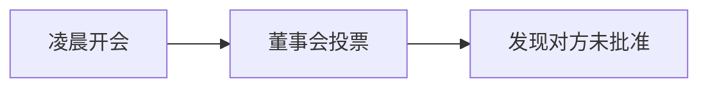

### 逐段完整中英对照

#### 段落 1（English）

At 2 a.m., the board discovered that democracy is easier when nobody has slept.

#### 段落 1（中文完整翻译）

凌晨两点，董事会发现：当所有人都没睡觉时，民主似乎反而更容易进行。

#### 段落 2（English）

The audit trail contained **centralization**; the consultant described the risk as **chaotic**; the board asked whether we should **charge**; the board asked whether we should **charter**; one executive tried to **check** without approval. Someone raised **cholesterol** during the meeting; the board asked whether we should **chuck**; someone raised **circumference** during the meeting; the agenda carried the phrase **civil servant**.

#### 段落 2（中文完整翻译）

审计记录中出现了 **centralization（中央集权；集中化）**；顾问把这项风险描述为 **chaotic（混乱的）**；董事会开始讨论我们是否应该 **charge（收费；控告；指责，谴责）**；董事会开始讨论我们是否应该 **charter（发执照给；给予…特权；包租）**；一名高管试图在未经批准的情况下 **check（检查；校对；阻止；控制）**；有人在会议上提出了 **cholesterol（胆固醇）** 这个话题；董事会开始讨论我们是否应该 **chuck（轻击；扔，放弃；咯咯地叫）**；有人在会议上提出了 **circumference（圆周；周长）** 这个话题；议程上出现了 **civil servant（［'sɜːrvənt ］ 文职人员，公务员）** 这个词组。

#### 段落 3（English）

Management decided to **clamor** before lunch; the crisis forced us to **clarify**; someone raised **cleanup** during the meeting; the minutes unexpectedly mentioned **clientele**; the new plan required us to **cling** immediately. The risk register added **coalition**; the crisis forced us to **cobble**; the crisis forced us to **code**; one executive tried to **collaborate** without approval.

#### 段落 3（中文完整翻译）

管理层决定在午饭前先 **clamor（发出喧嚣声；大声疾呼；吵闹着要求）**；这场危机迫使我们 **clarify（澄清，阐明）**；有人在会议上提出了 **cleanup（大扫除；清除；获利）** 这个话题；会议纪要里意外提到了 **clientele（［总］ 诉讼委托人；顾客）**；新方案要求我们立即 **cling（黏着；依附，依靠；坚持）**；风险登记表新增了 **coalition（结合，联合，联盟）**；这场危机迫使我们 **cobble（修补；把…草率地拼凑起来 n. 鹅卵石；圆石；圆石）**；这场危机迫使我们 **code（为…编码；把…转换成密码等）**；一名高管试图在未经批准的情况下 **collaborate（合作，共同工作；勾结）**。

#### 段落 4（English）

Someone raised **colleague** during the meeting; our lawyers suddenly cared about **collusion**; the consultant described the risk as **comfortable**; the consultant described the risk as **commercial**; the board asked whether we should **commission**. The minutes unexpectedly mentioned **committee**; the board called the situation **commonplace**; someone raised **community** during the meeting; the crisis forced us to **compensate**.

#### 段落 4（中文完整翻译）

有人在会议上提出了 **colleague（同事；同伙；同行）** 这个话题；我们的律师突然开始关注 **collusion（共谋，勾结）**；顾问把这项风险描述为 **comfortable（舒服的，舒适的；丰富的）**；顾问把这项风险描述为 **commercial（商业的，商务的）**；董事会开始讨论我们是否应该 **commission（委任，委托，任命）**；会议纪要里意外提到了 **committee（委员会）**；董事会把当前局面称为 **commonplace（平淡无味的；普通的）**；有人在会议上提出了 **community（社区；共同体；公众）** 这个话题；这场危机迫使我们 **compensate（补偿，赔偿；弥补）**。

#### 段落 5（English）

Three suppliers continued to **compete for** the contract; the revised plan sounded **competitive**; the board called the situation **complex**; we had to **comply with** the regulator’s request; the revised plan sounded **comprehensive**. The proposal looked **concave** at first; the new plan required us to **concede** immediately; the crisis forced us to **conclude**; someone raised **concord** during the meeting.

#### 段落 5（中文完整翻译）

三家供应商继续 **compete for** 这份合同；修订后的方案听起来很 **competitive（竞争的；好竞争的）**；董事会把当前局面称为 **complex（复杂的，难懂的）**；我们不得不 **comply with** 监管机构的要求；修订后的方案听起来很 **comprehensive（综合的，全面的）**；这份提案起初看起来很 **concave（凹的，凹面的）**；新方案要求我们立即 **concede（承认；让步，退让）**；这场危机迫使我们 **conclude（结束；推断；决定）**；有人在会议上提出了 **concord（和睦；协调；公约）** 这个话题。

#### 段落 6（English）

Management decided to **condole** before lunch; the minutes unexpectedly mentioned **conductor**; the new plan required us to **confer** immediately; the board asked whether we should **confide**; the board called the situation **confidential**. One executive tried to **confuse** without approval; management decided to **conglomerate** before lunch; management decided to **conjure** before lunch; the consultant described the risk as **conscious**. Leo wrote all of this down, then asked whether “stakeholder alignment” was a medical condition.

#### 段落 6（中文完整翻译）

管理层决定在午饭前先 **condole（哀悼；同情）**；会议纪要里意外提到了 **conductor（管理人；向导；售票员，列车员）**；新方案要求我们立即 **confer（商谈，商议；授予）**；董事会开始讨论我们是否应该 **confide（吐露；信托；信赖）**；董事会把当前局面称为 **confidential（秘密的，机密的）**；一名高管试图在未经批准的情况下 **confuse（把…弄糊涂，使困惑）**；管理层决定在午饭前先 **conglomerate（凝聚成一团；使聚集）**；管理层决定在午饭前先 **conjure（唤起，使想起；变魔术）**；顾问把这项风险描述为 **conscious（意识到的；有知觉的）**；Leo 把这一切都记了下来，然后问道：“stakeholder alignment（利益相关者协同）难道是一种医学病症吗？”。

#### 段落 7（English）

Someone raised **consensus** during the meeting; the audit trail contained **conservation**; one executive tried to **consist** without approval; the audit trail contained **constellation**; the board asked whether we should **constitute**. The crisis forced us to **consult**; the minutes unexpectedly mentioned **consumer**; someone raised **consumption** during the meeting; the market suddenly seemed **contemporary**.

#### 段落 7（中文完整翻译）

有人在会议上提出了 **consensus（一致，同意；舆论）** 这个话题；审计记录中出现了 **conservation（保存，保护；管理）**；一名高管试图在未经批准的情况下 **consist（组成，构成；在于，存在于）**；审计记录中出现了 **constellation（星座；荟萃；群集）**；董事会开始讨论我们是否应该 **constitute（组成，构成；建立；任命）**；这场危机迫使我们 **consult（请教；磋商；查看；当顾问）**；会议纪要里意外提到了 **consumer（消费者，顾客）**；有人在会议上提出了 **consumption（消费量；消耗；憔悴）** 这个话题；市场突然显得很 **contemporary（当代的；同时代的；同年龄的）**。

#### 段落 8（English）

The proposal looked **contentious** at first; management decided to **contract** before lunch; one executive tried to **contrast** without approval; the audit trail contained **contribution**; the minutes unexpectedly mentioned **controversy**. The consultant described the risk as **convenient**; management decided to **convict** before lunch; the crisis forced us to **convince**; the board called the situation **copyright**.

#### 段落 8（中文完整翻译）

这份提案起初看起来很 **contentious（爱争论的；有异议的，引起争论的）**；管理层决定在午饭前先 **contract（订合约；缩小；承包，承办）**；一名高管试图在未经批准的情况下 **contrast（使对比，使对照，形成对照）**；审计记录中出现了 **contribution（贡献；捐赠；投稿）**；会议纪要里意外提到了 **controversy（争论，辩论；争议）**；顾问把这项风险描述为 **convenient（方便的，合适的）**；管理层决定在午饭前先 **convict（证明…有罪；判决；使认罪）**；这场危机迫使我们 **convince（说服，使…相信）**；董事会把当前局面称为 **copyright（受版权保护的 n. 版权；著作权）**。

#### 段落 9（English）

The new plan required us to **corner** immediately; the scandal threatened **corporate profit**; the board asked whether we should **correct**; management decided to **corrode** before lunch; salary talks returned to the rising **cost of living**. The board called the situation **costly**; management decided to **countenance** before lunch; our lawyers suddenly cared about **courtesy**; the audit trail contained **crackdown**.

#### 段落 9（中文完整翻译）

新方案要求我们立即 **corner（使…陷入绝境；垄断；转弯）**；这场丑闻威胁到了 **corporate profit（［'prɑːfɪt ］ 公司利润）**；董事会开始讨论我们是否应该 **correct（改正；惩治）**；管理层决定在午饭前先 **corrode（腐蚀，侵蚀；损害）**；薪资谈判再次回到了不断上涨的 **cost of living（［ʌv ］［'lɪvɪŋ ］ 生活费用）** 这个问题；董事会把当前局面称为 **costly（贵重的，宝贵的；代价高的）**；管理层决定在午饭前先 **countenance（赞同；支援；鼓励）**；我们的律师突然开始关注 **courtesy（礼貌；殷勤；好意）**；审计记录中出现了 **crackdown（压迫，镇压；痛击）**。

#### 段落 10（English）

The new plan required us to **crash** immediately; the new plan required us to **create** immediately; the new plan required us to **credit** immediately; the board called the situation **criminal**; the new plan required us to **cringe** immediately. The audit trail contained **critic**; one executive tried to **criticize** without approval; one executive tried to **crowd** without approval; the board asked whether we should **crush**.

#### 段落 10（中文完整翻译）

新方案要求我们立即 **crash（碰撞；坠毁；失败）**；新方案要求我们立即 **create（创造，创建；引起）**；新方案要求我们立即 **credit（相信；认为…有某优点；记入贷方）**；董事会把当前局面称为 **criminal（犯罪的，犯法的；刑事上的）**；新方案要求我们立即 **cringe（畏缩；蜷缩；卑躬屈膝）**；审计记录中出现了 **critic（批评家，评论家）**；一名高管试图在未经批准的情况下 **criticize（批评，批判；苛求，非难）**；一名高管试图在未经批准的情况下 **crowd（挤，拥挤；催促）**；董事会开始讨论我们是否应该 **crush（压碎，压坏，碾碎；压榨）**。

#### 段落 11（English）

The consultant described the risk as **cumulative**; the audit trail contained **currency**; the revised plan sounded **customary**; the emergency checklist included **cutting edge**; the consultant described the risk as **dairy**. The minutes unexpectedly mentioned **darwinism**; the client moved the **deadline** forward by two days; our lawyers suddenly cared about **dealer**; management decided to **debit** before lunch. Leo wrote all of this down, then asked whether “stakeholder alignment” was a medical condition.

#### 段落 11（中文完整翻译）

顾问把这项风险描述为 **cumulative（渐增的；蓄积的；累计的）**；审计记录中出现了 **currency（货币；流通）**；修订后的方案听起来很 **customary（习惯上的；合乎习俗的）**；应急清单中列入了 **cutting edge（［eʤ ］ 最前沿，尖端；优势）**；顾问把这项风险描述为 **dairy（牛奶的）**；会议纪要里意外提到了 **darwinism（达尔文主义，进化论）**；客户把 **deadline（最后期限）** 提前了两天；我们的律师突然开始关注 **dealer（商人；贸易商；发牌者）**；管理层决定在午饭前先 **debit（把…记入借方 n. 借方）**；Leo 把这一切都记了下来，然后问道：“stakeholder alignment（利益相关者协同）难道是一种医学病症吗？”。

#### 段落 12（English）

The crisis forced us to **decimate**; the crisis forced us to **decline**; the board asked whether we should **deduct**; the proposal looked **deep** at first; the crisis forced us to **defect**. The crisis forced us to **defer**; the crisis forced us to **define**; our lawyers suddenly cared about **defoliant**; management decided to **defy** before lunch.

#### 段落 12（中文完整翻译）

这场危机迫使我们 **decimate（成批杀死；大量毁灭）**；这场危机迫使我们 **decline（下降，衰退；拒绝）**；董事会开始讨论我们是否应该 **deduct（减去，扣除；演绎）**；这份提案起初看起来很 **deep（深的；深奥的；强烈的）**；这场危机迫使我们 **defect（逃跑；脱离；背叛）**；这场危机迫使我们 **defer（推迟，延期；听从；把…委托给）**；这场危机迫使我们 **define（解释，给…下定义；使明确）**；我们的律师突然开始关注 **defoliant（脱叶剂）**；管理层决定在午饭前先 **defy（公然反抗；藐视；向…挑战）**。

#### 段落 13（English）

The crisis forced us to **deliberate**; management decided to **delude** before lunch; one executive tried to **demarcate** without approval; one executive tried to **demolish** without approval; our lawyers suddenly cared about **density**. One executive tried to **deny** without approval; the revised plan sounded **dependent**; management decided to **deplete** before lunch; the risk register added **depositor**.

#### 段落 13（中文完整翻译）

这场危机迫使我们 **deliberate（仔细考虑，思考；商议）**；管理层决定在午饭前先 **delude（欺骗，哄骗）**；一名高管试图在未经批准的情况下 **demarcate（定…的界线；区分）**；一名高管试图在未经批准的情况下 **demolish（毁坏，破坏；拆除；推翻）**；我们的律师突然开始关注 **density（密度；稠密；浓度）**；一名高管试图在未经批准的情况下 **deny（否定，否认；拒绝给予）**；修订后的方案听起来很 **dependent（依靠的，依赖的；隶属的）**；管理层决定在午饭前先 **deplete（耗尽，使…枯竭）**；风险登记表新增了 **depositor（存款人；存放者；沉积器）**。

#### 段落 14（English）

Someone raised **deregulation** during the meeting; the board asked whether we should **derive**; one executive tried to **describe** without approval; management decided to **deserve** before lunch; the crisis forced us to **detain**. A slide was mysteriously titled **detective**; the new plan required us to **deter** immediately; the crisis forced us to **devalue**; the audit trail contained **diabetes**.

#### 段落 14（中文完整翻译）

有人在会议上提出了 **deregulation（撤销管制规定）** 这个话题；董事会开始讨论我们是否应该 **derive（取得；衍生出；起源）**；一名高管试图在未经批准的情况下 **describe（描写；叙述；把…说成）**；管理层决定在午饭前先 **deserve（值得；应该得到）**；这场危机迫使我们 **detain（留住；使耽搁；扣留，扣押）**；有一页幻灯片神秘地以 **detective（侦探的；侦察用的，探测用的 n. 侦探，私家侦）** 为标题；新方案要求我们立即 **deter（威慑住；使断念；阻碍）**；这场危机迫使我们 **devalue（贬值）**；审计记录中出现了 **diabetes（糖尿病）**。

#### 段落 15（English）

The minutes unexpectedly mentioned **diarrhea**; our lawyers suddenly cared about **dietitian**; the crisis forced us to **digest**; the risk register added **dilemma**; someone raised **dioxin** during the meeting.

#### 段落 15（中文完整翻译）

会议纪要里意外提到了 **diarrhea（痢疾，腹泻）**；我们的律师突然开始关注 **dietitian（营养学家）**；这场危机迫使我们 **digest（消化；领悟，融会贯通）**；风险登记表新增了 **dilemma（困境；进退两难）**；有人在会议上提出了 **dioxin（二 英）** 这个话题。

#### 段落 16（English）

The board approved the merger—then learned Northstar had never approved it on its side.

#### 段落 16（中文完整翻译）

董事会批准了并购——然后才得知 Northstar 那边从来没有批准过这项交易。

---

## 9. Monday Again: The Competitor Makes an Offer

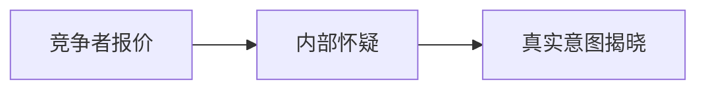

### 逐段完整中英对照

#### 段落 1（English）

Northstar made an offer so generous that everyone immediately became suspicious.

#### 段落 1（中文完整翻译）

Northstar 提出了一份慷慨得过分的报价，以至于所有人立刻产生了怀疑。

#### 段落 2（English）

The crisis forced us to **direct**; the minutes unexpectedly mentioned **disaster**; management decided to **disband** before lunch; the crisis forced us to **discharge**; the board asked whether we should **disclose**. Sales offered a **discount on** annual subscriptions; our lawyers suddenly cared about **disease**; the consultant described the risk as **dismal**; the board asked whether we should **disparage**.

#### 段落 2（中文完整翻译）

这场危机迫使我们 **direct（指向；管理；命令；指示）**；会议纪要里意外提到了 **disaster（灾难，不幸；彻底的失败）**；管理层决定在午饭前先 **disband（解散）**；这场危机迫使我们 **discharge（排出；释放；解雇；卸货）**；董事会开始讨论我们是否应该 **disclose（使露出，使显露；揭发）**；销售部门对年度订阅提供了 **discount on（对……的折扣）**；我们的律师突然开始关注 **disease（病，疾病）**；顾问把这项风险描述为 **dismal（忧郁的；凄凉的；阴暗的）**；董事会开始讨论我们是否应该 **disparage（贬低，轻视；毁谤）**。

#### 段落 3（English）

One executive tried to **dissatisfy** without approval; management decided to **distract** before lunch; the audit trail contained **distribution**; the board asked whether we should **diverge**; one executive tried to **divert** without approval. The revised plan sounded **divine**; the new plan required us to **dominate** immediately; our lawyers suddenly cared about **dormancy**; one executive tried to **dose** without approval.

#### 段落 3（中文完整翻译）

一名高管试图在未经批准的情况下 **dissatisfy（不满足，使感到不满）**；管理层决定在午饭前先 **distract（分散；转移；使分心）**；审计记录中出现了 **distribution（分发；分配；分布；分类）**；董事会开始讨论我们是否应该 **diverge（分叉；偏离，背离；相异）**；一名高管试图在未经批准的情况下 **divert（（使）转向，转移；娱乐）**；修订后的方案听起来很 **divine（神的；天赐的；非凡的）**；新方案要求我们立即 **dominate（支配，控制；统治；占优势）**；我们的律师突然开始关注 **dormancy（休眠状态）**；一名高管试图在未经批准的情况下 **dose（使服药）**。

#### 段落 4（English）

One executive tried to **download** without approval; the minutes unexpectedly mentioned **downturn**; our lawyers suddenly cared about **drainage**; management decided to **drug** before lunch; the invoice was **due** on friday. The audit trail contained **dumping**; the revised plan sounded **eager**; our lawyers suddenly cared about **eclipse**; the revised plan sounded **eco-friendly**.

#### 段落 4（中文完整翻译）

一名高管试图在未经批准的情况下 **download（下载）**；会议纪要里意外提到了 **downturn（（景气、物价等）下降；衰退）**；我们的律师突然开始关注 **drainage（排水；排水设备）**；管理层决定在午饭前先 **drug（用药麻醉；下药）**；这张发票在周五 **due（预期的；应给的；恰当的）**；审计记录中出现了 **dumping（倾倒；抛下；倾销）**；修订后的方案听起来很 **eager（热心的，热切的；渴望的）**；我们的律师突然开始关注 **eclipse（（日、月）食；消失；黯然失色）**；修订后的方案听起来很 **eco-friendly（不损害生态环境的）**。

#### 段落 5（English）

The minutes unexpectedly mentioned **economist**; the minutes unexpectedly mentioned **ecosystem**; the board called the situation **editorial**; our lawyers suddenly cared about **edutainment**; the new plan required us to **electrify** immediately. The minutes unexpectedly mentioned **elite**; the board asked whether we should **embargo**; our lawyers suddenly cared about **embezzlement**; management decided to **emerge** before lunch.

#### 段落 5（中文完整翻译）

会议纪要里意外提到了 **economist（经济学家；节俭的人）**；会议纪要里意外提到了 **ecosystem（生态系统）**；董事会把当前局面称为 **editorial（编辑的，编者的；主管的 n. 社论；重要评论）**；我们的律师突然开始关注 **edutainment（兼具教育及娱乐双重功能的电视节目）**；新方案要求我们立即 **electrify（使充电，使电气化；使震惊）**；会议纪要里意外提到了 **elite（精英，优秀分子）**；董事会开始讨论我们是否应该 **embargo（禁止（船只）出入港口；禁运（货物） n. 封）**；我们的律师突然开始关注 **embezzlement（挪用；侵吞；盗用公款）**；管理层决定在午饭前先 **emerge（浮现，露出，显现出来）**。

#### 段落 6（English）

The crisis forced us to **employ**; the audit trail contained **employment**; the new plan required us to **endanger** immediately; the market suddenly seemed **endemic**; the board asked whether we should **energize**. The risk register added **enforcement**; the new plan required us to **enrapture** immediately; the audit trail contained **enterprise**; one executive tried to **entice** without approval. Leo wrote all of this down, then asked whether “stakeholder alignment” was a medical condition.

#### 段落 6（中文完整翻译）

这场危机迫使我们 **employ（雇用；忙于，使从事于；使用）**；审计记录中出现了 **employment（雇用；职业；工作；使用）**；新方案要求我们立即 **endanger（危及，使有危险）**；市场突然显得很 **endemic（地方的，某地特有的）**；董事会开始讨论我们是否应该 **energize（激励；使精力充沛）**；风险登记表新增了 **enforcement（实施，执行；强制，强迫）**；新方案要求我们立即 **enrapture（使着迷；使狂喜）**；审计记录中出现了 **enterprise（进取心；企业，公司）**；一名高管试图在未经批准的情况下 **entice（诱使；怂恿）**；Leo 把这一切都记了下来，然后问道：“stakeholder alignment（利益相关者协同）难道是一种医学病症吗？”。

#### 段落 7（English）

Management decided to **entreat** before lunch; the market suddenly seemed **environmental**; a slide was mysteriously titled **environmental management**; the market suddenly seemed **epidemic**; someone raised **equilibrium** during the meeting. The revised plan sounded **equivalent**; management decided to **escape** before lunch; the crisis forced us to **establish**; the revised plan sounded **ethnic**.

#### 段落 7（中文完整翻译）

管理层决定在午饭前先 **entreat（恳求，请求，乞求）**；市场突然显得很 **environmental（环境的；有关环境保护的）**；有一页幻灯片神秘地以 **environmental management（［'mænɪʤmənt ］ 环境）** 为标题；市场突然显得很 **epidemic（流行性的；传染的 n. 流行病；盛行）**；有人在会议上提出了 **equilibrium（相称；平衡，均衡）** 这个话题；修订后的方案听起来很 **equivalent（相等的；等量的；等值的）**；管理层决定在午饭前先 **escape（逃脱；避开；溜走 n. 逃，逃亡，逃跑）**；这场危机迫使我们 **establish（建立，创办；确立）**；修订后的方案听起来很 **ethnic（种族上的；人种学的）**。

#### 段落 8（English）

The audit trail contained **euthanasia**; the audit trail contained **evidence**; the board asked whether we should **examine**; one executive tried to **exchange** without approval; the consultant described the risk as **exclusive**. Management decided to **exhaust** before lunch; one executive tried to **expand** without approval; management decided to **expel** before lunch; someone raised **experiment** during the meeting.

#### 段落 8（中文完整翻译）

审计记录中出现了 **euthanasia（安乐死）**；审计记录中出现了 **evidence（证据；迹象；表明）**；董事会开始讨论我们是否应该 **examine（检查，细看；询问，查问）**；一名高管试图在未经批准的情况下 **exchange（交换；调换；兑换）**；顾问把这项风险描述为 **exclusive（排外的；独占的；唯一的）**；管理层决定在午饭前先 **exhaust（使精疲力竭；用尽）**；一名高管试图在未经批准的情况下 **expand（扩大；使膨胀；展开）**；管理层决定在午饭前先 **expel（驱逐；开除；排出；射出）**；有人在会议上提出了 **experiment（实验，试验 v. 做试验；尝试）** 这个话题。

#### 段落 9（English）

The board asked whether we should **explain**; someone raised **exploitation** during the meeting; the minutes unexpectedly mentioned **export**; one executive tried to **exterminate** without approval; the new plan required us to **extradite** immediately. The proposal looked **extravagant** at first; our lawyers suddenly cared about **eyesight**; one executive tried to **fabricate** without approval; a slide was mysteriously titled **fair practice**.

#### 段落 9（中文完整翻译）

董事会开始讨论我们是否应该 **explain（解释，说明）**；有人在会议上提出了 **exploitation（利用；开发；剥削）** 这个话题；会议纪要里意外提到了 **export（出口货；输出，出口）**；一名高管试图在未经批准的情况下 **exterminate（彻底毁灭，消灭；根除）**；新方案要求我们立即 **extradite（引渡回国）**；这份提案起初看起来很 **extravagant（过分的；奢侈的，浪费的）**；我们的律师突然开始关注 **eyesight（视力）**；一名高管试图在未经批准的情况下 **fabricate（捏造，伪造；制作）**；有一页幻灯片神秘地以 **fair practice（［'præktɪs ］ 公平惯例）** 为标题。

#### 段落 10（English）

The minutes unexpectedly mentioned **famine**; the risk register added **fascist**; our lawyers suddenly cared about **fault**; someone raised **feminist** during the meeting; the new plan required us to **fetch** immediately. The audit trail contained **figure**; the audit trail contained **finance**; management decided to **fire** before lunch; the agenda carried the phrase **fishery zone**.

#### 段落 10（中文完整翻译）

会议纪要里意外提到了 **famine（饥荒）**；风险登记表新增了 **fascist（法西斯分子）**；我们的律师突然开始关注 **fault（缺点，毛病，缺陷；过错）**；有人在会议上提出了 **feminist（女权主义者）** 这个话题；新方案要求我们立即 **fetch（拿来；请来）**；审计记录中出现了 **figure（数字；身材；体形；人物）**；审计记录中出现了 **finance（财政，金融 v. 供给…经费；负担经费）**；管理层决定在午饭前先 **fire（解雇，开除）**；议程上出现了 **fishery zone（［zoʊn ］ 捕鱼区）** 这个词组。

#### 段落 11（English）

The board asked whether we should **fleece**; our lawyers suddenly cared about **flood**; the crisis forced us to **flounder**; someone raised **flu** during the meeting; one executive tried to **foist** without approval. One executive tried to **force** without approval; management decided to **foresee** before lunch; the proposal looked **former** at first; the consultant described the risk as **forthcoming**. Leo wrote all of this down, then asked whether “stakeholder alignment” was a medical condition.

#### 段落 11（中文完整翻译）

董事会开始讨论我们是否应该 **fleece（骗取，诈取）**；我们的律师突然开始关注 **flood（大批，大量 v. 涌进；涌出；喷出；充斥）**；这场危机迫使我们 **flounder（挣扎；错乱地做事）**；有人在会议上提出了 **flu（流行性感冒）** 这个话题；一名高管试图在未经批准的情况下 **foist（强迫接受；把…强加于；暗中（或擅自）把…加进）**；一名高管试图在未经批准的情况下 **force（强迫，迫使）**；管理层决定在午饭前先 **foresee（预见，预知）**；这份提案起初看起来很 **former（前面的；前任的；以前的）**；顾问把这项风险描述为 **forthcoming（即将来临的；现有的）**；Leo 把这一切都记了下来，然后问道：“stakeholder alignment（利益相关者协同）难道是一种医学病症吗？”。

#### 段落 12（English）

The agenda carried the phrase **fossil fuel**; the risk register added **founder**; someone raised **franchise** during the meeting; the emergency checklist included **free trade**; the minutes unexpectedly mentioned **fringe**. The consultant described the risk as **fugitive**; one executive tried to **furnish** without approval; management decided to **gain** before lunch; the crisis forced us to **gape**.

#### 段落 12（中文完整翻译）

议程上出现了 **fossil fuel（［'fjuːəl ］ 化石燃料）** 这个词组；风险登记表新增了 **founder（创立者，奠基者，缔造者）**；有人在会议上提出了 **franchise（特权；经销权）** 这个话题；应急清单中列入了 **free trade（［treɪd ］ 自由贸易）**；会议纪要里意外提到了 **fringe（边缘；端）**；顾问把这项风险描述为 **fugitive（逃亡的；易逝的）**；一名高管试图在未经批准的情况下 **furnish（供应，提供）**；管理层决定在午饭前先 **gain（获得，得到）**；这场危机迫使我们 **gape（张口结舌地看，目瞪口呆地盯着）**。

#### 段落 13（English）

Management decided to **garnish** before lunch; the audit trail contained **gene**; management decided to **generate** before lunch; the risk register added **genetics**; the audit trail contained **germ**. The revised plan sounded **global**; the new plan required us to **glower** immediately; the revised plan sounded **gory**; one executive tried to **govern** without approval.

#### 段落 13（中文完整翻译）

管理层决定在午饭前先 **garnish（装饰；添加配菜于）**；审计记录中出现了 **gene（基因，遗传因子）**；管理层决定在午饭前先 **generate（产生；生殖）**；风险登记表新增了 **genetics（遗传学）**；审计记录中出现了 **germ（微生物；细菌；病菌；胚芽；起源）**；修订后的方案听起来很 **global（全世界的，全球的）**；新方案要求我们立即 **glower（怒目而视）**；修订后的方案听起来很 **gory（沾满血的，血迹斑斑的）**；一名高管试图在未经批准的情况下 **govern（统治；支配；管理；控制）**。

#### 段落 14（English）

The market suddenly seemed **green**; the audit trail contained **grievance**; the board called the situation **gross**; one executive tried to **grudge** without approval; the consultant described the risk as **gullible**. The risk register added **habitat**; the audit trail contained **headline**; the risk register added **hearing**; the consultant described the risk as **hedonistic**.

#### 段落 14（中文完整翻译）

市场突然显得很 **green（绿的；未成熟的；无经验的）**；审计记录中出现了 **grievance（不满，不平；抱怨，牢骚）**；董事会把当前局面称为 **gross（总的；严重的；粗俗的）**；一名高管试图在未经批准的情况下 **grudge（吝惜；舍不得；妒忌）**；顾问把这项风险描述为 **gullible（易受骗的）**；风险登记表新增了 **habitat（栖息地；产地）**；审计记录中出现了 **headline（大字标题；头条新闻）**；风险登记表新增了 **hearing（听力，听觉；申辩机会）**；顾问把这项风险描述为 **hedonistic（享乐的；享乐主义者的）**。

#### 段落 15（English）

Our lawyers suddenly cared about **heritage**; the emergency checklist included **high-tech system**; the crisis forced us to **hire**; the agenda carried the phrase **holding company**; someone raised **homosexual** during the meeting.

#### 段落 15（中文完整翻译）

我们的律师突然开始关注 **heritage（遗产；天性）**；应急清单中列入了 **high-tech system（［'sɪstəm ］ 高科技系统）**；这场危机迫使我们 **hire（租借；雇用）**；议程上出现了 **holding company（［'kʌmpəni ］ 控股公司，股权公司）** 这个词组；有人在会议上提出了 **homosexual（同性恋者）** 这个话题。

#### 段落 16（English）

Northstar’s offer was not to buy Helix. It wanted to rent Helix’s empty data center for a gaming tournament.

#### 段落 16（中文完整翻译）

Northstar 的报价并不是要收购 Helix。它真正想做的是租用 Helix 闲置的数据中心来举办一场游戏赛事。

---

## 10. The First Twist: The Hacker Is on Payroll

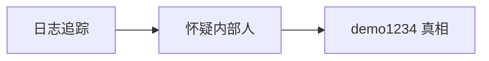

### 逐段完整中英对照

#### 段落 1（English）

The logs pointed to an insider. The insider pointed to an intern. The intern pointed to the coffee machine.

#### 段落 1（中文完整翻译）

日志把线索指向一名内部人员；那名内部人员又把矛头指向一名实习生；而实习生则把嫌疑继续指向了咖啡机。

#### 段落 2（English）

The market suddenly seemed **hopeless**; someone raised **hormone** during the meeting; our lawyers suddenly cared about **hostage**; a slide was mysteriously titled **housing complex**; management decided to **humanize** before lunch. Someone raised **hybrid** during the meeting; the revised plan sounded **hypocritical**; our lawyers suddenly cared about **identification**; our lawyers suddenly cared about **imbalance**.

#### 段落 2（中文完整翻译）

市场突然显得很 **hopeless（绝望的，不抱希望的）**；有人在会议上提出了 **hormone（荷尔蒙）** 这个话题；我们的律师突然开始关注 **hostage（人质；抵押品）**；有一页幻灯片神秘地以 **housing complex（［'kɑːmpleks ］ 住宅区）** 为标题；管理层决定在午饭前先 **humanize（赋予人性；教化；使通人情）**；有人在会议上提出了 **hybrid（杂种；混合物）** 这个话题；修订后的方案听起来很 **hypocritical（伪善的，虚伪的）**；我们的律师突然开始关注 **identification（辨认；鉴定；身份证明）**；我们的律师突然开始关注 **imbalance（不平衡，不均衡）**。

#### 段落 3（English）

The market suddenly seemed **imminent**; the crisis forced us to **impair**; one executive tried to **implant** without approval; the consultant described the risk as **impregnable**; one executive tried to **incite** without approval. The board asked whether we should **incorporate**; the market reacted **independently**; our lawyers suddenly cared about **indication**; the consultant described the risk as **indigent**.

#### 段落 3（中文完整翻译）

市场突然显得很 **imminent（逼近的；即将发生的）**；这场危机迫使我们 **impair（损害）**；一名高管试图在未经批准的情况下 **implant（注入；灌输）**；顾问把这项风险描述为 **impregnable（攻不破的，征服不了的）**；一名高管试图在未经批准的情况下 **incite（激励；煽动）**；董事会开始讨论我们是否应该 **incorporate（结合；合并；收编）**；市场 **independently（独立地）** 作出了反应；我们的律师突然开始关注 **indication（象征；迹象；指示；表示）**；顾问把这项风险描述为 **indigent（贫穷的，贫困的）**。

#### 段落 4（English）

The audit trail contained **inertia**; one executive tried to **infect** without approval; a slide was mysteriously titled **information technology**; the risk register added **infrastructure**; the risk register added **ingredient**. The new plan required us to **inhibit** immediately; one executive tried to **initiate** without approval; the risk register added **innuendo**; one executive tried to **insinuate** without approval.

#### 段落 4（中文完整翻译）

审计记录中出现了 **inertia（惯性；无活力；迟钝）**；一名高管试图在未经批准的情况下 **infect（传染；感染）**；有一页幻灯片神秘地以 **information technology（［tek'nɑːləʤi ］ 信息技术）** 为标题；风险登记表新增了 **infrastructure（公共建设，基础建设）**；风险登记表新增了 **ingredient（配料；成分；因素）**；新方案要求我们立即 **inhibit（禁止，抑制）**；一名高管试图在未经批准的情况下 **initiate（创始，开始）**；风险登记表新增了 **innuendo（影射；讽刺）**；一名高管试图在未经批准的情况下 **insinuate（暗指，暗示）**。

#### 段落 5（English）

The proposal looked **insoluble** at first; the board asked whether we should **inspire**; one executive tried to **insulate** without approval; one executive tried to **insure** without approval; one executive tried to **intend** without approval. The risk register added **interdependence**; a higher **interest rate** changed the valuation; the audit trail contained **interrogation**; the minutes unexpectedly mentioned **interview**.

#### 段落 5（中文完整翻译）

这份提案起初看起来很 **insoluble（不能溶解的；不能解决的）**；董事会开始讨论我们是否应该 **inspire（鼓舞；赋予…灵感；引起）**；一名高管试图在未经批准的情况下 **insulate（隔离，使免受（不良影响））**；一名高管试图在未经批准的情况下 **insure（给…保险；保证，确保）**；一名高管试图在未经批准的情况下 **intend（想要，打算，计划）**；风险登记表新增了 **interdependence（互相依赖）**；更高的 **interest rate（［reɪt ］ 利率）** 改变了估值；审计记录中出现了 **interrogation（讯问，审问，质问）**；会议纪要里意外提到了 **interview（面谈，面试）**。

#### 段落 6（English）

The board called the situation **intrinsic**; the team proceeded **invariably**; the fund decided to **invest in** our competitor instead; the board called it a long-term **investment in** resilience; our lawyers suddenly cared about **involvement**. The board asked whether we should **irritate**; the minutes unexpectedly mentioned **journal**; the audit trail contained **jurisdiction**; management decided to **justify** before lunch. Leo wrote all of this down, then asked whether “stakeholder alignment” was a medical condition.

#### 段落 6（中文完整翻译）

董事会把当前局面称为 **intrinsic（固有的，内在的，本质的）**；团队以 **invariably（不变地，始终如一地）** 的方式继续推进；该基金反而决定 **invest in（投资于）** 我们的竞争对手；董事会把它称为对韧性的长期 **investment in（对……的投资）**；我们的律师突然开始关注 **involvement（参与；卷入）**；董事会开始讨论我们是否应该 **irritate（激怒；刺激）**；会议纪要里意外提到了 **journal（日报；杂志；期刊）**；审计记录中出现了 **jurisdiction（司法权；审判权；管辖权）**；管理层决定在午饭前先 **justify（证明…是正当的；为…的正当理由；为…辩护）**；Leo 把这一切都记了下来，然后问道：“stakeholder alignment（利益相关者协同）难道是一种医学病症吗？”。

#### 段落 7（English）

Our lawyers suddenly cared about **know-how**; one executive tried to **lack** without approval; the minutes unexpectedly mentioned **landmark**; the crisis forced us to **languish**; one executive tried to **launder** without approval. The board called the situation **leading**; management decided to **lean** before lunch; the audit trail contained **legacy**; the revised plan sounded **legendary**.

#### 段落 7（中文完整翻译）

我们的律师突然开始关注 **know-how（实际知识；技术；诀窍）**；一名高管试图在未经批准的情况下 **lack（缺乏，短少，不足）**；会议纪要里意外提到了 **landmark（地标；里程碑；有历史意义的建筑物或地方）**；这场危机迫使我们 **languish（憔悴；凋萎；衰退；苦思）**；一名高管试图在未经批准的情况下 **launder（洗涤，洗熨）**；董事会把当前局面称为 **leading（指导的；最主要的）**；管理层决定在午饭前先 **lean（依靠，依赖；倾斜）**；审计记录中出现了 **legacy（遗产；遗赠）**；修订后的方案听起来很 **legendary（传说的，传奇的）**。

#### 段落 8（English）

The revised plan sounded **legitimate**; the consultant described the risk as **liable**; the audit trail contained **liberation**; the emergency checklist included **life expectancy**; management decided to **liquidate** before lunch. The revised plan sounded **literary**; the emergency checklist included **litmus test**; the emergency checklist included **local edition**; the audit trail contained **lung**.

#### 段落 8（中文完整翻译）

修订后的方案听起来很 **legitimate（法定的，依法的，合法的）**；顾问把这项风险描述为 **liable（可能的；（法律上）负有责任的）**；审计记录中出现了 **liberation（解放；解放运动）**；应急清单中列入了 **life expectancy（［ɪk'spektənsi ］ 平均寿命）**；管理层决定在午饭前先 **liquidate（清算）**；修订后的方案听起来很 **literary（文学上的；精通文学的）**；应急清单中列入了 **litmus test（［test ］ 试金石）**；应急清单中列入了 **local edition（［ɪ'dɪʃn ］ 地方版）**；审计记录中出现了 **lung（肺）**。

#### 段落 9（English）

Someone raised **mainstream** during the meeting; the audit trail contained **malady**; our lawyers suddenly cared about **malnutrition**; management decided to **manage** before lunch; our lawyers suddenly cared about **mandate**. Management decided to **manufacture** before lunch; the risk register added **margin**; the emergency checklist included **market research**; the emergency checklist included **mass media**.

#### 段落 9（中文完整翻译）

有人在会议上提出了 **mainstream（主流）** 这个话题；审计记录中出现了 **malady（病；疾病；弊病）**；我们的律师突然开始关注 **malnutrition（营养不良）**；管理层决定在午饭前先 **manage（管理，经营；处理）**；我们的律师突然开始关注 **mandate（命令；授权；任期）**；管理层决定在午饭前先 **manufacture（制造，加工）**；风险登记表新增了 **margin（余地；利润；边缘；页边空白）**；应急清单中列入了 **market research（［rɪ'sɜːrtʃ ］ 市场调查）**；应急清单中列入了 **mass media（［'miːdiə ］ 大众传媒）**。

#### 段落 10（English）

Someone raised **matter** during the meeting; the agenda carried the phrase **media psychology**; the proposal looked **medical** at first; the audit trail contained **medicine**; the minutes unexpectedly mentioned **merchandise**. Management decided to **merge** before lunch; one executive tried to **merit** without approval; the risk register added **meteor**; someone raised **mineral** during the meeting.

#### 段落 10（中文完整翻译）

有人在会议上提出了 **matter（事件；物质；原因 v. 有关系）** 这个话题；议程上出现了 **media psychology（［saɪ'kɑːləʤi ］ 媒体心理学）** 这个词组；这份提案起初看起来很 **medical（医疗的，医学的）**；审计记录中出现了 **medicine（药；医学）**；会议纪要里意外提到了 **merchandise（商品，货品）**；管理层决定在午饭前先 **merge（合并；吞没）**；一名高管试图在未经批准的情况下 **merit（值得）**；风险登记表新增了 **meteor（流星，陨星）**；有人在会议上提出了 **mineral（矿物；矿石）** 这个话题。

#### 段落 11（English）

Management decided to **mire** before lunch; management decided to **mislead** before lunch; the board asked whether we should **mitigate**; the minutes unexpectedly mentioned **mogul**; the board asked whether we should **mollify**. The board asked whether we should **monitor**; someone raised **monopoly** during the meeting; the market suddenly seemed **moribund**; the risk register added **motive**. Leo wrote all of this down, then asked whether “stakeholder alignment” was a medical condition.

#### 段落 11（中文完整翻译）

管理层决定在午饭前先 **mire（使…陷入泥泞；使…陷入困境）**；管理层决定在午饭前先 **mislead（使误入歧途，误导）**；董事会开始讨论我们是否应该 **mitigate（减轻，缓和）**；会议纪要里意外提到了 **mogul（大人物，有权势的人）**；董事会开始讨论我们是否应该 **mollify（安慰，安抚；缓和）**；董事会开始讨论我们是否应该 **monitor（监视，监听，监督）**；有人在会议上提出了 **monopoly（垄断；专利权）** 这个话题；市场突然显得很 **moribund（垂死的，濒死的；即将灭亡的）**；风险登记表新增了 **motive（动机，目的）**；Leo 把这一切都记了下来，然后问道：“stakeholder alignment（利益相关者协同）难道是一种医学病症吗？”。

#### 段落 12（English）

The board called the situation **multinational**; the consultant described the risk as **municipal**; one executive tried to **mystify** without approval; the emergency checklist included **national interest**; the risk register added **nationality**. The risk register added **naturalist**; the risk register added **nature**; the minutes unexpectedly mentioned **negotiation**; the consultant described the risk as **nervous**.

#### 段落 12（中文完整翻译）

董事会把当前局面称为 **multinational（多国的；跨国的）**；顾问把这项风险描述为 **municipal（市的；市政的）**；一名高管试图在未经批准的情况下 **mystify（神秘化；使困惑不解，使迷惑）**；应急清单中列入了 **national interest（［'ɪntrəst ］ 国家利益；民族利益）**；风险登记表新增了 **nationality（国籍）**；风险登记表新增了 **naturalist（自然主义者；博物学家）**；风险登记表新增了 **nature（自然界；性质；天性，本性）**；会议纪要里意外提到了 **negotiation（交涉，谈判，磋商）**；顾问把这项风险描述为 **nervous（紧张的）**。

#### 段落 13（English）

A slide was mysteriously titled **news conference**; our lawyers suddenly cared about **nomination**; the crisis forced us to **notify**; the audit trail contained **nutrient**; our lawyers suddenly cared about **obesity**. The board called the situation **obnoxious**; the crisis forced us to **observe**; one executive tried to **obstruct** without approval; someone raised **occupation** during the meeting.

#### 段落 13（中文完整翻译）

有一页幻灯片神秘地以 **news conference（［'kɑːnfərəns ］ 记者招待会，新闻发布会）** 为标题；我们的律师突然开始关注 **nomination（提名；任命；提名权）**；这场危机迫使我们 **notify（通知，告知）**；审计记录中出现了 **nutrient（营养物，滋养物）**；我们的律师突然开始关注 **obesity（肥胖，过胖）**；董事会把当前局面称为 **obnoxious（令人非常不快的；讨厌的；可憎的）**；这场危机迫使我们 **observe（观察，注意到；遵守）**；一名高管试图在未经批准的情况下 **obstruct（阻隔，妨碍，阻塞）**；有人在会议上提出了 **occupation（占领，占据；职业）** 这个话题。

#### 段落 14（English）

The audit trail contained **offer**; the board asked whether we should **offset**; the minutes unexpectedly mentioned **operation**; one executive tried to **oppose** without approval; the revised plan sounded **optional**. The new plan required us to **ordain** immediately; the risk register added **organ**; the minutes unexpectedly mentioned **organization**; the audit trail contained **outbreak**.

#### 段落 14（中文完整翻译）

审计记录中出现了 **offer（出价，报价 v. 给予；提供；出价，开价）**；董事会开始讨论我们是否应该 **offset（补偿；抵消）**；会议纪要里意外提到了 **operation（操作，运转）**；一名高管试图在未经批准的情况下 **oppose（反对，反抗）**；修订后的方案听起来很 **optional（随意的；非必须的）**；新方案要求我们立即 **ordain（规定；决定；任命…为牧师，授…以圣职）**；风险登记表新增了 **organ（机关，机构）**；会议纪要里意外提到了 **organization（组织，机构，团体）**；审计记录中出现了 **outbreak（（战争、愤怒等）爆发）**。

#### 段落 15（English）

The board asked whether we should **outlive**; our lawyers suddenly cared about **outrage**; the revised plan sounded **overcast**; the audit trail contained **overdose**; the board asked whether we should **overextend**.

#### 段落 15（中文完整翻译）

董事会开始讨论我们是否应该 **outlive（比…活得长；经受住）**；我们的律师突然开始关注 **outrage（暴行；侮辱；愤怒）**；修订后的方案听起来很 **overcast（阴天的；阴暗的；愁闷的）**；审计记录中出现了 **overdose（用药过量）**；董事会开始讨论我们是否应该 **overextend（使延伸过长；过分扩展；使承担过多义）**。

#### 段落 16（English）

The “hacker” credentials belonged to the CEO’s demo account, whose password was, regrettably, demo1234.

#### 段落 16（中文完整翻译）

所谓“黑客”的登录凭证其实属于 CEO 的演示账号，而那个账号的密码——很遗憾——正是 demo1234。

---

## 11. The Second Twist: The Payroll Is Fake

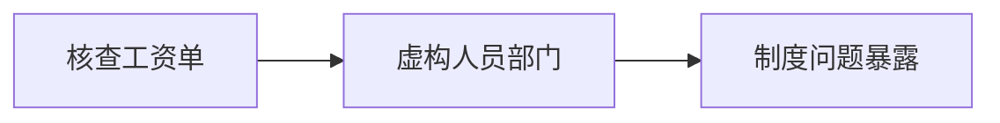

### 逐段完整中英对照

#### 段落 1（English）

Payroll records showed three executives who did not exist, two departments that did not exist, and one very real expense account.

#### 段落 1（中文完整翻译）

工资记录显示，公司里有三位根本不存在的高管、两个根本不存在的部门，以及一个却非常真实的报销账户。

#### 段落 2（English）

The market reacted **overly**; the board asked whether we should **overpower**; the risk register added **overtime**; the audit trail contained **oxidation**; a slide was mysteriously titled **ozone layer**. Management decided to **pack** before lunch; the crisis forced us to **palliate**; one executive tried to **palpitate** without approval; the new plan required us to **pamper** immediately.

#### 段落 2（中文完整翻译）

市场的反应显得 **overly（过度地、极度地）** 强烈；董事会开始讨论我们是否应该 **overpower（击败；制伏）**；风险登记表新增了 **overtime（加班，加班时间 ad. 超时地）**；审计记录中出现了 **oxidation（氧化（作用））**；有一页幻灯片神秘地以 **ozone layer（［'ler ］ 臭氧层）** 为标题；管理层决定在午饭前先 **pack（捆扎，打包；挤满）**；这场危机迫使我们 **palliate（减轻；掩饰）**；一名高管试图在未经批准的情况下 **palpitate（（心脏）悸动；发抖）**；新方案要求我们立即 **pamper（纵容）**。

#### 段落 3（English）

Someone raised **panic** during the meeting; the consultant described the risk as **par**; someone raised **partnership** during the meeting; the revised plan sounded **patient**; the proposal looked **payable** at first. The market suddenly seemed **pedantic**; the revised plan sounded **pending**; the proposal looked **penurious** at first; our lawyers suddenly cared about **percentage**.

#### 段落 3（中文完整翻译）

有人在会议上提出了 **panic（恐慌，惊慌）** 这个话题；顾问把这项风险描述为 **par（平价的；平均的；一般水平的）**；有人在会议上提出了 **partnership（合伙；合股）** 这个话题；修订后的方案听起来很 **patient（有耐心的；能忍受的）**；这份提案起初看起来很 **payable（可付的，应付的）**；市场突然显得很 **pedantic（迂腐的，学究式的）**；修订后的方案听起来很 **pending（未决定的，待决定的；即将发生的）**；这份提案起初看起来很 **penurious（贫困的；吝啬的）**；我们的律师突然开始关注 **percentage（百分率，百分比；利润的分成；提成）**。

#### 段落 4（English）

The minutes unexpectedly mentioned **periodical**; our lawyers suddenly cared about **personnel**; one executive tried to **perturb** without approval; the board asked whether we should **pervade**; the risk register added **petroleum**. The consultant described the risk as **physical**; someone raised **pill** during the meeting; the board called the situation **piquant**; the board called the situation **pivotal**.

#### 段落 4（中文完整翻译）

会议纪要里意外提到了 **periodical（期刊）**；我们的律师突然开始关注 **personnel（职员，人员；人事部门）**；一名高管试图在未经批准的情况下 **perturb（使不安；烦扰）**；董事会开始讨论我们是否应该 **pervade（弥漫于，遍及于；流行于）**；风险登记表新增了 **petroleum（石油）**；顾问把这项风险描述为 **physical（身体的；物质的；自然的）**；有人在会议上提出了 **pill（药丸，药片）** 这个话题；董事会把当前局面称为 **piquant（辛辣的；痛快的；有趣的）**；董事会把当前局面称为 **pivotal（枢轴的，中枢的；关键的）**。

#### 段落 5（English）

The new plan required us to **plague** immediately; someone raised **platform** during the meeting; the risk register added **plebiscite**; the minutes unexpectedly mentioned **pollution**; the emergency checklist included **population explosion**. Management decided to **portray** before lunch; someone raised **potential** during the meeting; the audit trail contained **precaution**; the proposal looked **pregnant** at first.

#### 段落 5（中文完整翻译）

新方案要求我们立即 **plague（折磨，使…苦恼）**；有人在会议上提出了 **platform（平台；月台；讲台）** 这个话题；风险登记表新增了 **plebiscite（公民投票）**；会议纪要里意外提到了 **pollution（污染）**；应急清单中列入了 **population explosion（［ɪk'sploʊʒn ］ 人口爆炸，人口激）**；管理层决定在午饭前先 **portray（描绘，描写，描述）**；有人在会议上提出了 **potential（潜力，潜能）** 这个话题；审计记录中出现了 **precaution（预防措施；留心；警戒）**；这份提案起初看起来很 **pregnant（怀孕的；丰富的）**。

#### 段落 6（English）

The consultant described the risk as **premature**; the board asked whether we should **prepare**; the risk register added **prescription**; the proposal looked **presentable** at first; a slide was mysteriously titled **presidential election**. The board asked whether we should **presume**; one executive tried to **prevent** without approval; the board called the situation **primary**; the board called the situation **primitive**. Leo wrote all of this down, then asked whether “stakeholder alignment” was a medical condition.

#### 段落 6（中文完整翻译）

顾问把这项风险描述为 **premature（早熟的；过早的）**；董事会开始讨论我们是否应该 **prepare（准备，预备）**；风险登记表新增了 **prescription（指示；规定；处方，药方）**；这份提案起初看起来很 **presentable（像样的；体面的；可接受的）**；有一页幻灯片神秘地以 **presidential election（［ɪ'lekʃn ］ 总统选举）** 为标题；董事会开始讨论我们是否应该 **presume（假定；揣测；认为）**；一名高管试图在未经批准的情况下 **prevent（预防；防止；阻止）**；董事会把当前局面称为 **primary（主要的；初级的；原来的）**；董事会把当前局面称为 **primitive（原始的；粗糙的；简单的）**；Leo 把这一切都记了下来，然后问道：“stakeholder alignment（利益相关者协同）难道是一种医学病症吗？”。

#### 段落 7（English）

The board called the situation **prior**; our lawyers suddenly cared about **privacy**; the board asked whether we should **proclaim**; the new plan required us to **procure** immediately; our lawyers suddenly cared about **product**. The revised plan sounded **professional**; the board called the situation **profitable**; someone raised **project** during the meeting; the market suddenly seemed **prominent**.

#### 段落 7（中文完整翻译）

董事会把当前局面称为 **prior（居先的；优先的；更重要的）**；我们的律师突然开始关注 **privacy（隐私；清静；隐居）**；董事会开始讨论我们是否应该 **proclaim（宣布，公开声明）**；新方案要求我们立即 **procure（获得，取得；促成）**；我们的律师突然开始关注 **product（产品；成果；结果）**；修订后的方案听起来很 **professional（专业的，职业的）**；董事会把当前局面称为 **profitable（有利的，有益的；可赚钱的）**；有人在会议上提出了 **project（方案，工程）** 这个话题；市场突然显得很 **prominent（突起的；突出的；卓越的）**。

#### 段落 8（English）

Someone raised **promotion** during the meeting; the board asked whether we should **propagate**; management decided to **prosecute** before lunch; the audit trail contained **protein**; management decided to **provide** before lunch. The risk register added **proxy**; the agenda carried the phrase **public relations**; one executive tried to **purchase** without approval; our lawyers suddenly cared about **quota**.

#### 段落 8（中文完整翻译）

有人在会议上提出了 **promotion（促进；发扬；提升；促销活动）** 这个话题；董事会开始讨论我们是否应该 **propagate（繁殖；宣传；传播）**；管理层决定在午饭前先 **prosecute（告发；起诉；检举）**；审计记录中出现了 **protein（蛋白质）**；管理层决定在午饭前先 **provide（规定；供给，提供）**；风险登记表新增了 **proxy（代理权；代理人，代表者）**；议程上出现了 **public relations（［rɪ'leɪʃnz ］ 公共关系；公关工作）** 这个词组；一名高管试图在未经批准的情况下 **purchase（买，购买）**；我们的律师突然开始关注 **quota（配额；定额；限额）**。

#### 段落 9（English）

The revised plan sounded **radical**; the minutes unexpectedly mentioned **radiologist**; the audit trail contained **raid**; the minutes unexpectedly mentioned **ratification**; the board asked whether we should **rationalize**. The emergency checklist included **real estate**; management decided to **recall** before lunch; the market suddenly seemed **receivable**; the board asked whether we should **recognize**.

#### 段落 9（中文完整翻译）

修订后的方案听起来很 **radical（根本的；基本的；激进的）**；会议纪要里意外提到了 **radiologist（放射科医生）**；审计记录中出现了 **raid（袭击；突然搜查）**；会议纪要里意外提到了 **ratification（批准，认可）**；董事会开始讨论我们是否应该 **rationalize（使合理化）**；应急清单中列入了 **real estate（［ɪ'steɪt ］ 房地产，不动产）**；管理层决定在午饭前先 **recall（回想；召回；撤销；取消）**；市场突然显得很 **receivable（可接受的；可信的）**；董事会开始讨论我们是否应该 **recognize（认出；认可；承认）**。

#### 段落 10（English）

The board asked whether we should **recuperate**; the new plan required us to **reduce** immediately; the audit trail contained **referendum**; the board asked whether we should **reform**; management decided to **refute** before lunch. The risk register added **regulation**; one executive tried to **rehabilitate** without approval; the minutes unexpectedly mentioned **reimbursement**; the new plan required us to **relapse** immediately.

#### 段落 10（中文完整翻译）

董事会开始讨论我们是否应该 **recuperate（恢复；挽回）**；新方案要求我们立即 **reduce（减少；降低；迫使）**；审计记录中出现了 **referendum（公民投票；请示书）**；董事会开始讨论我们是否应该 **reform（改革；改良；改造）**；管理层决定在午饭前先 **refute（驳斥，反驳，驳倒）**；风险登记表新增了 **regulation（规则，规章）**；一名高管试图在未经批准的情况下 **rehabilitate（修复；恢复（职位等））**；会议纪要里意外提到了 **reimbursement（偿还；赔偿）**；新方案要求我们立即 **relapse（旧病复发，再恶化）**。

#### 段落 11（English）

The new plan required us to **relieve** immediately; the revised plan sounded **reluctant**; the new plan required us to **remain** immediately; the crisis forced us to **remind**; the minutes unexpectedly mentioned **remuneration**. The audit trail contained **renewal**; someone raised **renovation** during the meeting; the audit trail contained **rental**; management decided to **replace** before lunch. Leo wrote all of this down, then asked whether “stakeholder alignment” was a medical condition.

#### 段落 11（中文完整翻译）

新方案要求我们立即 **relieve（减轻；救济；解除）**；修订后的方案听起来很 **reluctant（勉强的；不情愿的）**；新方案要求我们立即 **remain（剩下；保持）**；这场危机迫使我们 **remind（提醒，使想起，使记起）**；会议纪要里意外提到了 **remuneration（报酬）**；审计记录中出现了 **renewal（更新；革新；复兴）**；有人在会议上提出了 **renovation（更新；修理）** 这个话题；审计记录中出现了 **rental（租金；地租；地租收入）**；管理层决定在午饭前先 **replace（把…放回；取代，以…代替）**；Leo 把这一切都记了下来，然后问道：“stakeholder alignment（利益相关者协同）难道是一种医学病症吗？”。

#### 段落 12（English）

The crisis forced us to **represent**; the proposal looked **repressive** at first; the minutes unexpectedly mentioned **reputation**; the board asked whether we should **rescind**; the audit trail contained **reserve**. Management decided to **resist** before lunch; the minutes unexpectedly mentioned **resource**; the crisis forced us to **restore**; our lawyers suddenly cared about **restriction**.

#### 段落 12（中文完整翻译）

这场危机迫使我们 **represent（描述；表示；象征，代表）**；这份提案起初看起来很 **repressive（压抑的；抑制的；镇压的）**；会议纪要里意外提到了 **reputation（名誉，名声，声望）**；董事会开始讨论我们是否应该 **rescind（废除，取消）**；审计记录中出现了 **reserve（储藏；预备；保留；保留地）**；管理层决定在午饭前先 **resist（抵抗；忍住）**；会议纪要里意外提到了 **resource（资源）**；这场危机迫使我们 **restore（回复，恢复；归还）**；我们的律师突然开始关注 **restriction（限制，约束）**。

#### 段落 13（English）

The risk register added **resume**; one executive tried to **resuscitate** without approval; the audit trail contained **retainer**; someone raised **retaliation** during the meeting; our lawyers suddenly cared about **retreat**. The audit trail contained **revenue**; the new plan required us to **revile** immediately; the risk register added **rhetoric**; the audit trail contained **risk**.

#### 段落 13（中文完整翻译）

风险登记表新增了 **resume（摘要，梗概；简历）**；一名高管试图在未经批准的情况下 **resuscitate（使复活；使苏醒）**；审计记录中出现了 **retainer（家臣；公仆；保持者）**；有人在会议上提出了 **retaliation（报复；反击）** 这个话题；我们的律师突然开始关注 **retreat（撤退，退却；休养所）**；审计记录中出现了 **revenue（收入；税收）**；新方案要求我们立即 **revile（辱骂；斥责）**；风险登记表新增了 **rhetoric（修辞；修辞学；浮夸的语言）**；审计记录中出现了 **risk（风险；危险）**。

#### 段落 14（English）

The proposal looked **rocky** at first; the audit trail contained **ruin**; our lawyers suddenly cared about **sacrifice**; the audit trail contained **salary**; someone raised **sample** during the meeting. The minutes unexpectedly mentioned **sanction**; someone raised **satellite** during the meeting; the risk register added **saving**; the audit trail contained **scoop**.

#### 段落 14（中文完整翻译）

这份提案起初看起来很 **rocky（岩石的；顽固的；不稳的）**；审计记录中出现了 **ruin（毁灭，废墟，遗迹）**；我们的律师突然开始关注 **sacrifice（祭品；牺牲）**；审计记录中出现了 **salary（工资，薪水）**；有人在会议上提出了 **sample（范例；样品；标本）** 这个话题；会议纪要里意外提到了 **sanction（批准；认可；制裁；处罚）**；有人在会议上提出了 **satellite（卫星；人造卫星）** 这个话题；风险登记表新增了 **saving（存款；节约）**；审计记录中出现了 **scoop（勺，铲子；舀取；独家新闻）**。

#### 段落 15（English）

One executive tried to **scrutinize** without approval; the board called the situation **secure**; the board asked whether we should **seek**; management decided to **seize** before lunch; someone raised **senior** during the meeting.

#### 段落 15（中文完整翻译）

一名高管试图在未经批准的情况下 **scrutinize（细查，彻查）**；董事会把当前局面称为 **secure（安全的；无虑的）**；董事会开始讨论我们是否应该 **seek（寻求，寻找，搜索）**；管理层决定在午饭前先 **seize（抓住，捉住）**；有人在会议上提出了 **senior（年长者；上司）** 这个话题。

#### 段落 16（English）

The ghost employees were test records from an HR migration. Their “salaries” were simulation data, except one payment that was very real.

#### 段落 16（中文完整翻译）

那些“幽灵员工”其实是 HR 系统迁移时留下的测试记录；他们所谓的“工资”大多只是模拟数据，只有其中一笔付款是真实发生的。

---

## 12. The Final Twist: The Janitor Owns the Company

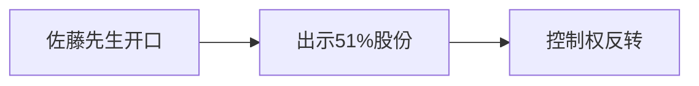

### 逐段完整中英对照

#### 段落 1（English）

The janitor, Mr. Sato, cleared his throat and produced 51 percent of the voting shares. The room became educationally silent.

#### 段落 1（中文完整翻译）

清洁工佐藤先生清了清嗓子，然后拿出了占公司 51% 投票权的股份证明。整个房间顿时安静得像进入了一堂极具教育意义的现场课。

#### 段落 2（English）

The new plan required us to **settle** immediately; someone raised **sexism** during the meeting; the minutes unexpectedly mentioned **shareholder**; the audit trail contained **shipment**; someone raised **showdown** during the meeting. The risk register added **shrug**; the minutes unexpectedly mentioned **sidekick**; the audit trail contained **skeleton**; the proposal looked **skillful** at first.

#### 段落 2（中文完整翻译）

新方案要求我们立即 **settle（安顿；安定；定居；决定）**；有人在会议上提出了 **sexism（性别歧视）** 这个话题；会议纪要里意外提到了 **shareholder（股东）**；审计记录中出现了 **shipment（装运；装载的货物）**；有人在会议上提出了 **showdown（摊牌）** 这个话题；风险登记表新增了 **shrug（耸肩）**；会议纪要里意外提到了 **sidekick（伙伴；共犯）**；审计记录中出现了 **skeleton（骨架，骨骼；纲要）**；这份提案起初看起来很 **skillful（有技巧的；熟练的；擅长的）**。

#### 段落 3（English）

The risk register added **skull**; the consultant described the risk as **sluggish**; management decided to **smolder** before lunch; management decided to **soar** before lunch; the board asked whether we should **socialize**. The risk register added **software**; the board called the situation **solar**; our lawyers suddenly cared about **sort**; the risk register added **source**.

#### 段落 3（中文完整翻译）

风险登记表新增了 **skull（头骨；头脑）**；顾问把这项风险描述为 **sluggish（偷懒的；迟钝的；不活跃的）**；管理层决定在午饭前先 **smolder（无火焰地闷烧；流露难以抑制的强烈感情）**；管理层决定在午饭前先 **soar（高飞；高涨；猛增）**；董事会开始讨论我们是否应该 **socialize（参与社交，交际）**；风险登记表新增了 **software（软件）**；董事会把当前局面称为 **solar（太阳的；日光的）**；我们的律师突然开始关注 **sort（种类，类别）**；风险登记表新增了 **source（来源）**。

#### 段落 4（English）

The minutes unexpectedly mentioned **spearhead**; our lawyers suddenly cared about **species**; the board called the situation **spectacular**; our lawyers suddenly cared about **spell**; the board called the situation **spiritual**. The risk register added **sponsor**; someone raised **sprain** during the meeting; the crisis forced us to **stabilize**; our lawyers suddenly cared about **stalemate**.

#### 段落 4（中文完整翻译）

会议纪要里意外提到了 **spearhead（矛头；先锋部队）**；我们的律师突然开始关注 **species（物种，种类）**；董事会把当前局面称为 **spectacular（惊人的，壮观的）**；我们的律师突然开始关注 **spell（一段时间；咒语）**；董事会把当前局面称为 **spiritual（精神的，心灵的）**；风险登记表新增了 **sponsor（保证人，担保人；赞助者）**；有人在会议上提出了 **sprain（扭伤）** 这个话题；这场危机迫使我们 **stabilize（使稳定，使稳固）**；我们的律师突然开始关注 **stalemate（僵持状态；陷于困境）**。

#### 段落 5（English）

Management decided to **stampede** before lunch; someone raised **status** during the meeting; the risk register added **stick**; the risk register added **stock**; our lawyers suddenly cared about **storm**. Someone raised **string** during the meeting; the board called the situation **stultifying**; the minutes unexpectedly mentioned **subcontractor**; management decided to **subpoena** before lunch.

#### 段落 5（中文完整翻译）

管理层决定在午饭前先 **stampede（冲动行事；惊逃）**；有人在会议上提出了 **status（地位；身份；状况）** 这个话题；风险登记表新增了 **stick（枝；杆；手杖 v. 刺；粘贴；坚持）**；风险登记表新增了 **stock（贮存；存货；股票）**；我们的律师突然开始关注 **storm（暴风雨；激动；爆发）**；有人在会议上提出了 **string（一串；字串；弦；线）** 这个话题；董事会把当前局面称为 **stultifying（极其单调乏味的；使人变迟钝的）**；会议纪要里意外提到了 **subcontractor（转包商，次承包商）**；管理层决定在午饭前先 **subpoena（传唤，传讯）**。

#### 段落 6（English）

The risk register added **subsidence**; the minutes unexpectedly mentioned **subsidy**; the board asked whether we should **suffer**; the risk register added **suicide**; the new plan required us to **supervise** immediately. The board asked whether we should **suppress**; the minutes unexpectedly mentioned **surcharge**; the risk register added **surgeon**; someone raised **surplus** during the meeting. Leo wrote all of this down, then asked whether “stakeholder alignment” was a medical condition.

#### 段落 6（中文完整翻译）

风险登记表新增了 **subsidence（沉降，下沉）**；会议纪要里意外提到了 **subsidy（补助金，津贴）**；董事会开始讨论我们是否应该 **suffer（遭受；经历；忍受）**；风险登记表新增了 **suicide（自杀；自杀行为）**；新方案要求我们立即 **supervise（监督；管理；指导）**；董事会开始讨论我们是否应该 **suppress（镇压；使…止住；禁止；封锁）**；会议纪要里意外提到了 **surcharge（装载过多；附加费）**；风险登记表新增了 **surgeon（外科医生）**；有人在会议上提出了 **surplus（过剩；剩余物；剩余额）** 这个话题；Leo 把这一切都记了下来，然后问道：“stakeholder alignment（利益相关者协同）难道是一种医学病症吗？”。

#### 段落 7（English）

The minutes unexpectedly mentioned **surroundings**; the risk register added **survival**; one executive tried to **suspend** without approval; the new plan required us to **sustain** immediately; management decided to **swear** before lunch. Management decided to **sympathize** before lunch; the audit trail contained **syndicate**; the audit trail contained **tabloid**; someone raised **tariff** during the meeting.

#### 段落 7（中文完整翻译）

会议纪要里意外提到了 **surroundings（周围的事物；环境）**；风险登记表新增了 **survival（生存）**；一名高管试图在未经批准的情况下 **suspend（悬挂；暂停；取消）**；新方案要求我们立即 **sustain（承受；支援；维持）**；管理层决定在午饭前先 **swear（发誓，宣誓；诅咒）**；管理层决定在午饭前先 **sympathize（同情，体谅）**；审计记录中出现了 **syndicate（企业联合）**；审计记录中出现了 **tabloid（小报；文摘）**；有人在会议上提出了 **tariff（关税）** 这个话题。

#### 段落 8（English）

The new plan required us to **tarry** immediately; our lawyers suddenly cared about **tear**; the minutes unexpectedly mentioned **telecommunication**; the audit trail contained **temperance**; the consultant described the risk as **tendentious**. The crisis forced us to **testify**; our lawyers suddenly cared about **theory**; management decided to **threaten** before lunch; our lawyers suddenly cared about **throat**.

#### 段落 8（中文完整翻译）

新方案要求我们立即 **tarry（滞留；停留；耽搁）**；我们的律师突然开始关注 **tear（眼泪；裂缝）**；会议纪要里意外提到了 **telecommunication（电信；电讯）**；审计记录中出现了 **temperance（节制，不过分，适度）**；顾问把这项风险描述为 **tendentious（有偏见的，有倾向的）**；这场危机迫使我们 **testify（作证，证明；表明，声明）**；我们的律师突然开始关注 **theory（理论）**；管理层决定在午饭前先 **threaten（威胁，恐吓；是…的征兆）**；我们的律师突然开始关注 **throat（喉咙）**。

#### 段落 9（English）

The revised plan sounded **tolerant**; one executive tried to **topple** without approval; the proposal looked **totalitarian** at first; the agenda carried the phrase **towering debt**; a slide was mysteriously titled **trade balance**. A slide was mysteriously titled **trade press**; the audit trail contained **trademark**; management decided to **transfer** before lunch; one executive tried to **translate** without approval.

#### 段落 9（中文完整翻译）

修订后的方案听起来很 **tolerant（宽容的，容忍的；能耐…的）**；一名高管试图在未经批准的情况下 **topple（推翻；向前倒）**；这份提案起初看起来很 **totalitarian（极权主义的）**；议程上出现了 **towering debt（［det ］ 深陷债务）** 这个词组；有一页幻灯片神秘地以 **trade balance（［'bæləns ］ 贸易平衡；贸易差额）** 为标题；有一页幻灯片神秘地以 **trade press（［pres ］ 商业出版）** 为标题；审计记录中出现了 **trademark（商标）**；管理层决定在午饭前先 **transfer（搬；转换，转变；调动）**；一名高管试图在未经批准的情况下 **translate（翻译；解释，说明）**。

#### 段落 10（English）

The audit trail contained **transplant**; the minutes unexpectedly mentioned **trauma**; the minutes unexpectedly mentioned **treatment**; the revised plan sounded **tremulous**; our lawyers suddenly cared about **trigger**. The board called the situation **truculent**; the minutes unexpectedly mentioned **trump**; the risk register added **tune**; someone raised **turbine** during the meeting.

#### 段落 10（中文完整翻译）

审计记录中出现了 **transplant（移居；移植）**；会议纪要里意外提到了 **trauma（精神创伤；外伤）**；会议纪要里意外提到了 **treatment（对待；处理；治疗）**；修订后的方案听起来很 **tremulous（颤动的；不安的）**；我们的律师突然开始关注 **trigger（扳机）**；董事会把当前局面称为 **truculent（野蛮的，粗野的；残酷的）**；会议纪要里意外提到了 **trump（王牌，法宝）**；风险登记表新增了 **tune（歌曲；旋律；和谐）**；有人在会议上提出了 **turbine（涡轮机）** 这个话题。

#### 段落 11（English）

Our lawyers suddenly cared about **turn**; our lawyers suddenly cared about **tyranny**; our lawyers suddenly cared about **ulcer**; the revised plan sounded **unanimous**; one executive tried to **undercut** without approval. Our lawyers suddenly cared about **understatement**; the new plan required us to **undulate** immediately; someone raised **unemployment** during the meeting; the audit trail contained **union**. Leo wrote all of this down, then asked whether “stakeholder alignment” was a medical condition.

#### 段落 11（中文完整翻译）

我们的律师突然开始关注 **turn（转动；轮班；倾向）**；我们的律师突然开始关注 **tyranny（高压统治；暴政）**；我们的律师突然开始关注 **ulcer（溃疡）**；修订后的方案听起来很 **unanimous（一致同意的；无异议的）**；一名高管试图在未经批准的情况下 **undercut（暗中破坏；廉价出售）**；我们的律师突然开始关注 **understatement（含蓄的陈述，保守的说法）**；新方案要求我们立即 **undulate（波动，起伏）**；有人在会议上提出了 **unemployment（失业；失业人口）** 这个话题；审计记录中出现了 **union（联盟；结合；和谐）**；Leo 把这一切都记了下来，然后问道：“stakeholder alignment（利益相关者协同）难道是一种医学病症吗？”。

#### 段落 12（English）

The consultant described the risk as **unprecedented**; the new plan required us to **upbraid** immediately; a slide was mysteriously titled **upper class**; the agenda carried the phrase **urban renewal**; the minutes unexpectedly mentioned **utopia**. Our lawyers suddenly cared about **vaccination**; the risk register added **vacuum**; the audit trail contained **value**; the audit trail contained **vapor**.

#### 段落 12（中文完整翻译）

顾问把这项风险描述为 **unprecedented（空前的）**；新方案要求我们立即 **upbraid（谴责，斥责）**；有一页幻灯片神秘地以 **upper class（［klæs ］ 上层阶级，上等阶层）** 为标题；议程上出现了 **urban renewal（［rɪ'nuːəl ］ 城市环境改造）** 这个词组；会议纪要里意外提到了 **utopia（理想国；乌托邦）**；我们的律师突然开始关注 **vaccination（接种疫苗，种痘）**；风险登记表新增了 **vacuum（真空；真空吸尘器）**；审计记录中出现了 **value（价值；重要性；币值）**；审计记录中出现了 **vapor（蒸汽，水汽）**。

#### 段落 13（English）

The spokesperson replied **vehemently**; the audit trail contained **venture**; the board asked whether we should **vibrate**; the audit trail contained **victim**; one executive tried to **vilify** without approval. One executive tried to **violate** without approval; the minutes unexpectedly mentioned **virus**; the revised plan sounded **vivacious**; the audit trail contained **voltage**.

#### 段落 13（中文完整翻译）

发言人以非常 **vehemently（热烈地；强烈地）** 的方式作出回应；审计记录中出现了 **venture（冒险；风险）**；董事会开始讨论我们是否应该 **vibrate（（使）振动；摇摆）**；审计记录中出现了 **victim（受害者；遇难者；祭品）**；一名高管试图在未经批准的情况下 **vilify（诽谤，中伤）**；一名高管试图在未经批准的情况下 **violate（违犯；亵渎）**；会议纪要里意外提到了 **virus（病毒，滤过性病毒）**；修订后的方案听起来很 **vivacious（活泼的，快活的）**；审计记录中出现了 **voltage（电压）**。

#### 段落 14（English）

Someone raised **volunteer** during the meeting; the board asked whether we should **wade**; someone raised **walkout** during the meeting; the crisis forced us to **wane**; the audit trail contained **waste**. The minutes unexpectedly mentioned **wear**; the minutes unexpectedly mentioned **weather**; the minutes unexpectedly mentioned **welfare**; the minutes unexpectedly mentioned **wholesale**.

#### 段落 14（中文完整翻译）

有人在会议上提出了 **volunteer（志愿者，义工 v. 志愿；志愿提供）** 这个话题；董事会开始讨论我们是否应该 **wade（跋涉，艰难地前进）**；有人在会议上提出了 **walkout（拂袖而去；罢工）** 这个话题；这场危机迫使我们 **wane（减少；衰微；亏缺）**；审计记录中出现了 **waste（废料；垃圾）**；会议纪要里意外提到了 **wear（穿，戴；磨损；耐用性）**；会议纪要里意外提到了 **weather（天气；气候）**；会议纪要里意外提到了 **welfare（福利；福利事业）**；会议纪要里意外提到了 **wholesale（批发）**。

#### 段落 15（English）

A slide was mysteriously titled **wind tunnel**; the company promised to retrain the **workforce**; the proposal looked **worldly** at first; the revised plan sounded **zealous**.

#### 段落 15（中文完整翻译）

有一页幻灯片神秘地以 **wind tunnel（［'tʌnl ］ （检查风压的）风洞）** 为标题；公司承诺重新培训 **workforce（劳动力、员工队伍）**；这份提案起初看起来很 **worldly（世间的，世俗的）**；修订后的方案听起来很 **zealous（热心的，热情的）**。

#### 段落 16（English）

Mr. Sato explained that he was the founder’s first investor. He had taken the janitor job because, unlike board meetings, cleaning produced visible results.

#### 段落 16（中文完整翻译）

佐藤先生解释说，他其实是公司创始人的第一位投资人。他之所以来做清洁工，是因为与董事会会议不同，打扫卫生至少能产生看得见的成果。

---

## Epilogue

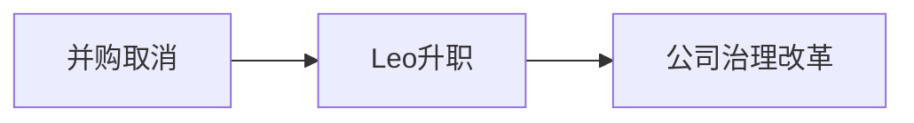

### 逐段完整中英对照

#### 段落 1（English）

The merger was cancelled, the prototype was recovered, the regulator received a corrected filing, the employees kept their jobs, and Leo was promoted for asking the only question nobody else had asked: “Did anyone actually verify the premise?” Mr. Sato remained janitor and controlling shareholder. His first governance reform was simple: every executive memo had to fit on one page, and every password had to contain something more imaginative than the company name.

#### 段落 1（中文完整翻译）

最终，并购被取消，原型机被找回，监管机构收到了修正后的申报文件，员工保住了工作，而 Leo 因为问出了唯一一个别人都没问的问题——“到底有没有人真正验证过最初的前提？”——而获得升职。佐藤先生仍然兼任清洁工和控股股东。他推动的第一项治理改革非常简单：所有高管备忘录都必须控制在一页以内，而所有密码都必须比直接使用公司名更有想象力。

#### 段落 2（English）

Helix Meridian survived. More surprisingly, it learned. For almost three weeks.

#### 段落 2（中文完整翻译）

Helix Meridian 活了下来。更令人惊讶的是，它似乎真的学到了点什么——虽然这种状态只维持了差不多三周。

---

