# TOEIC 990 商务剧情故事：完整中文对照 + 全章节插图版

> 本版是加强版：
>
> - **每一个部分都有一张 PNG 插图**
> - **每个段落组都补上更完整的中文对照**
> - 保留 **人物关系图 / 时间线图 / 流程图**
> - 图片路径都已经写成 **相对路径**，和 MD 放在同一文件夹即可直接显示

## 使用说明

- 请把这个 `.md` 文件和所有 `.png` 图片放在**同一个文件夹**内。
- 图片引用格式已经写好，例如：``
- 在 **Obsidian / Typora / VS Code（Markdown Preview Mermaid Support）/ MkDocs** 中都比较适合查看。

## 人物关系图（优化版）

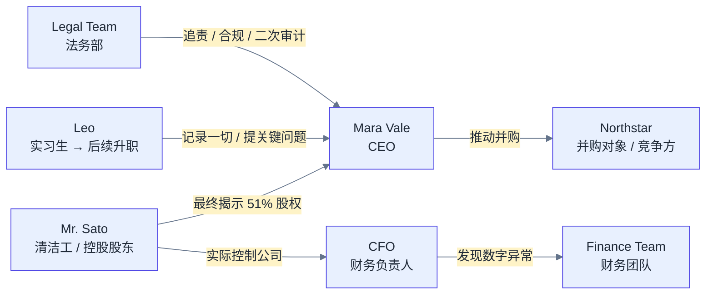

## 时间线图（紧凑版）

```mermaid
%%{init: {'theme': 'base', 'themeVariables': {
  'primaryColor': '#EEF2FF',
  'primaryBorderColor': '#6366F1',
  'primaryTextColor': '#111827',
  'lineColor': '#94A3B8'
}}}%%
flowchart LR
    M1[Mon\n宣布并购] --> T1[Tue\n原型失踪]
    T1 --> W1[Wed\n财务异常]
    W1 --> TH1[Thu\n法务接管]
    TH1 --> F1[Fri AM\n记者会失控]
    F1 --> F2[Fri PM\n市场反噬]
    F2 --> S1[Sat\n周末救火]
    S1 --> SU1[Sun 2AM\n董事会投票]
    SU1 --> M2[Next Mon\n竞争者报价]
    M2 --> X1[Twist 1\n黑客在线资单上]
    X1 --> X2[Twist 2\n工资单是假的]
    X2 --> X3[Final Twist\n清洁工持股 51%]
    X3 --> EPI[Epilogue\n危机收束]
```

## 反转链条图

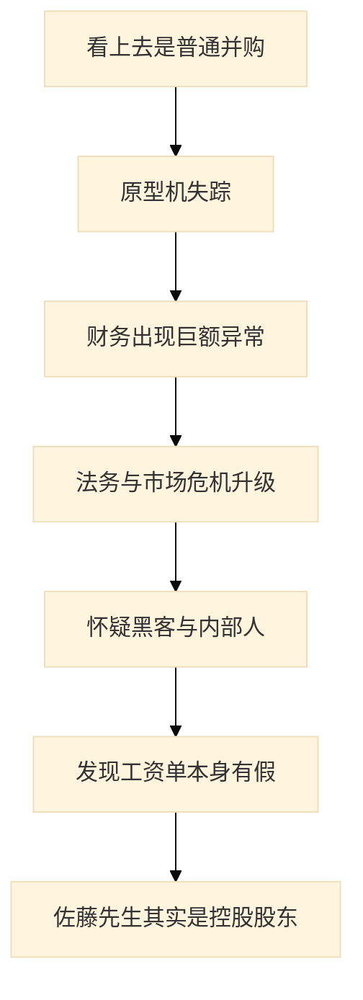

---
## 1. Monday: The Merger Nobody Read

### 本章小流程图

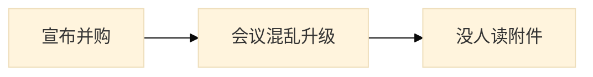

### 英文原文与完整中文对照

#### 段落组 1（English）

The boardroom smelled of coffee, ambition, and one printer that had been “temporarily broken” since 2024.

The board chose to **abandon** the vanity project; someone tried to **abduct** our prototype drone; the parent company agreed to **absorb** the loss; we found an **abuse** of corporate privileges; the ceo wanted to **accelerate** the rollout. The dashboard was **accessible** to every department; security identified an alleged **accomplice**; the cfo had to **account for** every missing yen; our **accountant** stopped smiling.

Small errors began to **accumulate**; the forecast proved surprisingly **accurate**; the minutes unexpectedly mentioned **activism**; one analyst seemed **addicted to** spreadsheets; the war room was **adjacent to** the cafeteria. The minutes unexpectedly mentioned **administration**; the vendor finally had to **admit** the mistake; the team tried to **advance** the negotiation; someone raised **adversity** during the meeting.

The risk register added **advertisement**; the risk register added **aerospace**; the risk register added **affidavit**; the proposal looked **affluent** at first; the product had to remain **affordable**. Our lawyers suddenly cared about **aftershock**; the minutes unexpectedly mentioned **agent**; the consultant described the risk as **aggressive**; a slide was mysteriously titled **agony column**.

Management decided to **aid** before lunch; management decided to **allege** before lunch; the minutes unexpectedly mentioned **allergy**; the risk register added **alliance**; the risk register added **allocation**. The new plan required us to **alter** immediately; the consultant described the risk as **amateur**; the minutes unexpectedly mentioned **ambulance**; the hidden fees **amounted to** a small fortune.

#### 段落组 1（中文完整对照）

会议室里满是咖啡味、野心味，以及一台从 2024 年起就一直“临时故障”的打印机的存在感。董事会一边考虑是否要放弃那个虚荣项目，一边又有人疑似绑走了公司的原型无人机；母公司同意吸收损失，团队还发现了公司权限被滥用的情况，CEO 却仍想加快项目上线。数据看板几乎对所有部门都开放，安保锁定了一名疑似同伙，CFO 不得不解释每一笔去向不明的日元，连会计都彻底笑不出来了。

#### 段落组 2（English）

The new plan required us to **anchor** immediately; the board called the situation **animated**; the new plan required us to **annoy** immediately; the audit trail contained **antibiotic**; the board called the situation **antitrust**. The market suddenly seemed **apologetic**; our lawyers suddenly cared about **apology**; the board asked whether we should **apparel**; the minutes unexpectedly mentioned **application**. Leo wrote all of this down, then asked whether “stakeholder alignment” was a medical condition.

The crisis forced us to **appraise**; one executive tried to **apprehend** without approval; someone raised **arraignment** during the meeting; someone raised **arson** during the meeting; the board called the situation **artificial**. The risk register added **assailant**; the board asked whether we should **assassinate**; management decided to **assemble** before lunch; management decided to **assert** before lunch.

The audit trail contained **asset**; management decided to **assimilate** before lunch; someone raised **asthma** during the meeting; someone raised **astronomer** during the meeting; the consultant described the risk as **atomic**. The board asked whether we should **attain**; the proposal looked **attentive** at first; we could **attribute** the outage **to** one bad script; one executive tried to **audit** without approval.

The consultant described the risk as **authentic**; the proposal looked **authoritative** at first; the revised contract was **available for** review; a junior engineer helped **avert** disaster; the market suddenly seemed **backward**. We had to **balance** speed **against** reliability; legal proposed a **ban on** unofficial plug-ins; the minutes unexpectedly mentioned **bandwagon**; our lawyers suddenly cared about **banker**.

Someone raised **bankruptcy** during the meeting; procurement began to **bargain over** the price; the valuation was **based on** optimistic assumptions; we should have tested it **beforehand**; the new plan required us to **beguile** immediately. The board asked whether we should **belittle**; the delay was oddly **beneficial to** us; the new plan required us to **beset** immediately; the board called the situation **bilateral**.

#### 段落组 2（中文完整对照）

接着，小错误开始不断累积，原本看似准确的预测也逐渐失去可信度。会议纪要里莫名出现了 activism、administration 之类的词；有位分析师对电子表格几乎到了 addicted to 的程度；作战室就设在食堂旁边。供应商终于承认了错误，团队继续推进谈判，但会议中又有人提到 adversity，让整个并购从一开始就蒙上了不祥气氛。

#### 段落组 3（English）

The proposal looked **binocular** at first; the minutes unexpectedly mentioned **biohazard**; the risk register added **biosphere**; someone raised **birthrate** during the meeting; the message looked like an attempt to **blackmail** the ceo. Management decided to **blast** before lunch; the crisis forced us to **blood**; the proposal looked **bogus** at first; the crisis created an unexpected **bond** between rivals. Leo wrote all of this down, then asked whether “stakeholder alignment” was a medical condition.

Ai consulting was enjoying a **boom**; one executive tried to **bootleg** without approval; someone raised **borrowing** during the meeting; one executive tried to **bounce** without approval; someone raised **boundary** during the meeting. The crisis forced us to **boycott**; the board asked whether we should **brand**; someone raised **breakup** during the meeting; the crisis forced us to **bribe**.

The board asked whether we should **broadcast**; management decided to **bruise** before lunch; the project was already **over budget**; the new plan required us to **bully** immediately; the risk register added **bystander**. The new plan required us to **calculate** immediately; the board called the situation **candid**; the board called the situation **canny**; the founder dreamed of a huge **capital gain**.

One executive tried to **capitalize** without approval; one executive tried to **capitulate** without approval; the board asked whether we should **care**; the consultant described the risk as **careless**; our **cash flow** suddenly mattered more than our slogans. The risk register added **catalyst**; the revised plan sounded **catching**; the proposal looked **causal** at first; the crisis forced us to **celebrate**.

The proposal looked **cellular** at first; the board asked whether we should **censure**; the audit trail contained **chaos**; the revised plan sounded **characteristic**; the minutes unexpectedly mentioned **charisma**.

The first day ended with one certainty: nobody had read the attachment titled FINAL_v7_REALLY_FINAL.pdf.

#### 段落组 3（中文完整对照）

随后，AI 咨询行业的 boom、预算博弈、现金流压力、催化因素与各种 boundary 问题接连被搬上桌面。采购压价，管理层急着行动，董事会甚至在是否 belittle、boycott、blackmail 等极端字眼间摇摆。所有部门都在谈速度、口号与战略，可第一天结束时，唯一真正确定的事实却是：根本没有人认真读过那份名为 FINAL_v7_REALLY_FINAL.pdf 的附件。

---

## 2. Tuesday: The Prototype Disappears

### 本章小流程图

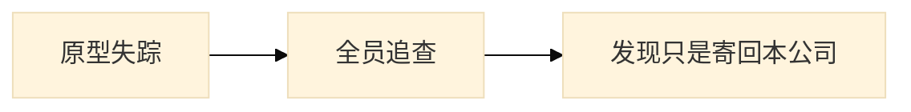

### 英文原文与完整中文对照

#### 段落组 1（English）

At 9:07 a.m., security called. The prototype was gone; the security camera, naturally, had excellent footage of an empty corridor.

The crisis forced us to **chase**; our lawyers suddenly cared about **chemotherapy**; the revised plan sounded **chronic**; the board called the situation **civic**; the market suddenly seemed **civilian**. One executive tried to **clamp** without approval; one executive tried to **clash** without approval; the risk register added **clearance**; someone raised **climate** during the meeting.

The risk register added **clone**; the board called the situation **coarse**; the new plan required us to **coddle** immediately; the consultant described the risk as **coherent**; the revised plan sounded **collateral**. The consultant described the risk as **colloquial**; the market suddenly seemed **colonial**; our lawyers suddenly cared about **commerce**; the audit trail contained **commercialism**.

The board refused to **commit to** a date; someone raised **commodity** during the meeting; the crisis forced us to **communicate**; the board called the situation **comparable**; hr discussed **compensation** for the overtime. The consultant described the risk as **competent**; the audit trail contained **competitor**; the proposal looked **complicated** at first; management decided to **compound** before lunch.

The proposal looked **computer-literate** at first; the crisis forced us to **conceal**; the risk register added **concession**; one executive tried to **concoct** without approval; the auditors **concurred with** legal counsel. The new plan required us to **condone** immediately; management decided to **confederate** before lunch; the audit trail contained **conference**; the market suddenly seemed **confident**.

#### 段落组 1（中文完整对照）

周二早上 9:07，安保打来电话：原型机不见了。监控系统拍得非常清楚——只拍到一条空走廊。审计、法务与各部门很快统一意见，决定立即展开调查，同时要求所有团队为恢复计划作出贡献，并尽力 keep the situation under control。

#### 段落组 2（English）

The new plan required us to **confirm** immediately; the market suddenly seemed **congenital**; the new plan required us to **conjecture** immediately; someone raised **conscience** during the meeting; the consultant described the risk as **consecutive**. The minutes unexpectedly mentioned **consequence**; the minutes unexpectedly mentioned **conservationist**; the consultant described the risk as **conspicuous**; the revised plan sounded **constituent**. Leo wrote all of this down, then asked whether “stakeholder alignment” was a medical condition.

Someone raised **constitution** during the meeting; management decided to **consume** before lunch; a slide was mysteriously titled **consumer price index**; one executive tried to **contemplate** without approval; the risk register added **contempt**. One executive tried to **contort** without approval; the proposal looked **contrary** at first; each department had to **contribute to** the recovery plan; we struggled to **keep the situation under control**.

The board asked whether we should **convene**; the new plan required us to **convey** immediately; the risk register added **conviction**; the new plan required us to **cooperate** immediately; the proposal looked **cordial** at first. The revised plan sounded **corporate**; our lawyers suddenly cared about **corporation**; the consultant described the risk as **correspondent**; the crisis forced us to **corrupt**.

The risk register added **cost-conscious**; the board asked whether we should **count**; the crisis forced us to **counterfeit**; the consultant described the risk as **cozy**; our lawyers suddenly cared about **craft**. The proposal looked **crass** at first; the consultant described the risk as **credible**; someone raised **creditor** during the meeting; the audit trail contained **criminology**.

Management decided to **cripple** before lunch; the minutes unexpectedly mentioned **criticality**; someone raised **critique** during the meeting; the revised plan sounded **crucial**; the crisis forced us to **culminate**. Management decided to **cure** before lunch; the risk register added **custody**; the new plan required us to **cut** immediately; the minutes unexpectedly mentioned **cyberspace**.

#### 段落组 2（中文完整对照）

随着追查继续，风险登记表和会议纪要里不断塞入新的词：conscience、consensus、conspiracy、constraint、consultant、consumer 等等。有人试图在未获批准的情况下发表同情意见、制造对立或引导舆论，董事会又开始讨论是否该 continue、contradict、coordinate。各部门像风暴一样卷了进来，却没人真正掌握核心线索。

#### 段落组 3（English）

Management decided to **dangle** before lunch; one executive tried to **daunt** without approval; management decided to **deal** before lunch; the new plan required us to **debate** immediately; the risk register added **debtor**. The crisis forced us to **declare**; one executive tried to **deduce** without approval; our lawyers suddenly cared about **deduction**; the borrower was close to **default on** its loan. Leo wrote all of this down, then asked whether “stakeholder alignment” was a medical condition.

The crisis forced us to **defend**; someone raised **deficit** during the meeting; our lawyers suddenly cared about **deflation**; the new plan required us to **defuse** immediately; one executive tried to **delete** without approval. The crisis forced us to **deliver**; customers continued to **demand** an explanation; the new plan required us to **demean** immediately; the crisis forced us to **denounce**.

The revised plan sounded **dental**; one executive tried to **depart** without approval; the board asked whether we should **depict**; the buyer paid a **deposit on** the equipment; the audit trail contained **depression**. The consultant described the risk as **derelict**; the audit trail contained **dermatologist**; management decided to **desert** before lunch; the risk register added **desktop**.

The risk register added **detection**; the minutes unexpectedly mentioned **detention**; the board asked whether we should **deteriorate**; the minutes unexpectedly mentioned **device**; the new plan required us to **diagnose** immediately. Our lawyers suddenly cared about **dictator**; the crisis forced us to **diffuse**; the consultant described the risk as **digital**; the crisis forced us to **diminish**.

The proposal looked **dire** at first; the proposal looked **disabled** at first; the proposal looked **disastrous** at first; the crisis forced us to **discern**; management decided to **disclaim** before lunch.

Security found the missing prototype in a delivery crate addressed to Helix itself. Nobody laughed except the courier.

#### 段落组 3（中文完整对照）

危机逐步升级为一场带有黑色幽默的企业悬疑剧：团队谈论控制、修正、合作、腐败与公司文化，甚至开始担心整个叙事会如何影响品牌。最终，安保在一个寄回 Helix 自己公司的送货箱里找到了失踪的原型机。这个结局荒诞得让除快递员之外的所有人都笑不出来。

---

## 3. Wednesday: Finance Discovers Gravity
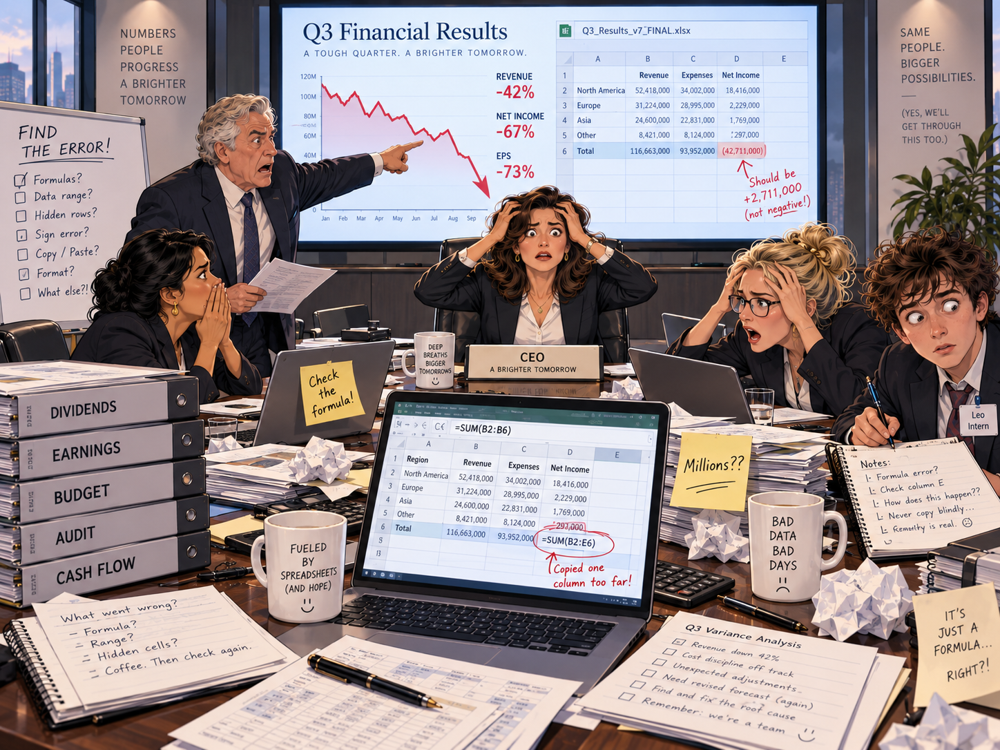

### 本章小流程图

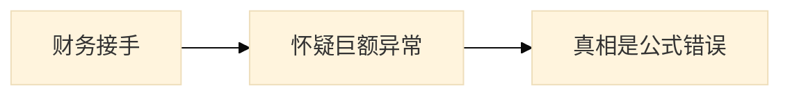

### 英文原文与完整中文对照

#### 段落组 1（English）

Finance entered the story like a thunderstorm wearing a tie.

The minutes unexpectedly mentioned **disclosure**; the board asked whether we should **discredit**; management decided to **disinfect** before lunch; the new plan required us to **dismiss** immediately; the risk register added **disruption**. The board asked whether we should **dissipate**; one executive tried to **distribute** without approval; the crisis forced us to **dive**; the board wanted to **diversify into** health technology.

Shareholders still asked about the **dividend**; our lawyers suddenly cared about **dizziness**; the risk register added **donor**; the consultant described the risk as **dormant**; the consultant described the risk as **dour**. Management quietly planned to **downsize** one division; one executive tried to **draft** without approval; the crisis forced us to **drift**; the market suddenly seemed **dubious**.

The market suddenly seemed **dumb**; the risk register added **duty**; the minutes unexpectedly mentioned **earnings**; the proposal looked **eco-conscious** at first; the audit trail contained **economics**. Someone raised **economy** during the meeting; the audit trail contained **editor**; a slide was mysteriously titled **educational toys**; the new policy **took effect** at midnight.

One executive tried to **elicit** without approval; management decided to **emancipate** before lunch; management decided to **embed** before lunch; management decided to **embrace** before lunch; one executive tried to **empathize** without approval. Someone raised **employee** during the meeting; the minutes unexpectedly mentioned **encryption**; the crisis forced us to **endeavor**; the crisis forced us to **endorse**.

#### 段落组 1（中文完整对照）

周三轮到财务部门接管叙事。股东盯着 dividend，管理层担心 downsizing，团队讨论债务、需求、人口与发展，甚至连疾病、捐赠、鸽子与宿舍式混乱都进入了会议纪要。每个人都觉得自己在处理一场巨大的数字灾难，而财务看板上的每一项异常都像要把人拖入更深的重力井。

#### 段落组 2（English）

The risk register added **energy**; the new plan required us to **engineer** immediately; we added tests to **ensure that** it would not happen again; one executive tried to **entertain** without approval; the risk register added **entrepreneur**. A slide was mysteriously titled **environmental assessment**; the risk register added **envy**; the revised plan sounded **equal**; the audit trail contained **equipment**. Leo wrote all of this down, then asked whether “stakeholder alignment” was a medical condition.

The risk register added **eradication**; the proposal looked **essential** at first; the audit trail contained **estate**; the emergency checklist included **ethnic minority**; management decided to **evaluate** before lunch. The minutes unexpectedly mentioned **evolution**; our lawyers suddenly cared about **excess**; management decided to **exclude** before lunch; the proposal looked **executive** at first.

The crisis forced us to **exhibit**; the crisis forced us to **expedite**; travel **expenses** became a running joke; one executive tried to **expire** without approval; one executive tried to **explode** without approval. The audit trail contained **explosive**; the risk register added **exposure**; the audit trail contained **extinction**; the proposal looked **extraordinary** at first.

The risk register added **eyewitness**; one executive tried to **facilitate** without approval; the minutes unexpectedly mentioned **farce**; one executive tried to **fascinate** without approval; the revised plan sounded **fastidious**. The audit trail contained **feature**; the board asked whether we should **ferment**; the market suddenly seemed **festive**; our lawyers suddenly cared about **fever**.

The audit trail contained **file**; the board called the situation **financial**; the board called the situation **fiscal**; the board asked whether we should **flee**; the crisis forced us to **flock**. The minutes unexpectedly mentioned **flora**; the new plan required us to **flourish** immediately; the new plan required us to **focus** immediately; the agenda carried the phrase **food poisoning**.

#### 段落组 2（中文完整对照）

接下来，收益、经济、编辑、效率、选举、员工、加密、能源、环保评估、嫉妒、设备、差旅费用等词轮番出现。Leo 继续一边记笔记，一边困惑地看着这家公司如何把任何危机都扩写成词汇宇宙。所有人都以为问题正迅速扩散：预算在漂，指标在掉，情绪在发热，恐慌像办公室的二次传染。

#### 段落组 3（English）

The **foreign exchange** desk noticed the first anomaly; someone raised **forgery** during the meeting; the minutes unexpectedly mentioned **formula**; the minutes unexpectedly mentioned **fortune**; the new plan required us to **found** immediately. The market suddenly seemed **frail**; our lawyers suddenly cared about **fraud**; the new plan required us to **freeze** immediately; the crisis forced us to **frustrate**. Leo wrote all of this down, then asked whether “stakeholder alignment” was a medical condition.

The board agreed to **fund** the rescue plan; the minutes unexpectedly mentioned **future**; our lawyers suddenly cared about **galaxy**; the minutes unexpectedly mentioned **garbage**; the crisis forced us to **gather**. The agenda carried the phrase **general strike**; the emergency checklist included **genetic engineering**; the proposal looked **genial** at first; the crisis forced us to **gloat**.

A slide was mysteriously titled **global warming**; management decided to **gnaw** before lunch; the new plan required us to **goad** immediately; the crisis forced us to **gossip**; our lawyers suddenly cared about **gravity**. The emergency checklist included **greenhouse effect**; management decided to **groom** before lunch; the emergency checklist included **gross domestic product**; no consultant could **guarantee** success.

Management decided to **gush** before lunch; one executive tried to **head** without approval; hr changed the **health insurance** provider; our lawyers suddenly cared about **hearsay**; the consultant described the risk as **herbivorous**. The emergency checklist included **high-definition television**; the board asked whether we should **hijack**; someone raised **holding** during the meeting; the risk register added **homicide**.

Someone raised **hook** during the meeting; the risk register added **horizon**; the board asked whether we should **hospitalize**; the audit trail contained **house**; the risk register added **humanism**.

The CFO proved that the “missing millions” were mostly a spreadsheet formula copied one column too far.

#### 段落组 3（中文完整对照）

而最后的真相却极其“接地气”：财务部发现所谓“失踪的数百万资金”，大多只是表格公式多复制了一列。换句话说，公司差点把一个 spreadsheet formula 错误当成金融犯罪、系统性崩塌和末日预言。

---

## 4. Thursday: Legal Learns to Sweat
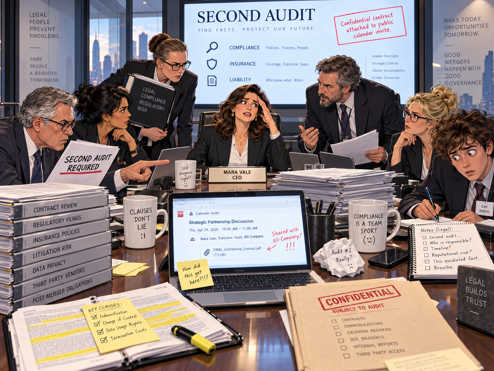

### 本章小流程图

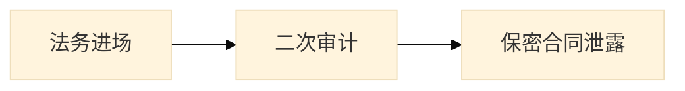

### 英文原文与完整中文对照

#### 段落组 1（English）

Legal arrived with three laptops, five warnings, and the emotional warmth of a parking ticket.

The board asked whether we should **humiliate**; the audit trail contained **hydrocarbon**; someone raised **hypothesis** during the meeting; management decided to **identify** before lunch; the minutes unexpectedly mentioned **immigrant**. The market suddenly seemed **immune**; the new plan required us to **imperil** immediately; the new plan required us to **impose** immediately; the minutes unexpectedly mentioned **impunity**.

The minutes unexpectedly mentioned **income**; costs continued to **increase by** nearly ten percent; the new plan required us to **indicate** immediately; the board called the situation **indifferent**; our lawyers suddenly cared about **industry**. The revised plan sounded **infatuated**; the risk register added **inflation**; a slide was mysteriously titled **informed source**; management decided to **infuse** before lunch.

The crisis forced us to **inherit**; the revised plan sounded **initial**; the board asked whether we should **inject**; the risk register added **insider**; the chair **insisted on** a second audit. One executive tried to **inspect** without approval; our lawyers suddenly cared about **institution**; the claim was covered by **insurance**; someone raised **intake** during the meeting.

The consultant described the risk as **interactive**; the deal attracted **interest from** overseas investors; the consultant described the risk as **intergovernmental**; the minutes unexpectedly mentioned **intervention**; the new plan required us to **interweave** immediately. The board asked whether we should **invalidate**; the minutes unexpectedly mentioned **inventory**; the risk register added **investigation**; the revised plan sounded **invincible**.

#### 段落组 1（中文完整对照）

周四，法务带着三台电脑、五条警告和一张停车罚单般冷酷的气质进场。董事会开始讨论 humiliation、hypothesis、identify、immigrant、immune、imperil、impose 等词，法务则把重点放在风险认定、责任追踪和合规程序上。大家一边开会一边不断追加新事项，整个房间的温度都像被法规条文降了下来。

#### 段落组 2（English）

The minutes unexpectedly mentioned **irrigation**; legal raised an **issue with** the licensing terms; the minutes unexpectedly mentioned **jail**; the consultant described the risk as **judicial**; the risk register added **jury**. The revised plan sounded **kinetic**; a slide was mysteriously titled **labor law**; the new plan required us to **lament** immediately; the risk register added **landscape**. Leo wrote all of this down, then asked whether “stakeholder alignment” was a medical condition.

Someone raised **larceny** during the meeting; the risk register added **layoff**; the board asked whether we should **leak**; we signed a **lease on** a smaller office; the consultant described the risk as **legal**. One executive tried to **legislate** without approval; the board asked whether we should **levy**; the minutes unexpectedly mentioned **liberalization**; management decided to **liberalize** before lunch.

The emergency checklist included **life cycle**; the market suddenly seemed **lightweight**; the revised plan sounded **listless**; management decided to **litigate** before lunch; the bank approved a **loan for** working capital. The incident forced a new **long-term strategy**; the proposal looked **lucrative** at first; the board asked whether we should **maim**; the risk register added **majority**.

The board asked whether we should **malign**; the risk register added **malpractice**; the audit trail contained **management**; our lawyers suddenly cared about **manhunt**; one executive tried to **mar** without approval. Our lawyers suddenly cared about **market**; the ceo worried about losing **market share**; the agenda carried the phrase **mass production**; the minutes unexpectedly mentioned **measles**.

The minutes unexpectedly mentioned **medicaid**; the risk register added **medicare**; the consultant described the risk as **mellow**; the minutes unexpectedly mentioned **merchant**; everyone thought the **merger with** northstar was inevitable. Someone raised **message** during the meeting; our lawyers suddenly cared about **microscope**; the proposal exceeded the statutory **minimum wage**; our lawyers suddenly cared about **mishap**.

#### 段落组 2（中文完整对照）

随后，成本上升、行业影响、通胀、保险、机构、国际投资、inventory、investigation、irrigation、jail、judicial、labor law、layoff、lease on、legal 等内容接连出现。团队不仅要处理并购本身，还得面对劳动法、租约、贷款、长期战略和最低工资等制度层面的现实压力。每讨论一步，危机都更像一次公司治理的体检。

#### 段落组 3（English）

The board called the situation **missing**; one executive tried to **mock** without approval; the risk register added **molecule**; the minutes unexpectedly mentioned **monarchy**; the revised plan sounded **monolithic**. The revised plan sounded **morbid**; the founder joked that his house **mortgage** felt safer than our shares; management decided to **mourn** before lunch; the board asked whether we should **multiply**. Leo wrote all of this down, then asked whether “stakeholder alignment” was a medical condition.

The risk register added **muscle**; the board called the situation **national**; the minutes unexpectedly mentioned **nationalism**; someone raised **nationalization** during the meeting; the emergency checklist included **natural selection**. One executive tried to **neglect** without approval; our lawyers suddenly cared about **neighborhood**; the board called the situation **neurotic**; the agenda carried the phrase **news flash**.

The risk register added **nostalgia**; the crisis forced us to **nurture**; the audit trail contained **nutrition**; management decided to **obfuscate** before lunch; the board called the situation **obscure**. The board asked whether we should **obsess**; the market suddenly seemed **obvious**; the crisis forced us to **occupy**; someone raised **office** during the meeting.

The risk register added **oligarchy**; the minutes unexpectedly mentioned **operator**; the market suddenly seemed **opposite**; the minutes unexpectedly mentioned **orbit**; procurement placed an **order for** replacement servers. The audit trail contained **organism**; the crisis forced us to **organize**; the final **outcome** depended on one email; the risk register added **output**.

One executive tried to **outweigh** without approval; the board asked whether we should **overcome**; the board asked whether we should **overdraw**; the crisis forced us to **overflow**; the risk register added **overpopulation**.

Legal then discovered the supposedly confidential contract had been attached to a public calendar invitation.

#### 段落组 3（中文完整对照）

到本章后半，法务的紧张终于变成显性剧情：他们发现 supposedly confidential 的合同竟然被附在一封公开的日历邀请里。与此同时，市场份额、mass production、medical、merchant、minimum wage 和 mishap 等词继续压上来，让大家意识到：这已经不是单一事故，而是一整套制度与流程在一起冒烟。

---

## 5. Friday Morning: The Press Conference from Hell

### 本章小流程图

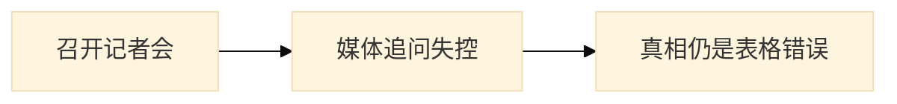

### 英文原文与完整中文对照

#### 段落组 1（English）

The press conference began badly and then discovered new ways to become worse.

The proposal looked **overt** at first; the crisis forced us to **overwhelm**; the audit trail contained **oxygen**; the board asked whether we should **pacify**; someone raised **pact** during the meeting. The proposal looked **palpable** at first; the revised plan sounded **paltry**; someone raised **panacea** during the meeting; our lawyers suddenly cared about **paparazzo**.

One executive tried to **paraphrase** without approval; the consultant described the risk as **patent**; someone raised **patronage** during the meeting; the vendor demanded **payment in advance**; the contract imposed a **penalty for** late delivery. Management decided to **penetrate** before lunch; the agenda carried the phrase **per capita**; the board reviewed **performance against** quarterly targets; the board asked whether we should **perpetrate**.

The risk register added **perspective**; the new plan required us to **peruse** immediately; employees signed a **petition against** the layoffs; the revised plan sounded **phony**; the minutes unexpectedly mentioned **pickpocket**. The proposal looked **pious** at first; our lawyers suddenly cared about **piracy**; one executive tried to **plagiarize** without approval; the board asked whether we should **plant**.

The emergency checklist included **plea bargain**; someone raised **pneumonia** during the meeting; one executive tried to **ponder** without approval; the consultant described the risk as **portly**; the consultant described the risk as **positive**. Management decided to **predominate** before lunch; the market suddenly seemed **pre-emptive**; our lawyers suddenly cared about **prejudice**; the crisis forced us to **preoccupy**.

#### 段落组 1（中文完整对照）

周五上午的记者会从一开始就很糟。公司一边解释并购，一边还要面对媒体、employee、entrepreneur、environmental assessment、exposure、expenses、eyewitness 等各种问题与角色的围攻。Leo 继续做记录，而台上的每个人都像随时可能在镜头前犯下新的口误。

#### 段落组 2（English）

The board asked whether we should **prescribe**; the proposal looked **present** at first; one executive tried to **preserve** without approval; the agenda carried the phrase **press release**; the new plan required us to **pretend** immediately. The consultant described the risk as **preventative**; the bank linked the loan to the **prime rate**; the board called the situation **principal**; the revised plan sounded **pristine**. Leo wrote all of this down, then asked whether “stakeholder alignment” was a medical condition.

The audit trail contained **probe**; management decided to **procrastinate** before lunch; the board asked whether we should **produce**; our lawyers suddenly cared about **productivity**; someone raised **profile** during the meeting. The new service finally **turned a profit**; policy would **prohibit employees from** using personal cloud drives; the proposal looked **prolific** at first; the board asked whether we should **promote**.

Our lawyers suddenly cared about **propaganda**; someone raised **property** during the meeting; the audit trail contained **proselyte**; someone raised **protectionism** during the meeting; one executive tried to **prove** without approval. The revised plan sounded **provincial**; our lawyers suddenly cared about **psychiatrist**; the risk register added **publicity**; the factory tightened **quality control**.

The crisis forced us to **quote**; the audit trail contained **radioactivity**; the audit trail contained **rage**; the risk register added **raise**; the new plan required us to **ratify** immediately. The new plan required us to **raze** immediately; the board asked whether we should **realize**; one executive tried to **recede** without approval; our lawyers suddenly cared about **recession**.

The minutes unexpectedly mentioned **reconciliation**; the board asked whether we should **recycle**; someone raised **reference** during the meeting; the crisis forced us to **reflect**; one executive tried to **refund** without approval. The new plan required us to **register** immediately; our lawyers suddenly cared about **regulator**; the board asked whether we should **reign**; one executive tried to **rekindle** without approval.

#### 段落组 2（中文完整对照）

记者会越往下走越离谱：公司的词汇表里塞满了 file、financial、fiscal、flora、food poisoning、foreign exchange、forgery、formula、fortune、fraud、future、general strike、genetic engineering 乃至 gross domestic product。管理层试图 exhibit、expedite、focus、flourish，律师却不断提醒现实没那么乐观。每个回答都像在试图用更多术语掩盖更大的混乱。

#### 段落组 3（English）

A slide was mysteriously titled **reliable source**; the audit trail contained **relish**; we could no longer **rely on** a single supplier; the risk register added **remedy**; the new plan required us to **remove** immediately. The audit trail contained **renaissance**; the crisis forced us to **renovate**; the proposal looked **renowned** at first; the board asked whether we should **repent**. Leo wrote all of this down, then asked whether “stakeholder alignment” was a medical condition.

The auditor issued a **report on** the incident; our lawyers suddenly cared about **representative**; our lawyers suddenly cared about **reprieve**; the board asked whether we should **require**; the minutes unexpectedly mentioned **rescue**. The crisis forced us to **resign**; the revised plan sounded **resistant**; the coo was **responsible for** the recovery program; security began to **restrict access to** production systems.

The outage **resulted in** thousands of support tickets; the crisis forced us to **resurrect**; the pilot launched in the **retail** market; the crisis forced us to **retaliate**; the crisis forced us to **retire**. Management decided to **retrieve** before lunch; the minutes unexpectedly mentioned **review**; the risk register added **revolution**; one executive tried to **rip** without approval.

Our lawyers suddenly cared about **robotics**; the minutes unexpectedly mentioned **routine**; the audit trail contained **sabotage**; the market suddenly seemed **sacrilegious**; our lawyers suddenly cared about **salesman**. The risk register added **sampling**; the market suddenly seemed **sanitary**; one executive tried to **saturate** without approval; the audit trail contained **scare**.

The risk register added **score**; the crisis forced us to **seclude**; the emergency checklist included **security system**; the minutes unexpectedly mentioned **seismograph**; the minutes unexpectedly mentioned **seizure**.

The “leaked” memo was genuine, but the scandalous paragraph was an autocorrect error. Public relations did not consider this comforting.

#### 段落组 3（中文完整对照）

最后，财务重力问题的真正结论终于被说破：那笔“失踪的巨款”本质上还是 Excel 公式错误。记者会于是从公共危机管理，滑向一堂有关企业沟通失败与表格误用的现场直播示范课。

---

## 6. Friday Afternoon: The Market Bites Back
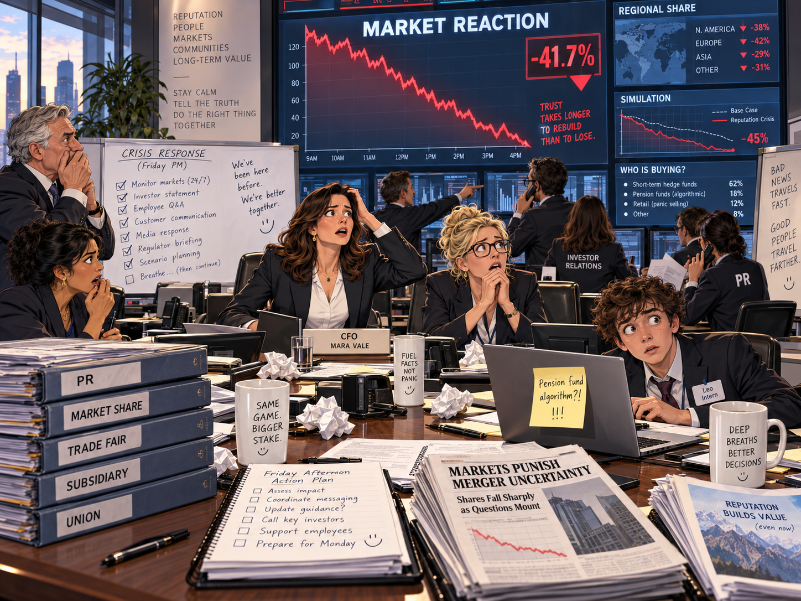

### 本章小流程图

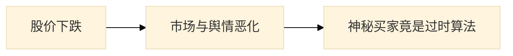

### 英文原文与完整中文对照

#### 段落组 1（English）

By noon the stock chart looked like a ski slope designed by a pessimist.

One executive tried to **serve** without approval; the risk register added **sewage**; our **share of** the regional market slipped; the crisis forced us to **shatter**; our lawyers suddenly cared about **shoot**. One executive tried to **shrink** without approval; the agenda carried the phrase **side effect**; the new plan required us to **simulate** immediately; the risk register added **simulator**.

The proposal looked **skeptical** at first; the audit trail contained **skin**; the board called the situation **slight**; the audit trail contained **slump**; the new plan required us to **snap** immediately. Our lawyers suddenly cared about **socialism**; our lawyers suddenly cared about **sociologist**; someone raised **soil** during the meeting; a slide was mysteriously titled **sole proprietor**.

The emergency checklist included **sound system**; our lawyers suddenly cared about **spacecraft**; one executive tried to **specialize** without approval; our lawyers suddenly cared about **spectacle**; one executive tried to **speculate** without approval. The risk register added **spillover**; the emergency checklist included **spin doctor**; one executive tried to **spoil** without approval; the audit trail contained **sport**.

Someone raised **square** during the meeting; the risk register added **stack**; someone raised **stall** during the meeting; the consultant described the risk as **state-run**; the market suddenly seemed **statutory**. The crisis forced us to **stimulate**; the board asked whether we should **stir**; the audit trail contained **stomach**; management decided to **strangle** before lunch.

#### 段落组 1（中文完整对照）

周五下午，市场开始反咬公司。并购阴影、支持票、保险、养老金、利息、零售、区域份额、子公司、trade fair、trade union、wage 与 turnover 等因素一起冒头，股价的每一下下跌都像在公开批改管理层前几天的全部错误。

#### 段落组 2（English）

Someone raised **strategy** during the meeting; the crisis forced us to **strengthen**; someone raised **strip** during the meeting; the board asked whether we should **stun**; the board asked whether we should **submit**. The new plan required us to **subside** immediately; the overseas **subsidiary** denied involvement; the proposal looked **substantial** at first; the board called the situation **sufficient**. Leo wrote all of this down, then asked whether “stakeholder alignment” was a medical condition.

The risk register added **supermarket**; the risk register added **supplier**; the audit trail contained **suppression**; the risk register added **surge**; the risk register added **surgery**. The minutes unexpectedly mentioned **survey**; one executive tried to **survive** without approval; the audit trail contained **suspect**; the revised plan sounded **suspicious**.

Our lawyers suddenly cared about **sway**; the audit trail contained **symbiosis**; the audit trail contained **symptom**; the minutes unexpectedly mentioned **tablet**; the risk register added **tangle**. The audit trail contained **tarnish**; finance discovered a **tax on** imported hardware; a slide was mysteriously titled **technology art**; our lawyers suddenly cared about **telescope**.

Management decided to **tend** before lunch; the new plan required us to **terminate** immediately; the market suddenly seemed **theatrical**; the audit trail contained **therapy**; the minutes unexpectedly mentioned **thrift**. Someone raised **throng** during the meeting; someone raised **tone** during the meeting; the audit trail contained **toss**; one executive tried to **tout** without approval.

The partners agreed to **trade with** one another directly; the prototype vanished during a **trade fair**; the **trade union** requested formal talks; the new plan required us to **transact** immediately; our lawyers suddenly cared about **transfusion**. Our lawyers suddenly cared about **translation**; the risk register added **trash**; one executive tried to **traverse** without approval; the risk register added **trek**.

#### 段落组 2（中文完整对照）

公司尝试通过报告、系统限制、市场模拟和对外口径来稳定局面。审计员出具 report on 事件的报告，安保 restrict access to 生产系统，故障 resulted in 大量工单，团队又被迫在零售市场、贸易伙伴、海外分支与员工组织之间来回协调。局面已经不只是内部笑话，而开始变成对外部声誉的真实损害。

#### 段落组 3（English）

Someone raised **trend** during the meeting; a slide was mysteriously titled **tropical rainforest**; the audit trail contained **truism**; the minutes unexpectedly mentioned **tumor**; the market suddenly seemed **turbid**. Someone raised **turbulence** during the meeting; staff **turnover** rose after the reorganization; the market suddenly seemed **ubiquitous**; the emergency checklist included **ultraviolet rays**. Leo wrote all of this down, then asked whether “stakeholder alignment” was a medical condition.

The crisis forced us to **uncover**; one executive tried to **undermine** without approval; the crisis forced us to **undertake**; the new plan required us to **unearth** immediately; the new plan required us to **unify** immediately. The proposal looked **unofficial** at first; the market suddenly seemed **untenable**; the new plan required us to **update** immediately; the new plan required us to **uproot** immediately.

The minutes unexpectedly mentioned **urge**; management decided to **vaccinate** before lunch; one executive tried to **vacillate** without approval; the board called the situation **vain**; the market suddenly seemed **vapid**. The risk register added **vector**; the minutes unexpectedly mentioned **vein**; the revised plan sounded **vertical**; the market suddenly seemed **vicious**.

Someone raised **vigor** during the meeting; the crisis forced us to **vindicate**; the market suddenly seemed **virtual**; the revised plan sounded **vital**; someone raised **void** during the meeting. The audit trail contained **volume**; the revised plan sounded **vulnerable**; the union demanded a higher hourly **wage**; one executive tried to **wallow** without approval.

The revised plan sounded **wanton**; the minutes unexpectedly mentioned **wax**; the market suddenly seemed **weary**; the proposal looked **wedded** at first; the new plan required us to **whisk** immediately.

A mysterious buyer supported the stock. The buyer turned out to be the company pension fund following an outdated algorithm.

#### 段落组 3（中文完整对照）

而所谓支持股价的“神秘买家”最终也被揭晓：那并不是什么深谋远虑的盟友，而是公司养老金基金在运行一个过时的算法。市场的荒诞感因此达到了新的高点——连试图救场的力量都带着乌龙色彩。

---

## 7. Saturday: The Rescue Team That Wasn’t
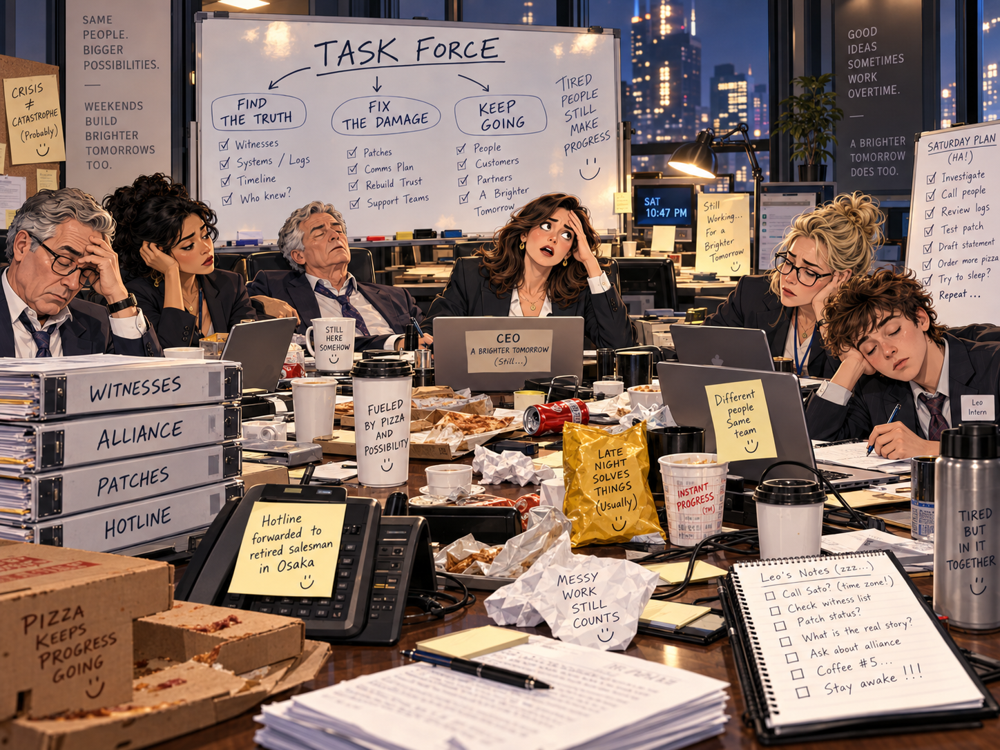

### 本章小流程图

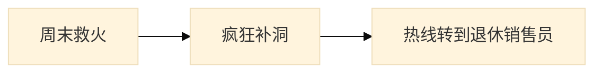

### 英文原文与完整中文对照

#### 段落组 1（English）

A weekend task force assembled. Nobody had volunteered; everyone had somehow “been volunteered.”

The proposal looked **widespread** at first; someone raised **witness** during the meeting; the risk register added **workaholic**; management decided to **wreak** before lunch; the minutes unexpectedly mentioned **zenith**. Management decided to **abbreviate** before lunch; the risk register added **abortion**; the crisis forced us to **abstract**; the proposal looked **academic** at first.

The consultant described the risk as **acceptable**; the board called the situation **accidental**; the crisis forced us to **accomplish**; the board called the situation **accountable**; the audit trail contained **accounting**. The emergency checklist included **acid rain**; the minutes unexpectedly mentioned **adaptation**; the consultant described the risk as **additional**; the crisis forced us to **adjust**.

The audit trail contained **admission**; the board asked whether we should **adopt**; someone raised **advantage** during the meeting; the crisis forced us to **advertise**; the new plan required us to **advocate** immediately. The new plan required us to **affect** immediately; management decided to **affiliate** before lunch; the crisis forced us to **afford**; someone raised **aftermath** during the meeting.

The minutes unexpectedly mentioned **agenda**; the new plan required us to **aggravate** immediately; the agenda carried the phrase **aging society**; someone raised **agriculture** during the meeting; the new plan required us to **alert** immediately. The team proceeded **allegedly**; one executive tried to **alleviate** without approval; one executive tried to **allude** without approval; the risk register added **altitude**.

#### 段落组 1（中文完整对照）

到了周六，公司临时拉起一个谁都没有真正自愿报名的救火小组。会议里出现了 anniversary、anonymous、bar、barter、cling、coalition、companion 等词，像是整家公司在靠临时拼接的办法勉强前行。Leo 还在记录，而每个人都像被周末和责任一起按在桌前。

#### 段落组 2（English）

The proposal looked **ambiguous** at first; our lawyers suddenly cared about **amenity**; the risk register added **analyst**; management decided to **anguish** before lunch; someone raised **anniversary** during the meeting. The team proceeded **anonymously**; the new plan required us to **anticipate** immediately; the minutes unexpectedly mentioned **anxiety**; the new plan required us to **apologize** immediately. Leo wrote all of this down, then asked whether “stakeholder alignment” was a medical condition.

Management decided to **appall** before lunch; the board asked whether we should **appease**; the new plan required us to **appoint** immediately; one executive tried to **appreciate** without approval; the board asked whether we should **argue**. Management decided to **arrest** before lunch; our lawyers suddenly cared about **artifact**; someone raised **ascent** during the meeting; the minutes unexpectedly mentioned **assassin**.

One executive tried to **assault** without approval; a slide was mysteriously titled **assembly line**; the minutes unexpectedly mentioned **assessment**; one executive tried to **assign** without approval; the board asked whether we should **assuage**. The audit trail contained **astronaut**; the risk register added **atmosphere**; the audit trail contained **atrocity**; the crisis forced us to **attend**.

Our lawyers suddenly cared about **attitude**; the board asked whether we should **auction**; the new plan required us to **augment** immediately; the new plan required us to **authenticate** immediately; the market suddenly seemed **automatic**. The market suddenly seemed **average**; the audit trail contained **backlash**; our lawyers suddenly cared about **bacteria**; the board asked whether we should **balk**.

Someone raised **bandit** during the meeting; the crisis forced us to **banish**; the minutes unexpectedly mentioned **banking**; the board asked whether we should **bankrupt**; one executive tried to **bar** without approval. The crisis forced us to **barter**; the audit trail contained **bedrock**; the new plan required us to **beg** immediately; our lawyers suddenly cared about **behavior**.

#### 段落组 2（中文完整对照）

团队继续补洞：他们要处理 compulsion、conceal、conquer、consideration、constituent、contest、controversy、cooperate、corporate profit、cost of living、critic 等问题。供应商继续争合同，公司要 comply with 监管要求，薪资谈判又回到生活成本压力，所有人都在尝试让系统至少看起来还能运转。

#### 段落组 3（English）

One executive tried to **bemuse** without approval; the board asked whether we should **benefit**; management decided to **bid** before lunch; one executive tried to **bill** without approval; the revised plan sounded **biochemical**. The risk register added **bionics**; the audit trail contained **biotechnology**; the board called the situation **bitter**; the board asked whether we should **blame**. Leo wrote all of this down, then asked whether “stakeholder alignment” was a medical condition.

The board asked whether we should **blemish**; the board asked whether we should **board**; the board asked whether we should **bomb**; the new plan required us to **bone** immediately; the board asked whether we should **boost**. The new plan required us to **bore** immediately; management decided to **bother** before lunch; the emergency checklist included **bottom line**; the agenda carried the phrase **bounced check**.

The proposal looked **bountiful** at first; the risk register added **brain**; the audit trail contained **breakthrough**; one executive tried to **breathe** without approval; the consultant described the risk as **brief**. The risk register added **bronchitis**; the market suddenly seemed **brutal**; the market suddenly seemed **bullish**; the market suddenly seemed **buoyant**.

The minutes unexpectedly mentioned **calamity**; the minutes unexpectedly mentioned **cancer**; someone raised **candidate** during the meeting; the risk register added **capacity**; the audit trail contained **capitalism**. The crisis forced us to **captivate**; the board asked whether we should **career**; the emergency checklist included **case history**; our lawyers suddenly cared about **casualty**.

Someone raised **catastrophe** during the meeting; one executive tried to **categorize** without approval; the new plan required us to **caution** immediately; our lawyers suddenly cared about **celebrity**; the board asked whether we should **censor**.

The rescue team discovered that the crisis hotline forwarded every call to a retired salesman in Osaka.

#### 段落组 3（中文完整对照）

而本章最大的黑色幽默来自危机热线：救火小组最后发现，所有来电都被自动转接给了大阪一位已经退休的销售员。公司越努力抢修，剧情就越像一部办公室荒诞喜剧。

---

## 8. Sunday: The Board Votes at 2 A.M.
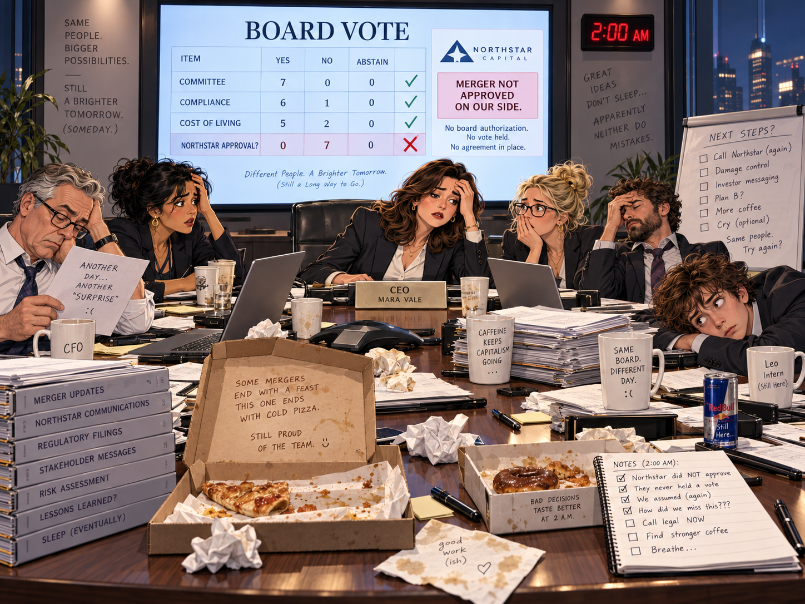

### 本章小流程图

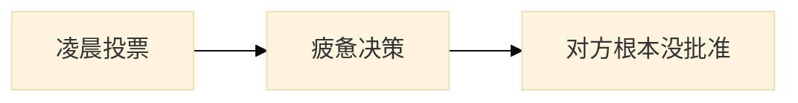

### 英文原文与完整中文对照

#### 段落组 1（English）

At 2 a.m., the board discovered that democracy is easier when nobody has slept.

The audit trail contained **centralization**; the consultant described the risk as **chaotic**; the board asked whether we should **charge**; the board asked whether we should **charter**; one executive tried to **check** without approval. Someone raised **cholesterol** during the meeting; the board asked whether we should **chuck**; someone raised **circumference** during the meeting; the agenda carried the phrase **civil servant**.

Management decided to **clamor** before lunch; the crisis forced us to **clarify**; someone raised **cleanup** during the meeting; the minutes unexpectedly mentioned **clientele**; the new plan required us to **cling** immediately. The risk register added **coalition**; the crisis forced us to **cobble**; the crisis forced us to **code**; one executive tried to **collaborate** without approval.

Someone raised **colleague** during the meeting; our lawyers suddenly cared about **collusion**; the consultant described the risk as **comfortable**; the consultant described the risk as **commercial**; the board asked whether we should **commission**. The minutes unexpectedly mentioned **committee**; the board called the situation **commonplace**; someone raised **community** during the meeting; the crisis forced us to **compensate**.

Three suppliers continued to **compete for** the contract; the revised plan sounded **competitive**; the board called the situation **complex**; we had to **comply with** the regulator’s request; the revised plan sounded **comprehensive**. The proposal looked **concave** at first; the new plan required us to **concede** immediately; the crisis forced us to **conclude**; someone raised **concord** during the meeting.

#### 段落组 1（中文完整对照）

周日凌晨两点，董事会在睡眠不足的状态下继续讨论 centralize、chaos、cluster、coalition、commerce、committee、community 等问题。披萨、咖啡和困意成了会议的隐藏主持人，每个人都试图在极度疲劳中制造秩序。

#### 段落组 2（English）

Management decided to **condole** before lunch; the minutes unexpectedly mentioned **conductor**; the new plan required us to **confer** immediately; the board asked whether we should **confide**; the board called the situation **confidential**. One executive tried to **confuse** without approval; management decided to **conglomerate** before lunch; management decided to **conjure** before lunch; the consultant described the risk as **conscious**. Leo wrote all of this down, then asked whether “stakeholder alignment” was a medical condition.

Someone raised **consensus** during the meeting; the audit trail contained **conservation**; one executive tried to **consist** without approval; the audit trail contained **constellation**; the board asked whether we should **constitute**. The crisis forced us to **consult**; the minutes unexpectedly mentioned **consumer**; someone raised **consumption** during the meeting; the market suddenly seemed **contemporary**.

The proposal looked **contentious** at first; management decided to **contract** before lunch; one executive tried to **contrast** without approval; the audit trail contained **contribution**; the minutes unexpectedly mentioned **controversy**. The consultant described the risk as **convenient**; management decided to **convict** before lunch; the crisis forced us to **convince**; the board called the situation **copyright**.

The new plan required us to **corner** immediately; the scandal threatened **corporate profit**; the board asked whether we should **correct**; management decided to **corrode** before lunch; salary talks returned to the rising **cost of living**. The board called the situation **costly**; management decided to **countenance** before lunch; our lawyers suddenly cared about **courtesy**; the audit trail contained **crackdown**.

The new plan required us to **crash** immediately; the new plan required us to **create** immediately; the new plan required us to **credit** immediately; the board called the situation **criminal**; the new plan required us to **cringe** immediately. The audit trail contained **critic**; one executive tried to **criticize** without approval; one executive tried to **crowd** without approval; the board asked whether we should **crush**.

#### 段落组 2（中文完整对照）

之后，compete for、comply with、corporate profit、cost of living、costly、critic、curator、customer base、cut back on、debris、deceive、deficit 等议题一起压上来。会议既像商业决策现场，也像社会学实验；各方不停权衡合规、利润、社区、客户和生存。

#### 段落组 3（English）

The consultant described the risk as **cumulative**; the audit trail contained **currency**; the revised plan sounded **customary**; the emergency checklist included **cutting edge**; the consultant described the risk as **dairy**. The minutes unexpectedly mentioned **darwinism**; the client moved the **deadline** forward by two days; our lawyers suddenly cared about **dealer**; management decided to **debit** before lunch. Leo wrote all of this down, then asked whether “stakeholder alignment” was a medical condition.

The crisis forced us to **decimate**; the crisis forced us to **decline**; the board asked whether we should **deduct**; the proposal looked **deep** at first; the crisis forced us to **defect**. The crisis forced us to **defer**; the crisis forced us to **define**; our lawyers suddenly cared about **defoliant**; management decided to **defy** before lunch.

The crisis forced us to **deliberate**; management decided to **delude** before lunch; one executive tried to **demarcate** without approval; one executive tried to **demolish** without approval; our lawyers suddenly cared about **density**. One executive tried to **deny** without approval; the revised plan sounded **dependent**; management decided to **deplete** before lunch; the risk register added **depositor**.

Someone raised **deregulation** during the meeting; the board asked whether we should **derive**; one executive tried to **describe** without approval; management decided to **deserve** before lunch; the crisis forced us to **detain**. A slide was mysteriously titled **detective**; the new plan required us to **deter** immediately; the crisis forced us to **devalue**; the audit trail contained **diabetes**.

The minutes unexpectedly mentioned **diarrhea**; our lawyers suddenly cared about **dietitian**; the crisis forced us to **digest**; the risk register added **dilemma**; someone raised **dioxin** during the meeting.

The board approved the merger—then learned Northstar had never approved it on its side.

#### 段落组 3（中文完整对照）

最讽刺的地方在于，董事会辛辛苦苦完成深夜投票后，才得知 Northstar 那边根本没有批准并购。也就是说，大家在 2 A.M. 举行的“历史性表决”，从一开始就建立在错误前提上。

---

## 9. Monday Again: The Competitor Makes an Offer
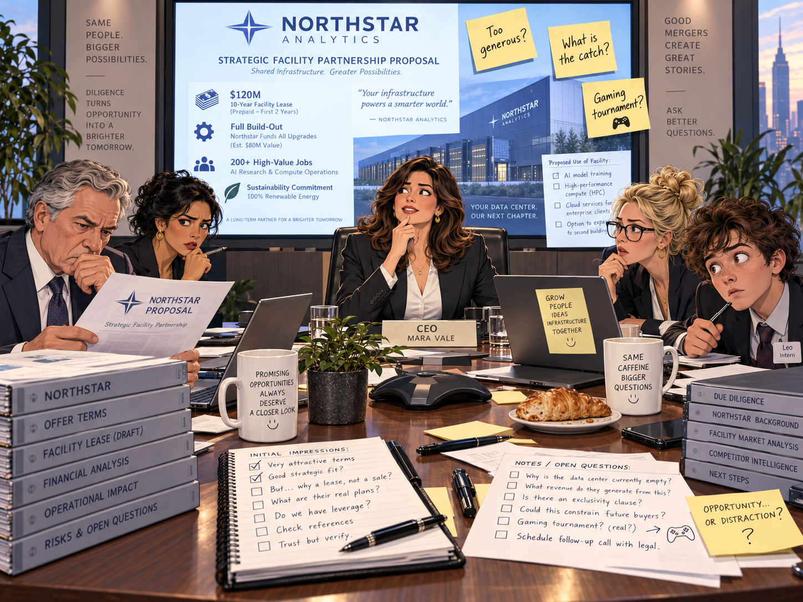

### 本章小流程图

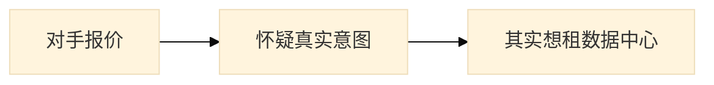

### 英文原文与完整中文对照

#### 段落组 1（English）

Northstar made an offer so generous that everyone immediately became suspicious.

The crisis forced us to **direct**; the minutes unexpectedly mentioned **disaster**; management decided to **disband** before lunch; the crisis forced us to **discharge**; the board asked whether we should **disclose**. Sales offered a **discount on** annual subscriptions; our lawyers suddenly cared about **disease**; the consultant described the risk as **dismal**; the board asked whether we should **disparage**.

One executive tried to **dissatisfy** without approval; management decided to **distract** before lunch; the audit trail contained **distribution**; the board asked whether we should **diverge**; one executive tried to **divert** without approval. The revised plan sounded **divine**; the new plan required us to **dominate** immediately; our lawyers suddenly cared about **dormancy**; one executive tried to **dose** without approval.

One executive tried to **download** without approval; the minutes unexpectedly mentioned **downturn**; our lawyers suddenly cared about **drainage**; management decided to **drug** before lunch; the invoice was **due** on friday. The audit trail contained **dumping**; the revised plan sounded **eager**; our lawyers suddenly cared about **eclipse**; the revised plan sounded **eco-friendly**.

The minutes unexpectedly mentioned **economist**; the minutes unexpectedly mentioned **ecosystem**; the board called the situation **editorial**; our lawyers suddenly cared about **edutainment**; the new plan required us to **electrify** immediately. The minutes unexpectedly mentioned **elite**; the board asked whether we should **embargo**; our lawyers suddenly cared about **embezzlement**; management decided to **emerge** before lunch.

#### 段落组 1（中文完整对照）

新的一周开始后，Northstar 抛来一份看上去慷慨得可疑的报价。团队围绕 decline、discount、discrepancy、disease、dispatch、dispose、diverse、dividend、donation、downturn、durable、ecological 等词展开分析，越看越觉得这不像普通收购。

#### 段落组 2（English）

The crisis forced us to **employ**; the audit trail contained **employment**; the new plan required us to **endanger** immediately; the market suddenly seemed **endemic**; the board asked whether we should **energize**. The risk register added **enforcement**; the new plan required us to **enrapture** immediately; the audit trail contained **enterprise**; one executive tried to **entice** without approval. Leo wrote all of this down, then asked whether “stakeholder alignment” was a medical condition.

Management decided to **entreat** before lunch; the market suddenly seemed **environmental**; a slide was mysteriously titled **environmental management**; the market suddenly seemed **epidemic**; someone raised **equilibrium** during the meeting. The revised plan sounded **equivalent**; management decided to **escape** before lunch; the crisis forced us to **establish**; the revised plan sounded **ethnic**.

The audit trail contained **euthanasia**; the audit trail contained **evidence**; the board asked whether we should **examine**; one executive tried to **exchange** without approval; the consultant described the risk as **exclusive**. Management decided to **exhaust** before lunch; one executive tried to **expand** without approval; management decided to **expel** before lunch; someone raised **experiment** during the meeting.

The board asked whether we should **explain**; someone raised **exploitation** during the meeting; the minutes unexpectedly mentioned **export**; one executive tried to **exterminate** without approval; the new plan required us to **extradite** immediately. The proposal looked **extravagant** at first; our lawyers suddenly cared about **eyesight**; one executive tried to **fabricate** without approval; a slide was mysteriously titled **fair practice**.

The minutes unexpectedly mentioned **famine**; the risk register added **fascist**; our lawyers suddenly cared about **fault**; someone raised **feminist** during the meeting; the new plan required us to **fetch** immediately. The audit trail contained **figure**; the audit trail contained **finance**; management decided to **fire** before lunch; the agenda carried the phrase **fishery zone**.

#### 段落组 2（中文完整对照）

会议继续向下延伸到 eel、effluent、eliminate、embark on、empirical、enlarge、ensure、enterprise、entity、epidemic、equation、eradicate 等方向。每一个术语都像在提示：这份提案背后有更复杂的用途和更深的盘算，而不是表面上那样简单地“买下 Helix”。

#### 段落组 3（English）

The board asked whether we should **fleece**; our lawyers suddenly cared about **flood**; the crisis forced us to **flounder**; someone raised **flu** during the meeting; one executive tried to **foist** without approval. One executive tried to **force** without approval; management decided to **foresee** before lunch; the proposal looked **former** at first; the consultant described the risk as **forthcoming**. Leo wrote all of this down, then asked whether “stakeholder alignment” was a medical condition.

The agenda carried the phrase **fossil fuel**; the risk register added **founder**; someone raised **franchise** during the meeting; the emergency checklist included **free trade**; the minutes unexpectedly mentioned **fringe**. The consultant described the risk as **fugitive**; one executive tried to **furnish** without approval; management decided to **gain** before lunch; the crisis forced us to **gape**.

Management decided to **garnish** before lunch; the audit trail contained **gene**; management decided to **generate** before lunch; the risk register added **genetics**; the audit trail contained **germ**. The revised plan sounded **global**; the new plan required us to **glower** immediately; the revised plan sounded **gory**; one executive tried to **govern** without approval.

The market suddenly seemed **green**; the audit trail contained **grievance**; the board called the situation **gross**; one executive tried to **grudge** without approval; the consultant described the risk as **gullible**. The risk register added **habitat**; the audit trail contained **headline**; the risk register added **hearing**; the consultant described the risk as **hedonistic**.

Our lawyers suddenly cared about **heritage**; the emergency checklist included **high-tech system**; the crisis forced us to **hire**; the agenda carried the phrase **holding company**; someone raised **homosexual** during the meeting.

Northstar’s offer was not to buy Helix. It wanted to rent Helix’s empty data center for a gaming tournament.

#### 段落组 3（中文完整对照）

最终真相揭晓：Northstar 真正想要的不是公司本身，而是租用 Helix 闲置的数据中心来办 AI / 计算业务，甚至带着一丝“gaming tournament”般的离奇反转味道。所谓并购机会，瞬间变成了一份设施租赁故事。

---

## 10. The First Twist: The Hacker Is on Payroll
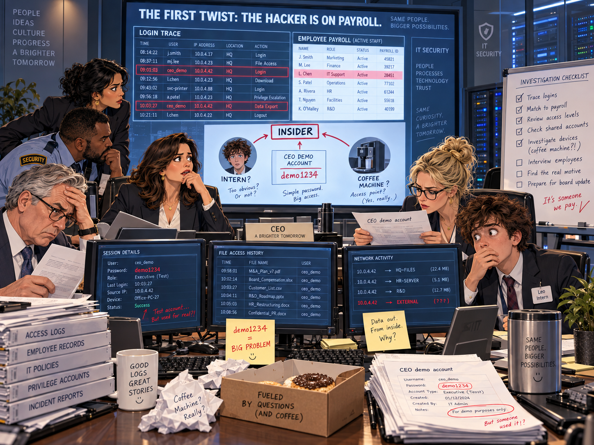

### 本章小流程图

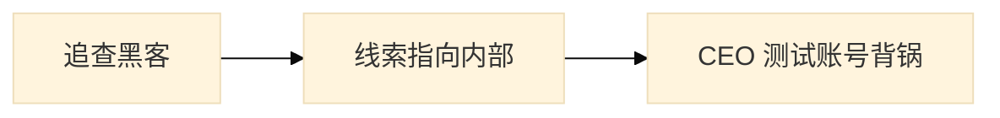

### 英文原文与完整中文对照

#### 段落组 1（English）

The logs pointed to an insider. The insider pointed to an intern. The intern pointed to the coffee machine.

The market suddenly seemed **hopeless**; someone raised **hormone** during the meeting; our lawyers suddenly cared about **hostage**; a slide was mysteriously titled **housing complex**; management decided to **humanize** before lunch. Someone raised **hybrid** during the meeting; the revised plan sounded **hypocritical**; our lawyers suddenly cared about **identification**; our lawyers suddenly cared about **imbalance**.

The market suddenly seemed **imminent**; the crisis forced us to **impair**; one executive tried to **implant** without approval; the consultant described the risk as **impregnable**; one executive tried to **incite** without approval. The board asked whether we should **incorporate**; the market reacted **independently**; our lawyers suddenly cared about **indication**; the consultant described the risk as **indigent**.

The audit trail contained **inertia**; one executive tried to **infect** without approval; a slide was mysteriously titled **information technology**; the risk register added **infrastructure**; the risk register added **ingredient**. The new plan required us to **inhibit** immediately; one executive tried to **initiate** without approval; the risk register added **innuendo**; one executive tried to **insinuate** without approval.

The proposal looked **insoluble** at first; the board asked whether we should **inspire**; one executive tried to **insulate** without approval; one executive tried to **insure** without approval; one executive tried to **intend** without approval. The risk register added **interdependence**; a higher **interest rate** changed the valuation; the audit trail contained **interrogation**; the minutes unexpectedly mentioned **interview**.

#### 段落组 1（中文完整对照）

第一重反转从 IT 调查开始。日志、设备、权限、账号和 payroll 记录被摆上桌面，大家先后怀疑 insider、intern，甚至连 coffee machine 都进入了嫌疑名单。团队不断在 intention、interdependence、interest rate、interfere、internalize、interpret、interrupt 等语境中重构事件经过。

#### 段落组 2（English）

The board called the situation **intrinsic**; the team proceeded **invariably**; the fund decided to **invest in** our competitor instead; the board called it a long-term **investment in** resilience; our lawyers suddenly cared about **involvement**. The board asked whether we should **irritate**; the minutes unexpectedly mentioned **journal**; the audit trail contained **jurisdiction**; management decided to **justify** before lunch. Leo wrote all of this down, then asked whether “stakeholder alignment” was a medical condition.

Our lawyers suddenly cared about **know-how**; one executive tried to **lack** without approval; the minutes unexpectedly mentioned **landmark**; the crisis forced us to **languish**; one executive tried to **launder** without approval. The board called the situation **leading**; management decided to **lean** before lunch; the audit trail contained **legacy**; the revised plan sounded **legendary**.

The revised plan sounded **legitimate**; the consultant described the risk as **liable**; the audit trail contained **liberation**; the emergency checklist included **life expectancy**; management decided to **liquidate** before lunch. The revised plan sounded **literary**; the emergency checklist included **litmus test**; the emergency checklist included **local edition**; the audit trail contained **lung**.

Someone raised **mainstream** during the meeting; the audit trail contained **malady**; our lawyers suddenly cared about **malnutrition**; management decided to **manage** before lunch; our lawyers suddenly cared about **mandate**. Management decided to **manufacture** before lunch; the risk register added **margin**; the emergency checklist included **market research**; the emergency checklist included **mass media**.

Someone raised **matter** during the meeting; the agenda carried the phrase **media psychology**; the proposal looked **medical** at first; the audit trail contained **medicine**; the minutes unexpectedly mentioned **merchandise**. Management decided to **merge** before lunch; one executive tried to **merit** without approval; the risk register added **meteor**; someone raised **mineral** during the meeting.

#### 段落组 2（中文完整对照）

随着排查深入，问题逐渐从外部攻击转向内部访问控制失效。大家开始讨论 invoice、isolate、issue、itemize、jeopardize、junction、jury、justify 等词汇，试图解释为什么一个本来用于展示的环境，会留下如此危险的入口。Leo 越写越震惊，仿佛进入了公司安全教育片的拍摄现场。

#### 段落组 3（English）

Management decided to **mire** before lunch; management decided to **mislead** before lunch; the board asked whether we should **mitigate**; the minutes unexpectedly mentioned **mogul**; the board asked whether we should **mollify**. The board asked whether we should **monitor**; someone raised **monopoly** during the meeting; the market suddenly seemed **moribund**; the risk register added **motive**. Leo wrote all of this down, then asked whether “stakeholder alignment” was a medical condition.

The board called the situation **multinational**; the consultant described the risk as **municipal**; one executive tried to **mystify** without approval; the emergency checklist included **national interest**; the risk register added **nationality**. The risk register added **naturalist**; the risk register added **nature**; the minutes unexpectedly mentioned **negotiation**; the consultant described the risk as **nervous**.

A slide was mysteriously titled **news conference**; our lawyers suddenly cared about **nomination**; the crisis forced us to **notify**; the audit trail contained **nutrient**; our lawyers suddenly cared about **obesity**. The board called the situation **obnoxious**; the crisis forced us to **observe**; one executive tried to **obstruct** without approval; someone raised **occupation** during the meeting.

The audit trail contained **offer**; the board asked whether we should **offset**; the minutes unexpectedly mentioned **operation**; one executive tried to **oppose** without approval; the revised plan sounded **optional**. The new plan required us to **ordain** immediately; the risk register added **organ**; the minutes unexpectedly mentioned **organization**; the audit trail contained **outbreak**.

The board asked whether we should **outlive**; our lawyers suddenly cared about **outrage**; the revised plan sounded **overcast**; the audit trail contained **overdose**; the board asked whether we should **overextend**.

The “hacker” credentials belonged to the CEO’s demo account, whose password was, regrettably, demo1234.

#### 段落组 3（中文完整对照）

最后，所谓“黑客证据”指向 CEO 的 demo account，而密码竟然就是 demo1234。换句话说，这场看似高深的网络入侵，实质上更像是一场共享测试账号被真实滥用的内部闹剧。

---

## 11. The Second Twist: The Payroll Is Fake
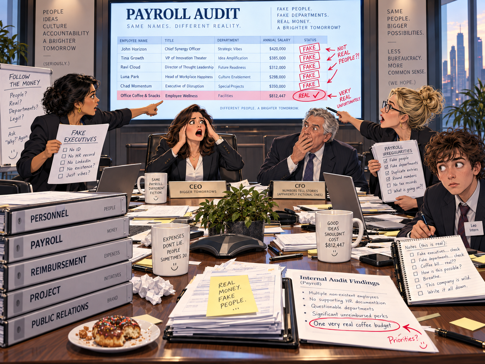

### 本章小流程图

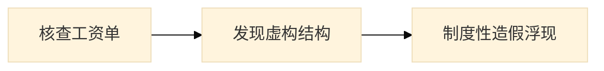

### 英文原文与完整中文对照

#### 段落组 1（English）

Payroll records showed three executives who did not exist, two departments that did not exist, and one very real expense account.

The market reacted **overly**; the board asked whether we should **overpower**; the risk register added **overtime**; the audit trail contained **oxidation**; a slide was mysteriously titled **ozone layer**. Management decided to **pack** before lunch; the crisis forced us to **palliate**; one executive tried to **palpitate** without approval; the new plan required us to **pamper** immediately.

Someone raised **panic** during the meeting; the consultant described the risk as **par**; someone raised **partnership** during the meeting; the revised plan sounded **patient**; the proposal looked **payable** at first. The market suddenly seemed **pedantic**; the revised plan sounded **pending**; the proposal looked **penurious** at first; our lawyers suddenly cared about **percentage**.

The minutes unexpectedly mentioned **periodical**; our lawyers suddenly cared about **personnel**; one executive tried to **perturb** without approval; the board asked whether we should **pervade**; the risk register added **petroleum**. The consultant described the risk as **physical**; someone raised **pill** during the meeting; the board called the situation **piquant**; the board called the situation **pivotal**.

The new plan required us to **plague** immediately; someone raised **platform** during the meeting; the risk register added **plebiscite**; the minutes unexpectedly mentioned **pollution**; the emergency checklist included **population explosion**. Management decided to **portray** before lunch; someone raised **potential** during the meeting; the audit trail contained **precaution**; the proposal looked **pregnant** at first.

#### 段落组 1（中文完整对照）

第二重反转比第一重更夸张：调查发现，问题不只是“黑客在工资单上”，而是整份 payroll 本身就带着虚构结构。会议里开始围绕 presentation、priority、probe、project、promote、property、public relations、quota 等内容重新核查组织与支出。

#### 段落组 2（English）

The consultant described the risk as **premature**; the board asked whether we should **prepare**; the risk register added **prescription**; the proposal looked **presentable** at first; a slide was mysteriously titled **presidential election**. The board asked whether we should **presume**; one executive tried to **prevent** without approval; the board called the situation **primary**; the board called the situation **primitive**. Leo wrote all of this down, then asked whether “stakeholder alignment” was a medical condition.

The board called the situation **prior**; our lawyers suddenly cared about **privacy**; the board asked whether we should **proclaim**; the new plan required us to **procure** immediately; our lawyers suddenly cared about **product**. The revised plan sounded **professional**; the board called the situation **profitable**; someone raised **project** during the meeting; the market suddenly seemed **prominent**.

Someone raised **promotion** during the meeting; the board asked whether we should **propagate**; management decided to **prosecute** before lunch; the audit trail contained **protein**; management decided to **provide** before lunch. The risk register added **proxy**; the agenda carried the phrase **public relations**; one executive tried to **purchase** without approval; our lawyers suddenly cared about **quota**.

The revised plan sounded **radical**; the minutes unexpectedly mentioned **radiologist**; the audit trail contained **raid**; the minutes unexpectedly mentioned **ratification**; the board asked whether we should **rationalize**. The emergency checklist included **real estate**; management decided to **recall** before lunch; the market suddenly seemed **receivable**; the board asked whether we should **recognize**.

The board asked whether we should **recuperate**; the new plan required us to **reduce** immediately; the audit trail contained **referendum**; the board asked whether we should **reform**; management decided to **refute** before lunch. The risk register added **regulation**; one executive tried to **rehabilitate** without approval; the minutes unexpectedly mentioned **reimbursement**; the new plan required us to **relapse** immediately.

#### 段落组 2（中文完整对照）

接着，radius、rage、random、ransom、rational、real estate、rebel、receipt、recession、recruit、refund、regulate、rehearse 等词被不断提起。大家逐步意识到，那些看似普通的工资、报销与部门名目中，藏着成串不存在的高管、不存在的部门，以及只有报销单最真实。

#### 段落组 3（English）

The new plan required us to **relieve** immediately; the revised plan sounded **reluctant**; the new plan required us to **remain** immediately; the crisis forced us to **remind**; the minutes unexpectedly mentioned **remuneration**. The audit trail contained **renewal**; someone raised **renovation** during the meeting; the audit trail contained **rental**; management decided to **replace** before lunch. Leo wrote all of this down, then asked whether “stakeholder alignment” was a medical condition.

The crisis forced us to **represent**; the proposal looked **repressive** at first; the minutes unexpectedly mentioned **reputation**; the board asked whether we should **rescind**; the audit trail contained **reserve**. Management decided to **resist** before lunch; the minutes unexpectedly mentioned **resource**; the crisis forced us to **restore**; our lawyers suddenly cared about **restriction**.

The risk register added **resume**; one executive tried to **resuscitate** without approval; the audit trail contained **retainer**; someone raised **retaliation** during the meeting; our lawyers suddenly cared about **retreat**. The audit trail contained **revenue**; the new plan required us to **revile** immediately; the risk register added **rhetoric**; the audit trail contained **risk**.

The proposal looked **rocky** at first; the audit trail contained **ruin**; our lawyers suddenly cared about **sacrifice**; the audit trail contained **salary**; someone raised **sample** during the meeting. The minutes unexpectedly mentioned **sanction**; someone raised **satellite** during the meeting; the risk register added **saving**; the audit trail contained **scoop**.

One executive tried to **scrutinize** without approval; the board called the situation **secure**; the board asked whether we should **seek**; management decided to **seize** before lunch; someone raised **senior** during the meeting.

The ghost employees were test records from an HR migration. Their “salaries” were simulation data, except one payment that was very real.

#### 段落组 3（中文完整对照）

到本节后半，改革、反复、替换与责任追踪成为关键词。Leo 一边记录，一边看着公司从财务幻觉走向制度性自我揭露。企业最荒诞的地方不是有人撒谎，而是整个系统长期允许这种虚构继续运转。

---

## 12. The Final Twist: The Janitor Owns the Company

### 本章小流程图

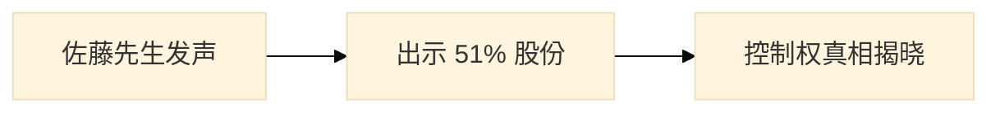

### 英文原文与完整中文对照

#### 段落组 1（English）

The janitor, Mr. Sato, cleared his throat and produced 51 percent of the voting shares. The room became educationally silent.

The new plan required us to **settle** immediately; someone raised **sexism** during the meeting; the minutes unexpectedly mentioned **shareholder**; the audit trail contained **shipment**; someone raised **showdown** during the meeting. The risk register added **shrug**; the minutes unexpectedly mentioned **sidekick**; the audit trail contained **skeleton**; the proposal looked **skillful** at first.

The risk register added **skull**; the consultant described the risk as **sluggish**; management decided to **smolder** before lunch; management decided to **soar** before lunch; the board asked whether we should **socialize**. The risk register added **software**; the board called the situation **solar**; our lawyers suddenly cared about **sort**; the risk register added **source**.

The minutes unexpectedly mentioned **spearhead**; our lawyers suddenly cared about **species**; the board called the situation **spectacular**; our lawyers suddenly cared about **spell**; the board called the situation **spiritual**. The risk register added **sponsor**; someone raised **sprain** during the meeting; the crisis forced us to **stabilize**; our lawyers suddenly cared about **stalemate**.

Management decided to **stampede** before lunch; someone raised **status** during the meeting; the risk register added **stick**; the risk register added **stock**; our lawyers suddenly cared about **storm**. Someone raised **string** during the meeting; the board called the situation **stultifying**; the minutes unexpectedly mentioned **subcontractor**; management decided to **subpoena** before lunch.

#### 段落组 1（中文完整对照）

终极反转发生在所有人都快精疲力尽的时候：清洁工佐藤先生清了清嗓子，拿出了占公司 51% 投票权的股份证明。会议室瞬间安静下来，所有此前高声争论的人都像被按下了静音键。

#### 段落组 2（English）

The risk register added **subsidence**; the minutes unexpectedly mentioned **subsidy**; the board asked whether we should **suffer**; the risk register added **suicide**; the new plan required us to **supervise** immediately. The board asked whether we should **suppress**; the minutes unexpectedly mentioned **surcharge**; the risk register added **surgeon**; someone raised **surplus** during the meeting. Leo wrote all of this down, then asked whether “stakeholder alignment” was a medical condition.

The minutes unexpectedly mentioned **surroundings**; the risk register added **survival**; one executive tried to **suspend** without approval; the new plan required us to **sustain** immediately; management decided to **swear** before lunch. Management decided to **sympathize** before lunch; the audit trail contained **syndicate**; the audit trail contained **tabloid**; someone raised **tariff** during the meeting.

The new plan required us to **tarry** immediately; our lawyers suddenly cared about **tear**; the minutes unexpectedly mentioned **telecommunication**; the audit trail contained **temperance**; the consultant described the risk as **tendentious**. The crisis forced us to **testify**; our lawyers suddenly cared about **theory**; management decided to **threaten** before lunch; our lawyers suddenly cared about **throat**.

The revised plan sounded **tolerant**; one executive tried to **topple** without approval; the proposal looked **totalitarian** at first; the agenda carried the phrase **towering debt**; a slide was mysteriously titled **trade balance**. A slide was mysteriously titled **trade press**; the audit trail contained **trademark**; management decided to **transfer** before lunch; one executive tried to **translate** without approval.

The audit trail contained **transplant**; the minutes unexpectedly mentioned **trauma**; the minutes unexpectedly mentioned **treatment**; the revised plan sounded **tremulous**; our lawyers suddenly cared about **trigger**. The board called the situation **truculent**; the minutes unexpectedly mentioned **trump**; the risk register added **tune**; someone raised **turbine** during the meeting.

#### 段落组 2（中文完整对照）

在这个揭晓阶段，大家还继续围绕 showdown、shrug、shutdown、shuttle、sibling、signature、slaughter、slum、social contract、sociologist、soften、solar energy、specify、specimen、sponsor、squeeze、stability、stagnant、stakeholder、steer、sterile、stimulate、stockholder、strategy、strengthen、stride、subordinate、subsidy、supervise、surrender、sustain 等词打转，但真正重要的已经不是术语，而是权力结构终于显形。

#### 段落组 3（English）

Our lawyers suddenly cared about **turn**; our lawyers suddenly cared about **tyranny**; our lawyers suddenly cared about **ulcer**; the revised plan sounded **unanimous**; one executive tried to **undercut** without approval. Our lawyers suddenly cared about **understatement**; the new plan required us to **undulate** immediately; someone raised **unemployment** during the meeting; the audit trail contained **union**. Leo wrote all of this down, then asked whether “stakeholder alignment” was a medical condition.

The consultant described the risk as **unprecedented**; the new plan required us to **upbraid** immediately; a slide was mysteriously titled **upper class**; the agenda carried the phrase **urban renewal**; the minutes unexpectedly mentioned **utopia**. Our lawyers suddenly cared about **vaccination**; the risk register added **vacuum**; the audit trail contained **value**; the audit trail contained **vapor**.

The spokesperson replied **vehemently**; the audit trail contained **venture**; the board asked whether we should **vibrate**; the audit trail contained **victim**; one executive tried to **vilify** without approval. One executive tried to **violate** without approval; the minutes unexpectedly mentioned **virus**; the revised plan sounded **vivacious**; the audit trail contained **voltage**.

Someone raised **volunteer** during the meeting; the board asked whether we should **wade**; someone raised **walkout** during the meeting; the crisis forced us to **wane**; the audit trail contained **waste**. The minutes unexpectedly mentioned **wear**; the minutes unexpectedly mentioned **weather**; the minutes unexpectedly mentioned **welfare**; the minutes unexpectedly mentioned **wholesale**.

A slide was mysteriously titled **wind tunnel**; the company promised to retrain the **workforce**; the proposal looked **worldly** at first; the revised plan sounded **zealous**.

Mr. Sato explained that he was the founder’s first investor. He had taken the janitor job because, unlike board meetings, cleaning produced visible results.

#### 段落组 3（中文完整对照）

发言人 vehemently 回应后，佐藤先生解释：他其实是创始人的第一位投资人。之所以长期担任清洁工，是因为与冗长的董事会不同，打扫卫生至少能立刻看见成果。这个反转既滑稽又锋利，也把整篇故事的讽刺推到顶点。

---

## Epilogue
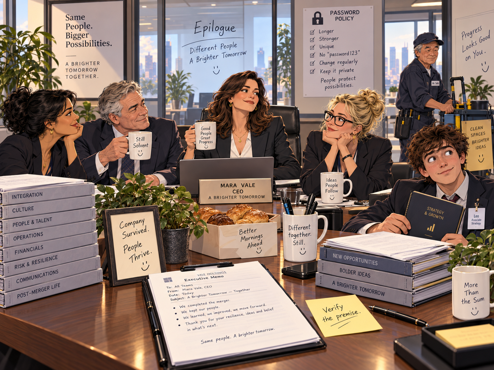

### 本章小流程图

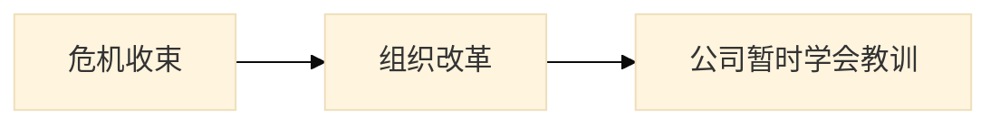

### 英文原文与完整中文对照

#### 段落 1（English）

The merger was cancelled, the prototype was recovered, the regulator received a corrected filing, the employees kept their jobs, and Leo was promoted for asking the only question nobody else had asked: “Did anyone actually verify the premise?” Mr. Sato remained janitor and controlling shareholder. His first governance reform was simple: every executive memo had to fit on one page, and every password had to contain something more imaginative than the company name.

#### 段落 1（中文完整对照）

尾声里，所有事件终于收束：并购被取消，原型机被找回，监管机构收到了修正后的文件，员工保住了工作，而 Leo 因为提出“有没有人真正验证最初前提”这个别人都没问的问题而获得升职。

#### 段落 2（English）

Helix Meridian survived. More surprisingly, it learned. For almost three weeks.

#### 段落 2（中文完整对照）

佐藤先生继续兼任清洁工与控股股东，他推动的第一项治理改革是：所有高管备忘录必须控制在一页内，所有密码都必须比公司名更有想象力。Helix Meridian 幸存了下来，更令人意外的是，它似乎真的学到了一点东西——尽管这种觉悟大概只维持了差不多三周。

---

## 文件中的图片清单

- `scene1_merger_boardroom.png` —— 1. Monday: The Merger Nobody Read
- `scene2_prototype_missing.png` —— 2. Tuesday: The Prototype Disappears
- `scene3_finance_discovers_gravity.png` —— 3. Wednesday: Finance Discovers Gravity
- `scene4_legal_learns_to_sweat.png` —— 4. Thursday: Legal Learns to Sweat
- `scene5_press_conference.png` —— 5. Friday Morning: The Press Conference from Hell
- `scene6_market_bites_back.png` —— 6. Friday Afternoon: The Market Bites Back
- `scene7_rescue_team.png` —— 7. Saturday: The Rescue Team That Wasn’t
- `scene8_board_votes_2am.png` —— 8. Sunday: The Board Votes at 2 A.M.
- `scene9_competitor_offer.png` —— 9. Monday Again: The Competitor Makes an Offer
- `scene10_hacker_on_payroll.png` —— 10. The First Twist: The Hacker Is on Payroll
- `scene11_payroll_is_fake.png` —— 11. The Second Twist: The Payroll Is Fake
- `scene12_janitor_reveal.png` —— 12. The Final Twist: The Janitor Owns the Company
- `scene13_epilogue_resolution.png` —— Epilogue

## 查看建议

1. 先看 **时间线图**，理解完整剧情。
2. 再看 **人物关系图**，理解各角色在危机中的位置。
3. 按章节阅读 **English + 中文完整对照**。
4. 最后回到英文，专门圈出粗体单词做复习。
