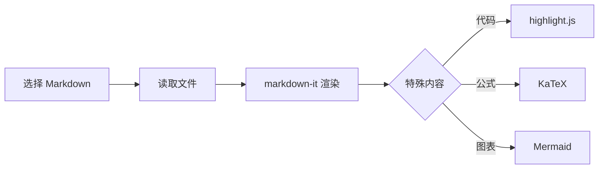
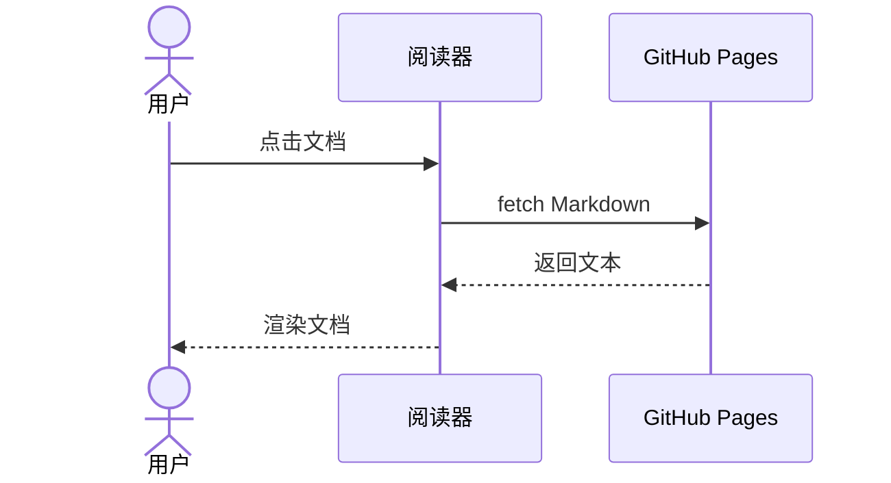
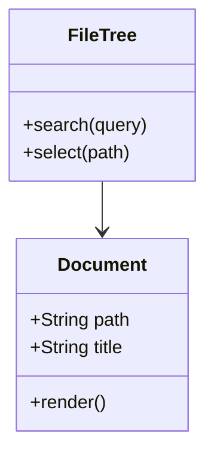
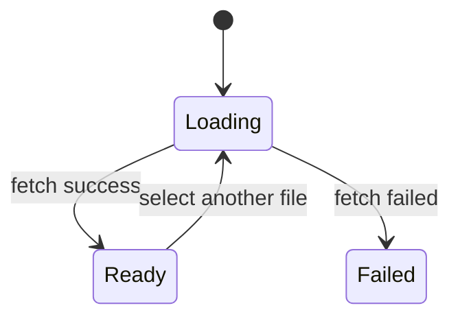
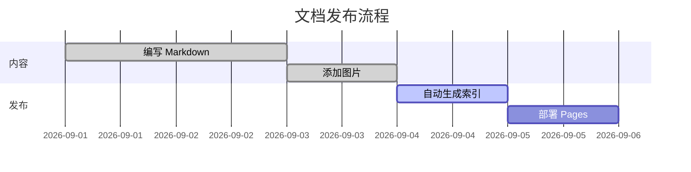
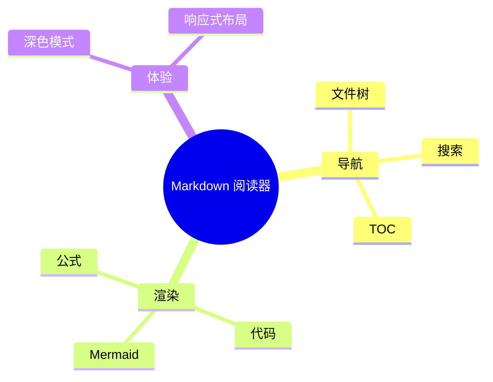

# Mermaid 图表示例

阅读器会查找语言标记为 `mermaid` 的代码块，并在 Markdown 渲染完成后生成 SVG 图表。切换主题时图表也会重新渲染。

## Flowchart

```mermaid
flowchart LR
    A[选择 Markdown] --> B[读取文件]
    B --> C[markdown-it 渲染]
    C --> D{特殊内容}
    D -->|代码| E[highlight.js]
    D -->|公式| F[KaTeX]
    D -->|图表| G[Mermaid]
```

## Sequence Diagram

```mermaid
sequenceDiagram
    actor User as 用户
    participant UI as 阅读器
    participant Pages as GitHub Pages
    User->>UI: 点击文档
    UI->>Pages: fetch Markdown
    Pages-->>UI: 返回文本
    UI-->>User: 渲染文档
```

## Class Diagram

```mermaid
classDiagram
    class Document {
      +String path
      +String title
      +render()
    }
    class FileTree {
      +search(query)
      +select(path)
    }
    FileTree --> Document
```

## State Diagram

```mermaid
stateDiagram-v2
    [*] --> Loading
    Loading --> Ready: fetch success
    Loading --> Failed: fetch failed
    Ready --> Loading: select another file
```

## Gantt

```mermaid
gantt
    title 文档发布流程
    dateFormat  YYYY-MM-DD
    section 内容
    编写 Markdown :done, write, 2026-09-01, 2d
    添加图片       :done, image, after write, 1d
    section 发布
    自动生成索引   :active, index, after image, 1d
    部署 Pages     :deploy, after index, 1d
```

## Mindmap

```mermaid
mindmap
  root((Markdown 阅读器))
    导航
      文件树
      搜索
      TOC
    渲染
      代码
      公式
      Mermaid
    体验
      深色模式
      响应式布局
```
